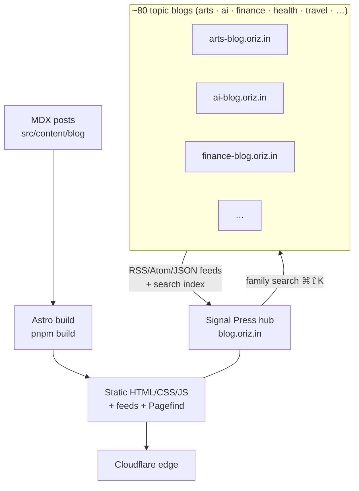

# Signal Press — the oriz blog hub

> The family's flagship blog and index at **blog.oriz.in** — long-form writing on engineering, finance, AI, and more, and the hub that ties the ~80-site oriz content fleet together.

[](./LICENSE)
[](https://github.com/chirag127/oriz-blog/stargazers)
[](https://github.com/chirag127/oriz-blog/commits)
[](https://astro.build)

## What it is

**Signal Press** is the hub of the oriz blog fleet — both a full long-form blog in its own right and the aggregation/landing point at `blog.oriz.in` for the family's ~80 topic sites (arts, AI, finance, health, travel, and dozens more). It carries its own bespoke editorial identity — mineral paper, coral signal ink, a serif nameplate, ruled strata — while a family-wide search (`⌘⇧K`) and shared `@chirag127/*` packages connect every sibling blog.

- **Live site:** https://blog.oriz.in
- **GitHub Pages:** https://chirag127.github.io/oriz-blog/
- **Repo:** https://github.com/chirag127/oriz-blog

⭐ If this is useful, please star the repo — it helps others find it.

## How the fleet aggregates



Each topic blog builds to static HTML and publishes feeds + a search index; the hub is the shared entry point, exposes local blog search (`⌘K`) plus family-wide search across the fleet (`⌘⇧K`), and — like every sibling — deploys to Cloudflare's free edge.

## Features

- Two MDX content collections (legacy `blog/` corpus + `posts/`) with typed frontmatter
- Full taxonomy: Tags / Categories / Series / Authors / Archive
- Local Pagefind search (`⌘K`) + family-wide MultiSearch across the fleet (`⌘⇧K`)
- 3-format feeds (`/rss.xml`, `/atom.xml`, `/feed.json`) + sitemap index
- Giscus comments (consent-gated), bookmarks (anon + signed-in, auto-merge)
- Optional Clerk SSO for account features — public reading never gated
- JSON-LD (Article + BreadcrumbList), View Transitions, sticky TOC
- KaTeX math, expressive-code blocks, reading time
- PWA service worker + offline fallback
- StatusBanner wired to `status.oriz.in`; cross-post engine (omnipost) 🚧 WIP

## Tech stack

Astro 6 (static output) · TypeScript · Tailwind CSS v4 · MDX · React 19 islands · astro-expressive-code · Pagefind · KaTeX · Firebase + Clerk (optional account features) · vite-plugin-pwa · Biome (lint/format) · Vitest + Playwright (tests) · Wrangler (Cloudflare deploy).

## Repo structure

```
oriz-blog/  (local folder: oriz-blog-hub)
├── astro.config.mjs        # site URL (blog.oriz.in), integrations, PWA, redirects
├── src/
│   ├── content/blog/       # MDX posts (the hub's own long-form corpus)
│   ├── content.config.ts   # frontmatter schema
│   ├── pages/              # routes: index, blog, tags, series, authors,
│   │                       #   search, account, legal/, now, about…
│   ├── layouts/            # page + post shells
│   ├── components/         # UI islands + chrome (incl. FamilyChrome)
│   ├── styles/             # tokens.css + global.css (Signal Press identity)
│   ├── lib/ · data/ · i18n/
│   └── __tests__/          # unit tests
├── docs/ (GH Pages)        # README-driven landing at github.io
└── package.json
```

## Screenshots

_Add a screenshot of the live hub here (`blog.oriz.in`)._

## Quick start

```bash
pnpm install
pnpm dev        # local dev server
pnpm build      # static build → dist/
pnpm preview    # preview the build
```

Other scripts: `pnpm typecheck` (astro check) · `pnpm lint` (biome) · `pnpm format` · `pnpm test` (vitest) · `pnpm test:e2e` (playwright) · `pnpm deploy` (wrangler). When the global pnpm shim is unavailable, use `corepack pnpm …`.

Posts live in `src/content/blog/*.mdx`; the frontmatter schema is in `src/content.config.ts`.

## Configuration

Environment variables are names + purpose only — never commit values. `PUBLIC_*` ship to the browser; unprefixed keys are server/deploy-only.

| Variable | Purpose |
|---|---|
| `PUBLIC_BASE_PATH` | Base path for the build (defaults to `/`) |
| `PUBLIC_CLERK_PUBLISHABLE_KEY` | Clerk publishable key for optional SSO / account features (client-only) |
| `PUBLIC_GISCUS_REPO` / `_REPO_ID` / `_CATEGORY` / `_CATEGORY_ID` | Giscus comments config (from giscus.app) |
| `PUBLIC_ALGOLIA_APP_ID` / `PUBLIC_ALGOLIA_SEARCH_KEY` / `PUBLIC_ALGOLIA_INDEX_NAME` | Optional search (falls back to client-side Pagefind) |
| `PUBLIC_CF_BEACON_TOKEN` | Cloudflare Web Analytics (cookieless) |

`CLERK_SECRET_KEY` and other server secrets live only in the deployment secret manager — never in the repo, never as `PUBLIC_*`. Reading the blog never requires an account.

## Part of the oriz family

This is the **hub** of the [oriz](https://blog.oriz.in) family — a fleet of ~80 static, edge-hosted content sites sharing framework-agnostic `@chirag127/*` packages while each keeps its own subject-led visual identity. Sibling blogs include [arts](https://arts-blog.oriz.in), [AI](https://ai-blog.oriz.in), and [finance](https://finance-blog.oriz.in), among many more.

**$0 on Cloudflare's free tier** — static output, no server.

## Contributing

Issues and PRs welcome. Keep changes minimal and conventional. Preserve accessibility (keyboard focus, reduced-motion, readable measure) and keep reading routes public/account-free.

## License

[MIT](./LICENSE) © Chirag Singhal · chirag@oriz.in

## Status

Live / production. Roadmap: finish the omnipost cross-post engine, deeper fleet aggregation on the hub landing.

_Conventional commits are the changelog._
