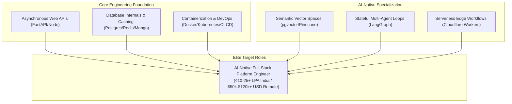

# Implementation Plan: The 2026 IT Career Blueprint

A comprehensive, strategic career transition guide and **30-part MDX blog series** (each strictly **2,000+ words**, totaling over **60,000 words**) under `src/content/blog/it-career-guide/`. This is an exhaustively researched upskilling blueprint designed specifically for **Chirag Singhal** to transition from an entry-level support/developer role inside a service-based giant (TCS Assistant Systems Engineer, ₹3.36 LPA) into a highly paid, internationally competitive **AI-Native Full-Stack Platform Engineer** (₹10–25+ LPA in India, or $50,000–$120,000+ USD globally remote).

---

## 1. Suggested Target Role & Market Positioning

Based on an exhaustive analysis of the 2026 global technology job market, local GCC hiring trends in India, and your current technical baseline (basic Python, limited database familiarity, entry-level TCS background), we strongly recommend targeting the following role:

### **Target Role: AI-Native Full-Stack Platform Engineer**

#### **Why This Role is in Massive Demand**
*   **The Shift to Production:** Startups and enterprises are moving past simple LLM wrappers and sandbox prototypes. They urgently require developers who understand core systems engineering (high-performance APIs, database indices, event-driven streaming, caching, container orchestration) *and* how to securely integrate stateful AI agents, multi-agent coordination models, and high-precision RAG pipelines into production code.
*   **Severe Talent Shortage:** While thousands of self-taught developers can write a basic LangChain API, very few can design a scalable database schema, profile PostgreSQL query execution paths, configure a partitioned Kafka broker, package containerized microservices in multi-stage Dockerfiles, or deploy serverless functions to the edge. 
*   **Leveraging Your Profile:** This role allows you to reframe your designation as an **Assistant Systems Engineer** at TCS into a systems-focused narrative (Systems Reliability, custom pricing-engine automation, and rules modeling) rather than letting recruiters classify you as a "manual support operator."

#### **Your Strategic Career Positioning Strategy**
Instead of competing as a generic entry-level backend developer (where competition is fierce), you will position yourself as an **AI-Native Systems Architect**. 



*   **Reframe TCS Work:** Translate your SAP CPQ configurations, pricing rule setups, and L3 support tickets into **Declarative Business Logic Modeling, SRE Operations, Log Diagnostic Debugging, and Scripted Automations**.
*   **Replace Fake Experience with Verifiable Portfolios:** Instead of hoping background checks won't notice unverified history, you will build **5 highly complex, open-source, fully documented production-grade portfolio projects** on your GitHub profile (`github.com/chirag127`). These projects will demonstrate your mastery of systems scale, event streaming, and stateful AI agents.

---

## 2. 6-Month Chronological Upskilling Roadmap (10 Hours/Day)

To successfully transition in 6 months while managing your work commitments, you must follow a disciplined, week-by-week schedule:

```
Month 1 (Weeks 1-4): CORE DEVELOPMENT TOOLKIT & MODERN PYTHON
├── Week 1: Linux Terminal Shell (rg, fzf, zoxide, jq) & Advanced Git Internals (DAG, Rebase, Reflog)
├── Week 2-3: Advanced Python Internals (CPython, memory cycles, closures) & Asynchronous Concurrency
└── Week 4: Strictly Typed Web APIs with FastAPI & Pydantic v2
[Goal: Build a fully functional, async file stream processing gateway with HTTPX integration]

Month 2 (Weeks 5-8): DATABASE ENGINEERING, CACHING & SERVER-SIDE JS
├── Week 5: Relational Deep-Dive: PostgreSQL Indexing (B-Tree, GIN), Query Tuning (EXPLAIN ANALYZE)
├── Week 6: Document Databases (MongoDB) & High-Performance In-Memory Caching (Redis Cache-Aside)
├── Week 7: Server-Side JavaScript/TypeScript: Node.js V8 Event Loops & Runtime Schema Validation (Zod)
└── Week 8: Distributed Event Streaming: Apache Kafka Partitions, Consumer Groups, & Idempotency
[Goal: Implement a telemetry processing pipeline utilizing Kafka brokers and Redis sorted sets]

Month 3 (Weeks 9-12): DISTRIBUTED ARCHITECTURES & INFRASTRUCTURE
├── Week 9: High-Level System Design (Consistent Hashing, Rate Limiters, CAP Theorem)
├── Week 10: Microservices Architecture (gRPC Protobuf, Saga Transactions, Circuit Breakers)
├── Week 11: Containerization: Multi-stage, non-root Dockerfiles & Layer Cache Optimization
└── Week 12: Container Orchestration: Declarative Kubernetes Pods, Ingress Controllers, & Helm Charts
[Goal: Build and package a gRPC microservices mesh deployed locally on replica Kubernetes clusters]

Month 4 (Weeks 13-16): CI/CD PIPELINES & EDGE SERVICE ARCHITECTURES
├── Week 13: Continuous Integration/Deployment: Parallel workflows, directory caches, & OIDC in GitHub Actions
├── Week 14: Serverless Edge Computing: Cloudflare Workers, Wrangler CLI, & D1/R2 storage engines
├── Week 15: Modern Frontend: React functional state hooks, lifecycle protocols, & dynamic styling
└── Week 16: Full-Stack Integration: Static Astro SSG rendering and connecting custom React components
[Goal: Provision multi-zone AWS VPCs via Terraform and automate edge service deployments]

Month 5 (Weeks 17-20): GENERATIVE AI SYSTEMS & AGENTIC WORKFLOWS
├── Week 17: LLM Architecture: Token boundaries, vector embeddings, & cosine similarity metrics
├── Week 18: Retrieval-Augmented Generation (RAG): Document chunking pipelines & PGVector search
├── Week 19: Stateful Multi-Agent Coordination: Graph routing and human-in-the-loop overrides in LangGraph
└── Week 20: Enterprise Security: OAuth2 PKCE token flows, CORS/CSRF middleware, & OWASP Top 10 hardening
[Goal: Construct a stateful, cyclic multi-agent research compiler with vector search storage]

Month 6 (Weeks 21-24): TESTING, PROBLEM SOLVING & CAREER LAUNCH
├── Week 21: Rigorous Testing: Unit, integration, & E2E pipelines utilizing Pytest and Playwright
├── Week 22: Algorithmic Thinking: Pattern recognition (sliding window, graph traversals, DFS/BFS)
├── Week 23: Global Resume Structuring (Awesome CV LaTeX) & LinkedIn Brand Optimization
└── Week 24: International Remote Job Portals (Toptal, Turing, Wellfound) & EU Visa Sponsorships
[Goal: Compile your ATS-optimized CV, update your profiles, and launch applications to 50+ roles]
```

---

## 3. User Review Required: 20 Clarifying Questions

To personalize this guide to your exact needs, please review the questions below. Your answers will help us align the blog series and career roadmap with your goals:

### **Section A: Technical Baseline & Comfort Level**
1.  **Programming Comfort:** On a scale of 1–10, how comfortable are you currently with writing raw Python or JavaScript logic without using AI assistance?
2.  **Concurrency Principles:** Have you ever encountered concepts like event loops, multithreading, or asynchronous programming, or should we start completely from first principles?
3.  **Database Familiarity:** Have you ever written raw SQL queries, designed custom database schemas, or worked with migrations (e.g. Alembic/Prisma), or is your knowledge limited to basic GUI-based CRUD?
4.  **CLI / Shell Experience:** Are you comfortable navigating directories, managing files, and piping outputs (`grep`, `awk`) inside a Linux terminal, or do you need a complete WSL2 setup guide?
5.  **Git Workflows:** How do you currently use Git? Do you only know basic commands (`add`, `commit`, `push`), or have you performed interactive rebases and resolved complex merge conflicts?
6.  **AI Engineering Understanding:** Have you ever worked directly with LLM APIs, vector stores (e.g., Pinecone/Chroma), or RAG workflows, or is this a completely new area of study?

### **Section B: Current TCS Context (SAP CPQ)**
7.  **Daily Scope:** What is the exact balance of your daily work on the SAP CPQ project? Is it mostly writing IronPython scripts for business rules, configuring pricing tables via GUI, or purely ticket/support handling?
8.  **Automation Opportunities:** Is there any room to write custom utility scripts or automation tools to simplify tasks for your TCS team? We can frame these as backend development achievements on your resume.
9.  **Bench Potential:** Are you currently on the bench, or do you have a dedicated, billable project allocation? Bench time is highly valuable for uninterrupted upskilling.
10. **TCS Resource Portals:** Can you confirm if you have active access to the **TCS Percipio (Skillsoft)** or **TCS Udemy Business** portals? Knowing this helps us verify which premium courses are free for you.

### **Section C: Job Hunt & Remote Strategy**
11. **Compensation Milestones:** What is your exact step-by-step salary goal? (e.g., Target ₹10 LPA within India first, or go directly for foreign remote contracts paying in USD?)
12. **Target Sectors:** Do you prefer working for high-growth Indian product startups (e.g., Razorpay, Groww) or international remote startups (US/Europe)?
13. **Immigration Preferences:** Are you interested in physically relocating to tech hubs abroad (e.g. Germany, Netherlands) using direct employer-sponsored visa routes?
14. **Interview Types:** Would you like to focus more on cracking algorithmic coding tests (LeetCode-style) or system design/architecture interviews?
15. **Portfolio Scope:** Do you already have a personal portfolio website hosted on your custom domain (`chirag127.in`), and is it active?

### **Section D: Learning Styles & Resource Preferences**
16. **Video vs. Text:** Do you prefer structured, visual, video-based learning (Udemy/LinkedIn Learning) or reading deep-dive technical books and official specifications?
17. **Study Pace:** How many hours can you consistently dedicate to upskilling every single day, including weekends?
18. **Coding Templates:** Do you want the blog series to include clean, modular code snippets for system configurations (like custom Dockerfiles or Redis rate limiters), or focus on architectural explanations?
19. **AdSense Integration:** Since this series will be published on `blog.oriz.in`, do you want us to include optimized Google AdSense placement tags in the MDX files to maximize ad revenue?
20. **Visual Visualizations:** Should we include custom, hand-crafted Mermaid diagrams for every complex system architecture described in the blogs?

---

## 4. Master Resource Selection (O'Reilly, Udemy, LinkedIn & Free)

To ensure you never have to spend money on courses or books, we have curated the **single best technical resource** for each major learning phase, utilizing your enterprise portals:

| Skill Domain | Premium Book (O'Reilly) | Premium Video Course (Udemy / LinkedIn) | Top Free Alternative |
| :--- | :--- | :--- | :--- |
| **Linux Terminal** | *The Linux Command Line* — William Shotts | **Linux Command Line Bootcamp** — Colt Steele (Udemy) | MIT Missing Semester: The Shell (missing.csail.mit.edu) |
| **Git Mastery** | *Version Control with Git* — Ponuthorai | **The Git & GitHub Bootcamp** — Colt Steele (Udemy) | Pro Git (git-scm.com/book) |
| **Python Internals** | *Fluent Python (2nd Ed)* — Luciano Ramalho | **Python 3: Deep Dive (Part 1)** — Fred Baptiste (Udemy) | Python Official Tutorial (docs.python.org/3/tutorial) |
| **FastAPI Backend** | *FastAPI: Modern Web Dev* — Bill Lubanovic | **FastAPI Complete Course 2026** — Eric Roby (Udemy) | FastAPI Official Docs (fastapi.tiangolo.com) |
| **TypeScript / Node** | *Effective TypeScript* — Dan Vanderkam | **Understanding TypeScript** — M. Schwarzmüller (Udemy) | TypeScript Handbook (typescriptlang.org/docs) |
| **PostgreSQL** | *Designing Data-Intensive Apps* — Kleppmann | **SQL and PostgreSQL: Complete Guide** — S. Grider (Udemy) | PostgreSQL 14 Internals (postgrespro.com/publications/books) |
| **Redis Caching** | *Redis Stack for App Modernization* — Fugaro | **Redis: Complete Developer's Guide** — S. Grider (Udemy) | Redis University (university.redis.io) |
| **Apache Kafka** | *Kafka: The Definitive Guide* — Gwen Shapira | **Apache Kafka for Beginners v3** — S. Maarek (Udemy) | Confluent Developer Academy (developer.confluent.io) |
| **System Design** | *Designing Data-Intensive Apps* — Kleppmann | **Mastering the System Design Interview** — Frank Kane (Udemy) | System Design Primer (github.com/donnemartin) |
| **Docker & K8s** | *Kubernetes: Up & Running* — Brendan Burns | **Docker & Kubernetes: Complete Guide** — S. Grider (Udemy) | Mumshad Mannambeth: Kubernetes Basics (KodeKloud) |
| **CI/CD Pipelines** | *GitHub Actions in Action* — Rob Bos | **GitHub Actions — The Complete Guide** — Schwarzmüller (Udemy) | GitHub Actions Learning Path (skills.github.com) |
| **Serverless Edge** | *Cloud Native DevOps* — John Arundel | **AWS Lambda & Serverless Bootcamp** — (Udemy) | Cloudflare Workers Docs (developers.cloudflare.com) |
| **React & Frontend** | *Learning React* — Alex Banks | **React — The Complete Guide** — M. Schwarzmüller (Udemy) | React Official Docs (react.dev) |
| **GenAI / LLMs** | *AI Engineering* — Chip Huyen | **Complete GenAI with Langchain** — Krish Naik (Udemy) | DeepLearning.AI Short Courses (deeplearning.ai) |
| **Agentic Workflows** | *Multi-Agent Systems* — Victor Dibia | **Build AI Agents with LangGraph** — Eden Marco (Udemy) | LangGraph Official Docs (langchain-ai.github.io) |
| **Web Security** | *Web Application Security* — Andrew Hoffman | **OWASP Top 10: 2026 Comprehensive Training** (Udemy) | OWASP Top 10 Official Portal (owasp.org/Top10) |
| **Software Testing** | *Python Testing with pytest* — Brian Okken | **Playwright Web Automation with Pytest** (Udemy) | Pytest Official Docs (docs.pytest.org) |
| **DSA & Algorithms** | *Grokking Algorithms* — Aditya Bhargava | **Master the Coding Interview: DSA** — A. Neagoie (Udemy) | NeetCode 150 Checklist (neetcode.io) |

---

## 5. Expanded 30-Part Master Syllabus Outline

To ensure absolute coverage of every critical topic without leaving any knowledge gaps, we have expanded the curriculum to a **30-Part Master Series**:

| Part | Title | Focus & Core Skills Covered |
| :---: | :--- | :--- |
| **1** | **The Blueprint & Escape Plan** | Escaping multinational IT support, understanding local GCC salary economics, and setting up study routines. |
| **2** | **Advanced Version Control & Git Mastery** | Git DAG topologies, branching models, interactive rebases, reflog recovery, and pre-commit hooks. |
| **3** | **The Developer Toolkit & CLI Productivity** | WSL2 configuration, terminal shell scripting (`rg`, `fzf`, `jq`), and SSH agent forwarding security. |
| **4** | **Python Mastery: Core Language Internals** | CPython memory compilation, garbage collection cycles, generators, closures, and static Mypy typing. |
| **5** | **Asynchronous Python & FastAPI Services** | Concurrency concurrency, event loop mechanics, Pydantic v2 validation, and dependency injection graphs. |
| **6** | **TypeScript & Server-Side Node.js** | Node V8 architecture, modern TypeScript syntax, compiled execution, and dynamic schema validation with Zod. |
| **7** | **Relational Databases & Advanced PostgreSQL** | MVCC storage engines, B-Tree/GIN indexing, transaction isolation levels, and query profiling (`EXPLAIN ANALYZE`). |
| **8** | **Document Modeling with MongoDB** | Denormalized document schema designs, aggregation frameworks, and indexing strategies. |
| **9** | **Distributed Caching with Redis** | Redis key-value structures, cache-aside/write-through topologies, TTL jitters, and sliding-window transactions. |
| **10** | **Distributed Event Streaming with Apache Kafka** | Topic partitioning models, consumer groups, offset tracking, and transaction idempotency guarantees. |
| **11** | **System Design Foundations for High Scale** | Consistent hashing, horizontal scaling, reverse proxies, CDNs, and CAP theorem trade-offs. |
| **12** | **Microservices Architecture Patterns** | DDD Bounded Contexts, inter-service gRPC communication, Saga transactions, and retry circuit breakers. |
| **13** | **API Design Excellence: REST & GraphQL** | REST maturity models, OpenAPI/Swagger specifications, and GraphQL query schemas. |
| **14** | **Docker Containers for Platform Developers** | Container isolation, multi-stage optimized Dockerfiles, layer caching, and non-root security. |
| **15** | **Kubernetes Orchestration & Helm Meshes** | Kubernetes nodes, load-balancing ingress, health probes, and automated Helm rolling updates. |
| **16** | **Continuous Integration with GitHub Actions** | Automated parallel workflows, directory caching, and keyless OIDC authentication. |
| **17** | **AWS Cloud Infrastructure & Services** | Core AWS compute/storage systems (EC2, S3, RDS, DynamoDB) and secure IAM access structures. |
| **18** | **Serverless Architectures at the Edge** | Cloudflare Workers edge runtimes, Wrangler CLI, D1 SQL engines, and R2 object storage. |
| **19** | **Modern Frontend Frameworks: React.js** | React functional state hooks, virtual DOM reconciliations, and Redux/Zustand state layers. |
| **20** | **Full-Stack Integration with Astro SSG** | Astro static site generation, responsive Tailwind styling, and routing architectures. |
| **21** | **Generative AI Fundamentals & Model APIs** | LLM tokenization, vector embeddings, similarity metrics, and OpenAI/Gemini system routing. |
| **22** | **Retrieval-Augmented Generation (RAG)** | Document chunking strategies, vector database storage (PGVector), and semantic hybrid searches. |
| **23** | **Stateful Agentic AI with LangGraph** | Cyclic state graphs, agent tools execution, and human-in-the-loop validation checkpoints. |
| **24** | **Enterprise Web Security & OWASP Hardening** | OAuth2 PKCE token flows, CORS/CSRF middleware, and OWASP Top 10 sanitizations. |
| **25** | **Comprehensive Testing Strategies** | Unit, integration, and E2E automation frameworks utilizing Pytest and Playwright. |
| **26** | **Data Structures, Algorithms & LeetCode** | Algorithmic pattern recognition matching the NeetCode 150 syllabus. |
| **27** | **Technical Interview Success & STAR Method** | System design diagrams, back-of-the-envelope calculations, and STAR behavioral stories. |
| **28** | **Global Remote Job Portals & Vetting** | Vetting strategies on Toptal and Turing, and direct hiring on Wellfound/WeWorkRemotely. |
| **29** | **Immigration Pathways & Tech Relocation** | Fast-track EU Blue Cards (Germany) and HSM visas (Netherlands) for systems engineers. |
| **30** | **Resume & Portfolio Overhaul Blueprint** | Awesome CV LaTeX overrides, reframing TCS support, and deploying 5 defensible portfolio projects. |

---

## 6. Verification Plan

### **Automated Verification**
1.  **Astro Schema Validation:** Run `pnpm astro check` or standard TypeScript type-checking to verify that all MDX files compile cleanly against the Astro collection schema.
2.  **Linting & Quality Checks:** Run `pnpm Biome lint` or linter commands on the repository to ensure zero format or styling syntax violations exist.
3.  **Link Integrity Diagnostics:** Run a custom Node-based link checking script across the generated MDX directory to ensure all cross-links (`previous`, `next`, and `index` links) are fully valid and non-broken.

### **Manual Verification**
1.  **Visual Layout Audit:** Start the local development server using `pnpm dev` and review the series index and individual pages.
2.  **Navigation Flow Test:** Verify that the series navigation bar on each page correctly routes users to the Index, the immediate Previous Part, and the next sequential Part.
3.  **AdSense & SEO Check:** Inspect the compiled HTML output to ensure meta description tags and placeholder ad blocks align with standard SEO and responsive formatting guidelines.
