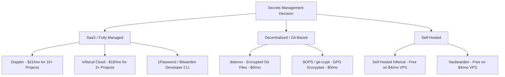

# How to Securely Backup and Sync Developer Secrets and Environment Variables

Every developer knows the drill: you clone a project, copy the `.env.example` file, and spend thirty minutes hunting down API keys, database credentials, and webhook secrets from your team or cloud dashboards.

But what happens if your laptop dies, gets stolen, or you simply set up a new machine? If your secrets only exist in a local, `.gitignore`-ed `.env` file, they are gone forever.

Worse, the temptation to "backup" these secrets by committing them to a private GitHub repository in plain text or sharing them over Slack/WhatsApp exposes your project to severe security risks. 

In this masterclass, we will explore why relying on local `.env` files is a ticking time bomb, review the best platforms and workflows to securely backup, sync, and manage your developer environment variables, and show you how to **scale secrets management to hundreds of projects on a $0 (or near-$0) solo developer budget**.

---

## The Core Problem: The Fragility of Local `.env` Files

For years, the standard approach to managing local configurations has been the humble `.env` file. While simple, it introduces significant friction:

1. **No Redundancy (Loss Risk):** If your hardware fails or is lost, you lose access to all local configurations.
2. **"Works on My Machine" Sync Issues:** When team members or different devices update environment variables, they have to manually communicate those changes. Inevitably, someone runs old configuration and wastes hours debugging.
3. **Accidental Leaks:** All it takes is one misconfigured `.gitignore` or a rushed commit to expose your production database password to the world.
4. **Secret Sprawl:** Secrets end up scattered in plain text across developer machines, staging servers, and cloud providers with zero centralized access control or audit logs.

---

## The Scaling Challenge for Solo Developers (Hundreds of Projects)

If you are an agency developer, an active open-source maintainer, or a serial side-project builder, you likely have **hundreds of code repositories**. 

Most modern SaaS secrets managers are priced for teams. When you look at their free tiers, they are designed to give you a taste, but restrict project scaling:
* **Doppler Cloud:** The free "Developer" tier restricts you to **10 projects**. If you have 150 projects, you must upgrade to the **Team plan at $21/user/month** (which caps at 250 projects).
* **Infisical Cloud:** The free tier restricts you to **3 projects** and 5 identities. Beyond that, the **Pro tier costs $18/identity/month**.
* **Dotenv Vault:** The hosted SaaS vault service has **discontinued its free tier** entirely, starting at $5/month for the Solo plan.

If you have 100+ projects, paying $200+ a year just to back up simple developer environment variables is highly inefficient. 

Below, we cover **six distinct approaches** to solving the secret backup problem, highlighting how to achieve unlimited projects for $0/month.

---

## 6 Paths to Secure Secrets Management



### Approach 1: The Decentralized Encrypted Git Model (dotenvx)
* **Cost:** **$0 / month** (100% Free & Open Source)
* **Project Limits:** **None** (stored directly in your Git repositories)
* **Perfect For:** Solo developers with hundreds of side projects.

[dotenvx](https://dotenvx.com/) is the modern successor to the traditional `dotenv` package. Instead of relying on a centralized cloud database, `dotenvx` uses **cryptographic separation** to make it safe to commit your environment variables to Git.

#### How it works:
1. You keep your `.env` file containing your secrets.
2. You run `dotenvx encrypt`.
3. `dotenvx` generates a public/private keypair using **Elliptic Curve Integrated Encryption Scheme (ECIES)** with **AES-256**.
4. The values in your `.env` file are encrypted in place:
   ```bash
   # .env (After encryption)
   DOTENV_PUBLIC_KEY="03a11b..."
   PORT="encrypted:BqK90r..."
   DATABASE_URL="encrypted:AqZ19p..."
   ```
5. A `.env.keys` file is generated containing the decryption key. You add `.env.keys` to your `.gitignore` so it never leaves your machine.
6. The encrypted `.env` is committed directly to your public or private GitHub repository.
7. To run your application, you inject secrets on the fly:
   ```bash
   dotenvx run -- npm run dev
   ```

#### The Backup Strategy:
Since your secrets are encrypted, you can back up your Git repositories anywhere (GitHub, GitLab, external SSDs, cloud storage) without worrying about leaks. To restore your setup on a new laptop, you only need to store the private keys. You can store your `DOTENV_PRIVATE_KEY` values in:
* A password manager (1Password, Bitwarden, KeePassXC).
* A single, master encrypted note.
* A private, secure backup file.

---

### Approach 2: The Self-Hosted Secrets Platform (Infisical / Vault)
* **Cost:** **$0 to $4 / month** (Cost of a cheap VPS or free cloud tier)
* **Project Limits:** **None**
* **Perfect For:** Developers who want a premium, Doppler-like web dashboard and CLI experience but refuse to pay SaaS markup.

Because [Infisical](https://infisical.com) is open-source, you can host it yourself. A single docker-compose setup on a $4/month VPS (like Hetzner, OVH, or DigitalOcean) can handle hundreds of projects and inject secrets into your local terminals, servers, and CI/CD pipelines.

#### Setting up a Self-Hosted Infisical Instance (Docker Compose):

Create a `docker-compose.yml` file:

```yaml
version: '3.8'

services:
  db:
    image: postgres:15-alpine
    environment:
      POSTGRES_USER: infisical
      POSTGRES_PASSWORD: super_secret_password_here
      POSTGRES_DB: infisical
    volumes:
      - pgdata:/var/lib/postgresql/data
    restart: always

  infisical:
    image: infisical/infisical:latest
    environment:
      - DB_CONNECTION_URI=postgresql://infisical:super_secret_password_here@db:5400/infisical
      - ENCRYPTION_KEY=your_32_byte_hex_encryption_key
      - AUTH_SECRET=your_auth_jwt_signing_secret
      - SITE_URL=https://secrets.yourdomain.com
    ports:
      - "80:80"
    depends_on:
      - db
    restart: always

volumes:
  pgdata:
```

#### How to Sync:
Once hosted, you login with the Infisical CLI pointing to your custom instance:
```bash
infisical login --domain https://secrets.yourdomain.com
infisical init
infisical run -- npm run dev
```
If your laptop is lost, your central VPS retains all projects and history. You simply spin up a new machine, download the CLI, log back into your server, and resume work.

---

### Approach 3: Doppler (The SaaS Premium Path)
* **Cost:** **$21 / user / month**
* **Project Limits:** **250 Projects** on the Team Plan.
* **Perfect For:** Teams, businesses, or developers who prioritize uptime, security compliance, and direct integrations over cost saving.

If you choose to pay for Doppler to support 10+ projects, you get a world-class environment sync engine. 

#### Setup:
1. Create a Doppler account and create your projects.
2. Install the Doppler CLI:
   * **Windows (Scoop):** `scoop install doppler`
   * **macOS (Homebrew):** `brew install doppler`
   * **Linux:** `curl -Ls https://cli.doppler.com/install.sh | sh`
3. Run `doppler login` to bind your machine.
4. Run `doppler setup` inside your repository.
5. Launch your runtime: `doppler run -- npm start`.

---

### Approach 4: Git-Crypt / SOPS (The Cryptographic Git Alternative)
* **Cost:** **$0 / month**
* **Project Limits:** **None**
* **Perfect For:** Git-native users who want transparent file-level encryption.

#### SOPS (Secrets Operations)
SOPS is an editor of encrypted files that supports YAML, JSON, ENV, INI, and BINARY formats and encrypts with Age, PGP, AWS KMS, GCP KMS, and Azure Key Vault.

For solo developers, using **Age** keys is the simplest solution:
1. Generate an Age key: `age-keygen -o key.txt`
2. Encrypt your `.env` file:
   ```bash
   sops --encrypt --age $(cat key.txt | grep -oP "public key: \K.*") .env > .env.enc
   ```
3. Commit `.env.enc` to Git.
4. Decrypt on your local machine when running:
   ```bash
   sops exec-env .env.enc "npm run dev"
   ```

---

### Approach 5: Password Manager Secrets Automation
* **Cost:** **Free to $5 / month**
* **Project Limits:** **None** (based on password manager vault items)
* **Perfect For:** Storing keys inside your existing password vault.

Both **1Password** and **Bitwarden** offer CLIs that let you reference credentials programmatically.

For example, using the **1Password CLI (`op`)**, you can write a config template file `env.tpl`:
```bash
DATABASE_URL="{{op://Personal/MyDatabase/username}}:{{op://Personal/MyDatabase/password}}@localhost:5432/db"
STRIPE_KEY="{{op://Personal/Stripe/credential}}"
```

You can then inject these variables dynamically at runtime:
```bash
op run --env-file=env.tpl -- npm run dev
```
Your secrets remain encrypted inside 1Password, which automatically syncs across all your devices.

---

### Approach 6: Cloud-Native Secret Vaults
* **Cost:** **$0 / month** (under free usage limits)
* **Project Limits:** **None** (limited by cloud provider parameter limits)
* **Perfect For:** Infrastructure deployed entirely on one cloud platform.

If you build primarily on AWS, GCP, or Cloudflare, you can store your developer configuration in their cloud systems:
- **AWS Parameter Store:** Storing standard parameters is completely free (up to 10,000 parameters per account).
- **Cloudflare KV/D1:** Store encrypted JSON payloads representing your `.env` variables and fetch them via a CLI script.

---

## Comparison Matrix for Solo Developers

| Solution | Cost (100 Projects) | Hosting Required? | Setup Complexity | Backup Overhead |
| :--- | :--- | :--- | :--- | :--- |
| **dotenvx** | $0/mo (Free) | No | Very Low | Keep track of `DOTENV_PRIVATE_KEY` for each repo |
| **Self-Hosted Infisical** | $0 to $4/mo | Yes (Docker VPS) | Medium | Back up the Postgres database |
| **Doppler (SaaS)** | $21/mo | No | Very Low | None (handled by SaaS) |
| **Infisical Cloud** | $18/mo (identity billing) | No | Very Low | None (handled by SaaS) |
| **1Password CLI** | Free / $3/mo | No | Medium | Handled by password manager account |
| **SOPS + Age** | $0/mo (Free) | No | High | Store PGP/Age keys safely |

---

## Migrating 100+ Projects Programmatically

If you have hundreds of repositories, migrating each manually is tedious. Here is an automated script to transition your local folders to **dotenvx** in bulk.

### PowerShell Script (Windows)

Save this script as `migrate.ps1` and run it from your main development directory:

```powershell
# Directory containing your git repositories
$DevDir = "C:\Users\chira\OneDrive\GitHub"

# Find all subdirectories containing a .git folder and a .env file
Get-ChildItem -Path $DevDir -Directory -Recurse -Depth 2 | ForEach-Object {
    $RepoPath = $_.FullName
    $DotEnv = Join-Path $RepoPath ".env"
    $GitFolder = Join-Path $RepoPath ".git"

    if ((Test-Path $DotEnv) -and (Test-Path $GitFolder)) {
        Write-Host "Migrating project: $($_.Name) at $RepoPath" -ForegroundColor Cyan
        
        # Change path to project directory
        Push-Location $RepoPath
        
        try {
            # 1. Initialize dotenvx encryption
            npx dotenvx encrypt
            
            # 2. Ensure .env.keys is added to .gitignore
            $GitIgnore = Join-Path $RepoPath ".gitignore"
            if (Test-Path $GitIgnore) {
                $content = Get-Content $GitIgnore
                if ($content -notcontains ".env.keys") {
                    Add-Content $GitIgnore "`n.env.keys"
                    Write-Host "Added .env.keys to .gitignore" -ForegroundColor Green
                }
            } else {
                New-Item -Path $GitIgnore -ItemType File -Value ".env.keys" | Out-Null
                Write-Host "Created .gitignore and added .env.keys" -ForegroundColor Green
            }

            # 3. Stage changes
            git add .env .gitignore
            git commit -m "security: migrate to dotenvx encrypted environment variables"
            Write-Host "Committed changes successfully!" -ForegroundColor Green
        }
        catch {
            Write-Error "Failed to process directory $RepoPath"
        }
        finally {
            Pop-Location
        }
    }
}
```

---

## Actionable Recommendations: What Setup Should You Choose?

### Scenario A: "I want a 100% free setup with zero hosting maintenance."
* **Recommendation:** **dotenvx**.
* **Action plan:** Run the PowerShell migration script above to encrypt all `.env` files across your repositories. Copy all generated keys from the `.env.keys` files into a single secure notes vault in your password manager.

### Scenario B: "I want a dashboard interface to edit variables visually, but I don't want to pay $21/month."
* **Recommendation:** **Self-hosted Infisical**.
* **Action plan:** Spend 30 minutes setting up a Docker Compose stack on a $4/month Hetzner or DigitalOcean Cloud instance. Back up the PostgreSQL database volumes nightly to an external drive or S3.

### Scenario C: "I am already paying for 1Password/Bitwarden."
* **Recommendation:** **1Password / Bitwarden Secrets Manager CLI**.
* **Action plan:** Move your `.env` values into developer items inside your password manager vault and reference them natively via the CLI.
