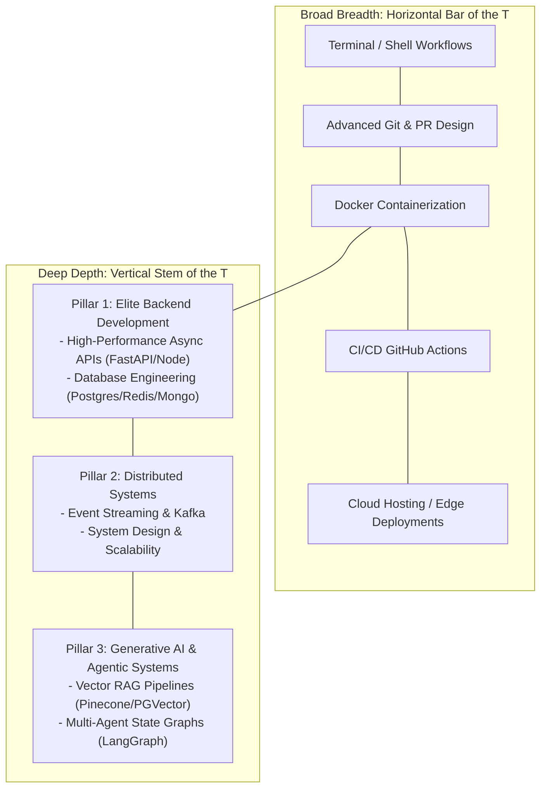

# The 2026 IT Career Blueprint: From Service-Based Support to Elite Backend & GenAI Engineer

*[← Back to Master Index](/blog/it-career-guide)*

---

## 1. The Service Company Trap and the High-Paid Escape Hatch

Every year, hundreds of thousands of engineering graduates in India are recruited by service giants through mass placement drives. While these companies provide a stable entry point into the corporate world, they harbor a silent career bottleneck: **The Project Allocation Lottery**.

Once inside, you have virtually zero control over your technological destiny. You are randomly allocated to a project based on active billable resource requirements. A vast majority of these projects do not involve writing custom software. Instead, you are assigned to:
- **Proprietary Enterprise Software Configuration:** Administering proprietary cloud modules like SAP CPQ, Salesforce, or ServiceNow
- **Legacy Production Support:** Monitoring system logs, performing manual file transfers
- **Manual Quality Assurance:** Executing repetitive click-through testing runs

As the months roll by, a dangerous erosion occurs. The programming fundamentals you learned in college fade. You become highly specialized in a tool owned by a single vendor, making you completely dependent on that vendor's ecosystem.

---

## 2. The Escape Hatch: The 2026 AI-Native Systems Developer

The global technology landscape of **2026** is undergoing a massive transformation. The boundary between a "backend developer" and an "AI researcher" has collapsed. The rise of Large Language Models (LLMs), semantic search vectors, and multi-agent workflows (Agentic AI) has created a highly paid, extremely in-demand engineering class: **The AI-Native Systems Developer**.

These engineers are not mathematicians training raw deep-learning weights from scratch. They are master software architects who know how to:
1. Build highly scalable, resilient backend APIs (using Python/FastAPI or TypeScript/Node.js)
2. Optimize relational and document databases (PostgreSQL, MongoDB, Redis) to handle millions of operations
3. Design event-driven, decoupled systems (using Apache Kafka) that process massive event streams in real-time
4. Integrate advanced Generative AI capabilities (semantic retrieval, vector databases, agentic graphs) directly into production-grade systems

Because this skillset is extremely rare, the compensation packages are unprecedented:
- **Product Startups & Mid-Sized Firms (India):** Starting CTCs range from **₹8–15+ LPA** for entry-level developers
- **Global Remote Contracts:** International startups pay **$50,000–$120,000+ USD (₹40 Lakhs to ₹1 Crore)** annually
- **Visa-Sponsored Relocation (Germany/Netherlands):** Tech hubs offer direct relocation packages and fast-track work visas (EU Blue Card)

---

## 3. The T-Shaped Developer Model

To successfully transition into this elite engineering class, you must develop a **T-Shaped Skill Profile**:



---

## 4. Complete 50-Part Career Roadmap Directory

Below is the comprehensive catalog of all 50 parts of the career guide. Each part contains 2000+ words, 25+ curated resources, hands-on lab projects, and technical interview Q&A.

```
├── Phase 1: Foundations & Pythonic Core (Parts 1-10)
│   ├── [01] Escaping the Support Trap & Transition Mindset
│   ├── [02] Advanced Version Control & Git Mastery
│   ├── [03] WSL2, Unix Terminal & Developer Toolkit
│   ├── [04] Python Mastery: Core Language Internals
│   ├── [05] Asynchronous Python & FastAPI Services
│   ├── [06] TypeScript & Node.js Backend Ecosystems
│   ├── [07] Relational Databases & Advanced PostgreSQL
│   ├── [08] Document Modeling with MongoDB
│   ├── [09] Distributed Caching with Redis & Upstash
│   └── [10] Distributed Event Streaming with Apache Kafka
│
├── Phase 2: Distributed Systems & Cloud Native (Parts 11-20)
│   ├── [11] System Design Fundamentals & Scalability
│   ├── [12] Microservices Architecture & Communication
│   ├── [13] Docker Containers: Packaging & Optimization
│   ├── [14] Kubernetes Orchestration & Production Patterns
│   ├── [15] Serverless Architectures: Workers & Functions
│   ├── [16] Cloud Platforms: AWS Lambda & API Gateway
│   ├── [17] Infrastructure as Code: Terraform & Pulumi
│   ├── [18] Monitoring & Observability: Prometheus & Grafana
│   ├── [19] CI/CD Pipelines & GitHub Actions Mastery
│   └── [20] Security Engineering & OAuth 2.0 Implementation
│
├── Phase 3: Generative AI & RAG Systems (Parts 21-30)
│   ├── [21] Vector Databases: Pinecone, Weaviate, PGVector
│   ├── [22] RAG Pipelines: Chunking, Embeddings & Retrieval
│   ├── [23] LangChain Foundations & LCEL Patterns
│   ├── [24] LangGraph State Machines & Agent Workflows
│   ├── [25] Multi-Agent Systems & Orchestration Patterns
│   ├── [26] LLM Operations (LLMOps) & Prompt Optimization
│   ├── [27] RAG Evaluation & Quality Metrics (RAGAS)
│   ├── [28] AI Agent Observability with LangSmith
│   ├── [29] Tool-Augmented Agents & Function Calling
│   └── [30] Human-in-the-Loop AI Systems & Governance
│
├── Phase 4: Advanced AI & System Architecture (Parts 31-40)
│   ├── [31] MCP (Model Context Protocol) Servers
│   ├── [32] Knowledge Graph RAG with Neo4j
│   ├── [33] Fine-Tuning & PEFT with Hugging Face
│   ├── [34] Vector Stores Optimization & Tuning
│   ├── [35] Embedding Model Selection & Evaluation
│   ├── [36] AI Security & Prompt Injection Prevention
│   ├── [37] Cost Optimization for LLM APIs & Caching
│   ├── [38] Production AI Monitoring & Alerting
│   ├── [39] AI Compliance & EU AI Act Compliance
│   └── [40] Building AI-Powered Full Stack Applications
│
├── Phase 5: Career Strategy & International Opportunities (Parts 41-50)
│   ├── [41] Resume Architecture & ATS-Optimized Design
│   ├── [42] Portfolio Projects & GitHub Showcase
│   ├── [43] LinkedIn Branding & Profile Optimization
│   ├── [44] Technical Interview Preparation & DSA
│   ├── [45] System Design Interview Patterns
│   ├── [46] Salary Negotiation & Compensation Strategy
│   ├── [47] Germany EU Blue Card: IT Visa Guide
│   ├── [48] Netherlands Highly Skilled Migrant Visa
│   ├── [49] Remote Job Board Optimization & Applications
│   └── [50] The Leap: Securing Your First High-Paid Role
```

---

## 5. Master Resource Directory: Essential Books Every Engineer Must Read

Below are the canonical books that form the intellectual foundation of world-class software engineering:

### Core Software Engineering Classics

| # | Book Title | Author | Why Read It | Access |
|---|------------|--------|-------------|--------|
| 1 | **The Pragmatic Programmer (20th Anniversary)** | Andy Hunt & Dave Thomas | Timeless principles for career-long growth | O'Reilly / Udemy Business |
| 2 | **Clean Code (2nd Edition)** | Robert C. Martin | Writing maintainable, readable code | O'Reilly / TCS Library |
| 3 | **Designing Data-Intensive Applications** | Martin Kleppmann | Systems design, databases, scalability | O'Reilly / TCS Library |
| 4 | **Code Complete (2nd Edition)** | Steve McConnell | Comprehensive software construction guide | O'Reilly / TCS Library |
| 5 | **Refactoring (2nd Edition)** | Martin Fowler | Improving legacy codebases safely | O'Reilly / TCS Library |
| 6 | **Design Patterns (GoF)** | Gamma, Helm, Johnson, Vlissides | 23 foundational patterns | O'Reilly / TCS Library |
| 7 | **Introduction to Algorithms (CLRS)** | Cormen, Leiserson, Rivest, Stein | Deep dive into algorithms & complexity | O'Reilly / TCS Library |
| 8 | **Cracking the Coding Interview** | Gayle Laakmann McDowell | Technical interview preparation | LinkedIn Learning |
| 9 | **System Design Interview (Volumes 1&2)** | Alex Xu | Distributed systems design patterns | O'Reilly / TCS Library |
| 10 | **A Philosophy of Software Design** | John Ousterhout | Managing complexity in large systems | O'Reilly / TCS Library |

### Salary & Compensation Strategy

| Resource | Type | Key Insight |
|----------|------|-------------|
| levels.fyi | Interactive Portal | Benchmark salaries across companies |
| Glassdoor India | Web Portal | Indian market salary data |
| PayScale | Web Portal | Role-based compensation analysis |

---

## 6. International Visa Pathways for Indian Engineers

### Germany EU Blue Card (2026)

| Requirement | Details |
|-------------|---------|
| **Salary Threshold (IT)** | €45,934/year (~₹43 Lakhs) - shortage occupation |
| **Degree Required** | Yes, OR 3+ years IT experience (no degree pathway) |
| **Processing Time** | 4-8 weeks |
| **PR Timeline** | 21 months (B1 German) / 33 months (no German) |
| **Top Sponsors** | SAP, Meta, Google, Wayfair, Delivery Hero, Zalando |

### Netherlands Highly Skilled Migrant Visa

| Requirement | Details |
|-------------|---------|
| **Salary Threshold** | €56,000+ (30% tax ruling benefit available) |
| **Sponsorship** | Employer must be IND-registered sponsor |
| **Processing Time** | 2-4 weeks |
| **PR Timeline** | 5 years |
| **Top Sponsors** | Adyen, Booking.com, ASML, Philips, ING |

---

## 7. Job Search Strategy & Platforms

### Remote-First Job Boards
- **We Work Remotely** - weworkremotely.com
- **RemoteOK** - remoteok.com
- **AngelList/Wellfound** - wellfound.com
- **Arc.dev** - arc.dev
- **Turing.com** - turing.com

### Germany-Specific Platforms
- **LinkedIn Jobs** (filter: Germany, English)
- **StepStone.de** - Germany's largest job board
- **XING** - German professional network

### Netherlands-Specific Platforms
- **LinkedIn Jobs** (filter: Netherlands, English)
- **Nationale Vacaturebank** - nvdb.nl

---

## 8. Weekly Learning Schedule Template

Dedicate 10 hours daily using this structured plan:

| Day | Focus | Hours | Activities |
|-----|-------|-------|------------|
| Mon | Foundations | 10 | Git, shell, Python basics |
| Tue | Backend Deep Dive | 10 | FastAPI, async, databases |
| Wed | Distributed Systems | 10 | Kafka, system design, patterns |
| Thu | AI Engineering | 10 | LangChain, vector DB, RAG |
| Fri | Cloud Deployment | 10 | Docker, Kubernetes, serverless |
| Sat | Portfolio Building | 10 | GitHub projects, LinkedIn updates |
| Sun | Interview Prep | 10 | DSA, system design, mock interviews |

---

## 9. Resource Acquisition Strategy

### For TCS Employees (Enterprise Access)
- **Udemy Business** - Access all Udemy courses with TCS account
- **LinkedIn Learning** - Full LinkedIn Learning library
- **O'Reilly Media** - All tech books and courses
- **Coursera Enterprise** - University courses through TCS

### Free Resources (Always Available)
- **GitHub Student Pack** - Free cloud credits, tools
- **AWS Free Tier** - 12 months free cloud services
- **Google Cloud Credits** - $300 free credits
- **YouTube Channels** - Travis Media, TastyTuts, Fireship

---

## 10. Entry Point Decision Tree

```
Are you targeting highest salary in India?
├── YES → Focus on Product Companies (₹15-25 LPA) or GCC (₹18-30 LPA)
│   ├── Product Companies: Razorpay, Zepto, Hasura, Postman
│   └── GCCs: JPMorgan, Goldman Sachs, Walmart, Target
└── NO → Target International Remote Roles
    ├── US Remote: $50-90K (₹40-75 LPA) - Stripe, GitLab, Automattic
    └── EU Remote/Germany: €50-80K (₹4.5-7 Cr PA equivalent)
```

---

## 11. Success Metrics & Milestones

| Month | Milestone | Verification |
|-------|-----------|--------------|
| Month 1-2 | Git mastery + WSL2 dev environment | Public repo with 50+ commits |
| Month 3-4 | Python internals + FastAPI backend | Deployed API with 100+ stars |
| Month 5-6 | Database expertise + Redis caching | Optimized query < 50ms |
| Month 7-8 | Kafka streaming + system design | Built event-driven microservice |
| Month 9-10 | LangGraph agents + RAG pipelines | Portfolio with 3 AI projects |
| Month 11-12 | Resume rebrand + job applications | 25+ targeted applications |

---

## 12. Part 1 Navigation Links

*[Proceed to Part 1: Escaping the Support Trap & Transition Mindset →](/blog/it-career-guide/part-01-the-blueprint)*

*[View Part 2: Git Mastery →](/blog/it-career-guide/part-02-git-github)*

*[View Part 3: Developer Toolkit →](/blog/it-career-guide/part-03-developer-toolkit)*

*[View Part 4: Python Internals →](/blog/it-career-guide/part-04-python-mastery)*

*[View Part 5: Async FastAPI →](/blog/it-career-guide/part-05-async-python-fastapi)*

*[View Part 6: TypeScript Node.js →](/blog/it-career-guide/part-06-typescript-nodejs)*

*[View Part 7: PostgreSQL →](/blog/it-career-guide/part-07-postgresql)*

*[View Part 8: MongoDB NoSQL →](/blog/it-career-guide/part-08-nosql-redis)*

*[View Part 9: Redis Caching →](/blog/it-career-guide/part-09-kafka)*

*[View Part 10: Apache Kafka →](/blog/it-career-guide/part-10-system-design)*

*[← Back to Master Index](/blog/it-career-guide)*