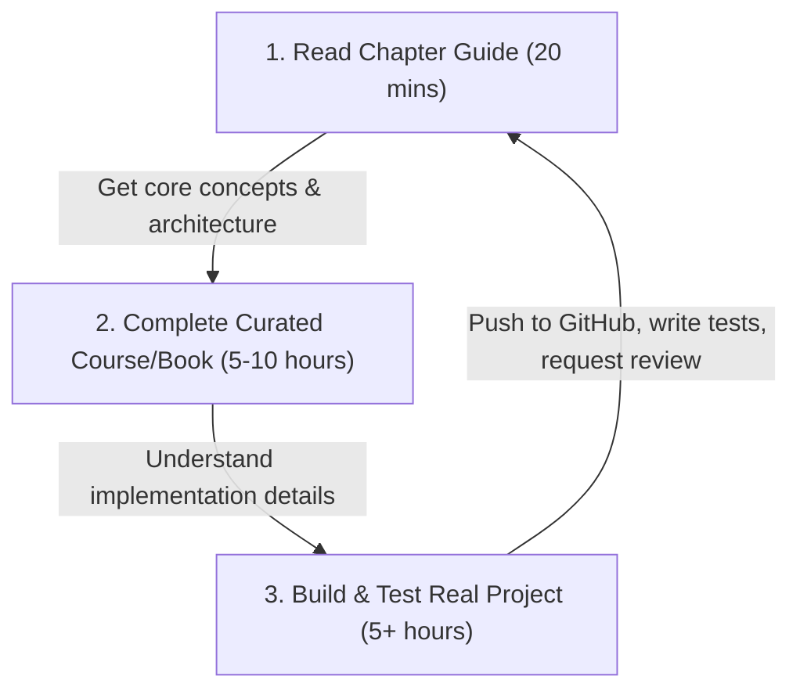
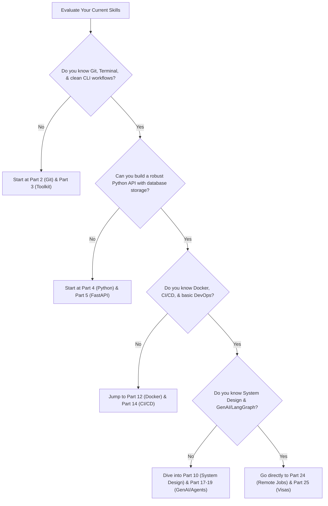

# The 2026 IT Career Blueprint: From Service-Based Support to Elite Backend & GenAI Engineer

## Introduction: The Service Company Trap and the High-Paid Escape Hatch

If you are a junior engineer sitting in a service-based IT giant like TCS, Infosys, Cognizant, or Wipro, you likely know the feeling: **the crushing weight of career stagnation**. You might have been assigned to a legacy, proprietary, or highly specialized package tool like **SAP CPQ (Configure, Price, Quote)**, Salesforce Admin, or a production support role. You look around, and your CTC is locked at **₹3.36 LPA (Lakhs Per Annum)**. Your daily tasks consist of dragging tickets, clicking administrative portals, writing basic scripts, or manually testing configurations. You feel your coding skills eroding day by day.

Meanwhile, the global tech industry has moved into a new era. In **2026**, the demand for elite **Backend Software Engineers**, **Distributed Systems Architects**, and **Generative AI/Agentic AI Engineers** has reached a fever pitch. These roles command compensation packages ranging from **₹8–10 LPA for entry-level professionals in India** to **₹25–50+ LPA for mid-to-senior levels**, and up to **$60,000–$120,000+ USD (₹50 Lakhs to ₹1 Crore) for remote international roles or jobs offering direct visa sponsorship to Europe or the UAE**.

This series is your comprehensive, battle-tested roadmap to bridge that gap. Designed specifically for **Chirag Singhal** and any developer sitting in a services company support role with rusty coding skills, this **25-part blueprint** leaves no stone unturned. We assume **zero prior experience** with databases, cloud architecture, system design, or AI agents, and build you up from first principles into a highly sought-after, production-ready systems engineer.

---

## The Core Philosophy: T-Shaped Skill Model for 2026

To escape the service-based support trap, you cannot just learn a bit of Python and some basic SQL. You need to develop a **T-Shaped Skill Profile**:

1. **Broad Breadth (The Horizontal Bar of the T):** You must understand the entire developer lifecycle, including terminal workflows, advanced Git collaboration, clean testing paradigms, Docker containerization, cloud deployment, and basic frontend interfaces.
2. **Deep Depth (The Vertical Stem of the T):** You must develop deep, uncompromising mastery in three primary pillars:
   - **Elite Backend Development:** High-performance async programming (Python/FastAPI and TypeScript/Node.js), advanced relational schemas (PostgreSQL indexes, transactions), and document stores (MongoDB/Redis).
   - **Distributed Systems:** Message streams (Kafka), event-driven microservices, and system design patterns that handle millions of concurrent requests.
   - **Generative AI & Agentic AI Systems:** Large Language Model (LLM) integration, Retrieval-Augmented Generation (RAG) with vector databases, and stateful multi-agent workflows using frameworks like LangGraph.

By combining deep backend skills with cutting-edge AI engineering, you become a **highly rare and incredibly valuable class of software engineer: an AI-Native Systems Developer**.

---

## 25 Chapters: The Complete Progression Map

Here is the master roadmap of the 25-part guide. Click on any chapter below to access the deep-dive, 2000+ word execution guide:

| Part | Topic | Focus Areas | Target Skills |
| :--- | :--- | :--- | :--- |
| **[Part 1: The Blueprint & Escape Plan →](/blog/it-career-guide/part-01-the-blueprint)** | The escape plan from TCS SAP CPQ to product-based jobs | Salary taxonomy, market mapping, and the 10 hours/day study routine | Mindset shift, study execution |
| **[Part 2: Git & GitHub Mastery →](/blog/it-career-guide/part-02-git-github)** | Advanced version control & repository management | Rebasing, cherry-picking, interactive workflows, Git hooks, and PR design | Professional collaboration |
| **[Part 3: The Elite Developer Toolkit →](/blog/it-career-guide/part-03-developer-toolkit)** | Terminal, Shell scripting, and IDE optimization | PowerShell/Zsh scripting, Vim keys, SSH, dotfiles, and VS Code/Cursor setup | Peak developer productivity |
| **[Part 4: Python Mastery from Scratch →](/blog/it-career-guide/part-04-python-mastery)** | Robust, modern Python programming | Memory management, decorators, generators, OOP, and type hints | Strict typed Pythonic logic |
| **[Part 5: Async Python & FastAPI →](/blog/it-career-guide/part-05-async-python-fastapi)** | High-performance asynchronous backend services | Asyncio event loop, FastAPI, Pydantic, dependency injection, and CRUD APIs | Production-grade API dev |
| **[Part 6: TypeScript & Node.js Backend →](/blog/it-career-guide/part-06-typescript-backend)** | The JS/TS server-side ecosystem | Node.js event loop, TypeScript compiler, Express, NestJS, and TS-Node | Concurrent Node backends |
| **[Part 7: Relational Databases & Postgres →](/blog/it-career-guide/part-07-postgresql)** | Deep relational SQL & data modeling | Indexing strategies (B-Tree, GIN), query optimization, transactions, and ACID | Database-level engineering |
| **[Part 8: NoSQL Databases & Redis →](/blog/it-career-guide/part-08-nosql-databases)** | Document stores & distributed caching | MongoDB schema design, aggregation pipelines, Redis data types, and caching strategies | Database caching, fast lookups |
| **[Part 9: Distributed Systems & Kafka →](/blog/it-career-guide/part-09-distributed-systems-kafka)** | Event-driven backend scaling | Apache Kafka, topics, partitions, consumer groups, offsets, and event streaming | Message-driven scale |
| **[Part 10: System Design Principles →](/blog/it-career-guide/part-10-system-design)** | High-level system design fundamentals | Load balancers, CDNs, horizontal/vertical scaling, database partitioning, sharding | System architecture design |
| **[Part 11: Microservices Architecture →](/blog/it-career-guide/part-11-microservices)** | Splitting monorepos into services | Service discovery, API gateways, circuit breakers, gRPC, and distributed tracing | Monolith migration patterns |
| **[Part 12: Docker & Containerization →](/blog/it-career-guide/part-12-docker)** | Building reliable execution environments | Multi-stage Dockerfiles, caching layers, container security, and docker-compose | Standardized environment packaging |
| **[Part 13: Kubernetes & Orchestration →](/blog/it-career-guide/part-13-kubernetes)** | Managing containers at massive scale | Pods, Deployments, Services, Ingress, ConfigMaps, Secrets, and Autoscaling | Production infra management |
| **[Part 14: CI/CD & GitHub Actions →](/blog/it-career-guide/part-14-cicd)** | Automating linting, testing, and deployment | Pipeline orchestration, environment secrets, runner setups, and automatic delivery | DevOps pipeline engineering |
| **[Part 15: AWS Cloud & Serverless →](/blog/it-career-guide/part-15-aws-serverless)** | Cloud architecture and serverless runtimes | AWS IAM, EC2, S3, RDS, Lambda, API Gateway, Cloudflare Workers, edge execution | Cost-optimized cloud hosting |
| **[Part 16: Front-End Mastery: React & Next.js →](/blog/it-career-guide/part-16-frontend-react)** | Modern, rich client-side interfaces | React hooks, state management, Next.js Server Components, hydration, and routing | Full-stack capability |
| **[Part 17: Generative AI & LLM Integration →](/blog/it-career-guide/part-17-genai-llms)** | Building smart applications with LLM APIs | Prompt engineering, token management, OpenAI/Anthropic APIs, LangChain, semantic search | AI-native app backend dev |
| **[Part 18: RAG & Vector Databases →](/blog/it-career-guide/part-18-rag-vector-db)** | Bringing external knowledge to AI systems | Vector embeddings, PGVector, Pinecone/Chroma, semantic retrieval, chunking strategies | Knowledge retrieval systems |
| **[Part 19: AI Agents & LangGraph →](/blog/it-career-guide/part-19-ai-agents-langgraph)** | Stateful, autonomous multi-agent systems | LangGraph, state-charts, tool calling, human-in-the-loop validation, agent memory | Autonomous AI workflow dev |
| **[Part 20: Enterprise Security & Auth →](/blog/it-career-guide/part-20-security-auth)** | Securing backends against real-world threats | JWT, OAuth2, session state, CORS, CSRF, HTTPS, and OWASP Top 10 mitigation | Secure software engineering |
| **[Part 21: Comprehensive Testing →](/blog/it-career-guide/part-21-testing)** | Writing resilient, bug-free backends | Pytest, Jest, Playwright E2E, mock strategies, and coverage reports | Bulletproof TDD execution |
| **[Part 22: DSA & LeetCode Blueprint →](/blog/it-career-guide/part-22-dsa-leetcode)** | Overcoming technical coding rounds | Sliding window, two pointers, graphs, dynamic programming, and NeetCode 150 | Algorithmic problem solving |
| **[Part 23: Tech Interview & STAR Method →](/blog/it-career-guide/part-23-tech-interviews)** | Nailing design sessions & soft skill rounds | System design templates, behavioral questions, STAR technique, negotiation | Interview clearing mechanics |
| **[Part 24: Global Remote Jobs & Platforms →](/blog/it-career-guide/part-24-global-remote)** | Securing high-paying location-agnostic jobs | Toptal, Turing, Wellfound, Arc.dev, cold outreach, and billing mechanics | Remote freelancing/contracts |
| **[Part 25: Immigration, Visas & Relocation →](/blog/it-career-guide/part-25-immigration-visas)** | Direct paths to international tech hubs | Germany EU Blue Card, Netherlands HSM visa, H-1B, and relocation packages | Geographic career upgrades |

---

## Leveraging Your TCS Resource Advantage

One of the biggest advantages of working at a services company like TCS is the **unlimited learning budgets** they provide to their employees. If you are sitting in a support account with plenty of bench time or light workloads, you have a golden opportunity.

TCS provides its employees with **free, full access to three premium education ecosystems**:
1. **Udemy Business:** Unlimited access to thousands of top-rated video courses.
2. **O'Reilly Learning Platform:** Full access to every tech book published by O'Reilly, Manning, Addison-Wesley, and Packt, along with video series and interactive sandboxes.
3. **LinkedIn Learning:** Short-form professional courses and specialized paths.

Throughout this series, every single chapter contains a dedicated **Upskilling Curated Resources Table**. This table maps the exact high-value courses and books available inside your TCS portals, so you can transition from reading theory directly into world-class video instruction and deep-dive technical literature without spending a single rupee.

### Universal Learning Strategy: The 3-Step Execution Model

To ensure you don't fall into "tutorial hell" (watching videos endlessly without writing code), you must follow this 3-step learning strategy for every single part of this roadmap:

1. **Step 1: Read the Chapter Guide (20 minutes).** Grasp the high-level system architectural concepts, database design patterns, or AI pipelines described in our blog series.
2. **Step 2: Dive into Curated Courses or Books (5–10 hours).** Search your TCS Udemy or O'Reilly accounts for the highly recommended resources listed in that chapter's table. Complete the course sections with playback speed at 1.25x or 1.5x, taking active technical notes.
3. **Step 3: Execute and Build from Scratch (5+ hours).** Do not copy-paste. Build a real, working service on your local machine. Write automated tests first (Test-Driven Development), enforce strict typing, package it in Docker, and commit it to your GitHub repository with a detailed README.

---

## Universal Decision Tree: Where Do You Start?

Are you confused about where to begin based on your current background? Use this quick decision tree to navigate the blueprint series:

---

## Universal Series Disclaimer

> [!IMPORTANT]
> **This blueprint is a highly intense, self-driven curriculum.** Transitioning from a service-based support role to an elite, high-paying Backend/GenAI role requires uncompromising discipline. If you can dedicate **10 hours a day** (leveraging bench time, weekends, and late evenings), you can comfortably cover this entire blueprint in **6 to 8 months**. 
>
> **No Shortcuts:** We write zero boilerplate templates and use zero stub/mock placeholders in final project code. You must write real tests, deploy real services to the cloud, configure actual databases, and prove your capabilities through a public GitHub portfolio. 

---

*[Proceed directly to Chapter 1: The Blueprint & Escape Plan →](/blog/it-career-guide/part-01-the-blueprint)*

---

### The 2026 IT Career Blueprint Series Navigation

- **Master Index: The 2026 IT Career Blueprint**
- **Part 1:** [The Blueprint & Escape Plan →](/blog/it-career-guide/part-01-the-blueprint)
- **Part 2:** [Advanced Version Control & Git Mastery →](/blog/it-career-guide/part-02-git-github)
- **Part 3:** [The Elite Developer Toolkit & Workflows →](/blog/it-career-guide/part-03-developer-toolkit)
- **Part 4:** [Python Mastery from Scratch →](/blog/it-career-guide/part-04-python-mastery)
- **Part 5:** [Async programming & FastAPI Backend Services →](/blog/it-career-guide/part-05-async-python-fastapi)
- **Part 6:** [TypeScript & Node.js Backend Ecosystems →](/blog/it-career-guide/part-06-typescript-backend)
- **Part 7:** [Relational Databases & Advanced PostgreSQL →](/blog/it-career-guide/part-07-postgresql)
- **Part 8:** [NoSQL Databases (MongoDB & Redis Caching) →](/blog/it-career-guide/part-08-nosql-databases)
- **Part 9:** [Distributed Systems & Message Queues with Kafka →](/blog/it-career-guide/part-09-distributed-systems-kafka)
- **Part 10:** [System Design Principles & Scalable Architecture →](/blog/it-career-guide/part-10-system-design)
- **Part 11:** [Microservices Architecture Patterns →](/blog/it-career-guide/part-11-microservices)
- **Part 12:** [Docker & Containerization for Backend Developers →](/blog/it-career-guide/part-12-docker)
- **Part 13:** [Kubernetes & Container Orchestration →](/blog/it-career-guide/part-13-kubernetes)
- **Part 14:** [Continuous Integration & Deployment (CI/CD) with GitHub Actions →](/blog/it-career-guide/part-14-cicd)
- **Part 15:** [AWS Cloud & Serverless Architectures →](/blog/it-career-guide/part-15-aws-serverless)
- **Part 16:** [Front-End Mastery: React, Next.js & Client-Side Architectures →](/blog/it-career-guide/part-16-frontend-react)
- **Part 17:** [Generative AI & Large Language Models (LLM) Integration →](/blog/it-career-guide/part-17-genai-llms)
- **Part 18:** [Retrieval-Augmented Generation (RAG) & Vector Databases →](/blog/it-career-guide/part-18-rag-vector-db)
- **Part 19:** [AI Agents & Advanced Workflows with LangGraph →](/blog/it-career-guide/part-19-ai-agents-langgraph)
- **Part 20:** [Enterprise Security, Authentication & OWASP Top 10 →](/blog/it-career-guide/part-20-security-auth)
- **Part 21:** [Comprehensive Testing: Unit, Integration, & E2E Testing →](/blog/it-career-guide/part-21-testing)
- **Part 22:** [Data Structures & Algorithms (DSA) and LeetCode Blueprint →](/blog/it-career-guide/part-22-dsa-leetcode)
- **Part 23:** [Tech Interview Success: System Design & Behavioral STAR Method →](/blog/it-career-guide/part-23-tech-interviews)
- **Part 24:** [Global Remote Jobs and Freelancing Platforms →](/blog/it-career-guide/part-24-global-remote)
- **Part 25:** [Immigration, Visas & Tech Relocation →](/blog/it-career-guide/part-25-immigration-visas)
