# Part 1: The 2026 Career Blueprint & TCS SAP CPQ Escape Plan

*[← Back to Master Index](/blog/it-career-guide)*

---

## 1. The TCS Reality: The Legacy Support Trap

If you have recently joined a service giant like TCS as an Assistant System Engineer, congratulations on taking your first step into the IT industry. However, the reality of service-based companies often sets in rapidly. Instead of building high-performance modern web apps, distributed real-time systems, or state-of-the-art AI systems, you might find yourself assigned to a niche enterprise product package—such as **SAP CPQ (Configure, Price, Quote)**.

SAP CPQ is a cloud-based software solution designed to help sales teams configure complex products, price them accurately, and generate professional quotes. While SAP CPQ is a powerful tool for enterprise commerce, its core development experience is highly specialized:
- You write script configurations in **IronPython** (a .NET implementation of Python that is stuck on older Python syntax standards).
- You design business rules using proprietary SAP administration interfaces.
- You build client-side views using legacy JavaScript frameworks like **Knockout.js** or custom HTML/CSS embedded directly into the SAP portal.
- Your daily database interaction is limited to standard, packaged SQL queries structured within the SAP environment.

### The Specialized Skill Trap
In a niche role like SAP CPQ support, you are insulated from the broader, general-purpose software engineering ecosystem. You do not get to design database indexes in native PostgreSQL, you do not write high-performance asynchronous microservices using FastAPI, you do not manage container clusters using Kubernetes, and you definitely do not build autonomous multi-agent AI systems with LangGraph.

If you stay in this role for three years, your resume will read "SAP CPQ Consultant." You will find yourself locked into the SAP ecosystem, dependent on enterprise consulting contracts. While senior SAP Solution Architects can earn good money, your exit opportunities for global remote software engineering jobs, startup engineering roles, or cutting-edge AI product roles will drop to almost zero. Furthermore, your compensation is likely to remain stagnant, starting at **₹3.36 LPA** with slow, incremental raises.

### The High-Paid Escape Hatch
To transition from a services support role into a high-paying, general-purpose software developer role commanding **₹8–10 LPA in India** (or **₹50 Lakhs to ₹1.25 Crore for international remote roles**), you must learn the skills that startups and global product giants actually value: **native Backend Systems Engineering, Distributed Systems, and Generative AI / Agentic AI Systems**. 

The goal of this chapter is to outline the exact execution strategy to escape this trap, leverage your TCS bench time, and build an unshakeable foundation for your career pivot.

---

## 2. Market Realities: The 2026 Role Taxonomy & Salaries

The global tech landscape in **2026** has bifurcated. On one hand, basic front-end developers who only know basic React or entry-level developers who copy-paste CRUD endpoints are struggling due to AI-assisted coding tools like Cursor, GitHub Copilot, and Gemini. On the other hand, engineers who understand **system architecture, data pipelines, scalability, security, and AI agent integration** are seeing unprecedented salary inflation.

Let’s look at the actual role taxonomy and salary ranges in the industry today for developers who master the stack taught in this series:

### A. Seniority & Salary Map (India vs. International Remote)

| Role & Title | Essential Skills | India Salary Range (LPA) | International Remote Salary (USD/yr) |
| :--- | :--- | :--- | :--- |
| **Junior Backend Engineer (0-2 Yrs)** | Python/Node.js, PostgreSQL, REST APIs, Git, Basic Docker | **₹6 – ₹12 LPA** | **$45,000 – $75,000** (₹37L – ₹62L) |
| **Mid Backend / Systems Engineer (2-5 Yrs)** | FastAPI, System Design, Kafka, Microservices, Redis, AWS | **₹12 – ₹28 LPA** | **$75,000 – $120,000** (₹62L – ₹1Cr) |
| **AI-Native Backend / GenAI Engineer (1-3 Yrs)** | RAG Pipelines, Vector DBs, LangChain/LangGraph, API security | **₹18 – ₹35 LPA** | **$90,000 – $140,000** (₹75L – ₹1.15Cr) |
| **Distributed Systems Architect (5+ Yrs)** | High-throughput Kafka, Kubernetes, Sharding, Global Caching | **₹30 – ₹60+ LPA** | **$120,000 – $200,000+** (₹1Cr – ₹1.6Cr) |

### B. Why "Backend + AI" is the Golden Combo
Startups and mid-sized international tech companies do not want to hire separate, highly academic machine learning researchers to build their AI products. They want **product-minded backend software developers** who know how to connect APIs, configure vector databases, manage stateful agent loops, write robust unit tests, and host services efficiently on the cloud. 

By mastering both general backend systems engineering and generative AI engineering, you position yourself at the absolute center of global tech demand.

---

## 3. The Escape Blueprint: Carving Out 10 Hours a Day

The most common excuse for not upskilling is: *"I don't have enough time."* 

However, working as a junior developer or support engineer at a service giant like TCS actually gives you a unique advantage if you know how to manage your schedule. Many junior engineers are placed on **"the bench"** (waiting to be allocated to a client project) for months at a time. Even if you are allocated to a support project like SAP CPQ, the actual active workload is often highly fluctuating—characterized by long stretches of waiting for tickets, simple administrative approvals, or clients to reply.

If you are serious about escaping this trap and landing a ₹8–10 LPA backend role within 6 to 8 months, you must treat upskilling as your **real full-time job**. You must dedicate **10 hours a day** to active study and implementation.

### The 10-Hour Daily Routine for Support Engineers

Here is how you can structure your day, even if you have active support shifts:

```mermaid
gantt
    title The 10-Hour Daily Upskilling Schedule
    dateFormat  HH:mm
    axisFormat %H:%M
    section Morning Shift
    Deep Theoretical Study (Udemy/O'Reilly) :active, 07:00, 10:00
    TCS Support Shift / Parallel Passive Study : 10:00, 13:00
    section Afternoon Shift
    Hands-On Coding & Project Dev (TDD) :active, 13:00, 17:00
    TCS Shift Wrap-Up / Documentation : 17:00, 19:00
    section Evening Shift
    System Design & DSA (LeetCode/NeetCode) :active, 19:00, 22:00
```

#### Phase 1: The Morning Deep-Work Block (07:00 - 10:00 — 3 Hours)
- **Objective:** Deep, uninterrupted theoretical study.
- **Action:** Read the day's career guide chapter. Log into your TCS Udemy account and watch 1.5 hours of a comprehensive backend/AI course at 1.25x speed. Take active, markdown-based notes on system architectures, database normalization, or vector spaces.
- **Rule:** Phone off, social media blocked, absolute focus.

#### Phase 2: The Parallel Work Shift (10:00 - 17:00 — 4 Hours of Upskilling)
- **Objective:** Utilize gaps in your support shift.
- **Action:** If you are on the bench, this entire block is yours. If you are on an active SAP CPQ support account, monitor your ticketing queue on one screen. On your second monitor, open your IDE (VS Code or Cursor) or O'Reilly Reader. 
- **Coding Practice:** Write code to implement the theoretical concepts you studied in the morning. Build APIs, design database schemas, or set up Docker containers locally. If you get a support ticket, pause, resolve it quickly, and immediately return to your code.
- **Rule:** Never browse social media during work gaps—channel all free cognitive energy into your backend projects.

#### Phase 3: The Evening Algorithmic & Design Block (19:00 - 22:00 — 3 Hours)
- **Objective:** Master coding interviews and architecture.
- **Action:** Spend 1.5 hours solving Data Structures and Algorithms (DSA) problems on LeetCode using the NeetCode 150 roadmap. Spend the remaining 1.5 hours reviewing high-level System Design principles (System Design Primer) or mapping out distributed microservice communications.

*Total: 10 Hours of intensive upskilling every single day.*

---

## 4. Building a High-Impact Portfolio

You cannot clear interviews for top product companies or remote international startups with a resume that says "SAP CPQ Configurator." In fact, recruiters will filter your resume out immediately. To bypass this barrier, you must build **overwhelming technical evidence** of your capabilities.

Your transition strategy relies on building three key public pillars:

### A. Your Personal Domain (`chirag127.in` or `oriz.in`)
Your personal portfolio website must be a sleek, highly performant showcase of your engineering capabilities. Built using a modern framework like Astro or Next.js, it should load in under 1 second, scoring 100/100 on Google Lighthouse. It must display:
- Direct links to your production-grade GitHub repositories.
- Live, interactive demonstrations of your backend and AI systems (e.g., an embedded chat interface running an AI agent).
- Deep-dive technical blog posts showing your understanding of advanced topics (such as database locking, Kafka stream partitioning, or semantic retrieval).

### B. Your GitHub Profile (`github.com/chirag127`)
Your GitHub must not look like a collection of student fork repositories or abandoned tutorial code. It must contain **3 to 4 flagship repositories**, each demonstrating production-grade code characteristics:
1. **Strict Type Systems:** Entirely written in strongly typed Python (using Pydantic/Type Hints) or TypeScript (enforcing strict compiler options).
2. **Comprehensive Test Suites:** At least 80% code coverage using Pytest or Jest, with real unit, integration, and functional test suites (zero mocks for crucial business logic).
3. **Professional DevOps Configurations:** Every repository must contain a `.github/workflows/` directory with automated GitHub Actions executing formatters, linters, typecheckers, and test runners on every commit.
4. **Exhaustive Documentation:** A highly detailed `README.md` containing:
   - Clear system architecture diagrams (using Mermaid).
   - Local setup instructions using `docker-compose`.
   - Complete environment variable guides.
   - Live API endpoint documentations.

In the subsequent chapters of this series, we will guide you step-by-step through building these flagship projects.

---

## 5. TCS Curated Upskilling Resources

As a TCS employee, you have free, unlimited access to premium educational portals. Do not spend a single rupee buying external courses or books. Use this curated resources list to guide your search inside your corporate portals:

| Focus Area | Udemy Course (Search Exact Title) | O'Reilly Book (Search Title/Author) | LinkedIn Learning Path | Free Gold-Standard Resource |
| :--- | :--- | :--- | :--- | :--- |
| **Git & Version Control** | "The Git & GitHub Bootcamp" by Colt Steele | "Pro Git" by Scott Chacon & Ben Straub | "Git Essential Training" | GitHub Interactive Git branching tool |
| **Terminal & Tooling** | "Learn Linux in 5 Days and Level Up Your Career" | "The Linux Command Line" by William Shotts | "Linux Command Line Basics" | "The Missing Semester of your CS Education" (MIT) |
| **Python Core** | "100 Days of Code: The Complete Python Pro Bootcamp" | "Python Crash Course" (Eric Matthes) | "Advanced Python" | Python.org Official Tutorial |
| **Async Python & APIs** | "FastAPI - The Complete Course (Novice to Advanced)" | "Building Data-Intensive Applications with FastAPI" | "Building RESTful APIs with Python" | FastAPI Official Documentation |
| **PostgreSQL & SQL** | "SQL and PostgreSQL: The Complete Developer's Guide" | "Designing Data-Intensive Applications" (Martin Kleppmann) | "PostgreSQL Essential Training" | Use The Index, Luke (SQL Indexing Guide) |
| **Docker & Containers** | "Docker & Kubernetes: The Practical Guide" by Academind | "Kubernetes: Up and Running" by Brendan Burns | "Docker for Developers" | KodeKloud Free Beginners Courses |
| **System Design** | "Pragmatic System Design" by Michael Pogrebinsky | "Software Architecture: The Hard Parts" by Neal Ford | "Software Architecture Foundations" | System Design Primer (GitHub Repository) |
| **AI & LLM Integration** | "The AI Developer Course: Build Generative AI Apps" | "AI Engineering" by Chip Huyen | "Introduction to Large Language Models" | DeepLearning.AI Short Courses |
| **AI Agents** | "LangChain & LangGraph: Build AI Agentic Workflows" | "Generative AI Agents" by O'Reilly Media | "Building AI Agents" | LangGraph Official Conceptual Guides |
| **DSA & Coding Prep** | "Master the Coding Interview: Data Structures + Algorithms" | "Introduction to Algorithms" (CLRS) | "Programming Foundations: Algorithms" | NeetCode 150 Practice Roadmap |

---

## 6. Actionable Next Steps

To begin your transition today, complete these five foundational tasks:

1. **Verify Your Corporate Learning Access:** Log into your TCS portal (Ultimatix) and ensure you can access **Udemy Business**, **O'Reilly Learning**, and **LinkedIn Learning** without any permission issues.
2. **Audit Your Current Schedule:** Track your time for the next three days. Identify every 30-minute and 1-hour gap in your support shift or daily routine where you can insert study blocks.
3. **Configure Your Workspace:** Set up a clean, distraction-free physical desk. Configure your terminal, install Git, and register your public GitHub account if you haven't already.
4. **Block Off Daily Time:** Set calendar alerts for the **07:00 - 10:00** Deep Work block and the **19:00 - 22:00** Algorithmic block. Treat these blocks as non-negotiable professional commitments.
5. **Read the Next Chapter:** Proceed to Part 2 to begin mastering the most important tool for engineering collaboration: **Advanced Version Control & Git**.

---

*[Proceed to Part 2: Advanced Version Control & Git Mastery →](/blog/it-career-guide/part-02-git-github)*

---

### The 2026 IT Career Blueprint Series Navigation

- **[Master Index: The 2026 IT Career Blueprint](/blog/it-career-guide)**
- **Part 1:** [The Blueprint & Escape Plan →](/blog/it-career-guide/part-01-the-blueprint)
- **Part 2:** [Advanced Version Control & Git Mastery →](/blog/it-career-guide/part-02-git-github)
- **Part 3:** [The Elite Developer Toolkit & Workflows →](/blog/it-career-guide/part-03-developer-toolkit)
- **Part 4:** [Python Mastery from Scratch →](/blog/it-career-guide/part-04-python-mastery)
- **Part 5:** [Async programming & FastAPI Backend Services →](/blog/it-career-guide/part-05-async-python-fastapi)
- **Part 6:** [TypeScript & Node.js Backend Ecosystems →](/blog/it-career-guide/part-06-typescript-backend)
- **Part 7:** [Relational Databases & Advanced PostgreSQL →](/blog/it-career-guide/part-07-postgresql)
- **Part 8:** [NoSQL Databases (MongoDB & Redis Caching) →](/blog/it-career-guide/part-08-nosql-databases)
- **Part 9:** [Distributed Systems & Message Queues with Kafka →](/blog/it-career-guide/part-09-distributed-systems-kafka)
- **Part 10:** [System Design Principles & Scalable Architecture →](/blog/it-career-guide/part-10-system-design)
- **Part 11:** [Microservices Architecture Patterns →](/blog/it-career-guide/part-11-microservices)
- **Part 12:** [Docker & Containerization for Backend Developers →](/blog/it-career-guide/part-12-docker)
- **Part 13:** [Kubernetes & Container Orchestration →](/blog/it-career-guide/part-13-kubernetes)
- **Part 14:** [Continuous Integration & Deployment (CI/CD) with GitHub Actions →](/blog/it-career-guide/part-14-cicd)
- **Part 15:** [AWS Cloud & Serverless Architectures →](/blog/it-career-guide/part-15-aws-serverless)
- **Part 16:** [Front-End Mastery: React, Next.js & Client-Side Architectures →](/blog/it-career-guide/part-16-frontend-react)
- **Part 17:** [Generative AI & Large Language Models (LLM) Integration →](/blog/it-career-guide/part-17-genai-llms)
- **Part 18:** [Retrieval-Augmented Generation (RAG) & Vector Databases →](/blog/it-career-guide/part-18-rag-vector-db)
- **Part 19:** [AI Agents & Advanced Workflows with LangGraph →](/blog/it-career-guide/part-19-ai-agents-langgraph)
- **Part 20:** [Enterprise Security, Authentication & OWASP Top 10 →](/blog/it-career-guide/part-20-security-auth)
- **Part 21:** [Comprehensive Testing: Unit, Integration, & E2E Testing →](/blog/it-career-guide/part-21-testing)
- **Part 22:** [Data Structures & Algorithms (DSA) and LeetCode Blueprint →](/blog/it-career-guide/part-22-dsa-leetcode)
- **Part 23:** [Tech Interview Success: System Design & Behavioral STAR Method →](/blog/it-career-guide/part-23-tech-interviews)
- **Part 24:** [Global Remote Jobs and Freelancing Platforms →](/blog/it-career-guide/part-24-global-remote)
- **Part 25:** [Immigration, Visas & Tech Relocation →](/blog/it-career-guide/part-25-immigration-visas)
