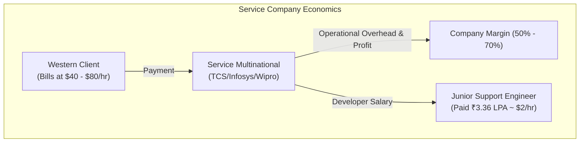
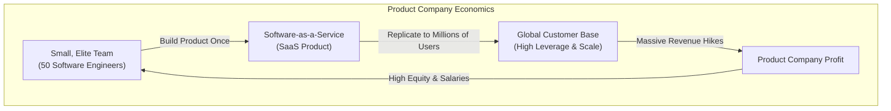

# Part 1: The Blueprint — Escaping the Support Trap

*[← Back to Master Index](/blog/it-career-guide)*

---

## 1. Core Concept Refresher: The Economics of Service Multinationals vs. Product Companies

To build a successful path out of a service-based IT giant (like TCS, Infosys, Wipro, or Cognizant), you must first understand the fundamental economic realities of the IT industry. You cannot escape a system whose mechanics you do not comprehend. Many junior engineers believe that low salaries and stagnant career growth inside service companies are simply a matter of bad luck. In reality, they are the direct mathematical consequence of the company's business model.

---

### The Labor Arbitrage Business Model
Service-based multinationals operate on a model known as **Labor Arbitrage**. 
- They hire large numbers of entry-level engineers in regions with lower costs of living (like India).
- They bill international clients (in the US, Europe, or the Middle East) for these engineers' time at western market rates.
- The difference between the billed hourly rate and the salary paid to the developer, minus operational overhead (office spaces, HR, management), constitutes the company's profit margin.

Because these margins are under constant pressure from global competitors, service companies prioritize volume over individual productivity. They need thousands of billable resources on their "bench" or active projects to hit their aggregate revenue targets. In this system, you are not treated as a unique creative asset; you are a **billable resource unit** (FTE - Full-Time Equivalent).

As a result:
- **Skills are secondary to availability:** If a client needs five "SAP CPQ administrators" tomorrow morning, the resource management team will pick any available junior developers from the bench, give them a brief vendor-specific training course, and assign them to the project. It does not matter if you want to be a Distributed Systems Engineer. You are billable, and that is what matters for the company's monthly cash flow.
- **Incremental, linear growth:** Hikes are tied to company-wide guidelines and utilization ratios. If you perform at 300% efficiency, your manager cannot easily triple your salary because the billing rate for your role is capped by the client contract.

---

### The Product Company Paradigm
Product-based companies (software startups, Global Capability Centers, and enterprise tech giants) operate on a completely different financial model. 

Instead of selling developers' hours, they build a software product once and sell it millions of times over. The marginal cost of replicating software is virtually zero. This means that a highly talented group of fifty engineers can build a product that generates hundreds of millions of dollars in recurring revenue.

This model is built on **High Leverage**:
- **Exponential revenue per engineer:** Because individual performance directly impacts the scale and quality of the product, hiring the top 10% of engineering talent is highly rational. A great developer who designs a scalable caching layer can save the company millions of dollars in server costs and prevent customer churn.
- **Resource compensation alignment:** Since the company's revenue is not tied to billing hours, they can afford to pay high base salaries, performance bonuses, and equity (ESOPs - Employee Stock Ownership Plans) to attract and retain top talent.

---

### The Modern Tech Job Taxonomy
To navigate your job search effectively, you must understand the different types of employers hiring backend and platform engineers in **2026**:

1. **Global Capability Centers (GCCs):** These are the technology hubs of major global enterprises (e.g. JPMorgan Chase, Walmart, Target, Goldman Sachs) located in India. GCCs operate like product companies, focusing on building internal platforms, security systems, and data pipelines. They offer excellent stability, structured work hours, and competitive compensation packages ranging from **₹8–18+ LPA** for junior-to-mid level roles.
2. **Product-Based Startups (Early to Late Stage):** Highly dynamic, fast-paced environments funded by venture capital. Startups prioritize speed-to-market and rapid iteration. They are highly receptive to self-taught developers with strong GitHub portfolios. They offer high compensation (often splitting value between cash and ESOPs) ranging from **₹10–25+ LPA**, but require high ownership and involve lower job stability.
3. **Enterprise Product Giants (MANG/FAANG):** Large, established technology platforms (Google, Microsoft, Amazon, Adobe). They have highly structured engineering processes, massive systems footprints, and complex interview pipelines focusing heavily on algorithmic coding rounds (DSA) and systems design. They offer high starting compensation packages (**₹15–35+ LPA** for entry levels) alongside stock vesting schedules.

---

### Deconstructing Your Compensation Package (CTC)
When negotiating or evaluating job offers outside service companies, you must look beyond the raw "CTC" (Cost to Company) figure. Product companies structure their compensation packages using three primary components:

*   **Fixed Base Salary:** The guaranteed cash paid to you monthly. This is the most critical metric because your future hikes, EPF contributions, and gratuity calculations are based directly on this number. In service companies, the base is often low, padded with minor allowances. Product companies offer high fixed bases.
*   **Variable Performance Bonus:** A cash percentage (typically 10%–20% of your base) paid annually based on your individual performance and the company's financial success.
*   **Equity / Stock Grants (ESOPs or RSUs):**
    - **RSUs (Restricted Stock Units):** Publicly traded shares of the company (common in GCCs and large tech companies). They represent real cash value once they vest.
    - **ESOPs (Employee Stock Option Plans):** The right to purchase shares of a private startup at a discounted price. They represent significant wealth generation if the startup goes public or gets acquired, but have zero liquidity value while the company remains private.
    - **Vesting Schedule:** Stock is almost never given upfront. It is distributed over a multi-year schedule (typically 4 years with a 1-year "cliff"). A 1-year cliff means you must complete one full year at the company before any portion of your stock vests. After the cliff, stock vests monthly or quarterly.

---

## 2. Master Resource Directory: Career Transition & Mindset

### Resource 1: *The Software Engineer's Guidebook* by Gergely Orosz
*   **Why It Was Selected:** Gergely Orosz (author of The Pragmatic Engineer) is the definitive authority on tech career progression. This book is selected because it completely bypasses academic theories and explains the raw operational realities of modern software engineering. For an engineer transitioning from a service-based supportive background, it provides a vital mental framework on how product companies evaluate developer impact, write performance reviews, and build career tracks, helping you align your mindset with tech industry expectations.
*   **Target Syllabus Modules/Chapters:** Focus on **Part 1: Developer Career Fundamentals** (specifically Chapter 1 on career paths, Chapter 2 on owning your career, and Chapter 5 on switching jobs).
*   **Time Investment Required:** 8 hours of active reading and annotation.
*   **Value Assessment:** Essential. It acts as your strategic career compass, explaining how to evaluate equity packages, handle recruiter screening filters, and establish professional visibility.
*   **Actionable Study Strategy:** Read at a comfortable pace. Keep a dedicated notebook to jot down the core parameters of developer performance expectations. Pay close attention to the structural differences between "service company titles" and "product company levels" (L3/L4/L5 equivalent scales).

---

### Resource 2: *The Complete 2026 Web Developer Bootcamp* by Dr. Angela Yu
*   **Why It Was Selected:** Angela Yu is a master educator renowned for her hands-on, conceptual approach. Many service company support developers have rusty development basics. This course is selected because it builds a robust, comprehensive bridge from zero Web foundations into modern server-client communication architectures, utilizing zero assumptions.
*   **Target Syllabus Modules/Chapters:** Focus on **Section 1: Intro to Web Development** and the modules detailing HTML/CSS client fundamentals.
*   **Time Investment Required:** 12 hours of video study and code replication.
*   **Value Assessment:** High. It lays down the concrete foundations of client-server requests, rendering behaviors, and network routing layers that form the bedrock of backend systems.
*   **Actionable Study Strategy:** Watch videos at 1.25x playback speed. Do not passively watch; keep your VS Code editor open side-by-side. Replicate every single layout exercise and inspect the DOM rendering cycles using Chrome Developer Tools to build practical muscle memory.

---

### Resource 3: *Programming Foundations: Fundamentals* by Annyce Davis
*   **Why It Was Selected:** Annyce Davis provides a highly structured, low-overhead refresher on computer science essentials. When transition candidates have been clicking support portals for months, their programming logic decays. This course is selected to quickly re-establish clean OOP principles, memory allocation schemas, and data structures.
*   **Target Syllabus Modules/Chapters:** Complete the full course, focusing specifically on variables, conditional logic, loops, object-oriented parameters, and debugging workflows.
*   **Time Investment Required:** 5 hours of focused video training.
*   **Value Assessment:** Medium-High. It serves as a rapid, high-efficiency diagnostic tool to verify if your programming logic is ready for complex systems configurations.
*   **Actionable Study Strategy:** Watch at 1.5x playback speed. Treat this as a diagnostic assessment. If any concept (like polymorphism or recursion) feels confusing, pause the video and write raw code implementations in your local terminal until it becomes second nature.

---

### Resource 4: *System Design Primer* by Donne Martin
*   **Why It Was Selected:** The single most vetted open-source repository for scalability engineering. This resource is selected because it exposes you immediately to the architectural concepts of high-scale systems (horizontal scaling, load balancing, DNS, CDNs) that product companies evaluate.
*   **Target Syllabus Modules/Chapters:** Read the introductory section explaining basic scaling concepts, bottlenecks, and the differences between horizontal and vertical scale architectures.
*   **Time Investment Required:** 6 hours of detailed reading and diagram inspection.
*   **Value Assessment:** High. It builds the system-level vocabulary required to navigate backend engineering interviews.
*   **Actionable Study Strategy:** Read the markdown documents slowly. Do not rush. Redraw the architecture diagrams on a blank sheet of paper to visualize the traffic flow from a user's client browser, through DNS and CDN caching edge nodes, to the primary backend database.

---

## 3. Hands-On Portfolio Lab Project: Career Transition Roadmap & Shell Automation Tracker

To demonstrate your platform engineering and systems automation capabilities to international recruiters, you must build and commit a complete **Upskilling Roadmap Automation Repository** to your public GitHub profile (`github.com/chirag127`).

### The Lab Project Guidelines:
1.  **Repository Construction:** Create a public repository named `2026-upskilling-roadmap` on GitHub.
2.  **Structured Roadmap Layout:** Write a comprehensive `README.md` containing:
    - An executive overview of your transition roadmap.
    - Checklists representing all 25 parts of this career blueprint.
    - Status labels indicating your active upskilling focus.
3.  **Active Progress Calculator Script (`progress_tracker.py`):**
    - Write a Python script that programmatically reads your `README.md` file.
    - The script must count the total number of checked markdown slots (`- [x]`) versus unchecked slots (`- [ ]`).
    - It must dynamically calculate the completion percentage:
      `Percentage = (Checked Tasks / Total Tasks) * 100`
    - The script must then rewrite the top line of your `README.md` to display a dynamic, color-coded progress badge (e.g. `Progress: 12% [||..........]`).
4.  **GitHub Profile Hardening:** Customizing your GitHub profile is a critical step for service-company candidates. Create a repository named `chirag127` (your username) to build a GitHub Profile README:
    - Display your target technical stack (Python, FastAPI, TypeScript, Node, Postgres, Docker, Kafka, LangGraph).
    - Provide links to your upcoming portfolio projects.
    - Highlight your career target: **Backend & Generative AI Systems Platform Engineer**.
5.  **LinkedIn Profile Hardening:** Hardening your professional profile helps bypass basic screening filters. Update your LinkedIn page:
    - Remove specialized administrative text (like "SAP CPQ Specialist" or "TCS Support Engineer").
    - Replace your headline with target keywords: **Backend Systems Engineer | Python | FastAPI | Node.js | Generative AI**.
    - Add a detailed description in your Experience section highlighting software engineering foundations, OOP logic, and version control.

---

## 4. Technical Interview Self-Assessment

Use these questions to verify if you have successfully digested the principles of this introductory chapter:

| Concept | High-Frequency Interview Question | Expected Technical Answer Framework |
| :--- | :--- | :--- |
| **Startups vs GCCs** | What are the pros and cons of joining an early-stage startup versus a Global Capability Center (GCC)? | **GCCs:** Offer higher stability, structured work hours, clear career paths, and exposure to large enterprise-scale systems, but have slower decision-making processes. **Startups:** Offer rapid upskilling, high ownership, exposure to modern, cloud-native tech stacks, and potential upside through equity (ESOPs), but involve higher volatility and longer working hours. |
| **Vesting Cliffs** | Explain how a 4-year vesting schedule with a 1-year cliff works for startup stock options. | It means that your total stock option grant is earned over four years. The 1-year cliff dictates that you must remain employed at the company for a minimum of 12 consecutive months before any shares are vested. On your first anniversary, 25% of the grant vests immediately. The remaining 75% vests in monthly or quarterly increments over the subsequent 36 months. |
| **Service vs Product** | Why do product companies pay significantly higher salaries than service-based IT giants? | Service companies charge clients based on developer hourly rates; their revenue scales linearly with headcount. Hikes are capped by client billing rates. Product companies build software once and sell it millions of times over; their revenue scales exponentially with scale. This leverage allows them to pay premium salaries to attract the top 10% of engineering talent who directly impact the software's performance and scalability. |

---

## 5. Exit Tasks for this Phase

Complete these verification steps before proceeding to Part 2:

- [ ] Read the targeted career transition chapters in Gergely Orosz's *Software Engineer's Guidebook*.
- [ ] Create and structure your public GitHub profile README showcasing your transition stack.
- [ ] Commit your interactive `2026-upskilling-roadmap` tracking script and progress map to your public GitHub profile.
- [ ] Hardened your LinkedIn profile by removing legacy support keywords and adding modern backend tech indicators.

---

*[Proceed to Part 2: Advanced Version Control & Git Mastery →](/blog/it-career-guide/part-02-git-github)*
