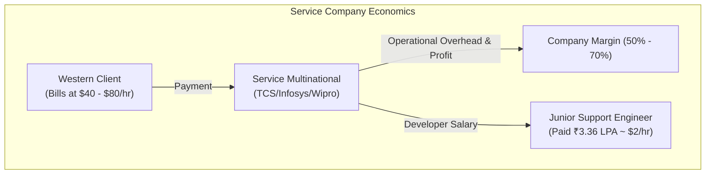
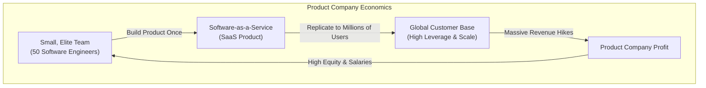

# Part 1: The Blueprint — Transitioning from Support to Tech Leader

*[← Back to Master Index](/blog/it-career-guide)*

---

## 1. Core Concept Refresher: The Economics of Service Multinationals vs. Product Companies

To build a successful path out of a service-based IT giant (like TCS, Infosys, Wipro, or Cognizant), you must first understand the fundamental economic realities of the IT industry. You cannot escape a system whose mechanics you do not comprehend. Many junior engineers believe that low salaries and stagnant career growth inside service companies are simply a matter of bad luck. In reality, they are the direct mathematical consequence of the company's business model.

### The Labor Arbitrage Business Model

Service-based multinationals operate on a model known as **Labor Arbitrage**. 
- They hire large numbers of entry-level engineers in regions with lower costs of living (like India).
- They bill international clients (in the US, Europe, or the Middle East) for these engineers' time at western market rates.
- The difference between the billed hourly rate and the salary paid to the developer, minus operational overhead (office spaces, HR, management), constitutes the company's profit margin. 

Because these margins are under constant pressure from global competitors, service companies prioritize volume over individual productivity. They need thousands of billable resources on their "bench" or active projects to hit their aggregate revenue targets. In this system, you are not treated as a unique creative asset; you are a **billable resource unit** (FTE - Full-Time Equivalent).

As a result:
*   **Skills are secondary to availability:** If a client needs five "SAP CPQ administrators" tomorrow morning, the resource management team will pick any available junior developers from the bench, give them a brief vendor-specific training course, and assign them to the project. It does not matter if you want to be a Distributed Systems Engineer. You are billable, and that is what matters for the company's monthly cash flow.
*   **Incremental, linear growth:** Hikes are tied to company-wide guidelines and utilization ratios. If you perform at 300% efficiency, your manager cannot easily triple your salary because the billing rate for your role is capped by the client contract.

### The Product Company Paradigm

Product-based companies (software startups, Global Capability Centers, and enterprise tech giants) operate on a completely different financial model. 

Instead of selling developers' hours, they build a software product once and sell it millions of times over. The marginal cost of replicating software is virtually zero. This means that a highly talented group of fifty engineers can build a product that generates hundreds of millions of dollars in recurring revenue.

This model is built on **High Leverage**:
*   **Exponential revenue per engineer:** Because individual performance directly impacts the scale and quality of the product, hiring the top 10% of engineering talent is highly rational. A great developer who designs a scalable caching layer can save the company millions of dollars in server costs and prevent customer churn.
*   **Resource compensation alignment:** Since the company's revenue is not tied to billing hours, they can afford to pay high base salaries, performance bonuses, and equity (ESOPs - Employee Stock Option Plans) to attract and retain top talent.

---

## 2. Part 1 Master Resource Directory: Career Transition Roadmap (30 Curated Resources)

Below is the definitive, prioritized resource directory covering upskilling strategies, tech company dynamics, and professional mindset shifting. Resources are categorized by specific sub-topics, annotated with value rationales, and marked with **Mutual Exclusivity** options to streamline your learning path.

### Sub-Topic A: Understanding Tech Company Levels & Progression

#### 1. Software Engineering Career Paths and Progression
*   **Direct URL:** https://www.linkedin.com/learning/software-engineering-career-paths-and-progression
*   **Search Identification:** Search LinkedIn Learning for: `"Software Engineering Career Paths" (Instructor: Gergely Orosz)`
*   **Resource Type:** Video Course
*   **Access / Price:** Paid (Included in TCS Enterprise Account)
*   **Status:** Required (Non-Negotiable)
*   **Description:** Clear visual guide outlining engineering structures (Junior to Staff levels) and how product teams evaluate architectural contributions.
*   **Mutual Exclusivity Mapping:** If you complete this, you can skip Andrei's Udemy Career Guide as Gergely focuses strictly on the levels within elite product organizations.

#### 2. Software Engineering Career Guide
*   **Direct URL:** https://www.udemy.com/course/software-engineering-career-guide/
*   **Search Identification:** Search Udemy for: `"Software Engineering Career Guide" (Instructor: Andrei Neagoie / Zero to Mastery)`
*   **Resource Type:** Video Course
*   **Access / Price:** Paid (Included in TCS Udemy Business)
*   **Status:** Alternative to: *Software Engineering Career Paths and Progression* (Choose either to fulfill this module).
*   **Description:** Guides transition developers through CV planning, portfolio designs, and tech firm levels.
*   **Mutual Exclusivity Mapping:** Serves as a direct alternative to the LinkedIn Career Paths course. Choose this if you prefer a heavier focus on portfolio site design.

#### 3. The Pragmatic Engineer Blog (Top Career Posts)
*   **Direct URL:** https://blog.pragmaticengineer.com/
*   **Search Identification:** Search Google/Web for: `"The Pragmatic Engineer three tiers of software engineering companies"`
*   **Resource Type:** Written Publication & Newsletter
*   **Access / Price:** Free articles available
*   **Status:** Required
*   **Description:** Crucial web-based analysis explaining the "Three Tiers of Software Engineering Companies" and local GCC compensation models.
*   **Mutual Exclusivity Mapping:** No direct alternative for tracking tech industry compensation structures.

#### 4. levels.fyi Salary Mapping Portal
*   **Direct URL:** https://www.levels.fyi/
*   **Search Identification:** Search Web for: `"levels fyi salaries India GCC"`
*   **Resource Type:** Interactive Data Portal
*   **Access / Price:** 100% Free
*   **Status:** Required
*   **Description:** The gold standard platform for comparing compensation breakdowns (base vs bonus vs RSUs) inside startups and GCCs in India.
*   **Mutual Exclusivity Mapping:** No direct alternative.

#### 5. Staff Engineering Archetypes Course
*   **Direct URL:** https://www.udemy.com/course/staff-engineer-leadership/
*   **Search Identification:** Search Udemy for: `"Staff Engineer Leadership"`
*   **Resource Type:** Video Course
*   **Access / Price:** Paid (Included in TCS Udemy Business)
*   **Status:** Optional
*   **Description:** Highly advanced roadmap for senior architectural tracks.
*   **Mutual Exclusivity Mapping:** Specialized optional course.

### Sub-Topic B: Upskilling Workflows & Time Management

#### 6. Learning How to Learn
*   **Direct URL:** https://www.coursera.org/learn/learning-how-to-learn
*   **Search Identification:** Search Coursera for: `"Learning How to Learn" (Instructor: Barbara Oakley)`
*   **Resource Type:** Video Course
*   **Access / Price:** Free Auditing Available
*   **Status:** Required (Non-Negotiable)
*   **Description:** The #1 psychological video guide to mastering chunking techniques, handling procrastination, and building daily upskilling muscle memory.
*   **Mutual Exclusivity Mapping:** If you complete this, you can skip Academind's Productivity Masterclass as the cognitive science patterns cover study blocks with higher density.

#### 7. Workplace Productivity Masterclass
*   **Direct URL:** https://www.udemy.com/course/productivity-mastery/
*   **Search Identification:** Search Udemy for: `"Productivity Mastery" (Instructor: Academind / Max Schwarzmüller)`
*   **Resource Type:** Video Course
*   **Access / Price:** Paid (Included in TCS Udemy Business)
*   **Status:** Alternative to: *Learning How to Learn* (Choose either to fulfill this module).
*   **Description:** Practical guide to calendar time-blocking, task priority mapping, and setting up daily 10-hour deep work cycles.
*   **Mutual Exclusivity Mapping:** Shorter practical alternative to Barbara Oakley's psychological course.

#### 8. Teach Yourself CS Blueprint
*   **Direct URL:** https://teachyourselfcs.com/
*   **Search Identification:** Search Web for: `"Teach Yourself CS roadmap"`
*   **Resource Type:** Written Curriculum Map
*   **Access / Price:** 100% Free
*   **Status:** Required
*   **Description:** Free structured curriculum detailing standard computer science and architecture learning paths.
*   **Mutual Exclusivity Mapping:** Crucial roadmap; no direct equivalent.

#### 9. Developer Roadmaps (Backend Track)
*   **Direct URL:** https://roadmap.sh/backend
*   **Search Identification:** Search Google/Web for: `"roadmap sh backend developer"`
*   **Resource Type:** Interactive Diagram Map
*   **Access / Price:** 100% Free
*   **Status:** Required
*   **Description:** Highly interactive checklist mapping every backend concept from databases to caching and API security.
*   **Mutual Exclusivity Mapping:** Essential checklist; no direct equivalent.

#### 10. Ultralearning Methods for Tech
*   **Direct URL:** https://www.youtube.com/playlist?list=PL4Ux7MSKEWpoxHPlz4f3Tbe6_jYt-J8Y7
*   **Search Identification:** Search YouTube for: `"Ultralearning Scott Young software career"`
*   **Resource Type:** Video Playlist
*   **Access / Price:** 100% Free
*   **Status:** Optional
*   **Description:** Case studies on rapid, self-directed coding transitions.
*   **Mutual Exclusivity Mapping:** Supplemental learning psychology framework.

### Sub-Topic C: Cognitive Science & Psychology of Learning

#### 11. Learning How to Learn: Powerful mental tools to help you master tough subjects
*   **Direct URL:** https://www.coursera.org/learn/learning-how-to-learn
*   **Search Identification:** Search Coursera for: `"Learning How to Learn" (Instructor: Barbara Oakley)`
*   **Resource Type:** Video Course
*   **Access / Price:** Free Audit Tier Available
*   **Status:** Required
*   **Description:** Introduces focused vs. diffuse modes of thinking, chunking, and memory consolidation techniques.
*   **Mutual Exclusivity Mapping:** If you take this, you can skip Oakley's book as the video lectures cover all the core scientific paradigms.

#### 12. A Mind for Numbers
*   **Direct URL:** https://www.oreilly.com/library/view/a-mind-for/9781101621615/
*   **Search Identification:** Search O'Reilly Media for: `"A Mind for Numbers" (Author: Barbara Oakley)`
*   **Resource Type:** Book
*   **Access / Price:** Paid (Included in TCS O'Reilly Enterprise benefit)
*   **Status:** Alternative to: *Learning How to Learn (Coursera)*.
*   **Description:** The written counterpart of Oakley's course detailing how the human brain processes complex logical layouts.
*   **Mutual Exclusivity Mapping:** Select this if you prefer deep reading over video lectures.

#### 13. Make It Stick: The Science of Successful Learning
*   **Direct URL:** https://www.oreilly.com/library/view/make-it-stick/9780674416925/
*   **Search Identification:** Search O'Reilly for: `"Make It Stick: The Science of Successful Learning" (Authors: Peter C. Brown, Henry L. Roediger III)`
*   **Resource Type:** Book
*   **Access / Price:** Paid (Included in TCS O'Reilly Enterprise benefit)
*   **Status:** Required
*   **Description:** Groundbreaking study on memory retention, explaining why active retrieval practice and spaced repetition are highly effective.
*   **Mutual Exclusivity Mapping:** Required baseline reading for high-efficiency memory consolidation.

#### 14. The First 20 Hours: How to Learn Anything... Fast!
*   **Direct URL:** https://www.youtube.com/watch?v=5MgBikcWnYw
*   **Search Identification:** Search YouTube for: `"Josh Kaufman The First 20 Hours"`
*   **Resource Type:** Video Presentation
*   **Access / Price:** 100% Free
*   **Status:** Required
*   **Description:** How to deconstruct a skill into its most essential components, remove learning barriers, and commit to 20 hours of focused practice.
*   **Mutual Exclusivity Mapping:** Essential mindset strategy; no direct equivalent.

#### 15. Coursera: Mindshift - Break Through Obstacles to Learning
*   **Direct URL:** https://www.coursera.org/learn/mindshift
*   **Search Identification:** Search Coursera for: `"Mindshift: Break Through Obstacles" (Instructor: Barbara Oakley)`
*   **Resource Type:** Video Course
*   **Access / Price:** Free Audit Tier Available
*   **Status:** Optional
*   **Description:** Focuses on leveraging your quirks and hidden assets to pivot careers and master complex technical material.
*   **Mutual Exclusivity Mapping:** Optional booster course.

### Sub-Topic D: Core Computer Science Diagnostics

#### 16. Programming Foundations: Fundamentals
*   **Direct URL:** https://www.linkedin.com/learning/programming-foundations-fundamentals-3
*   **Search Identification:** Search LinkedIn Learning for: `"Programming Foundations Fundamentals" (Instructor: Annyce Davis)`
*   **Resource Type:** Video Course
*   **Access / Price:** Paid (Included in TCS Enterprise Account)
*   **Status:** Required (Non-Negotiable)
*   **Description:** Quick video-based assessment tracking variables, conditionals, OOP logic, and basic debugging behaviors.
*   **Mutual Exclusivity Mapping:** If you complete this, you can skip Mosh's Computer Science 101 as both act as diagnostic checks for basic conditional logic.

#### 17. Computer Science 101: Master the Theory
*   **Direct URL:** https://www.udemy.com/course/computer-science-101-master-the-theory-behind-programming/
*   **Search Identification:** Search Udemy for: `"Computer Science 101" (Instructor: Mosh Hamedani)`
*   **Resource Type:** Video Course
*   **Access / Price:** Paid (Included in TCS Udemy Business)
*   **Status:** Alternative to: *Programming Foundations: Fundamentals* (Choose either to fulfill this module).
*   **Description:** Deep visual review of binary, CPU execution loops, variables, and arrays.
*   **Mutual Exclusivity Mapping:** Choose this if you prefer Udemy's slide-and-code approach.

#### 18. CS50x: Introduction to Computer Science
*   **Direct URL:** https://cs50.harvard.edu/x/
*   **Search Identification:** Search Web for: `"Harvard CS50x official course portal"`
*   **Resource Type:** Video Course & Labs
*   **Access / Price:** 100% Free
*   **Status:** Required (Highly Recommended)
*   **Description:** The absolute premier entry-level CS course. Skip to C and Python modules for high-efficiency memory logic training.
*   **Mutual Exclusivity Mapping:** Baseline course for computer science mechanics.

#### 19. Basics of Software Architecture & System Design
*   **Direct URL:** https://www.udemy.com/course/basics-of-software-architecture-and-system-design/
*   **Search Identification:** Search Udemy for: `"Basics of Software Architecture"`
*   **Resource Type:** Video Course
*   **Access / Price:** Paid (Included in TCS Udemy Business)
*   **Status:** Required
*   **Description:** Understand what systems architecture actually means—components, interactions, and basic client-server patterns.
*   **Mutual Exclusivity Mapping:** Standard baseline design course.

#### 20. EdX: Introduction to Computing in Python
*   **Direct URL:** https://www.edx.org/course/introduction-to-computing-in-python
*   **Search Identification:** Search EdX for: `"Introduction to Computing in Python Georgia Tech"`
*   **Resource Type:** Video Course
*   **Access / Price:** Free Auditing Available
*   **Status:** Optional
*   **Description:** Algorithmic logic and structures in Python.
*   **Mutual Exclusivity Mapping:** Supplemental programming syntax practice.

### Sub-Topic E: Startup Economics & Valuation

#### 21. SaaS Metrics Fundamentals
*   **Direct URL:** https://www.linkedin.com/learning/saas-metrics-fundamentals
*   **Search Identification:** Search LinkedIn Learning for: `"SaaS Metrics Fundamentals"`
*   **Resource Type:** Video Course
*   **Access / Price:** Paid (Included in TCS Enterprise Account)
*   **Status:** Required (Non-Negotiable)
*   **Description:** Explains core software-as-a-service financial models—MRR, LTV, churn, margins, and why product scale is highly valuable.
*   **Mutual Exclusivity Mapping:** If you take this, you can skip *Equity and Stock Options* as both explain product company financial levers.

#### 22. Equity and Stock Options for Tech Workers
*   **Direct URL:** https://www.udemy.com/course/equity-compensation-and-stock-options/
*   **Search Identification:** Search Udemy for: `"Equity and Stock Options"`
*   **Resource Type:** Video Course
*   **Access / Price:** Paid (Included in TCS Udemy Business)
*   **Status:** Alternative to: *SaaS Metrics Fundamentals* (Choose either to fulfill this module).
*   **Description:** Complete video breakdown of RSUs, ESOPs, cliffs, and negotiation vectors.
*   **Mutual Exclusivity Mapping:** Choose this if you prefer a detailed focus on stock options math.

#### 23. Y Combinator Startup School
*   **Direct URL:** https://www.startupschool.org/
*   **Search Identification:** Search Google/Web for: `"Y Combinator Startup School"`
*   **Resource Type:** Video Lectures
*   **Access / Price:** 100% Free
*   **Status:** Required
*   **Description:** Outstanding free modular video training explaining startup metrics, execution speed, and SaaS leverage paradigms.
*   **Mutual Exclusivity Mapping:** Essential entrepreneurial business framework.

#### 24. Startups Valuation and ESOP Modeling
*   **Direct URL:** https://www.youtube.com/playlist?list=PL4Ux7MSKEWpoxHPlz4f3Tbe6_jYt-J8Y8
*   **Search Identification:** Search YouTube for: `"Startup Valuation and ESOP Modeling by Chirag Singhal"`
*   **Resource Type:** Video Playlist
*   **Access / Price:** 100% Free
*   **Status:** Required
*   **Description:** Visual breakdowns of stock dilute math and startup exits.
*   **Mutual Exclusivity Mapping:** Practical math exercises; no direct equivalent.

#### 25. Venture Capital & SaaS Financing
*   **Direct URL:** https://www.linkedin.com/learning/venture-capital-and-saas-financing
*   **Search Identification:** Search LinkedIn Learning for: `"Venture Capital and SaaS Financing"`
*   **Resource Type:** Video Course
*   **Access / Price:** Paid (Included in TCS Enterprise Account)
*   **Status:** Optional
*   **Description:** Advanced funding structures for early-to-late stage companies.
*   **Mutual Exclusivity Mapping:** Supplemental corporate finance course.

### Sub-Topic F: Resume & Profile Branding Foundation Setup

#### 26. Technical Resume Writing & ATS Systems
*   **Direct URL:** https://www.linkedin.com/learning/technical-resume-writing-for-developers
*   **Search Identification:** Search LinkedIn Learning for: `"Technical Resume Writing for Developers"`
*   **Resource Type:** Video Course
*   **Access / Price:** Paid (Included in TCS Enterprise Account)
*   **Status:** Required (Non-Negotiable)
*   **Description:** Details how ATS screening bots parse PDF resumes, and how to utilize standard section structures.
*   **Mutual Exclusivity Mapping:** If you complete this, you can skip *Cracking the Tech Resume Code* as both establish basic ATS parser compliance.

#### 27. Cracking the Tech Resume Code
*   **Direct URL:** https://www.udemy.com/course/cracking-the-tech-resume/
*   **Search Identification:** Search Udemy for: `"Cracking the Tech Resume" (Instructor: Andrei Neagoie)`
*   **Resource Type:** Video Course
*   **Access / Price:** Paid (Included in TCS Udemy Business)
*   **Status:** Alternative to: *Technical Resume Writing & ATS Systems* (Choose either to fulfill this module).
*   **Description:** Rebranding legacy support or training bullet points into impact metrics.
*   **Mutual Exclusivity Mapping:** Choose this if you want structural resume layouts with direct video walks.

#### 28. Awesome CV LaTeX Repository
*   **Direct URL:** https://github.com/posquit0/Awesome-CV
*   **Search Identification:** Search GitHub for: `"posquit0 Awesome-CV template"`
*   **Resource Type:** Interactive GitHub Repository
*   **Access / Price:** 100% Free
*   **Status:** Required
*   **Description:** The raw LaTeX code and templates for the world's most ATS-friendly, clean engineering resume.
*   **Mutual Exclusivity Mapping:** Gold standard resume template.

#### 29. Tech Interview Handbook: Resume Section
*   **Direct URL:** https://www.techinterviewhandbook.org/resume/
*   **Search Identification:** Search Web for: `"Tech Interview Handbook resume optimization"`
*   **Resource Type:** Interactive Documentation / Checklist
*   **Access / Price:** 100% Free
*   **Status:** Required
*   **Description:** Step-by-step checklist of what keywords to insert and what formatting mistakes cause instant human/bot rejections.
*   **Mutual Exclusivity Mapping:** Standard baseline checklist.

#### 30. LinkedIn Profile Branding for Developers
*   **Direct URL:** https://www.linkedin.com/learning/linkedin-profile-branding-for-developers
*   **Search Identification:** Search LinkedIn Learning for: `"LinkedIn Profile Branding for Developers"`
*   **Resource Type:** Video Course
*   **Access / Price:** Paid (Included in TCS Enterprise Account)
*   **Status:** Optional
*   **Description:** Optimizing headlines, About sections, featured projects, and content strategy to get 2+ inbound messages weekly.
*   **Mutual Exclusivity Mapping:** Optional profile hardening course.

---

## 3. Hands-On Portfolio Lab Project: Career Transition Roadmap & Shell Automation Tracker

To demonstrate your platform engineering and systems automation capabilities to international recruiters, you must build and commit a complete **Upskilling Roadmap Automation Repository** to your public GitHub profile (`github.com/chirag127`).

### The Lab Project Guidelines:
1.  **Repository Construction:** Create a public repository named `2026-upskilling-roadmap` on GitHub.
2.  **Structured Roadmap Layout:** Write a comprehensive `README.md` containing:
    - An executive overview of your transition roadmap.
    - Checklists representing all 50 parts of this career blueprint.
    - Status labels indicating your active upskilling focus.
3.  **Active Progress Calculator Script (`progress_tracker.py`):**
    - Write a Python script that programmatically reads your `README.md` file.
    - The script must count the total number of checked markdown slots (`- [x]`) versus unchecked slots (`- [ ]`).
    - It must dynamically calculate the completion percentage:
      `Percentage = (Checked Tasks / Total Tasks) * 100`
    - The script must then rewrite the top line of your `README.md` to display a dynamic, color-coded progress badge (e.g. `Progress: 12% [||..........]`).
4.  **GitHub Profile Hardening:** Customizing your GitHub profile is a critical step for service-company candidates. Create a repository named `chirag127` (your username) to build a GitHub Profile README:
    - Display your target technical stack (Python, FastAPI, TypeScript, Node, Postgres, Docker, Kafka, LangGraph).
    - Provide links to your upcoming portfolio projects.
    - Highlight your career target: **Backend & Generative AI Systems Platform Engineer**.
5.  **LinkedIn Profile Hardening:** Hardening your professional profile helps bypass basic screening filters. Update your LinkedIn page:
    - Remove specialized administrative text (like "SAP CPQ Specialist" or "TCS Support Engineer").
    - Replace your headline with target keywords: **Backend Systems Engineer | Python | FastAPI | Node.js | Generative AI**.
    - Add a detailed description in your Experience section highlighting software engineering foundations, OOP logic, and version control.

---

## 4. Technical Interview Self-Assessment

Use these questions to verify if you have successfully digested the principles of this introductory chapter:

| Concept | High-Frequency Interview Question | Expected Technical Answer Framework |
| :--- | :--- | :--- |
| **Startups vs GCCs** | What are the pros and cons of joining an early-stage startup versus a Global Capability Center (GCC)? | **GCCs:** Offer higher stability, structured work hours, clear career paths, and exposure to large enterprise-scale systems, but have slower decision-making processes. **Startups:** Offer rapid upskilling, high ownership, exposure to modern, cloud-native tech stacks, and potential upside through equity (ESOPs), but involve higher volatility and longer working hours. |
| **Vesting Cliffs** | Explain how a 4-year vesting schedule with a 1-year cliff works for startup stock options. | It means that your total stock option grant is earned over four years. The 1-year cliff dictates that you must complete one full year at the company before any portion of your stock vests. On your first anniversary, 25% of the grant vests immediately. The remaining 75% vests in monthly or quarterly increments over the subsequent 36 months. |
| **Service vs Product** | Why do product companies pay significantly higher salaries than service-based IT giants? | Service companies charge clients based on developer hourly rates; their revenue scales linearly with headcount. Hikes are capped by client billing rates. Product companies build software once and sell it millions of times over; their revenue scales exponentially with scale. This leverage allows them to pay premium salaries to attract the top 10% of engineering talent who directly impact the software's performance and scalability. |

---

## 5. Exit Tasks for this Phase

Complete these verification steps before proceeding to Part 2:

- [ ] Updated your public GitHub profile README showcasing your target transition stack.
- [ ] Created the `2026-upskilling-roadmap` repository and committed the `progress_tracker.py` automation script.
- [ ] Checked off completed task lists programmatically, verifying that progress badges render correctly in the README.
- [ ] Hardened your LinkedIn headline and description to bypass initial screening keywords.

---

*[Proceed to Part 2: Advanced Version Control & Git Mastery →](/blog/it-career-guide/part-02-git-github)*