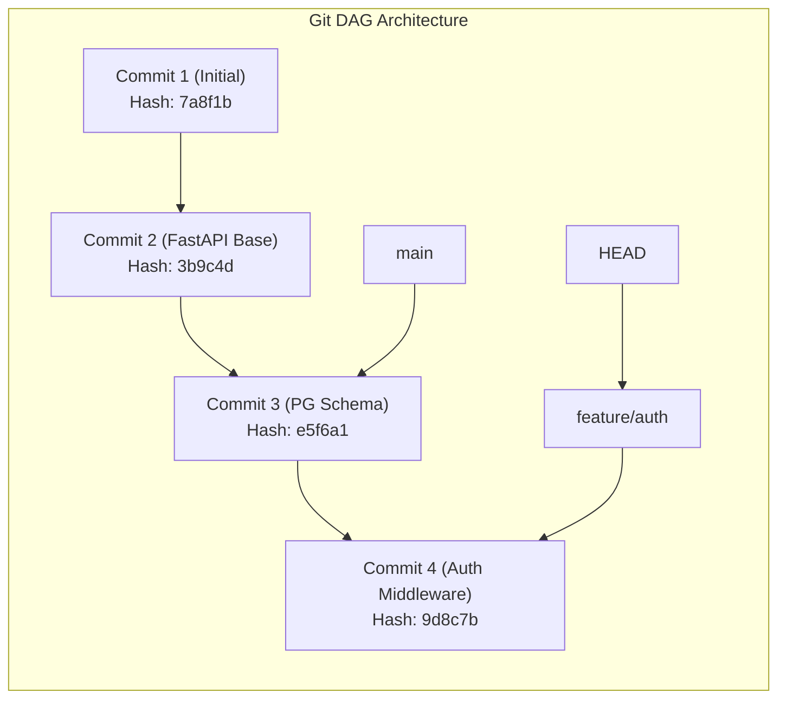
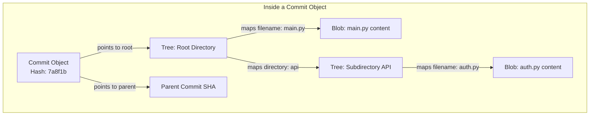

# Part 2: Advanced Version Control & Git Mastery

*[← Back to Master Index](/blog/it-career-guide)*

---

## 1. Core Concept Refresher: The Git Directed Acyclic Graph (DAG) & Internals

Most junior developers treat Git as a magical black box, memorizing basic command strings (`git add`, `git commit`, `git push`) like incantations. In high-performance backend and AI engineering environments, this superficial understanding leads to corrupted histories, accidental credential leaks, and massive hours wasted resolving merge conflicts. 

To achieve Git mastery, you must understand **how Git stores data under the hood**.

---

### The Directed Acyclic Graph (DAG)
Git does not store diffs or changes. Instead, it stores **snapshots of your entire file tree** over time. These snapshots form a **Directed Acyclic Graph (DAG)**. 



*   **Directed:** Commits point backward to their parent commit(s). They only move in one direction.
*   **Acyclic:** There are no loops. A commit can never trace its history back to itself in a circular path.
*   **Nodes:** Commits are nodes.
*   **Edges:** The links pointing back to parent commits.

---

### The Four Core Object Types
Inside the `.git/objects/` directory, Git stores all your data. Everything is compressed and named after its 40-character SHA-1 (or SHA-256) hash:

1.  **Blobs (Binary Large Objects):** Stores file content. A blob contains only raw file data; it does *not* store the file name, directory path, or permissions. If two identical files exist in different directories, Git stores only a single blob.
2.  **Trees:** Stores directory structures. A tree object is a simple mapping list that associates directory file names and path strings with their corresponding blob hashes and permissions. It can also point to other tree objects (representing subdirectories).
3.  **Commits:** Stores the metadata of a snapshot. A commit object points to a single root *Tree* hash (representing the project's root directory at that snapshot), lists the SHA-1 hash of the parent commit(s), and stores the author's name, email, timestamp, and commit message.
4.  **Annotated Tags:** A permanent reference pointing to a specific commit, containing metadata like a tagger's identity, timestamp, and message.



---

### Understanding References (Refs) & HEAD
*   **References (Refs):** A reference is simply a lightweight pointer to a commit hash. Branches and tags are refs. They are stored as tiny text files under `.git/refs/` containing exactly one 40-character commit hash string.
*   **HEAD:** A special reference that points to the currently checked-out commit or branch. In a healthy state, HEAD points to a branch reference (e.g. `ref: refs/heads/main`).
*   **Detached HEAD:** A state where HEAD points directly to a specific commit hash rather than a branch reference. Any new commits made in a detached HEAD state will not belong to any branch and will be lost during Git garbage collection if not saved to a new branch ref.

---

## 2. Advanced Workflows: Rebase vs. Merge, Cherry-Picking & Reflog Recovery

### Rebase vs. Merge
When combining changes from one branch into another, you have two core options:

```mermaid
graph TD
    subgraph Merging (Creates Merge Commit)
    m1["main: C1"] --> m2["main: C2"]
    m2 --> mm["Merge Commit: C5"]
    f1["feature: C3"] --> f2["feature: C4"]
    m2 --> f1
    f2 --> mm
    end
    
    subgraph Rebasing (Rewrites History)
    r1["main: C1"] --> r2["main: C2"]
    r2 --> rf1["feature: C3' (re-written)"]
    rf1 --> rf2["feature: C4' (re-written)"]
    end
```

1.  **Merge (`git merge`):**
    *   *What it does:* Combines histories by creating a new **Merge Commit** with two parents.
    *   *Pros:* Preserves the true historical order of events.
    *   *Cons:* Can create complex, cluttered history diagrams with many crossing lines ("train tracks").
2.  **Rebase (`git rebase`):**
    *   *What it does:* Applies commits from your branch on top of the target branch, **rewriting history** by creating brand-new commits with new hashes.
    *   *Pros:* Keeps a perfectly linear, clean commit history.
    *   *Cons:* Golden Rule of Rebasing: **Never rebase a public branch.** Rewriting commits that other developers have already pulled will corrupt their local histories.

#### Recommended Interactive Rebase Command:
Use `git rebase -i HEAD~N` to clean up your commit history before opening a Pull Request:
*   `pick`: Keep the commit.
*   `squash`: Combine the commit's changes with the previous commit, merging messages.
*   `reword`: Edit the commit message.
*   `drop`: Remove the commit.

---

### Disaster Recovery with Reflog
If you accidentally run a destructive command (such as `git reset --hard` or deleting a branch), Git does not immediately delete your commits. Commits remain in database storage until Git runs its internal garbage collection (`git gc`, typically every 30 days).

You can rescue lost commits using **Reflog (Reference Log)**:
1.  Run `git reflog` to view a chronological history of every movement of your HEAD pointer (including checks, rebases, and resets).
2.  Locate the SHA-1 commit hash immediately *before* your destructive action.
3.  Restore your HEAD by running: `git reset --hard <commit-hash>`.

---

## 3. Part 2 Master Resource Directory: Version Control (30 Curated Resources)

Below is the definitive, prioritized resource collection to master Git internals, advanced workflows, and collaborative PR mechanics:

---

### Sub-Topic A: Core Git & Branching Concepts

#### 1. The Git & GitHub Bootcamp
*   **Direct URL:** https://www.udemy.com/course/git-and-github-bootcamp/
*   **Search Identification:** Search Udemy for: `"The Git & GitHub Bootcamp" (Instructor: Colt Steele)`
*   **Resource Type:** Video Course
*   **Access / Price:** Paid (Included in TCS Udemy Business)
*   **Status:** Required (Non-Negotiable)
*   **Description:** The premier video guide to Directed Acyclic Graph (DAG) structures, interactive rebasing, reflogs, and merge mechanics.
*   **Mutual Exclusivity Mapping:** If you take this, you can skip Jan-Erik's *Git Complete* as this course covers rebase operations with deeper terminal walks.

#### 2. Git Complete: The Definitive, Step-by-Step Guide
*   **Direct URL:** https://www.udemy.com/course/git-complete/
*   **Search Identification:** Search Udemy for: `"Git Complete" (Instructor: Jan-Erik Sandberg)`
*   **Resource Type:** Video Course
*   **Access / Price:** Paid (Included in TCS Udemy Business)
*   **Status:** Alternative to: *The Git & GitHub Bootcamp* (Choose either to fulfill this module).
*   **Description:** Deep visual review of tracking states, index, staging areas, and working directories.
*   **Mutual Exclusivity Mapping:** Choose this if you prefer a highly technical, slide-based pacing instead of Colt Steele's fast-paced coding format.

#### 3. Interactive Git Branching Playground
*   **Direct URL:** https://learngitbranching.js.org/
*   **Search Identification:** Search Google/Web for: `"Learn Git Branching"`
*   **Resource Type:** Interactive Playground & Puzzle Sandbox
*   **Access / Price:** 100% Free
*   **Status:** Required (Non-Negotiable)
*   **Description:** In-browser, terminal-based visual puzzle sandbox. You write Git commands and see the tree render in real-time.
*   **Mutual Exclusivity Mapping:** Gold standard interactive learning playground; no direct equivalent.

#### 4. GitHub Skills - Official Interactive Labs
*   **Direct URL:** https://skills.github.com/
*   **Search Identification:** Search Web for: `"GitHub Skills official labs"`
*   **Resource Type:** Interactive Sandbox Labs
*   **Access / Price:** 100% Free
*   **Status:** Required
*   **Description:** Interactive repository-based courses covering branches, merging, pull requests, and automated workflows directly on GitHub servers.
*   **Mutual Exclusivity Mapping:** Essential hands-on GitHub workflows; no direct replacement.

#### 5. Git Essentials (LinkedIn Learning Pathway)
*   **Direct URL:** https://www.linkedin.com/learning/git-essential-training-14815410
*   **Search Identification:** Search LinkedIn Learning for: `"Git Essential Training" (Instructor: Kevin Skoglund)`
*   **Resource Type:** Video Course
*   **Access / Price:** Paid (Included in TCS Enterprise Account)
*   **Status:** Optional
*   **Description:** Highly comprehensive diagnostic review of files status mapping and repository lifecycles.
*   **Mutual Exclusivity Mapping:** Optional booster path.

---

### Sub-Topic B: Advanced Git Workflows & Recovery

#### 6. Advanced Git: Stash, Reflog, and Cherry-Pick
*   **Direct URL:** https://www.linkedin.com/learning/advanced-git-techniques
*   **Search Identification:** Search LinkedIn Learning for: `"Advanced Git Techniques" (Instructor: Kevin Skoglund)`
*   **Resource Type:** Video Course
*   **Access / Price:** Paid (Included in TCS Enterprise Account)
*   **Status:** Required (Non-Negotiable)
*   **Description:** Practical training to debug merge conflicts, perform advanced cherry-picks, configure diff settings, and rescue deleted commits via reflogs.
*   **Mutual Exclusivity Mapping:** If you complete this, you can skip *Git Going Fast* as it covers local recovery with much higher precision.

#### 7. Git & GitHub For Beginners (2026)
*   **Direct URL:** https://www.udemy.com/course/git-going-fast/
*   **Search Identification:** Search Udemy for: `"Git Going Fast" (Instructor: Imran Afzal)`
*   **Resource Type:** Video Course
*   **Access / Price:** Paid (Included in TCS Udemy Business)
*   **Status:** Alternative to: *Advanced Git: Stash, Reflog, and Cherry-Pick* (Choose either to fulfill this module).
*   **Description:** Focuses on conflict resolution, stashing, and tagging operations.
*   **Mutual Exclusivity Mapping:** Shorter structural alternative to the LinkedIn techniques course.

#### 8. Oh Shit, Git!?!
*   **Direct URL:** https://ohshitgit.com/
*   **Search Identification:** Search Google/Web for: `"Oh Shit Git"`
*   **Resource Type:** Written Publication & Reference
*   **Access / Price:** 100% Free
*   **Status:** Required
*   **Description:** Critical, highly actionable web guide to rescuing common Git mistakes.
*   **Mutual Exclusivity Mapping:** Gold standard recovery dictionary; no replacement.

#### 9. Git Flight Rules Reference
*   **Direct URL:** https://github.com/k88hudson/git-flight-rules
*   **Search Identification:** Search GitHub for: `"k88hudson git-flight-rules"`
*   **Resource Type:** Interactive Documentation / Code Manual
*   **Access / Price:** 100% Free
*   **Status:** Required
*   **Description:** Extensive open-source manual detailing step-by-step terminal fixes for virtually every possible corrupt repository state.
*   **Mutual Exclusivity Mapping:** Extensive diagnostic manual.

#### 10. First Aid Git Index
*   **Direct URL:** https://firstaidgit.io/
*   **Search Identification:** Search Web for: `"First Aid Git"`
*   **Resource Type:** Written Glossary
*   **Access / Price:** 100% Free
*   **Status:** Optional
*   **Description:** A searchable glossary of specific Git emergency commands.
*   **Mutual Exclusivity Mapping:** Quick reference index.

---

### Sub-Topic C: Git Internals & Data Models

#### 1 Peepcode: Git Internals - Peeking Under the Hood
*   **Direct URL:** https://www.oreilly.com/library/view/git-internals/9780596801939/
*   **Search Identification:** Search O'Reilly Media for: `"Git Internals" (Author: Scott Chacon)`
*   **Resource Type:** Book
*   **Access / Price:** Paid (Included in TCS O'Reilly Enterprise benefit)
*   **Status:** Required (Non-Negotiable)
*   **Description:** Landmark presentation explaining how Git stores files as SHA-1 content-addressed objects (blobs, trees, commits).
*   **Mutual Exclusivity Mapping:** If you read this book, you can skip *The Internals of Git (LinkedIn)* as this book explains the structural database layer with deeper mathematical detail.

#### 12. The Internals of Git (LinkedIn Learning)
*   **Direct URL:** https://www.linkedin.com/learning/advanced-git-techniques
*   **Search Identification:** Search LinkedIn Learning for: `"Advanced Git Techniques" (Instructor: Kevin Skoglund)`
*   **Resource Type:** Video Course
*   **Access / Price:** Paid (Included in TCS Enterprise Account)
*   **Status:** Alternative to: *Peepcode: Git Internals - Peeking Under the Hood* (Choose either to fulfill this module).
*   **Description:** Video walkthrough tracing the directory files inside the `.git` metadata folder.
*   **Mutual Exclusivity Mapping:** Video alternative to Scott Chacon's written internals book.

#### 13. Visualizing Git Sandbox
*   **Direct URL:** https://git-school.github.io/visualizing-git/
*   **Search Identification:** Search Web for: `"Visualizing Git sandbox"`
*   **Resource Type:** Interactive Graph Sandbox
*   **Access / Price:** 100% Free
*   **Status:** Required
*   **Description:** Outstanding D3-based sandbox rendering DAG commit nodes in real-time as you execute commands.
*   **Mutual Exclusivity Mapping:** Visual animation tool.

#### 14. Explain Git With D3
*   **Direct URL:** https://onlywei.github.io/explain-git-with-d3/
*   **Search Identification:** Search Google for: `"Explain Git D3 onlywei"`
*   **Resource Type:** Interactive Animation Sandbox
*   **Access / Price:** 100% Free
*   **Status:** Required
*   **Description:** Visual tool showing standard operations (rebase, reset, commit) dynamically in a graphic topology map.
*   **Mutual Exclusivity Mapping:** High fidelity visual simulator.

#### 15. Git Immersion Lab Series
*   **Direct URL:** https://gitimmersion.com/
*   **Search Identification:** Search Web for: `"Git Immersion custom tutorial"`
*   **Resource Type:** Interactive Tutorial Labs
*   **Access / Price:** 100% Free
*   **Status:** Optional
*   **Description:** 53 structured lessons tracing Git commits, tags, and local configuration files.
*   **Mutual Exclusivity Mapping:** Deep hands-on booster.

---

### Sub-Topic D: Pull Request Architecture & Branching Models

#### 16. Collaborative Workflows on GitHub
*   **Direct URL:** https://www.linkedin.com/learning/github-collaboration-and-workflows
*   **Search Identification:** Search LinkedIn Learning for: `"GitHub Collaboration and Workflows"`
*   **Resource Type:** Video Course
*   **Access / Price:** Paid (Included in TCS Enterprise Account)
*   **Status:** Required (Non-Negotiable)
*   **Description:** Explains trunk-based development versus GitFlow, formatting standard commit messages, designing clean pull requests, and managing reviews.
*   **Mutual Exclusivity Mapping:** If you take this, you can skip *Mastering Pull Requests (Udemy)* as it covers collaboration schemas with wider enterprise context.

#### 17. Mastering Pull Requests and Code Review
*   **Direct URL:** https://www.udemy.com/course/code-reviews/
*   **Search Identification:** Search Udemy for: `"Code Reviews Masterclass"`
*   **Resource Type:** Video Course
*   **Access / Price:** Paid (Included in TCS Udemy Business)
*   **Status:** Alternative to: *Collaborative Workflows on GitHub* (Choose either to fulfill this module).
*   **Description:** Focuses on code review etiquettes, staging branch setups, and commit squashing.
*   **Mutual Exclusivity Mapping:** Practical alternative to the LinkedIn workflows course.

#### 18. Conventional Commits Specification
*   **Direct URL:** https://www.conventionalcommits.org/en/v1.0.0/
*   **Search Identification:** Search Web for: `"Conventional Commits specification"`
*   **Resource Type:** Written Standard Specification
*   **Access / Price:** 100% Free
*   **Status:** Required
*   **Description:** Standard industry guidelines for formatting commits (e.g. `feat:`, `fix:`, `chore:`) to automate version increments.
*   **Mutual Exclusivity Mapping:** Unified formatting rules; no alternative.

#### 19. Trunk Based Development Guide
*   **Direct URL:** https://trunkbaseddevelopment.com/
*   **Search Identification:** Search Google for: `"Trunk Based Development guidelines"`
*   **Resource Type:** Written Documentation / Heuristics Guide
*   **Access / Price:** 100% Free
*   **Status:** Required
*   **Description:** Strategic analysis of high-velocity deployment branching patterns used by top-tier tech firms.
*   **Mutual Exclusivity Mapping:** Standard baseline guide.

#### 20. GitHub Flow Documentation
*   **Direct URL:** https://docs.github.com/en/get-started/using-git/github-flow
*   **Search Identification:** Search Web for: `"GitHub Flow official docs"`
*   **Resource Type:** Written Documentation
*   **Access / Price:** 100% Free
*   **Status:** Optional
*   **Description:** Official workflows maps for feature branching.
*   **Mutual Exclusivity Mapping:** Standard guide.

---

### Sub-Topic E: Local Commit Automation & Hooks

#### 21. pre-commit Framework Official Documentation
*   **Direct URL:** https://pre-commit.com/
*   **Search Identification:** Search Web for: `"pre-commit framework configuration"`
*   **Resource Type:** Written Documentation & Interactive Reference
*   **Access / Price:** 100% Free
*   **Status:** Required (Non-Negotiable)
*   **Description:** Standard configuration guidelines for managing multi-language Git hooks scripts.
*   **Mutual Exclusivity Mapping:** If you use this, you can skip *Husky & Lint-Staged* for simple repositories, as pre-commit handles hook environments natively without Node.

#### 22. Husky & Lint-Staged for JS/TS Systems
*   **Direct URL:** https://typicode.github.io/husky/
*   **Search Identification:** Search Web for: `"Husky Git Hooks typescript"`
*   **Resource Type:** Code Library & Written Reference
*   **Access / Price:** 100% Free
*   **Status:** Alternative to: *pre-commit Framework Official Documentation* (Choose either to fulfill this module).
*   **Description:** Git hook automation libraries for full-stack Node.js environments.
*   **Mutual Exclusivity Mapping:** Choose Husky if you are writing a strictly TypeScript or JavaScript monorepo where package.json is the main orchestration core.

#### 23. Pro Git Book (O'Reilly Video/Reading Stream)
*   **Direct URL:** https://www.oreilly.com/library/view/pro-git-second/9781484200766/
*   **Search Identification:** Search O'Reilly Media for: `"Pro Git Book" (Author: Scott Chacon)`
*   **Resource Type:** Book
*   **Access / Price:** Paid (Included in TCS O'Reilly Enterprise benefit)
*   **Status:** Required
*   **Description:** The ultimate reference manual for Git hooks, server configuration, custom attributes, and Git internals.
*   **Mutual Exclusivity Mapping:** Baseline guide for local pipeline setups.

#### 24. ShellCheck Linter Integration
*   **Direct URL:** https://github.com/koalaman/shellcheck
*   **Search Identification:** Search GitHub for: `"koalaman shellcheck"`
*   **Resource Type:** Code Library & Linter Reference
*   **Access / Price:** 100% Free
*   **Status:** Required
*   **Description:** Static analysis scanner for pre-commit shell scripts to detect syntax bugs.
*   **Mutual Exclusivity Mapping:** Crucial linting standard.

#### 25. Git Hooks Documentation (git-scm.com/docs/githooks)
*   **Direct URL:** https://git-scm.com/docs/githooks
*   **Search Identification:** Search Web for: `"Git Hooks official documentation"`
*   **Resource Type:** Written Reference
*   **Access / Price:** 100% Free
*   **Status:** Optional
*   **Description:** Explains commit-msg, post-merge, and pre-push lifecycle events.
*   **Mutual Exclusivity Mapping:** Deep technical guide.

---

### Sub-Topic F: Continuous Integration & GitHub Automation

#### 26. GitHub Actions — The Complete Guide
*   **Direct URL:** https://www.udemy.com/course/github-actions-the-complete-guide/
*   **Search Identification:** Search Udemy for: `"GitHub Actions The Complete Guide" (Instructor: Maximilian Schwarzmüller)`
*   **Resource Type:** Video Course
*   **Access / Price:** Paid (Included in TCS Udemy Business)
*   **Status:** Required
*   **Description:** Explains how local Git operations link directly to automatic runner pipelines, matrix checks, and secrets.
*   **Mutual Exclusivity Mapping:** If you complete this, you can skip LinkedIn's GitHub Actions course as it covers runner topologies in more detail.

#### 27. CI/CD Pipelines with GitHub Actions
*   **Direct URL:** https://www.linkedin.com/learning/github-actions-for-ci-cd-devops-pipelines
*   **Search Identification:** Search LinkedIn Learning for: `"GitHub Actions for CI/CD DevOps Pipelines"`
*   **Resource Type:** Video Course
*   **Access / Price:** Paid (Included in TCS Enterprise Account)
*   **Status:** Alternative to: *GitHub Actions — The Complete Guide*.
*   **Description:** Explains staging checks, environment variables, and OIDC runners.
*   **Mutual Exclusivity Mapping:** Select this if you want a shorter, certification-driven path.

#### 28. commitlint Specification and Tooling
*   **Direct URL:** https://commitlint.js.org/
*   **Search Identification:** Search Web for: `"commitlint configuration guidelines"`
*   **Resource Type:** Code Library & Interactive Reference
*   **Access / Price:** 100% Free
*   **Status:** Required
*   **Description:** Enforces Conventional Commits rules on commit messages dynamically, preventing unstructured commits.
*   **Mutual Exclusivity Mapping:** Baseline library for validation.

#### 29. GitLab CI/CD Fundamentals
*   **Direct URL:** https://www.udemy.com/course/gitlab-cicd/
*   **Search Identification:** Search Udemy for: `"GitLab CI/CD"`
*   **Resource Type:** Video Course
*   **Access / Price:** Paid (Included in TCS Udemy Business)
*   **Status:** Optional
*   **Description:** Comprehensive video training covering GitLab pipelines, runners, and templates.
*   **Mutual Exclusivity Mapping:** Optional cross-platform pipeline training.

#### 30. Continuous Integration (Martin Fowler)
*   **Direct URL:** https://martinfowler.com/articles/continuousIntegration.html
*   **Search Identification:** Search Web for: `"Martin Fowler Continuous Integration blog"`
*   **Resource Type:** Written Publication
*   **Access / Price:** 100% Free
*   **Status:** Required
*   **Description:** Landmark article explaining the conceptual software design principles of automated integration, test environments, and trunk branching.
*   **Mutual Exclusivity Mapping:** Theoretical baseline reference.

---

## 4. Hands-On Portfolio Lab Project: pre-commit pipeline Automation & PR Hardening

To establish world-class collaborative development credentials, you must build and showcase an automated **pre-commit Hook Pipeline** in your public `2026-upskilling-roadmap` repository.

### The Lab Project Guidelines:
1.  **Framework Setup:** Initialize the python-based `pre-commit` framework in your repository:
    ```bash
    pip install pre-commit
    ```
2.  **Configuration Schema (`.pre-commit-config.yaml`):** Write a strict YAML configuration:
    *   **Hook 1 (Security - check-added-large-files):** Blocks commits containing files exceeding 5MB to prevent pushing models or raw weights.
    *   **Hook 2 (Security - detect-private-key):** Scans files to block any accidental SSH or TLS private key commits.
    *   **Hook 3 (Sanitization - end-of-file-fixer & trailing-whitespace):** Enforces clean syntax metrics.
    *   **Hook 4 (Code Quality - Biome / Black):** Run Biome (if JS/TS) or Black (if Python) program formatters automatically before commits.
3.  **Local Pipeline Installation:** Install the hooks locally so they block dirty commits automatically:
    ```bash
    pre-commit install
    ```
4.  **The PR Design Challenge:** Create a new branch named `feature/pre-commit-setup`. Add the config, make a dummy commit with trailing whitespace (observe the hook block and fix it), push your branch, and open a beautiful Pull Request on GitHub matching the **Awesome PR Template** (detailing title, issue maps, changes, manual verification logs, and screenshots).

---

## 5. Technical Interview Self-Assessment

Use these questions to verify if you have successfully digested the principles of this version control chapter:

| Concept | High-Frequency Interview Question | Expected Technical Answer Framework |
| :--- | :--- | :--- |
| **Git DAG** | How does Git internally represent a commit under the hood? | A commit object points to a single root *Tree* object representing the project directory. It lists one or more *Parent* commit hashes, and stores metadata (author, committer, timestamp, message). All references are stored as SHA-1/256 content-addressed keys. |
| **Git Reflog** | What is the difference between `git log` and `git reflog`, and when would you use reflog? | `git log` displays the commit history of the current branch (following the DAG links). `git reflog` is a local, chronological journal recording every movement of your HEAD pointer (including resets, checkouts, and rebases). Reflog is used to recover lost commits or deleted branches that do not exist in standard branch logs. |
| **Rebase Conflict** | If a merge conflict occurs during an interactive rebase, what are the step-by-step recovery steps? | 1. Identify the conflict files. 2. Open the files, locate the conflict markers (`<<<<<<<`), and resolve the edits. 3. Stage the resolved files (`git add`). 4. Resume the rebase: `git rebase --continue`. (Do NOT run `git commit`). |

---

## 6. Exit Tasks for this Phase

Complete these verification steps before proceeding to Part 3:

- [ ] Configured local pre-commit YAML settings with at least 4 hooks activated.
- [ ] Staged and checked commits using local CLI hooks setups, resolving trailing formatting.
- [ ] Created and documented a complete feature Branching Pull Request on GitHub.
- [ ] Safely used `git reflog` to trace and recover a mock reset commit point.

---

*[Proceed to Part 3: WSL2, Unix Terminal & Developer Toolkit →](/blog/it-career-guide/part-03-developer-toolkit)*
