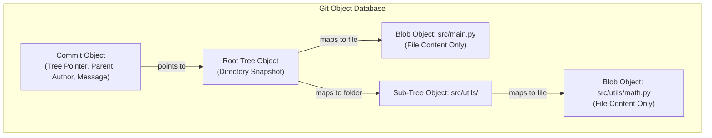
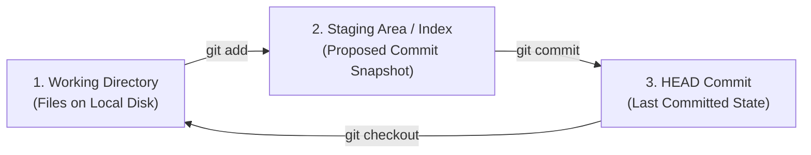

# Part 2: Advanced Version Control & Git Mastery

*[← Back to Master Index](/blog/it-career-guide)*

---

## 1. Core Concept Refresher: The Mechanics of Git Internals

Many junior developers treat Git as a magical black box. They memorize a few basic CLI commands—`git add .`, `git commit -m "message"`, `git push origin main`—and hope nothing breaks. However, the moment a merge conflict occurs, their local branch drifts, or they accidentally lose a day's worth of work due to an unaligned reset command, they panic. 

In **2026**, elite systems developers do not guess. They understand exactly how Git behaves under the hood. 

---

### The Directed Acyclic Graph (DAG) and Content-Addressable Database
At its core, Git is not a file version tracker. It is a **content-addressable object database** layered beneath a **Directed Acyclic Graph (DAG)**. 

Every object inside Git—whether it is a file content, a directory structure, or a commit metadata snapshot—is identified by a 40-character hexadecimal checksum string: the **SHA-1 hash** (composed of a 2-character directory name and a 38-character filename stored inside the `.git/objects/` directory).



Git manages your repository history using four primary object types:
1.  **Blobs:** Binary Large Objects. A blob stores only raw file contents. It contains no file metadata, no filename, and no directory paths. If two files in your project contain the exact same code, Git stores only one blob object, automatically deduplicating storage.
2.  **Trees:** Represent directory structures. A tree object is a flat list mapping SHA-1 hashes of blobs (representing files) and other sub-trees (representing subdirectories) to their literal filenames and file permissions.
3.  **Commits:** Represent project snapshots. A commit object contains a pointer to the root tree object (the top-level directory snapshot), pointers to parent commit hashes, the author and committer metadata, and the commit message.
4.  **Annotated Tags:** A pointer to a specific commit object, containing a tagger name, date, and custom message.

Because commits point to parent commits, they form a **Directed Acyclic Graph (DAG)**.
- **Directed:** The child commit points back to its parent (representing a chronological history vector).
- **Acyclic:** The graph is acyclic because it is mathematically impossible for a commit to point to a future child, preventing loops.

---

### The Three Trees of Git
To master file lifecycle states, you must understand the **Three Trees** model that Git uses to manage content:



1.  **The Working Directory:** The actual physical files on your local machine's disk. You modify these files directly.
2.  **The Staging Area (The Index):** A binary file located at `.git/index` that stores the proposed snapshot of your next commit. When you run `git add`, Git hashes the file, writes a new blob to `.git/objects/`, and updates the index file with the filename and hash.
3.  **The Git Repository (HEAD):** The database of all committed snapshots. The `HEAD` pointer is a reference file pointing directly to your active branch pointer (e.g. `refs/heads/main`), which in turn points to the most recent commit object hash in that branch.

---

### Git Merge vs. Git Rebase: History Modification
When integrating changes from a feature branch back into your main branch, you have two options: merging or rebasing. Understanding their mechanical differences is a high-frequency interview topic:

#### Git Merge (Non-Destructive)
A merge takes the tip of your feature branch, finds the common ancestor commit with the target branch, and creates a new **Merge Commit** combining the changes. 
- **Pros:** Completely non-destructive. The real commit history is preserved exactly as it happened chronologically.
- **Cons:** If multiple developers merge frequently, your DAG history becomes cluttered with crossing lines and repetitive merge commits, making debugging and bisecting difficult.

```
Merge Flow:
A --- B --- C (main)
     \       \
      D --- E --- F (feature) -> Merging creates a combined commit
```

#### Git Rebase (Linear History)
A rebase takes all commits written on your feature branch, temporarily stashes them, moves the branch pointer to the tip of the target branch, and then **re-applies** each commit sequentially.
- **Pros:** Creates a clean, linear commit history that reads like a story.
- **Cons:** It **rewrites history**. Since the parent pointers of your feature commits change, Git must generate new hashes for every rebased commit. **Rule:** Never rebase commits that have been pushed to a public/shared branch, as it will break peer developers' histories.

```
Rebase Flow:
A --- B --- C (main)
             \
              D' --- E' --- F' (feature re-applied linearly on top of C)
```

---

### The Git Reflog System
When you run commands that rewrite history (like `git rebase`, `git commit --amend`, or `git reset`), it seems like your previous commits are permanently deleted. In reality, Git keeps a local transaction database called the **Reflog** (Reference Log) located at `.git/logs/`.

Every time a reference pointer (like your branch pointer or the `HEAD` pointer) moves, Git writes a log entry recording the old and new SHA-1 hashes. If you accidentally reset your branch to a past commit and lose your current work, the "deleted" commits still exist as **dangling commits** inside the `.git/objects/` database. They remain there for a default safety window (typically 30 days) before Git runs its garbage collection process (`git gc`). You can query the reflog to find the lost commit hash and restore it instantly.

---

## 2. Master Resource Directory: Version Control & Git

### Resource 1: *The Git & GitHub Bootcamp* by Colt Steele
*   **Why It Was Selected:** Colt Steele is a master of project-based pedagogy. While many Git tutorials focus on basic commands, Colt goes deep into rebasing, reflogs, cherry-picking, and custom hooks. This course is selected because it forces you to practice complex repository resolution states in interactive console configurations, mimicking real-world development friction.
*   **Target Syllabus Modules/Chapters:** Focus on **Section 11: Rebasing**, **Section 15: The Reflog**, and **Section 18: Custom Git Hooks**.
*   **Time Investment Required:** 15 hours of active video learning and terminal labs.
*   **Value Assessment:** Exceptional. It establishes the hands-on baseline needed to operate securely within multi-developer software repositories.
*   **Actionable Study Strategy:** Watch at 1.25x speed. Complete every terminal lab on your local machine. Do not just use a web GUI interface—run everything through your UNIX shell.

---

### Resource 2: *Pro Git* (2nd Edition) by Scott Chacon & Ben Straub
*   **Why It Was Selected:** Written by Git core contributors, this is the definitive technical manual on Git. It is selected because it contains the absolute best architectural description of Git internals, detailing how loose objects are packed, compressed, and traversed inside `.git/objects/`.
*   **Target Syllabus Modules/Chapters:** Focus on **Chapter 7: Git Tools** (specifically the sections on resetting, rebasing, and reflogs) and **Chapter 10: Git Internals**.
*   **Time Investment Required:** 10 hours of technical reading.
*   **Value Assessment:** High. Reading the internals chapter provides a deep-level understanding of object hashing, delta compression, and graph topologies.
*   **Actionable Study Strategy:** Read the internals chapter slowly. Open a local terminal, create an empty repository, and inspect the changes in `.git/` after running every simple git command to see directories build.

---

### Resource 3: *Git Essential Training* by Kevin Skoglund
*   **Why It Was Selected:** Kevin Skoglund focuses heavily on defensive version control workflows. This course is selected because it details how to inspect diff outputs, clean untracked files safely, restore past files, and recover from detached HEAD pointer states.
*   **Target Syllabus Modules/Chapters:** Focus on the sections detailing "Undoing Changes", "Cherry-Picking Commits", and "Working with Detached HEAD states".
*   **Time Investment Required:** 6 hours of focused video study.
*   **Value Assessment:** High. It builds the confidence needed to repair broken repository configurations.
*   **Actionable Study Strategy:** Watch at 1.5x playback speed. Pause the videos to simulate mistakes locally (e.g. creating a detached HEAD state) and use the course commands to recover.

---

### Resource 4: *Git Hooks Documentation*
*   **Why It Was Selected:** The official specifications manual for Git Hooks. This resource is selected because it provides the API reference and parameter constraints needed to write custom shell scripts that automate code format checking.
*   **Target Syllabus Modules/Chapters:** Read the client-side hooks reference guide (specifically pre-commit, prepare-commit-msg, and commit-msg hooks).
*   **Time Investment Required:** 4 hours of reading and script testing.
*   **Value Assessment:** Medium-High. Essential for understanding how to hook bash lint checking scripts into Git lifecycles.
*   **Actionable Study Strategy:** Review the sample hook scripts generated inside `.git/hooks/` of any new git repository. Write shell scripts that redirect exit codes to abort commits when conditions fail.

---

## 3. Hands-On Portfolio Lab Project: Git Disaster Recovery & Custom Hook Suite

To demonstrate your workflow automation and systems validation capabilities to recruiters, you must build and commit a custom Git automation repository.

### The Lab Project Guidelines:
1.  **Disaster Recovery Simulation:**
    -   Initialize a local Git repository and commit three sequential revisions of a Python file.
    -   Execute a destructive reset: `git reset --hard HEAD~2`. This resets your repository history, making the last two commits vanish from your `git log` output.
    -   Use the reflog to find the lost commits: `git reflog`. Find the SHA-1 hash of the commit right before the destructive reset.
    -   Restore the branch state: `git reset --hard <sha-from-reflog>`. Document this complete recovery process inside a markdown file.
2.  **Automated pre-commit Hook Suite:**
    -   Git hooks are executable shell scripts located in `.git/hooks/`.
    -   Write a custom bash script named `pre-commit` and place it in your local `.git/hooks/` directory (ensure it is executable: `chmod +x .git/hooks/pre-commit`).
    -   The script must automatically execute the following checks before allowing any commit to proceed:
        -   **Code Formatting:** Run your project's formatter (e.g. Biome or Black). If the formatter detects unformatted files, reject the commit and print an error message.
        -   **Syntax Validation:** Run a syntax check (e.g. compile Node code or run a python linter). If syntax checks fail, block the commit.
        -   **Secrets Scanning:** Use a simple grep command to check if any `.env` keys or raw secret string variables are accidentally staged for commit. If detected, abort.
3.  **Exhaustive README:** Your repository readme must display a detailed walkthrough showing terminal output logs for both a successful commit (where all checks pass) and a blocked commit (where formatting errors or secrets were caught).

---

## 4. Technical Interview Self-Assessment

Use these questions to verify if you have successfully digested the version control principles:

| Concept | High-Frequency Interview Question | Expected Technical Answer Framework |
| :--- | :--- | :--- |
| **Rebase vs Merge** | When should you use `git rebase` instead of `git merge`, and what is the Golden Rule of rebasing? | Use `git merge` when you want a non-destructive integration that preserves the historical timeline exactly as it happened. Use `git rebase` when you want a clean, linear history. The **Golden Rule** is to never rebase commits that have been pushed to a shared public branch, as rebasing rewrites hashes, which will break peer developers' branches. |
| **Git Reflog** | If you run `git reset --hard` and lose some commits, how does the Reflog allow you to recover them? | `git reset --hard` moves the branch pointer and HEAD back, but the old commits still exist as dangling objects in `.git/objects/`. The Reflog preserves a local history of every pointer change. Running `git reflog` lists the past states of `HEAD`. You can find the hash of the lost commit and run `git reset --hard <hash>` to restore it. |
| **Git Objects** | Explain the relationship between Blobs, Trees, and Commits in Git internals. | A **Blob** stores only the raw data of a file (no filename). A **Tree** represents a directory, mapping filenames to their respective blob hashes or other sub-tree hashes. A **Commit** represents the snapshot, pointing to the root Tree hash and recording metadata (author, message, parent commit hashes) to form the DAG. |

---

## 5. Exit Tasks for this Phase

Complete these verification steps before proceeding to Part 3:

- [ ] Complete the Git internals and rebasing modules of Colt Steele's Git course.
- [ ] Read Chapter 10 (Git Internals) in the *Pro Git* textbook.
- [ ] Successfully restore a branch from a simulated hard reset using the Reflog.
- [ ] Build and test a working custom `pre-commit` bash script that successfully blocks commits when code is unformatted.

---

*[Proceed to Part 3: The Elite Developer Toolkit & Workflows →](/blog/it-career-guide/part-03-developer-toolkit)*
