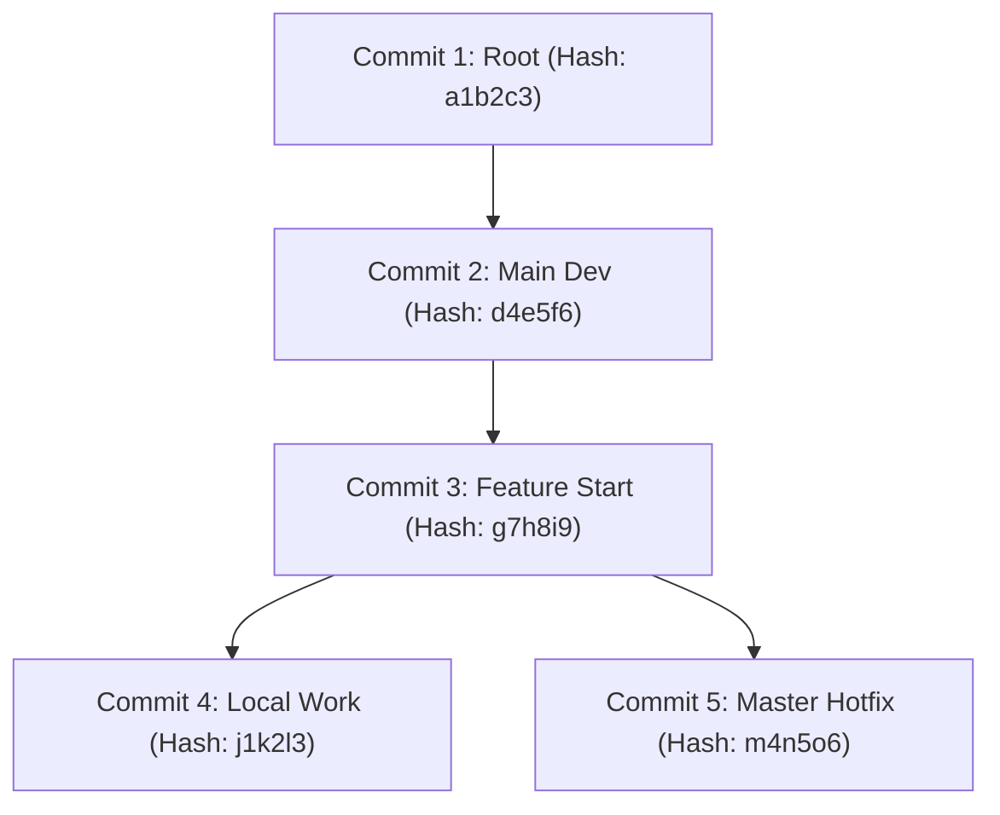
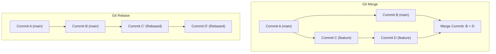

# Part 2: Advanced Version Control & Git Mastery

*[← Back to Master Index](/blog/it-career-guide)*

---

## 1. Introduction: Moving Beyond Basic Git

Most self-taught developers and service company support engineers use Git like a simple cloud backup system. Their daily Git interaction is restricted to exactly three commands:
```bash
git add .
git commit -m "fixed bug"
git push origin main
```

If you operate like this in a high-performing backend engineering team or a remote startup, you will rapidly cause chaos. You will clutter the repository with dozens of messy, non-atomic commits ("typo", "fix again", "hopefully works now"). You will struggle to resolve merge conflicts, accidentally overwrite colleagues' changes, and panic when your local branch enters a broken state.

In professional product organizations, **Git history is treated as code documentation**. A clean, logical, and readable Git history allows teams to track exactly why changes were made, run automated bisects to identify when bugs were introduced, and revert individual features cleanly without breaking unrelated code. 

To transition to an elite software developer role, you must understand Git from first principles and master advanced operations like interactive rebasing, commit squashing, stash slicing, and recovery mechanics using the Git reflog.

---

## 2. Git Internals: Under the Hood of the DAG

To truly master Git, you must discard the mental model of Git as a series of "changesets" or file diffs. **Git is a Content-Addressable Storage System that represents history as a Directed Acyclic Graph (DAG).**



### A. The Four Core Git Objects
Every file, directory, and history state you commit in Git is stored inside the `.git/objects/` folder as a unique, compressed file named after its SHA-1 cryptographic hash (or SHA-256 in newer repositories). There are exactly four types of objects in Git's database:

1. **Blobs (Binary Large Objects):** A blob stores the raw file contents of a specific version of a file. Crucially, **blobs store zero metadata**—they contain no file names, permissions, or commit dates. Git is content-addressable: if two files in different directories have the exact same content, they share the exact same blob in the Git database.
2. **Trees:** A tree object represents a directory state. It acts like a directory listing, referencing other tree objects (subdirectories) and blob objects (files), along with their file names, permissions, and file modes.
3. **Commits:** A commit object is a small text file that links to a top-level Tree object representing the root directory at that specific moment. It also contains metadata: the author's name and email, the committer's details, the timestamp, the commit message, and a list of **parent commit hashes** (one parent for normal commits, multiple parents for merge commits, zero parents for the initial commit).
4. **Annotated Tags:** A tag object points to a specific commit, carrying its own metadata (tagger name, date, signature).

### B. Commits are Snapshots, Not Diffs
A common misconception is that Git stores the "differences" between files over time. It does not. **Every single commit in Git is a complete snapshot of the entire repository at that specific point in time.** 

If a file has not changed between Commit A and Commit B, the Tree object for Commit B simply points to the exact same Blob hash as Commit A. This makes branching, switching branches, and comparing points in history incredibly fast, because Git never has to calculate file diffs on the fly to understand a branch's state.

---

## 3. Standard Workflows: Git Flow vs. Trunk-Based Development

Enterprise organizations utilize structured branch models to manage multi-developer collaboration. Understanding these workflows is essential for passing system integration assessments.

### A. Git Flow (The Traditional Model)
Git Flow utilizes permanent branches for different stages of the release cycle:
- `main`: Reflects production-ready state.
- `develop`: The integration branch for features.
- `feature/*`: Short-lived branches created from `develop` and merged back into `develop` via Pull Requests.
- `release/*`: Branches created to prepare for production deployments, allowing bug fixes but no new features.
- `hotfix/*`: Branches created directly from `main` to patch production bugs quickly, then merged into both `main` and `develop`.

> **Verdict:** Git Flow is excellent for legacy release cycles (e.g., shipping software once every few weeks), but it is generally considered too slow and complex for modern SaaS products.

### B. Trunk-Based Development (The Modern Standard)
In modern high-velocity organizations, teams practice **Trunk-Based Development**:
- All developers commit directly to a single main branch (the "trunk") or create very short-lived feature branches (lasting less than 24 hours).
- Code is merged frequently back to the trunk.
- **Continuous Integration (CI)** runs automated tests on every merge.
- High-risk features are wrapped in **Feature Flags** (toggle configurations), allowing the code to be deployed to production in a dormant state before it is activated for users.

> **Verdict:** This is the preferred model for high-performing engineering teams in 2026. It drastically reduces "merge hell" (where branches diverge for weeks) and encourages small, atomic releases.

---

## 4. Advanced Branch Operations

As a backend developer, your local workstation is your workshop. You must command the advanced Git tools required to manipulate the DAG cleanly.

### A. Git Merge vs. Git Rebase: The Decisive Choice

When you want to integrate changes from `main` into your local `feature` branch, you have two distinct paths:



#### 1. Git Merge
Merging takes the tip of your feature branch, the tip of `main`, finds their common ancestor, and creates a **new "Merge Commit"** joining the histories.
- **Pros:** Preserves the exact historical sequence of commits. Non-destructive (does not modify existing commit hashes).
- **Cons:** Clutters the Git history with hundreds of "Merge branch 'main' into feature" commits, making the graph extremely difficult to read.

#### 2. Git Rebase
Rebasing finds the common ancestor, takes all commits created on your feature branch, and **replays them one-by-one on top of the latest commit on `main`**.
- **Pros:** Creates a perfectly linear, clean commit history. No unnecessary merge commits. Easy to search and read.
- **Cons:** **Destructive.** Rebasing rewrites history by generating brand new commits with new SHA-1 hashes. 

> [!CAUTION]
> **The Golden Rule of Rebasing:** Never rebase a branch that has been pushed to a public or shared repository. If multiple developers are working on a branch, rebasing it will break their local histories, leading to significant synchronization issues. Only rebase local feature branches that belong solely to you.

---

### B. Interactive Rebasing: Cleaning Up Before You Push

Before you submit a Pull Request for code review, you must clean up your local commit history. You can achieve this using **Interactive Rebasing**:
```bash
git rebase -i HEAD~N
```
*(where `N` is the number of commits you want to review and modify).*

Executing this command opens an interactive text editor displaying your commits in reverse chronological order (oldest first). You can change the action keyword before each commit to manipulate your history:

- `pick`: Keep the commit exactly as is.
- `reword`: Keep the commit, but rewrite the commit message to be descriptive.
- `edit`: Stop the rebase process to edit the file contents of that specific commit.
- `squash`: Combine the commit into the parent commit above it, merging the commit messages.
- `fixup`: Combine the commit into the parent commit above it, discarding this commit's message.
- `drop`: Delete the commit entirely from history.

#### Interactive Rebase Workflow Example:
Suppose your local commit history looks like this:
```text
8f9d2a1: WIP: adding database schemas
5b3c4d2: typo fix in schema
2a1f8e9: feat: implemented user signup controller
c7d6e5f: debug logs removed
```

You run `git rebase -i HEAD~4`. In the editor, you configure the actions:
```text
pick 2a1f8e9 feat: implemented user signup controller
squash 8f9d2a1 WIP: adding database schemas
fixup 5b3c4d2 typo fix in schema
fixup c7d6e5f debug logs removed
```
Upon saving, Git squashes all four commits into a single, clean commit: `feat: implemented user signup controller with database schemas`. Your colleagues will see a single atomic commit instead of your messy working history.

---

### C. Git Stash: The Developer's Clipboard

If you are in the middle of a complex coding session and your lead asks you to patch an urgent bug on another branch, you cannot commit half-written, broken code. Instead, use `git stash` to temporarily save your changes without making a commit.

#### Advanced Stash Tooling:
- **Stash with a Message:** Never run just `git stash`. Use descriptive messages so you know what is in each stash slot:
  ```bash
  git stash save "FastAPI user controller partial work"
  ```
- **Stash Untracked Files:** By default, stashing ignores untracked (newly created) files. Include them using the `-u` flag:
  ```bash
  git stash -u
  ```
- **Inspect Stash Contents:** View your stashed states:
  ```bash
  git stash list
  # View specific changes in the top stash
  git stash show -p stash@{0}
  ```
- **Apply vs. Pop:**
  - `git stash apply`: Restores the stashed code but keeps the stash copy in the list.
  - `git stash pop`: Restores the stashed code and immediately deletes it from your stash list.

---

### D. Git Cherry-Pick: Surgical Commits

If you accidentally committed a critical bug fix to the wrong branch, or if you want to pull a single specific feature commit from a massive experimental branch without merging the entire branch, use `git cherry-pick`:
```bash
git cherry-pick <commit-hash>
```
Git will extract that exact commit's changes, apply them to your current active branch, and create a new commit with the same changes and commit message.

---

### E. Getting Out of Jail Free: Git Reflog

What happens if you run `git reset --hard HEAD~3` and accidentally delete three hours of local work? Or what if a complex interactive rebase goes completely wrong, corrupting your branch's state?

Do not panic. As long as your code was committed locally at least once, **it is almost impossible to delete code in Git.**

#### The Magic of Reflog
Git maintains a local log of every movement of your repository's pointers (like `HEAD` or branch tips). This is called the **Reflog (Reference Log)**:
```bash
git reflog
```

Executing this command displays a chronological list of actions:
```text
e4a5f6b HEAD@{0}: reset: moving to HEAD~3
d2c3b4a HEAD@{1}: commit: feat: added stripe integration
c1b2a3f HEAD@{2}: commit: WIP: stripe payment flow
a9b8c7d HEAD@{3}: checkout: moving from main to feature
```

Even though you performed a hard reset and your branch no longer shows the stripe integration commits, the reflog shows their exact commit hashes (`d2c3b4a`).

#### Restoring Lost History:
To restore your branch to the exact state before your accidental reset, simply hard reset to the reflog reference:
```bash
git reset --hard HEAD@{1}
```
*Your lost commits are instantly restored to your branch.*

---

## 5. Team Collaboration & Pull Request Design

In a high-performing software team, code review is the gatekeeper of engineering quality. Your Pull Requests (PRs) must be designed to make reviewer feedback efficient and constructive.

### A. The Anatomy of a Perfect Pull Request
When submitting a PR, your title and description must be self-documenting:
1. **Title:** Use Conventional Commits formatting:
   `feat(auth): implemented OAuth2 login with Google` or `fix(db): corrected transaction locking timeout in PostgreSQL`.
2. **Context:** Describe *why* this change is necessary and the problem it resolves.
3. **Proposed Changes:** Provide a bulleted summary of exactly what was modified across the codebase.
4. **Verification:** Document exactly how you tested the code (including commands to run the test suite and verify coverage).
5. **Architectural Decisions:** Explain any non-obvious engineering decisions or tradeoffs you made.

### B. Setting Up Git Hooks: Automating Quality Control
To prevent bad code from ever reaching the remote repository, you must automate local quality checks using **Git Hooks**—scripts that run automatically during specific Git lifecycle events (like `pre-commit` or `pre-push`).

In modern JavaScript/TypeScript backend ecosystems, teams utilize **Husky** and **lint-staged**. In Python ecosystems, developers use **pre-commit**.

#### Real-World Python Pre-Commit Setup:
Create a `.pre-commit-config.yaml` file in your repository's root directory:
```yaml
repos:
  - repo: https://github.com/pre-commit/pre-commit-hooks
    rev: v4.6.0
    hooks:
      - id: check-yaml
      - id: end-of-file-fixer
      - id: trailing-whitespace

  - repo: https://github.com/psf/black
    rev: 24.4.2
    hooks:
      - id: black
        language_version: python3.11

  - repo: https://github.com/pycqa/flake8
    rev: 7.0.0
    hooks:
      - id: flake8
        args: ["--max-line-length=80"]
```

Install and activate the hooks locally:
```bash
pip install pre-commit
pre-commit install
```
Now, whenever you run `git commit`, Git will automatically run Black to format your code and Flake8 to lint it. If any check fails, Git aborts the commit, forcing you to correct the issue locally before pushing.

---

## 6. TCS Curated Upskilling Resources

Use this curated table to guide your learning inside your corporate portals:

| Platform | Resource Title | Format | Target Skills Covered |
| :--- | :--- | :--- | :--- |
| **Udemy Business** | "The Git & GitHub Bootcamp" by Colt Steele | Video Course | Absolute beginner to advanced Git flows, rebasing, cherry-picking, and reflog |
| **O'Reilly Learning** | "Pro Git" (2nd Edition) by Scott Chacon & Ben Straub | Book | Highly detailed reference guide on Git internals, configurations, and DAG graph mechanics |
| **O'Reilly Learning** | "Version Control with Git" by Jon Loeliger | Book | Advanced branching strategies, merging mechanics, and conflict resolution |
| **LinkedIn Learning** | "Git Essential Training" by Kevin Skoglund | Video | Ground-up basics, setting up SSH keys, tracking files, and repository management |
| **Free Interactive** | [Learn Git Branching (GitHub Sandbox)](https://learngitbranching.js.org/) | Gamified Simulator | Visual, interactive simulation of branching, rebasing, cherry-picking, and pointer manipulation |

---

## 7. Hands-On Practical Lab: Git Sandbox Recovery

To consolidate your Git skills, open your terminal (PowerShell or Zsh) and execute this hands-on simulation to practice recovery mechanics:

### Step 1: Initialize a Sandbox Repo
```bash
mkdir git-sandbox
cd git-sandbox
git init
```

### Step 2: Create a Commited History
```bash
echo "First line" > file.txt
git add file.txt
git commit -m "commit 1: initial line"

echo "Second line" >> file.txt
git commit -am "commit 2: second line"

echo "Third line" >> file.txt
git commit -am "commit 3: third line"
```

### Step 3: Simulate a Disaster
Accidentally perform a hard reset, deleting the last two commits:
```bash
git reset --hard HEAD~2
```
Verify your file contents: `cat file.txt` will now show only "First line". Commits 2 and 3 appear to be completely gone.

### Step 4: Perform the Rescue Operation
1. Run `git reflog`. Find the commit hash for "commit 3: third line".
2. Reset your branch to that hash:
   ```bash
   git reset --hard <commit-hash-from-reflog>
   ```
3. Run `cat file.txt`. Your third line is restored, and all commits are back in your history!

---

*[Proceed to Part 3: The Elite Developer Toolkit & Workflows →](/blog/it-career-guide/part-03-developer-toolkit)*

---

### The 2026 IT Career Blueprint Series Navigation

- **[Master Index: The 2026 IT Career Blueprint](/blog/it-career-guide)**
- **Part 1:** [The Blueprint & Escape Plan →](/blog/it-career-guide/part-01-the-blueprint)
- **Part 2:** [Advanced Version Control & Git Mastery →](/blog/it-career-guide/part-02-git-github)
- **Part 3:** [The Elite Developer Toolkit & Workflows →](/blog/it-career-guide/part-03-developer-toolkit)
- **Part 4:** [Python Mastery from Scratch →](/blog/it-career-guide/part-04-python-mastery)
- **Part 5:** [Async programming & FastAPI Backend Services →](/blog/it-career-guide/part-05-async-python-fastapi)
- **Part 6:** [TypeScript & Node.js Backend Ecosystems →](/blog/it-career-guide/part-06-typescript-backend)
- **Part 7:** [Relational Databases & Advanced PostgreSQL →](/blog/it-career-guide/part-07-postgresql)
- **Part 8:** [NoSQL Databases (MongoDB & Redis Caching) →](/blog/it-career-guide/part-08-nosql-databases)
- **Part 9:** [Distributed Systems & Message Queues with Kafka →](/blog/it-career-guide/part-09-distributed-systems-kafka)
- **Part 10:** [System Design Principles & Scalable Architecture →](/blog/it-career-guide/part-10-system-design)
- **Part 11:** [Microservices Architecture Patterns →](/blog/it-career-guide/part-11-microservices)
- **Part 12:** [Docker & Containerization for Backend Developers →](/blog/it-career-guide/part-12-docker)
- **Part 13:** [Kubernetes & Container Orchestration →](/blog/it-career-guide/part-13-kubernetes)
- **Part 14:** [Continuous Integration & Deployment (CI/CD) with GitHub Actions →](/blog/it-career-guide/part-14-cicd)
- **Part 15:** [AWS Cloud & Serverless Architectures →](/blog/it-career-guide/part-15-aws-serverless)
- **Part 16:** [Front-End Mastery: React, Next.js & Client-Side Architectures →](/blog/it-career-guide/part-16-frontend-react)
- **Part 17:** [Generative AI & Large Language Models (LLM) Integration →](/blog/it-career-guide/part-17-genai-llms)
- **Part 18:** [Retrieval-Augmented Generation (RAG) & Vector Databases →](/blog/it-career-guide/part-18-rag-vector-db)
- **Part 19:** [AI Agents & Advanced Workflows with LangGraph →](/blog/it-career-guide/part-19-ai-agents-langgraph)
- **Part 20:** [Enterprise Security, Authentication & OWASP Top 10 →](/blog/it-career-guide/part-20-security-auth)
- **Part 21:** [Comprehensive Testing: Unit, Integration, & E2E Testing →](/blog/it-career-guide/part-21-testing)
- **Part 22:** [Data Structures & Algorithms (DSA) and LeetCode Blueprint →](/blog/it-career-guide/part-22-dsa-leetcode)
- **Part 23:** [Tech Interview Success: System Design & Behavioral STAR Method →](/blog/it-career-guide/part-23-tech-interviews)
- **Part 24:** [Global Remote Jobs and Freelancing Platforms →](/blog/it-career-guide/part-24-global-remote)
- **Part 25:** [Immigration, Visas & Tech Relocation →](/blog/it-career-guide/part-25-immigration-visas)
