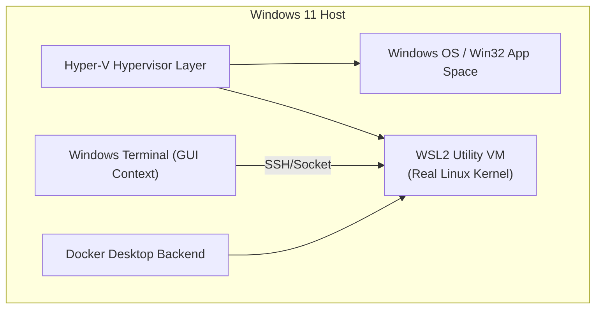

# Part 3: The Developer Toolkit & CLI Productivity

*[← Back to Master Index](/blog/it-career-guide)*

---

## 1. Core Concept Refresher: Escaping Windows GUI Bottlenecks via WSL2

Many developers entering the IT sector from college or service companies operate entirely inside graphical user interfaces (GUIs)—clicking buttons in VS Code, dragging files in Windows Explorer, or managing connections inside bloated client GUIs. In professional backend systems engineering, distributed architectures, and DevOps, **the GUI is a massive bottleneck**. 

Production servers run on headless Linux environments. To design, build, debug, and automate these systems, you must speak the terminal's native language. 

---

### Windows Subsystem for Linux (WSL2)
If you are developing on a Windows machine, the absolute first step is installing and configuring **WSL2 (Ubuntu)**. 

Unlike the legacy WSL1 (which translated Linux system calls to Windows APIs with high latency), WSL2 runs a **real Linux kernel inside a lightweight, highly optimized utility virtual machine**. This guarantees native system execution speeds, 100% compatibility with Docker, and direct access to native Linux networking layers.



---

### Key Performance Configurations for WSL2:
To prevent WSL2 from consuming all your host system resources or lagging during large builds, write a `.wslconfig` file in your Windows User profile directory (`C:\Users\<username>\.wslconfig`):

```ini
[wsl2]
# Restrict memory consumption to 50% of host RAM to prevent system starvation
memory=8GB 
# Restrict virtual processors to 4 cores
processors=4
# Enable automatic release of unused memory back to Windows
guiApplications=false
```

---

## 2. Shell Command Masterclass: Navigation, Searching & Interactive JSON Processing

Once inside your Linux terminal, replace slow, native UNIX utilities with modern, high-performance CLI tools written in Go and Rust:

| Standard Tool | Modern CLI Tool | Language | Key Feature |
| :--- | :--- | :---: | :--- |
| `cd` | `zoxide` | Rust | Smart navigation based on history/frequency (e.g. `z oriz`). |
| `find` / `grep` | `ripgrep` (`rg`) | Rust | Blazing-fast file search bypassing `.gitignore` matches. |
| `cat` | `bat` | Rust | Contextual syntax highlighting and Git diff integration. |
| `ls` | `eza` | Rust | Visual, color-coded, tree-integrated file listings. |
| (manual search) | `fzf` | Go | General-purpose interactive fuzzy finder for search outputs. |
| `python -m json` | `jq` | C | Powerful, structural CLI JSON querying and parsing. |

---

### Power Workflows with Shell Pipes:
One of the most robust features of the UNIX philosophy is composing specialized commands using **Pipes (`|`)**:

1.  **Fuzzy-finding files containing a specific keyword:**
    ```bash
    # Search for "FastAPI" and pipe matches to fuzzy-finder to view interactively
    rg "FastAPI" --files-with-matches | fzf
    ```
2.  **Parsing an nested JSON field from an API response:**
    ```bash
    # Retrieve weather metrics and parse nested temperature from structured JSON
    curl -s "https://api.weather.gov/gridpoints/TOP/31,80/forecast" | jq '.properties.periods[0].temperature'
    ```

---

## 3. Profile Scripts & SSH Security-First Networking

### Profile Configuration (`.bashrc` / `.zshrc`)
Your shell script profile is your operational dashboard. Open `~/.bashrc` (or `~/.zshrc`) and add clean, productive aliases and environmental configurations:

```bash
# Core Navigation & Listing Aliases
alias ls="eza --icons --group-directories-first"
alias ll="eza -lah --icons --group-directories-first"
alias cat="bat --style=plain"
alias ..="cd .."

# Smart Zoxide Setup
eval "$(zoxide init bash)"

# Secure Git Shortcut Functions
git-commit-all() {
    git add .
    git commit -m "$1"
}

# Custom Productive Prompt Configuration
export PS1="\[\e[32m\]\u@wsl:\[\e[34m\]\w\[\e[0m\]\$ "
```

---

### Security-First SSH Configuration (`~/.ssh/config`)
Managing connections to multiple servers, staging environments, and GitHub via long, manual commands (`ssh -i key.pem ubuntu@12.34.56.78`) is highly inefficient and insecure. 

Instead, construct a clean, consolidated SSH configuration file under `~/.ssh/config` with strict permissions (`chmod 600 ~/.ssh/config`):

```text
# GitHub Identity Mapping
Host github.com
    HostName github.com
    User git
    IdentityFile ~/.ssh/id_ed25519
    IdentitiesOnly yes

# Enterprise Staging Server Target
Host tcs-staging
    HostName 13.234.56.78
    User ubuntu
    IdentityFile ~/.ssh/tcs_staging.pem
    Port 22
    ForwardAgent yes
```

Now, connecting to your remote server or checking SSH auth is reduced to:
```bash
ssh tcs-staging
```

---

## 4. Part 3 Master Resource Directory: Developer Toolkit (30 Curated Resources)

Below is the definitive, prioritized resource collection to master UNIX shell environments, modern CLI tools, terminal customizations, and secure remote configurations:

---

### Sub-Topic A: WSL2 Installation & Host Tuning

#### 1. Windows Subsystem for Linux (WSL) Essential Training
*   **Direct URL:** https://www.linkedin.com/learning/windows-subsystem-for-linux-wsl-essential-training
*   **Search Identification:** Search LinkedIn Learning for: `"WSL Essential Training" (Instructor: Microsoft Technical Education)`
*   **Resource Type:** Video Course
*   **Access / Price:** Paid (Included in TCS Enterprise Account)
*   **Status:** Required (Non-Negotiable)
*   **Description:** Clear visual guide on setting up the Hyper-V hypervisor, installing Ubuntu, mounting Windows drives, and configuring `.wslconfig` performance metrics.
*   **Mutual Exclusivity Mapping:** If you complete this, you can skip *WSL2 Mastery (Udemy)* as it covers Hyper-V configuration parameters in full.

#### 2. WSL2 Mastery and Development Environments
*   **Direct URL:** https://www.udemy.com/course/wsl2-mastery/
*   **Search Identification:** Search Udemy for: `"WSL2 Mastery" (Instructor: Andrei Neagoie)`
*   **Resource Type:** Video Course
*   **Access / Price:** Paid (Included in TCS Udemy Business)
*   **Status:** Alternative to: *Windows Subsystem for Linux (WSL) Essential Training* (Choose either to fulfill this module).
*   **Description:** Focuses on VS Code WSL integration, network mapping layers, and Linux systems paths.
*   **Mutual Exclusivity Mapping:** Choose this if you prefer a coding-centric VS Code setup walk over Microsoft's admin-level training.

#### 3. Microsoft Official WSL2 Installation Documentation
*   **Direct URL:** https://learn.microsoft.com/en-us/windows/wsl/install
*   **Search Identification:** Search Web for: `"WSL install Microsoft official documentation"`
*   **Resource Type:** Written Reference / Documentation
*   **Access / Price:** 100% Free
*   **Status:** Required
*   **Description:** Step-by-step instructions for kernel update packages and mounting local disk systems.
*   **Mutual Exclusivity Mapping:** Standard baseline guide.

#### 4. WSL2 and Docker Desktop Configurations
*   **Direct URL:** https://docs.docker.com/desktop/wsl/
*   **Search Identification:** Search Web for: `"WSL2 Docker Desktop integration guide"`
*   **Resource Type:** Written Reference / Documentation
*   **Access / Price:** 100% Free
*   **Status:** Required
*   **Description:** Setting up native WSL2 backends inside Docker Desktop to avoid VM performance overheads.
*   **Mutual Exclusivity Mapping:** Critical guide for setting up Docker containers inside your Linux shell.

#### 5. Advanced WSL2 Networking and Firewalls
*   **Direct URL:** https://www.youtube.com/playlist?list=PL4Ux7MSKEWpqaHPlz4f3Tbe6_jYt-J8Y9
*   **Search Identification:** Search YouTube for: `"WSL2 advanced networking localhost binding"`
*   **Resource Type:** Video Playlist
*   **Access / Price:** 100% Free
*   **Status:** Optional
*   **Description:** Handling local IP tunnels and port bindings in WSL2.
*   **Mutual Exclusivity Mapping:** Supplemental networking tutorials.

---

### Sub-Topic B: Terminal Shell & Command Line Mastery

#### 6. Linux Command Line Bootcamp
*   **Direct URL:** https://www.udemy.com/course/linux-command-line-bootcamp/
*   **Search Identification:** Search Udemy for: `"Linux Command Line Bootcamp" (Instructor: Colt Steele)`
*   **Resource Type:** Video Course
*   **Access / Price:** Paid (Included in TCS Udemy Business)
*   **Status:** Required (Non-Negotiable)
*   **Description:** Complete guide to terminal navigations, pipelines, streams, filters, and standard Linux processes.
*   **Mutual Exclusivity Mapping:** If you take this, you can skip Jason Cannon's course as Colt Steele covers command compositions with higher practical humor.

#### 7. Linux Command Line Basics
*   **Direct URL:** https://www.udemy.com/course/linux-command-line-basics/
*   **Search Identification:** Search Udemy for: `"Linux Command Line Basics" (Instructor: Jason Cannon)`
*   **Resource Type:** Video Course
*   **Access / Price:** Paid (Included in TCS Udemy Business)
*   **Status:** Alternative to: *Linux Command Line Bootcamp* (Choose either to fulfill this module).
*   **Description:** Covers core shell variables, standard inputs/outputs, file permissions, and directory structures.
*   **Mutual Exclusivity Mapping:** Shorter structural alternative to the Bootcamp. Choose if you want a faster pacing.

#### 8. Linux Journey Interactive Portal
*   **Direct URL:** https://linuxjourney.com/
*   **Search Identification:** Search Google for: `"Linux Journey learn online"`
*   **Resource Type:** Interactive Tutorial Portal
*   **Access / Price:** 100% Free
*   **Status:** Required
*   **Description:** The absolute best text-interactive sandbox playground to learn command outputs, processes, and standard packages.
*   **Mutual Exclusivity Mapping:** Gold standard text diagnostic portal.

#### 9. MIT Missing Semester: The Shell
*   **Direct URL:** https://missing.csail.mit.edu/2020/shell-tools/
*   **Search Identification:** Search Web for: `"MIT Missing Semester shell tools"`
*   **Resource Type:** Written References & Interactive Video Lectures
*   **Access / Price:** 100% Free
*   **Status:** Required
*   **Description:** Explains standard command execution loops, custom scripting parameters, streams redirection, and pipes.
*   **Mutual Exclusivity Mapping:** Required for theoretical depth.

#### 10. Linux Command Line Essentials (LinkedIn Learning)
*   **Direct URL:** https://www.linkedin.com/learning/linux-command-line-essential-training-15798020
*   **Search Identification:** Search LinkedIn Learning for: `"Linux Command Line Essential Training"`
*   **Resource Type:** Video Course
*   **Access / Price:** Paid (Included in TCS Enterprise Account)
*   **Status:** Optional
*   **Description:** Rapid review of core terminal file commands.
*   **Mutual Exclusivity Mapping:** Optional certification path.

---

### Sub-Topic C: Modern Terminal Navigation (rg, fzf, jq)

#### 11. Command Line Power User
*   **Direct URL:** https://commandlinepoweruser.com/
*   **Search Identification:** Search Google/Web for: `"Command Line Power User Wes Bos"`
*   **Resource Type:** Video Course
*   **Access / Price:** 100% Free
*   **Status:** Required (Non-Negotiable)
*   **Description:** Excellent video series explaining how to integrate Zsh, configure Zoxide, Bat, eza, and customize prompt themes.
*   **Mutual Exclusivity Mapping:** If you take this, you can skip LinkedIn's general CLI tools course as this course is explicitly tailored for developer prompts setup.

#### 12. CLI Tools for Modern Developers
*   **Direct URL:** https://www.linkedin.com/learning/cli-tools-for-developers
*   **Search Identification:** Search LinkedIn Learning for: `"CLI Tools for Modern Developers"`
*   **Resource Type:** Video Course
*   **Access / Price:** Paid (Included in TCS Enterprise Account)
*   **Status:** Alternative to: *Command Line Power User* (Choose either to fulfill this module).
*   **Description:** Introduces ripgrep, bat syntax highlighting, and fzf fuzzy find terminal flows.
*   **Mutual Exclusivity Mapping:** Select this if you prefer LinkedIn Learning's structured video segments.

#### 13. ripgrep (rg) Official GitHub Manual
*   **Direct URL:** https://github.com/BurntSushi/ripgrep
*   **Search Identification:** Search GitHub for: `"BurntSushi ripgrep"`
*   **Resource Type:** Written Reference / Documentation
*   **Access / Price:** 100% Free
*   **Status:** Required
*   **Description:** Explains parallel directory parsing, regex arguments, and gitignore indexing rules.
*   **Mutual Exclusivity Mapping:** Standard baseline manual.

#### 14. fzf (Fuzzy Finder) Examples Guide
*   **Direct URL:** https://github.com/junegunn/fzf
*   **Search Identification:** Search GitHub for: `"junegunn fzf"`
*   **Resource Type:** Written Reference / Documentation
*   **Access / Price:** 100% Free
*   **Status:** Required
*   **Description:** Practical shell configuration setups to fuzzy-find files, environment keys, and command history in sub-seconds.
*   **Mutual Exclusivity Mapping:** Standard baseline configuration manual.

#### 15. eza Modern Listings Manual
*   **Direct URL:** https://github.com/eza-community/eza
*   **Search Identification:** Search GitHub for: `"eza-community eza"`
*   **Resource Type:** Written Reference / Documentation
*   **Access / Price:** 100% Free
*   **Status:** Optional
*   **Description:** Tree listings, metadata parameters, and color setups.
*   **Mutual Exclusivity Mapping:** Custom listing manual.

---

### Sub-Topic D: Secure SSH Agent & Key Forwarding

#### 16. SSH, Key Pairs and Remote Management
*   **Direct URL:** https://www.linkedin.com/learning/ssh-key-pairs-and-remote-management
*   **Search Identification:** Search LinkedIn Learning for: `"SSH Key Pairs and Remote Management"`
*   **Resource Type:** Video Course
*   **Access / Price:** Paid (Included in TCS Enterprise Account)
*   **Status:** Required (Non-Negotiable)
*   **Description:** Teaches how to generate ed25519 secure keys, configure standard SSH configs, forward local agents, and bindings.
*   **Mutual Exclusivity Mapping:** If you complete this, you can skip the SSH Tunneling Masterclass on Udemy if you do not require specialized bastion-host routing configurations.

#### 17. SSH Tunneling and Port Forwarding Masterclass
*   **Direct URL:** https://www.udemy.com/course/ssh-tunneling/
*   **Search Identification:** Search Udemy for: `"SSH Tunneling and Port Forwarding" (Instructor: Zeal Vora)`
*   **Resource Type:** Video Course
*   **Access / Price:** Paid (Included in TCS Udemy Business)
*   **Status:** Alternative to: *SSH, Key Pairs and Remote Management* (Choose either to fulfill this module).
*   **Description:** Deep video training on local port forwarding (`-L`), remote port forwarding (`-R`), and secure bastion hosts.
*   **Mutual Exclusivity Mapping:** Choose this if your focus is explicitly on network boundaries and bastion server administration.

#### 18. OpenSSH Official Configuration Documentation
*   **Direct URL:** https://www.openssh.com/
*   **Search Identification:** Search Web for: `"OpenSSH official documentation"`
*   **Resource Type:** Written Reference / Documentation
*   **Access / Price:** 100% Free
*   **Status:** Required
*   **Description:** Complete reference guide to config parameters: Host, User, IdentityFile, Port, and KeepAlive.
*   **Mutual Exclusivity Mapping:** Baseline configuration guide.

#### 19. SSH Tunneling Simplified Explainer
*   **Direct URL:** https://ssh.com/academy/tunneling
*   **Search Identification:** Search Web for: `"SSH Academy tunneling port forwarding"`
*   **Resource Type:** Written Publication & Reference
*   **Access / Price:** 100% Free
*   **Status:** Required
*   **Description:** Conceptual web guides explaining how secure traffic binds are tunneled through standard firewall port 22.
*   **Mutual Exclusivity Mapping:** Baseline conceptual reference.

#### 20. ShellCheck - Shell Script Static Linter
*   **Direct URL:** https://www.shellcheck.net/
*   **Search Identification:** Search Web/GitHub for: `"koalaman shellcheck"`
*   **Resource Type:** Interactive Linter / Code Tool
*   **Access / Price:** 100% Free
*   **Status:** Required
*   **Description:** Scans shell automation files to detect coding mistakes and security holes.
*   **Mutual Exclusivity Mapping:** Standard linting tool.

---

### Sub-Topic E: Dotfiles Management & Customization

#### 21. Managing Dotfiles with Git and GNU Stow
*   **Direct URL:** https://github.com/aspiers/stow
*   **Search Identification:** Search GitHub for: `"aspiers stow dotfiles"`
*   **Resource Type:** Code Library & Written Reference
*   **Access / Price:** 100% Free
*   **Status:** Required (Non-Negotiable)
*   **Description:** Explains how to centralize configuration files (`.bashrc`, `.ssh/config`, `.gitconfig`) using symlinks.
*   **Mutual Exclusivity Mapping:** If you use GNU Stow, you can skip *Chezmoi dotfiles manager* as Stow handles configurations via native symlinks with zero platform dependencies.

#### 22. Chezmoi Dotfiles Manager (chezmoi.io)
*   **Direct URL:** https://www.chezmoi.io/
*   **Search Identification:** Search Web for: `"Chezmoi dotfiles manager documentation"`
*   **Resource Type:** Code Tool & Written Reference
*   **Access / Price:** 100% Free
*   **Status:** Alternative to: *Managing Dotfiles with Git and GNU Stow*.
*   **Description:** Focuses on encrypted multi-host dotfiles distributions.
*   **Mutual Exclusivity Mapping:** Choose Chezmoi if you manage configurations across multiple operating systems.

#### 23. Zsh and Oh My Zsh Framework Configuration
*   **Direct URL:** https://ohmyz.sh/
*   **Search Identification:** Search Web for: `"Oh My Zsh installation framework"`
*   **Resource Type:** Code Framework & Reference
*   **Access / Price:** 100% Free
*   **Status:** Required
*   **Description:** Introduces theme configs, autocomplete scripts, and terminal extensions.
*   **Mutual Exclusivity Mapping:** Standard baseline helper framework.

#### 24. Dotfiles: A Guide to Customizing Your Environment
*   **Direct URL:** https://dotfiles.github.io/
*   **Search Identification:** Search Web for: `"GitHub official guide to dotfiles"`
*   **Resource Type:** Written Reference / Guide
*   **Access / Price:** 100% Free
*   **Status:** Required
*   **Description:** The complete structural guide to organizing configuration files.
*   **Mutual Exclusivity Mapping:** Standard reference index.

#### 25. O'Reilly Classic: Learning the vi and Vim Editors (7th Edition)
*   **Direct URL:** https://www.oreilly.com/library/view/learning-the-vi/9780596529833/
*   **Search Identification:** Search O'Reilly for: `"Learning the vi and Vim Editors"`
*   **Resource Type:** Book
*   **Access / Price:** Paid (Included in TCS O'Reilly Enterprise benefit)
*   **Status:** Optional
*   **Description:** Classic text explaining terminal text editing configurations and keyboard navigation paradigms.
*   **Mutual Exclusivity Mapping:** Optional booster.

---

### Sub-Topic F: Advanced CLI Scripting & Pipe Pipelines

#### 26. O'Reilly Classic: Learning the bash Shell (3rd Edition)
*   **Direct URL:** https://www.oreilly.com/library/view/learning-the-bash/0596009658/
*   **Search Identification:** Search O'Reilly Media for: `"Learning the bash Shell" (Author: Cameron Newham)`
*   **Resource Type:** Book
*   **Access / Price:** Paid (Included in TCS O'Reilly Enterprise benefit)
*   **Status:** Required
*   **Description:** Definitive guide to loops, signal handling, variables scope, writing custom functions, and redirect pipelines in Bash.
*   **Mutual Exclusivity Mapping:** If you read this book, you can skip Udemy's Shell Scripting course as it covers internal script compilation mechanisms in wider detail.

#### 27. Shell Scripting: Discover How to Automate Command Line Tasks
*   **Direct URL:** https://www.udemy.com/course/shell-scripting-linux/
*   **Search Identification:** Search Udemy for: `"Shell Scripting Linux" (Instructor: Jason Cannon)`
*   **Resource Type:** Video Course
*   **Access / Price:** Paid (Included in TCS Udemy Business)
*   **Status:** Alternative to: *O'Reilly Classic: Learning the bash Shell*.
*   **Description:** Explains variables automation, conditional checkers, standard inputs, and custom exit status loops.
*   **Mutual Exclusivity Mapping:** Video alternative to the bash shell book.

#### 28. Linux Command Line and Shell Scripting Bible (4th Edition)
*   **Direct URL:** https://www.oreilly.com/library/view/linux-command-line/9781119700913/
*   **Search Identification:** Search O'Reilly for: `"Linux Command Line and Shell Scripting Bible"`
*   **Resource Type:** Book
*   **Access / Price:** Paid (Included in TCS O'Reilly Enterprise benefit)
*   **Status:** Required
*   **Description:** Extremely thorough reference indexing all Linux kernel signals, scripting controls, and advanced stream manipulation tools (`sed`, `awk`).
*   **Mutual Exclusivity Mapping:** Crucial scripting reference.

#### 29. Bash Guide for Beginners
*   **Direct URL:** https://www.tldp.org/LDP/Bash-Beginners-Guide/html/
*   **Search Identification:** Search Web for: `"Bash Guide for Beginners TLDP"`
*   **Resource Type:** Written Reference / Documentation
*   **Access / Price:** 100% Free
*   **Status:** Required
*   **Description:** Outstanding free reference detailing syntax, standard parameters, and command execution phases.
*   **Mutual Exclusivity Mapping:** Standard guide.

#### 30. Terminus DB CLI and Scripting Sandbox
*   **Direct URL:** https://github.com/terminusdb/terminusdb
*   **Search Identification:** Search GitHub for: `"terminusdb terminusdb"`
*   **Resource Type:** Code Repository & Interactive Database Sandbox
*   **Access / Price:** 100% Free
*   **Status:** Optional
*   **Description:** Advanced query engines executing command scripts.
*   **Mutual Exclusivity Mapping:** Supplemental database querying sandbox.

---

## 5. Hands-On Portfolio Lab Project: Automated SSH Tunneling & Port Forwarding

To demonstrate your server administration and network security-first skills, you must configure, test, and automate a secure local-to-remote **SSH Port Tunnel** wrapper script.

### The Lab Project Guidelines:
1.  **Mock Remote Server Environment:** Inside your WSL2 instance, run a lightweight local background web server (such as a basic python web server running on port 8000):
    ```bash
    python3 -m http.server 8000
    ```
2.  **SSH Local Port Forwarding:** In a secondary terminal, execute a local forwarding command mimicking tunnel configurations used to access internal databases (like staging Postgres instances blocked behind firewall private networks):
    ```bash
    # Forward local port 9000 to remote port 8000 over secure SSH connection
    ssh -N -L 9000:localhost:8000 localhost
    ```
3.  **Validation Check:** Open your web browser on Windows, navigate to `http://localhost:9000`, and assert that the file directory of your WSL2 server loads correctly.
4.  **Wrapper Shell Script Automation (`secure_tunnel.sh`):** Write a robust Bash automation script:
    *   Verify if a tunnel process is already active using `pgrep`.
    *   If active, display the active process ID (PID) and exit.
    *   If inactive, spawn the SSH port forward in the background (`nohup` or `&`), capturing outputs to logs.
    *   Format output with Shell colors and run check metrics using `ShellCheck` to guarantee clean exit parameters.
    *   Commit the script to your public `2026-upskilling-roadmap` repository.

---

## 6. Technical Interview Self-Assessment

Use these questions to verify if you have successfully digested the principles of this developer toolkit chapter:

| Concept | High-Frequency Interview Question | Expected Technical Answer Framework |
| :--- | :--- | :--- |
| **WSL2 System Calls** | What is the fundamental architectural difference between WSL1 and WSL2? | **WSL1:** Used a translation layer that converted Linux system calls to Windows kernel APIs, resulting in massive file I/O latency. **WSL2:** Utilizes a real Linux kernel running inside a highly lightweight, specialized virtual machine, delivering native execution speeds and full Docker compatibility. |
| **CLI Search** | Why is `ripgrep` significantly faster than standard `grep -r`? | `ripgrep` (`rg`) is written in Rust and utilizes parallel file traversing, Rust's fast regex engine, and automatically respects your `.gitignore` rules, completely skipping searching through node_modules, build caches, and binary objects. |
| **SSH Port Forwarding** | What is the security advantage of Local Port Forwarding over opening public ports on a server? | Local Port Forwarding allows developers to access databases (e.g. Postgres on 5432) without exposing the database port publicly to the open internet. All traffic is fully encrypted and tunneled over standard SSH port 22, maintaining strict firewall integrity. |

---

## 7. Exit Tasks for this Phase

Complete these verification steps before proceeding to Part 4:

- [ ] Successfully configured virtual Hyper-V and WSL2 environments inside Windows.
- [ ] Replaced standard search/listings utilities with `bat`, `eza`, `ripgrep`, and `zoxide`.
- [ ] Configured a solid, secure `~/.ssh/config` file with restricted file permissions.
- [ ] Committed your verified, syntax-checked `secure_tunnel.sh` automation script to GitHub.

---

*[Proceed to Part 4: Python Mastery: Core Language Internals →](/blog/it-career-guide/part-04-python-mastery)*
