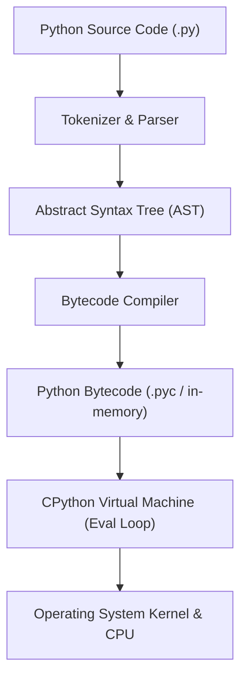
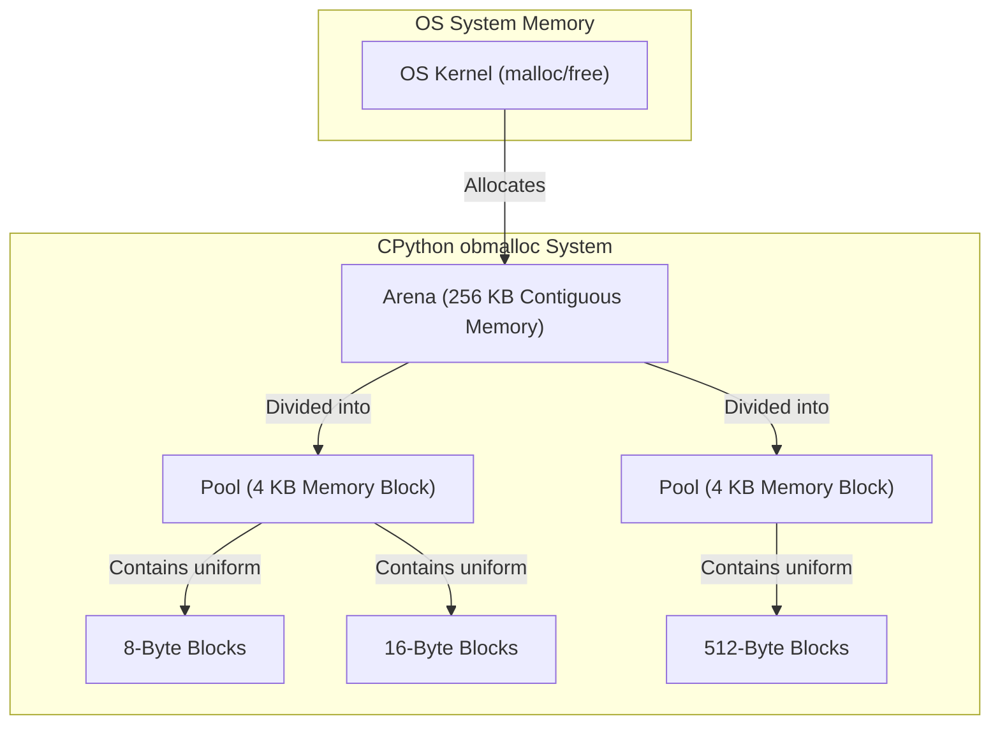
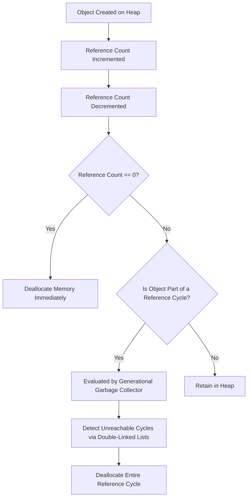
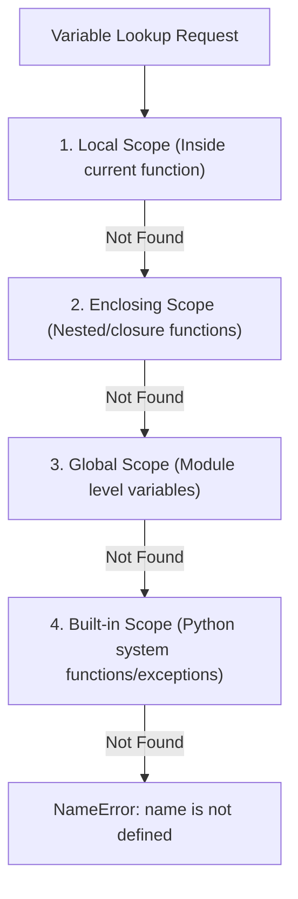
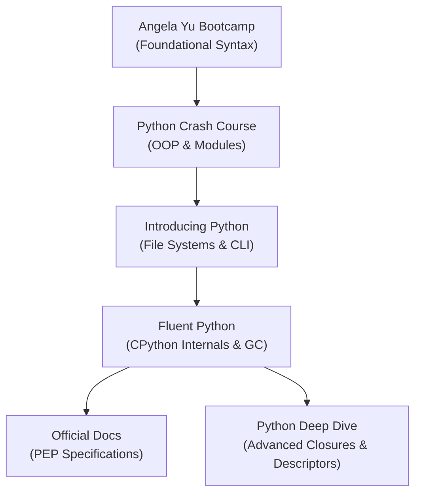

# Part 4: Python Mastery — CPython Architecture & Production Engineering

*[← Back to Master Index](/blog/it-career-guide)*

---

## 1. Deep-Dive Core Concepts: Python Internals & CPython Runtime Architecture

Many developers write Python without understanding how the code executes. They treat Python as a magical script runner. However, to build high-performance backend systems, scale data processing pipelines, and implement custom AI agents, you must understand the underlying CPython runtime architecture, memory management model, and structural type system.

Python is an interpreted, high-level, dynamically typed programming language. The default and reference implementation of Python is **CPython**, which is written in C. When you execute a Python script (e.g., `python script.py`), the CPython interpreter compiles your source code into bytecode, which is then executed on a stack-based virtual machine.

---

### The Compiler & Virtual Machine Execution Pipeline



When a Python process starts, the execution pipeline runs as follows:
1. **Parsing & AST Generation:** The compiler reads the raw characters of your source file, tokenizes them, and builds a concrete syntax tree, which is compiled into an **Abstract Syntax Tree (AST)**.
2. **Bytecode Compilation:** The compiler translates the AST into a platform-independent set of instructions called **Bytecode**. These instructions are stored in `.pyc` files (inside `__pycache__` directories) to skip recompilation on subsequent runs if the source code has not changed.
3. **The Eval Loop:** The CPython virtual machine reads the bytecode instructions sequentially inside a large loop, historically implemented as a switch-statement inside the C file `ceval.c`. The VM is a **Stack-Based Machine**, meaning it uses an internal evaluation stack to push and pop operands to execute operations.

---

### CPython Memory Allocation Architecture: Obmalloc, Arenas, Pools, and Blocks

To understand how Python allocates memory, we must look below the operating system level. If Python requested memory from the OS kernel using standard C `malloc` calls for every integer, string, or list element, the system would spend significant time switching between user and kernel modes (system call overhead) and suffer from severe memory fragmentation.

To solve this, CPython implements a custom memory allocator called **obmalloc** (object memory allocator), optimized for small object allocations (less than or equal to 512 bytes).



The obmalloc allocator organizes memory hierarchically into three layers:
1. **Arenas:** These are the largest chunks of memory allocated by CPython from the OS, sized at 256 KB. Arenas hold the raw memory addresses and are managed using standard C library allocation.
2. **Pools:** Each Arena is divided into 4 KB blocks called Pools. A pool contains memory blocks of a single uniform size class (e.g., all 8-byte blocks or all 16-byte blocks). Pools are aligned to 4 KB virtual page boundaries.
3. **Blocks:** Inside each pool are the actual memory blocks where Python objects are stored. Blocks range in size from 8 bytes up to 512 bytes, in multiples of 8 bytes (e.g., 8, 16, 24, ..., 512). If an object exceeds 512 bytes, the allocator bypasses obmalloc entirely, passing the allocation request directly to the system's standard C memory management tools.

#### Under the Hood of Pools: State Transitions and Singly-Linked Free Lists
Pools in obmalloc are not just static structures; they manage their blocks dynamically using singly-linked lists. Each pool has three states:
- **Empty:** No blocks are allocated. The memory is fully available.
- **Used:** Some blocks are allocated, and some are free. The pool is linked in a doubly-linked list of used pools for its specific size class, allowing obmalloc to find it quickly when a new object of that size class is requested.
- **Full:** All blocks in the pool are allocated. The pool is removed from the used list until one of its blocks is freed, changing its status back to "used."

Within a pool, free blocks are tracked using a singly-linked list of pointers. The header of the pool contains a pointer `freeblock` pointing to the first free block. Each free block contains, as its first bytes, a pointer to the next free block. When an object is deallocated, its block is inserted at the head of the `freeblock` list, allowing allocations to occur in **O(1)** time by popping the head.

#### Object Allocation Categories and Resizing Mechanics
Different Python datastructures manage their internal memory in specific ways:
- **Lists (Dynamic Arrays):** A Python list is an array of pointers to other Python objects. When you create an empty list, Python allocates room for a small number of items (typically 4). When the list grows past its allocated size, Python resizes the array using the following expansion ratio:

  ```
  New Capacity = Current Size + (Current Size >> 3) + 6
  ```

  This over-allocation reduces the frequency of resizing operations, keeping append operations at **O(1)** amortized time.
- **Resizing on Shrinkage:** When elements are popped from a list, Python does not shrink the memory layout immediately. The memory is only reallocated and shrunk if the list size falls below half of its allocated capacity. This prevents memory thrashing when lists are repeatedly modified.
- **Dictionaries (Hash Tables):** Python dictionaries are sparse hash tables using open addressing with perturbation for collision resolution. They are highly optimized for lookup speeds. When a dictionary reaches 2/3 full, it is resized to a larger capacity (typically doubled or quadrupled) to prevent hash collisions from slowing down lookups.

---

### CPython Memory Management: Heap, Stack, and PyObject

#### The Stack vs. The Heap
- **The Execution Stack:** Stores active frame objects. Each time a function is called, CPython pushes a frame onto the stack containing the function's local variables, references to global scopes, and the instruction pointer. Stack memory allocation is fast and managed automatically by the call stack.
- **The Private Heap:** All Python objects (integers, strings, lists, custom classes) are allocated on Python's private heap. When you assign `x = 10`, the integer object `10` is created on the heap, and the local variable `x` on the stack stores a pointer referencing that heap address.

#### The C-Level `PyObject` structure
At the C level, every Python object is wrapped in a struct named `PyObject` (or `PyVarObject` for variable-length items like lists and strings). You can find this definition in the CPython source code (`Include/object.h`):
```c
typedef struct _object {
    _PyObject_HEAD_EXTRA // Double linked list pointers for tracking active heap objects
    Py_ssize_t ob_refcnt; // Reference count tracking active references
    struct _typeobject *ob_type; // Pointer to the object's type description struct
} PyObject;
```
Because of this C structure:
- **Reference Counting overhead:** Every variable assignment or reference addition increments `ob_refcnt`. When a reference is deleted or goes out of scope, the count is decremented.
- **Type Information Pointer:** The `ob_type` pointer points to another struct containing the object's type details (e.g., how to add, print, or delete it). This is why Python is dynamically typed but strongly typed: variables can point to any object type, but the objects themselves retain explicit type rules.
- **Memory Footprint:** Even a simple integer like `10` requires significantly more memory in Python than in C. In C, a 64-bit integer takes 8 bytes of raw memory. In Python, a `PyObject` wrapper requires 28 bytes or more to store type pointers, reference counts, and the value.

---

### Reference Counting & Garbage Collection Architecture

CPython uses two complementary algorithms to manage heap memory: **Reference Counting** and **Generational Cyclic Garbage Collection**.



#### Reference Counting Mechanics
Reference counting is Python’s primary memory management system.
- **How It Works:** Each time an object is referenced (e.g., passed to a function, appended to a list, or assigned to a variable), its internal `ob_refcnt` is incremented by 1. When a reference goes out of scope or is deleted, `ob_refcnt` is decremented by 1.
- **Immediate Reclaim:** As soon as `ob_refcnt` hits `0`, the memory allocated to the object is freed immediately, returning it to Python’s internal memory allocator. This keeps memory cleanup deterministic and fast.

#### The Problem of Reference Cycles
Reference counting cannot clean up circular references. Consider this example:
```python
class Node:
    def __init__(self):
        self.ref = None

a = Node()
b = Node()
a.ref = b
b.ref = a

del a
del b
```
Even after calling `del a` and `del b`, the two objects still reference each other on the heap. Their reference counts remain at `1`, making them unreachable from the Python code but preventing their memory from being freed automatically.

#### Generational Cyclic Garbage Collection (GC)
To resolve reference cycles, CPython runs a cyclic garbage collector in the background, implemented in `Modules/gcmodule.c`.
- **Generational Model:** The GC divides all tracked container objects (lists, dictionaries, custom objects) into three generations: Generation 0, 1, and 2.
- **Thresholds:** New objects are placed in Gen 0. When Gen 0 fills up (determined by a threshold counter, typically 700 allocations), Python runs a collection pass on Gen 0. Objects that survive this pass are moved to Gen 1. As Gen 1 fills up, it and Gen 0 are collected, moving survivors to Gen 2. Gen 2 contains long-lived objects and is collected less frequently.
- **Cycle Detection Algorithm:** To find cyclic references, the GC copies the reference counts of all tracked objects into a separate tracker. It then traverses the double-linked list of container objects and decrements their virtual reference counts for every reference originating within the group. Any object whose virtual reference count drops to `0` is identified as part of an isolated cycle and is scheduled for deallocation.

---

### Variable Mutability, Object Identity, and Shared References

Understanding variable mutability is essential for avoiding bugs, especially when working with concurrent tasks or shared data structures.

#### Mutability vs. Immutability
- **Immutable Objects:** Once created on the heap, their value cannot be changed. This group includes `int`, `float`, `str`, `tuple`, `bytes`, and `frozenset`. Any operation modifying an immutable variable (e.g., `s = s + "world"`) creates a new object on the heap and updates the variable to point to its new address.
- **Mutable Objects:** Their content can be modified in place without changing the object's heap address. This group includes `list`, `dict`, `set`, `bytearray`, and user-defined class instances.

#### Object Identity and Interning
- **The `id()` Function:** Returns the unique integer address representing the object on the heap.
- **The `is` Operator:** Compares the heap addresses of two references. Using `a is b` checks if they point to the exact same object (`id(a) == id(b)`).
- **The `==` Operator:** Compares the values of two objects by calling their class’s `__eq__` method.
- **String and Integer Interning:** To optimize memory, CPython pre-allocates and caches small integers (from `-5` to `256`) and short strings. When you assign `x = 100` and `y = 100`, both variables point to the same cached integer object on the heap.

```python
x = [1, 2, 3]
y = [1, 2, 3]
print(x == y) # True (their values are equal)
print(x is y) # False (they are separate list objects on the heap)

a = "hello"
b = "hello"
print(a is b) # True (interned string optimization)
```

---

### Namespaces and Scope Resolution: The LEGB Rule

When Python encounters a variable name, it searches for it in four sequential scopes. This lookup order is known as the **LEGB Rule**:



1. **Local (L):** Variables defined inside a function using standard assignments.
2. **Enclosing (E):** Variables defined in the outer scope of a nested function (closures).
3. **Global (G):** Module-level variables defined at the top level of a script.
4. **Built-in (B):** Standard Python system names (e.g., `print`, `len`, `ValueError`).

If the interpreter searches all four scopes and cannot resolve the name, it raises a `NameError`.

---

### Advanced Python Features: Decorators, Descriptors, Generators, and Metaclasses

To build flexible libraries and scalable systems, you must understand Python's advanced class and function mechanics.

#### Decorators and Functional Closures
A **closure** is a nested function that retains access to variables from its enclosing scope even after the outer function has finished executing. 
A **decorator** leverages closures to wrap another function, extending its behavior without modifying its source code.
```python
import time
from functools import wraps

def time_logger(func):
    @wraps(func)
    def wrapper(*args, **kwargs):
        start = time.perf_counter()
        result = func(*args, **kwargs)
        duration = time.perf_counter() - start
        print(f"Executed {func.__name__} in {duration:.4f} seconds")
        return result
    return wrapper
```
Using `@time_logger` wraps the target function inside the closure `wrapper`, running timing checks whenever the function is invoked.

#### Generators, Iterators, and Memory Efficiency
A standard function returns a value and exits, discarding its local stack frame. A **generator** function uses the `yield` keyword to return values sequentially, pausing its execution state between iterations without discarding its local variables.
- **The Iterator Protocol:** Objects implementing `__iter__()` and `__next__()` are iterators.
- **Memory Optimization:** Returning a list of one million integers requires allocating memory for all one million values on the heap. Using a generator yields integers one at a time, keeping the memory footprint low regardless of the dataset size.

```python
def fibonacci_generator(limit):
    a, b = 0, 1
    count = 0
    while count < limit:
        yield a
        a, b = b, a + b
        count += 1
```

#### Descriptors and Lookup Precedence Mechanics
A **descriptor** is an object that defines custom attribute access behaviors by implementing one or more methods of the descriptor protocol: `__get__()`, `__set__()`, or `__delete__()`.
Descriptors are divided into two main categories:
1. **Data Descriptors:** Implement both `__get__()` and `__set__()` (and/or `__delete__()`). They override instance dictionary lookups.
2. **Non-Data Descriptors:** Only implement `__get__()`. They can be overridden by setting an attribute on the instance.

#### Precedence Rules: How Attribute Resolution Works
When you read an attribute `obj.attr`, Python uses a strict lookup hierarchy:
1. **Data Descriptor:** If `attr` is defined as a data descriptor on the class of `obj`, Python calls its `__get__()` method first.
2. **Instance Dictionary:** If not overridden by a data descriptor, Python searches `obj.__dict__` for `"attr"`.
3. **Non-Data Descriptor / Class Attribute:** If not found in the instance dictionary, Python searches the class directory, running the `__get__()` method of any non-data descriptor found.
4. **Base Classes (MRO):** Python climbs the Method Resolution Order (MRO) chain to find the attribute, throwing an `AttributeError` if the search fails.

#### Custom Validation Descriptor Implementation
Here is how to write a descriptor to enforce strict type checking on class attributes:
```python
class PositiveNumber:
    def __init__(self, name: str) -> None:
        self.name = name

    def __get__(self, instance: Any, owner: Any) -> Any:
        if instance is None:
            return self
        return instance.__dict__.get(self.name)

    def __set__(self, instance: Any, value: Any) -> None:
        if not isinstance(value, (int, float)):
            raise TypeError(f"{self.name} must be a number.")
        if value <= 0:
            raise ValueError(f"{self.name} must be positive.")
        instance.__dict__[self.name] = value

class Product:
    # Assign descriptors
    price = PositiveNumber("price")
    quantity = PositiveNumber("quantity")

    def __init__(self, name: str, price: float, quantity: int) -> None:
        self.name = name
        self.price = price
        self.quantity = quantity
```

#### Metaclasses and Class Creation
In Python, classes are objects themselves. The class that defines how a class behaves is called a **metaclass**. By default, all Python classes are instances of the default metaclass `type`.
- **Custom Metaclasses:** By inheriting from `type` and overriding `__new__()` or `__init__()`, you can intercept class creation. This allows you to enforce naming conventions, validate method signatures, or register classes automatically at runtime.

---

## 2. Master Resource Directory: Python Mastery

Deepening your Python knowledge requires studying both CPython's source architecture and practical backend engineering patterns. The resources below provide structured paths to master Python.



---

### Resource 1: Fluent Python (Book by Luciano Ramalho)

- **Why It Was Selected:** This book is a comprehensive reference for writing idiomatic, high-performance Python. It covers data structures, object representations, design patterns, and CPython internals like descriptors, generators, and coroutines.
- **Target Syllabus Modules/Chapters:**
  - *Chapter 3: Dictionaries and Sets* (Understanding hash table collisions and performance characteristics).
  - *Chapter 6: Object References, Mutability, and Recycling* (Garbage collection mechanics and weak references).
  - *Chapter 16: Coroutines and Yield From* (Understanding asynchronous generators).
  - *Chapter 20: Attribute Descriptors* (Creating custom validation descriptors).
- **Time Investment Required:** 35 Hours (includes reading, note-taking, and testing code examples).
- **Value Assessment:** Professional worth: Extremely High. While it normally costs around ₹3,000 for the print edition, it is available free online via TCS-provided O'Reilly library access. It bridges the gap between basic syntax and professional backend engineering.
- **Actionable Study Strategy:** Read one chapter at a time. Run the code snippets in a local terminal and inspect object states using `id()`, `dir()`, and the `sys` module.

---

### Resource 2: 100 Days of Code: Complete Python Pro Bootcamp (Udemy Course)

- **Why It Was Selected:** A video-based course containing practical assignments, web scraping projects, and command-line automation exercises.
- **Target Syllabus Modules/Chapters:**
  - *Days 1-15: Python Basics* (Variables, conditionals, loops, functions, lists, and dictionaries).
  - *Days 16-30: Object-Oriented Programming (OOP)* (Classes, inheritance, encapsulation, and package layouts).
  - *Days 35-50: APIs, JSON processing, and web scrapers.*
- **Time Investment Required:** 60 Hours (includes watching videos and writing the projects).
- **Value Assessment:** Professionally worth: Medium-High. Included with TCS-provided Udemy access. It provides hands-on coding practice to build muscle memory for programming.
- **Actionable Study Strategy:** Watch the videos at 1.25x speed. Complete every project without copying code templates, debugging execution errors yourself.

---

### Resource 3: Python Crash Course (Book by Eric Matthes)

- **Why It Was Selected:** A clear, project-focused introduction to writing clean, maintainable code, implementing tests, and using third-party packages.
- **Target Syllabus Modules/Chapters:**
  - *Chapter 8: Functions & Modules* (Scope organization and file separation).
  - *Chapter 11: Testing Your Code* (Using `unittest` and `pytest`).
  - *Project 2: Data Visualization* (Parsing JSON data streams).
- **Time Investment Required:** 20 Hours.
- **Value Assessment:** Free via O'Reilly library access. Excellent for learning modular program structure and structured project styling.
- **Actionable Study Strategy:** Focus on the second half of the book, completing the data processing projects and writing units tests for each feature.

---

### Resource 4: Introducing Python (Book by Bill Lubanovic)

- **Why It Was Selected:** A guide covering file systems, databases, message queues, and systems programming using Python.
- **Target Syllabus Modules/Chapters:**
  - *Chapter 11: Concurrency* (Understanding threads, processes, and network sockets).
  - *Chapter 12: Systems Programming* (Managing shell processes, file attributes, and system arguments).
- **Time Investment Required:** 15 Hours.
- **Value Assessment:** Free via O'Reilly. Useful for learning how Python interacts with the underlying operating system.
- **Actionable Study Strategy:** Read the system administration chapters. Use the examples to write scripts that automate file cleanup and process checks in WSL2.

---

### Resource 5: Python Official Documentation & Tutorial

- **Why It Was Selected:** The official reference guides for the Python standard library, syntax rules, and PEP (Python Enhancement Proposal) style guides.
- **Target Syllabus Modules/Chapters:**
  - *The Python Tutorial:* Complete review.
  - *Python Library Reference:* Deep-dive on `sys`, `os`, `gc`, `collections`, and `itertools`.
  - *PEP 8:* Python code style conventions.
  - *PEP 484:* Static typing specifications.
- **Time Investment Required:** 10 Hours.
- **Value Assessment:** Free. The absolute gold standard of documentation. Explains library specifications precisely.
- **Actionable Study Strategy:** Read PEP 8 and PEP 484 carefully. Apply these styling and typing rules to all Python code you write.

---

### Resource 6: Python Deep Dive (Udemy Series by Fred Baptiste)

- **Why It Was Selected:** A highly detailed video series focusing on variable scopes, namespaces, memory management, closures, decorators, and descriptors.
- **Target Syllabus Modules/Chapters:**
  - *Part 1: Functional Programming* (Variables, memory, functions, closures, and decorators).
  - *Part 2: Iterators and Generators* (The iterator protocol, generator functions, and coroutines).
  - *Part 4: Object-Oriented Programming* (Descriptors, slots, properties, and custom metaclasses).
- **Time Investment Required:** 40 Hours.
- **Value Assessment:** Included with TCS Udemy access. Excellent for visual learners who want to understand CPython implementation details.
- **Actionable Study Strategy:** Watch the videos at 1.5x speed. Re-create the memory diagrams by drawing object addresses on a whiteboard to visualize garbage collection.

---

## 3. Hands-On Portfolio Lab Project: High-Performance Data Processing Engine

In this lab, you will build a modular **High-Performance Data Processing Engine** using Python. The engine will read mock transactional JSON datasets, parse them using generators, apply filters using custom decorators, monitor memory allocation with the garbage collector, and validate input types using static analysis tools.

```
~/python_engine/
├── data/
│   └── transactions.json   # Input dataset file
├── src/
│   ├── __init__.py
│   ├── types.py            # Custom typing schemas
│   ├── decorators.py       # Performance logging decorators
│   ├── parser.py           # Memory-efficient generator loops
│   └── analyzer.py         # Main analysis and run logic
├── tests/
│   ├── __init__.py
│   └── test_engine.py      # Unit tests
├── pyproject.toml          # Package configuration and dependencies
└── run.sh                  # Execution automation script
```

---

### Step 1: Initialize Project Configurations

Create the directory structure inside WSL2:
```bash
mkdir -p ~/python_engine/src ~/python_engine/tests ~/python_engine/data
cd ~/python_engine
```

#### File: `~/python_engine/pyproject.toml`
Defines project settings and configures static analysis tools like `mypy` and `pytest`.
```toml
[project]
name = "python-data-engine"
version = "1.0.0"
description = "A memory-efficient transactional data processing engine"
requires-python = ">=3.11"
dependencies = [
    "pytest>=8.0.0",
    "mypy>=1.8.0",
]

[tool.mypy]
strict = true
warn_unused_configs = true
ignore_missing_imports = false

[tool.pytest.ini_options]
minversion = "8.0"
addopts = "-ra -q"
testpaths = ["tests"]
```

---

### Step 2: Generate Mock Dataset

#### File: `~/python_engine/data/transactions.json`
A list of transaction logs to test parser efficiency.
```json
[
    {"id": "T001", "amount": 1250.50, "category": "infrastructure", "status": "completed"},
    {"id": "T002", "amount": 80.00, "category": "saas", "status": "completed"},
    {"id": "T003", "amount": 5400.00, "category": "marketing", "status": "pending"},
    {"id": "T004", "amount": 320.10, "category": "hardware", "status": "completed"},
    {"id": "T005", "amount": 15000.00, "category": "infrastructure", "status": "failed"},
    {"id": "T006", "amount": 450.00, "category": "saas", "status": "completed"},
    {"id": "T007", "amount": 9200.00, "category": "infrastructure", "status": "completed"}
]
```

---

### Step 3: Implement Typing Schemas

#### File: `~/python_engine/src/types.py`
Defines structure templates using Python's `TypedDict`.
```python
from typing import TypedDict, Literal

TransactionStatus = Literal["completed", "pending", "failed"]

class TransactionRecord(TypedDict):
    id: str
    amount: float
    category: str
    status: TransactionStatus
```

---

### Step 4: Write Performance Decorators

#### File: `~/python_engine/src/decorators.py`
This file implements timing and memory tracking decorators.
```python
import time
import gc
import functools
from typing import Callable, Any, TypeVar, cast

F = TypeVar("F", bound=Callable[..., Any])

def profile_resource_usage(func: F) -> F:
    """Decorator to measure execution duration and track garbage collector changes."""
    @functools.wraps(func)
    def wrapper(*args: Any, **kwargs: Any) -> Any:
        # Force garbage collection to ensure a clean starting memory state
        gc.collect()
        
        start_time = time.perf_counter()
        
        # Track initial object count
        initial_objects = len(gc.get_objects())
        
        # Execute function
        result = func(*args, **kwargs)
        
        end_time = time.perf_counter()
        final_objects = len(gc.get_objects())
        
        duration = end_time - start_time
        object_diff = final_objects - initial_objects
        
        print(f"[METRIC] Function '{func.__name__}' executed in {duration:.6f} seconds.")
        print(f"[METRIC] Active heap objects delta: {object_diff:+d} objects.")
        
        return result
    return cast(F, wrapper)
```

---

### Step 5: Build Parser and Analyzer Logic

#### File: `~/python_engine/src/parser.py`
Uses generators to parse the JSON dataset memory-efficiently.
```python
import json
from typing import Generator, Any
from src.types import TransactionRecord

def stream_transactions(file_path: str) -> Generator[TransactionRecord, None, None]:
    """Reads transactions from a JSON file, yielding them one record at a time."""
    with open(file_path, "r", encoding="utf-8") as file:
        # Load the array of objects
        data: list[dict[str, Any]] = json.load(file)
        
        for record in data:
            # Cast dict object to TransactionRecord template
            yield TransactionRecord(
                id=str(record["id"]),
                amount=float(record["amount"]),
                category=str(record["category"]),
                status=record["status"]
            )
```

#### File: `~/python_engine/src/analyzer.py`
Aggregates transactional data and runs analysis routines.
```python
from typing import Iterable
from src.types import TransactionRecord
from src.parser import stream_transactions
from src.decorators import profile_resource_usage

class TransactionAnalyzer:
    def __init__(self, records: Iterable[TransactionRecord]) -> None:
        self.records = records

    @profile_resource_usage
    def calculate_total_completed_by_category(self, category: str) -> float:
        """Sums the amounts of completed transactions for a specified category."""
        total = 0.0
        for record in self.records:
            if record["category"] == category and record["status"] == "completed":
                total += record["amount"]
        return total

def run_pipeline(data_path: str, target_category: str) -> float:
    """Executes the parsing and analysis pipeline."""
    # Instantiates the generator stream
    transaction_stream = stream_transactions(data_path)
    
    # Initialize analyzer with generator stream
    analyzer = TransactionAnalyzer(transaction_stream)
    
    # Run calculation
    total = analyzer.calculate_total_completed_by_category(target_category)
    return total

if __name__ == "__main__":
    import sys
    path = "./data/transactions.json"
    cat = sys.argv[1] if len(sys.argv) > 1 else "infrastructure"
    print(f"Running pipeline for category: {cat}")
    result = run_pipeline(path, cat)
    print(f"Total Completed: {result}")
```

---

### Step 6: Write Unit Tests

#### File: `~/python_engine/tests/test_engine.py`
Tests calculations and verifies generator data streaming.
```python
import tempfile
import json
import pytest
from src.parser import stream_transactions
from src.analyzer import TransactionAnalyzer, run_pipeline

@pytest.fixture
def temp_data_file() -> tempfile._TemporaryFileWrapper[str]:
    """Creates a temporary JSON file with mock transaction data."""
    mock_data = [
        {"id": "T1", "amount": 100.0, "category": "cloud", "status": "completed"},
        {"id": "T2", "amount": 200.0, "category": "cloud", "status": "failed"},
        {"id": "T3", "amount": 300.0, "category": "cloud", "status": "completed"},
        {"id": "T4", "amount": 150.0, "category": "marketing", "status": "completed"},
    ]
    file = tempfile.NamedTemporaryFile(mode="w+", suffix=".json", delete=False)
    json.dump(mock_data, file)
    file.flush()
    return file

def test_stream_transactions(temp_data_file: tempfile._TemporaryFileWrapper[str]) -> None:
    """Verifies that the generator yields objects matching the typing schema."""
    stream = stream_transactions(temp_data_file.name)
    records = list(stream)
    assert len(records) == 4
    assert records[0]["id"] == "T1"
    assert records[0]["amount"] == 100.0
    assert records[0]["status"] == "completed"

def test_calculate_total_completed_by_category(temp_data_file: tempfile._TemporaryFileWrapper[str]) -> None:
    """Verifies that the calculation logic filters and sums records correctly."""
    stream = stream_transactions(temp_data_file.name)
    analyzer = TransactionAnalyzer(stream)
    result = analyzer.calculate_total_completed_by_category("cloud")
    assert result == 400.0  # Sum of T1 (100.0) and T3 (300.0)

def test_run_pipeline(temp_data_file: tempfile._TemporaryFileWrapper[str]) -> None:
    """Verifies that the main pipeline execution yields correct calculation values."""
    result = run_pipeline(temp_data_file.name, "marketing")
    assert result == 150.0
```

---

### Step 7: Build the Run Automation Script

#### File: `~/python_engine/run.sh`
This script configures a virtual environment, installs dependencies, runs static analysis checks, and executes the test suite.
```bash
#!/usr/bin/env bash

# Exit script on any execution error
set -euo pipefail

echo "=== Stage 1: Initializing Virtual Environment ==="
python3 -m venv .venv
source .venv/bin/activate

echo "=== Stage 2: Installing Dependencies ==="
pip install --upgrade pip
pip install pytest mypy

echo "=== Stage 3: Running Static Code Analysis (Mypy) ==="
# Enforce strict type validation across source files
mypy src/ --strict

echo "=== Stage 4: Executing Testing Suite (Pytest) ==="
pytest tests/

echo "=== Stage 5: Running Pipeline Application ==="
python -m src.analyzer infrastructure

echo "=== Verification Successful! ==="
```

Make the script executable and run it:
```bash
chmod +x ~/python_engine/run.sh
./run.sh
```

---

## 4. Technical Interview Self-Assessment

Prepare for Python engineering interviews by studying the common questions and answer frameworks below.

| Category | High-Frequency Interview Question | Expected Technical Answer Framework |
| :--- | :--- | :--- |
| **Memory Allocation** | What is the difference between Python's stack and private heap memory? | The execution stack stores function frames containing local variables and reference pointers. These frames are managed automatically by the call stack. The private heap stores all actual Python objects (like lists, dictionaries, and custom classes). Variable references on the stack point to the corresponding object addresses on the heap. |
| **Garbage Collection** | How does Python handle reference cycles, and why are they a problem for reference counting? | Reference counting deallocates memory as soon as an object's reference count hits zero. However, in circular references, objects reference each other, keeping their reference counts above zero even when they are unreachable. To clean these up, Python runs a generational garbage collector in the background that checks container objects for isolated reference loops. |
| **Scopes & Variable Lookup** | Explain how the LEGB rule determines variable resolution in nested scopes. | When Python encounters a variable name, it searches for it in four sequential scopes: Local (inside the current function), Enclosing (in outer enclosing functions/closures), Global (at the module level), and Built-in (standard Python functions). If the variable is not found in any of these scopes, Python raises a `NameError`. |
| **Code Optimization** | Why should you use generators (`yield`) instead of returning standard lists for large datasets? | Returning a standard list requires allocating memory for all elements on the heap at once. A generator function returns an iterator that yields one element at a time, using the `yield` keyword to pause execution between calls. This keeps the memory footprint small and constant, regardless of the size of the dataset. |
| **Type Validation** | How do Python's runtime typing and static analysis tools like Mypy differ? | Python is dynamically and strongly typed, meaning type checks are performed at runtime based on the object's actual type. Mypy is a static analysis tool that parses code prior to execution to check for type mismatches based on your type annotations (PEP 484), helping catch errors before the code runs. |
| **Dict Performance** | How do CPython dictionaries achieve O(1) average lookup times, and how does key sizing impact this? | Python dicts are hash tables utilizing open addressing. Dict lookups use the object's hash values modulo table size to find keys. To save memory, Python uses a key-sharing scheme for class instances (PEP 412), separating key/hash tables from the actual instance value arrays. Collisions are resolved using a custom pseudo-random perturbation index. |

---

## 5. Exit Tasks for this Phase

Complete these verification steps before moving to Part 5:
- [ ] Run the `run.sh` automation script to verify your virtual environment setup and execute the tests.
- [ ] Ensure that Mypy runs with `--strict` type checks and returns no compilation errors.
- [ ] Verify that Pytest executes and passes all test cases successfully.
- [ ] Inspect the memory metrics printed by the `profile_resource_usage` decorator.
- [ ] Commit your data engine repository to GitHub to keep your progress backed up.

---

*[Proceed to Part 5: Asynchronous Python & FastAPI Backend Services →](/blog/it-career-guide/part-05-async-python-fastapi)*
