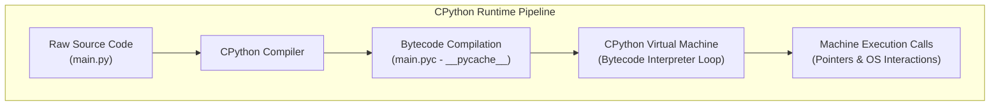
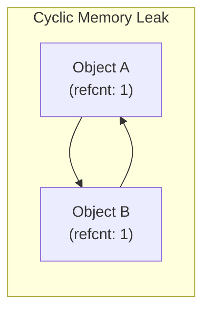

# Part 4: Python Mastery: Core Language Internals

*[← Back to Master Index](/blog/it-career-guide)*

---

## 1. Core Concept Refresher: Under the Hood of CPython

Most software developers write Python code without understanding **how the code is executed in memory**. This lack of deep operational knowledge is the primary reason why systems built by junior developers suffer from performance bottlenecks, memory leaks, and erratic runtime execution speeds. 

To transition from a novice into a high-paid platform developer, you must study **CPython internals**.

---

### The CPython Execution Pipeline
Python is not a purely interpreted language. When you execute a script (`python main.py`), the CPython runtime runs a two-step compilation sequence:



1.  **Bytecode Compilation:** The compiler parses your source code into a syntax tree and compiles it into a low-level platform-independent format called **Bytecode** (`.pyc` files stored in `__pycache__`).
2.  **Virtual Machine Execution:** The CPython Virtual Machine (a stack-based interpreter loop written in C) reads the bytecode instructions sequentially, converting them into native machine commands.

---

### Memory Management & Reference Counting
Unlike languages with manual memory allocation (like C/C++) or complex tracing garbage collectors (like Java/Go), CPython manages memory objects primarily using **Reference Counting**:

*   Every Python object created contains a header metadata struct (`PyObject`) which tracks:
    1.  `ob_refcnt`: The total number of variables, collections, or references currently pointing to that object in memory.
    2.  `ob_type`: A pointer mapping to the object's class/type definition.
*   When a reference is added (e.g. `y = x`), the `ob_refcnt` increases by 1.
*   When a reference is deleted or goes out of scope, the counter decreases by 1.
*   **Instant Deallocation:** As soon as an object's reference counter hits **0**, CPython immediately deallocates the memory space occupied by the object, returning it to the system.

---

### Generational Cyclic Garbage Collection (GC)
Reference counting alone has a critical vulnerability: **Reference Cycles**. 



If Object A points to Object B, and Object B points back to Object A, their reference counts will never drop below 1, even if all external variables pointing to them are destroyed. This creates a permanent **Memory Leak**.

To solve this, CPython executes a secondary **Generational Cyclic Garbage Collector (GC)** in the background:
*   **Generations:** The GC organizes all objects into three generation groups (Gen 0, Gen 1, Gen 2) based on survival history.
*   **Heuristics:** New objects enter Gen 0. If they survive a GC scan, they are promoted to Gen 1, and eventually to Gen 2.
*   **Scan Frequencies:** Gen 0 is scanned frequently because new objects die fast. Gen 2 is scanned rarely.
*   **Algorithm:** The GC traverses object graphs, identifying self-referencing cycles that are isolated from the root application namespace, and safely deallocates them.

---

## 2. Advanced Language Features: Variable Scopes, Closures & Memory-Efficient Generators

### Variable Scopes & LEGB Rules
When CPython resolves the value of a variable name, it follows a strict hierarchical search order known as the **LEGB Rule**:

```text
1. L (Local): Variables defined inside the active function block.
2. E (Enclosing): Variables defined in outer enclosing helper functions (closures).
3. G (Global): Variables defined at the top level of the module file.
4. B (Built-in): Built-in Python keywords and names (e.g. range, len, print).
```

---

### Closures & Free Variables
A **Closure** is an inner function that retains access to variables from its outer enclosing scope even after the outer function has completed execution. 

These retained variables are called **Free Variables**:

```python
def make_multiplier(factor: int):
    # Inner closure retains 'factor' variable in memory
    def multiplier(number: int) -> int:
        return number * factor
    return multiplier

double = make_multiplier(2)
print(double(5)) # Outputs: 10
```

---

### Memory-Efficient Generators
Standard functions return a complete collection of values at once using `return`, which loads the entire list into memory. If you are processing millions of records, this causes memory starvation (`OutOfMemory` errors).

**Generators** solve this by using the `yield` keyword:
*   Instead of returning a complete collection, a generator returns an **iterator object**.
*   When `next()` is called, the generator executes until it encounters the `yield` statement, returns a single value, and **suspends its state** (preserving local variables and instruction pointers).
*   On subsequent calls, execution resumes exactly where it was suspended, consuming virtually zero memory overhead.

```python
from typing import Generator

def read_massive_log(file_path: str) -> Generator[str, None, None]:
    # Stream file line-by-line, loading only one line in memory at a time
    with open(file_path, "r") as file:
        for line in file:
            yield line.strip()
```

---

## 3. Object-Oriented Programming (OOP), Magic Methods & Strict Mypy Typing

### The Power of Magic (Dunder) Methods
Magic methods (prefixed and suffixed with double underscores, e.g. `__init__`) allow you to hook your custom Python classes directly into core language mechanics and operators:

*   `__repr__(self)`: Defines the formal string representation of an object (crucial for debugging and logging).
*   `__enter__` & `__exit__`: Hooks your class into the **Context Manager** protocol (`with` blocks), guaranteeing secure file or database connection closing even if exceptions occur.

```python
class DatabaseConnection:
    def __init__(self, dsn: str):
        self.dsn = dsn
        self.connection = None

    def __enter__(self):
        # Establish connection automatically on entering 'with' block
        print(f"Connecting to {self.dsn}")
        self.connection = "Active Connection"
        return self

    def __exit__(self, exc_type, exc_val, exc_tb):
        # Guarantee teardown and release on exit
        print("Closing database connection pool")
        self.connection = None
```

---

### Strictly Typed Python & Static Verification
Python is a dynamically typed language, which means type checks occur only at runtime. This causes critical bugs in production APIs when unexpected values (such as `None` or `str` instead of `int`) flow through systems.

To build production-grade, enterprise-scale backends, you must enforce **Strict Static Typing** utilizing **Type Hints** and the **Mypy** static analysis compiler.

#### File Syntax with Type Hints:
```python
from typing import List, Optional

def process_transaction(user_id: int, amounts: List[float]) -> Optional[float]:
    if not amounts:
        return None
    return sum(amounts)
```

Running type-checking validation:
```bash
mypy --strict src/
```

---

## 4. Part 4 Master Resource Directory: Python Language Internals (30 Curated Resources)

Below is the prioritized resource collection to master CPython compiler operations, memory cycles, object orientations, and typed validation networks:

---

### Sub-Topic A: CPython VM & Compilation

#### 1. Python Internals Deep Dive
*   **Direct URL:** https://www.linkedin.com/learning/python-internals
*   **Search Identification:** Search LinkedIn Learning for: `"Python Internals" (Instructor: Bill Lubanovic)`
*   **Resource Type:** Video Course
*   **Access / Price:** Paid (Included in TCS Enterprise Account)
*   **Status:** Required (Non-Negotiable)
*   **Description:** Video series explaining the CPython Virtual Machine stack, bytecode compilation loops, instruction pointers, and `.pyc` cache outputs.
*   **Mutual Exclusivity Mapping:** If you complete this, you can skip Shaw's *CPython Compiler Mechanics* on Udemy as Bill Lubanovic covers Virtual Machine bytecode execution with tighter structural context.

#### 2. CPython Compiler Mechanics Masterclass
*   **Direct URL:** https://www.udemy.com/course/python-internals-masterclass/
*   **Search Identification:** Search Udemy for: `"CPython Internals Masterclass" (Instructor: Anthony Shaw)`
*   **Resource Type:** Video Course
*   **Access / Price:** Paid (Included in TCS Udemy Business)
*   **Status:** Alternative to: *Python Internals Deep Dive* (Choose either to fulfill this module).
*   **Description:** Details CPython C-level pointers, structures definitions (`PyObject`), and bytecode maps.
*   **Mutual Exclusivity Mapping:** Choose this if you prefer a detailed code-level look at the actual C source code of the Python interpreter.

#### 3. Real Python: CPython Internals Guides Portal
*   **Direct URL:** https://realpython.com/
*   **Search Identification:** Search Google/Web for: `"Real Python CPython internals guide"`
*   **Resource Type:** Written Publication & Reference
*   **Access / Price:** 100% Free
*   **Status:** Required
*   **Description:** Exceptional written diagnostic walkthroughs detailing how the standard Python source code compiled.
*   **Mutual Exclusivity Mapping:** Essential written reference for VM internals.

#### 4. Python Tutor - Visual Execution Stack Frames
*   **Direct URL:** https://pythontutor.com/
*   **Search Identification:** Search Web for: `"Python Tutor visualization code"`
*   **Resource Type:** Interactive Trace Sandbox
*   **Access / Price:** 100% Free
*   **Status:** Required (Highly Recommended)
*   **Description:** Browser trace sandbox displaying memory allocations, reference counters, scopes, and pointers.
*   **Mutual Exclusivity Mapping:** Standard visual tracing tool.

#### 5. The GIL (Global Interpreter Lock) Explainer
*   **Direct URL:** https://www.youtube.com/watch?v=Obt-vMVdM8s
*   **Search Identification:** Search YouTube for: `"Global Interpreter Lock Python core explainers"`
*   **Resource Type:** Video Presentation
*   **Access / Price:** 100% Free
*   **Status:** Optional
*   **Description:** Visual breakdowns of CPython thread scheduling constraints.
*   **Mutual Exclusivity Mapping:** Supplemental conceptual video.

---

### Sub-Topic B: CPython Memory Allocation Models

#### 6. Memory Management in Python
*   **Direct URL:** https://www.linkedin.com/learning/memory-management-in-python
*   **Search Identification:** Search LinkedIn Learning for: `"Memory Management in Python"`
*   **Resource Type:** Video Course
*   **Access / Price:** Paid (Included in TCS Enterprise Account)
*   **Status:** Required (Non-Negotiable)
*   **Description:** Video guide explaining reference counting mechanisms, generational cyclic garbage collection heuristics, memory allocations, and leaks detection.
*   **Mutual Exclusivity Mapping:** If you take this, you can skip Fred Baptiste's *Advanced Memory Optimization* if you do not require specialized C-level memory arenas tuning diagnostics.

#### 7. Python Advanced Memory Optimization
*   **Direct URL:** https://www.udemy.com/course/python-advanced-memory-management/
*   **Search Identification:** Search Udemy for: `"Python Advanced Memory Management" (Instructor: Fred Baptiste)`
*   **Resource Type:** Video Course
*   **Access / Price:** Paid (Included in TCS Udemy Business)
*   **Status:** Alternative to: *Memory Management in Python* (Choose either to fulfill this module).
*   **Description:** Tracing reference cycles, configuring GC parameters, and memory-profiling backends.
*   **Mutual Exclusivity Mapping:** Select this if you manage massive datasets and need line-by-line RAM diagnostic configurations.

#### 8. Python gc Module Official Documentation
*   **Direct URL:** https://docs.python.org/3/library/gc.html
*   **Search Identification:** Search Web for: `"Python gc module official library reference"`
*   **Resource Type:** Written Reference / Documentation
*   **Access / Price:** 100% Free
*   **Status:** Required
*   **Description:** Complete guide to gc threshold triggers, debugging variables, and object references lookup.
*   **Mutual Exclusivity Mapping:** Standard library index.

#### 9. Tracemalloc - Core Python Memory Profiler Docs
*   **Direct URL:** https://docs.python.org/3/library/tracemalloc.html
*   **Search Identification:** Search Web for: `"tracemalloc Python standard library documentation"`
*   **Resource Type:** Written Reference / Documentation
*   **Access / Price:** 100% Free
*   **Status:** Required
*   **Description:** Official manual detailing how to track and profile memory block allocations in Python scripts.
*   **Mutual Exclusivity Mapping:** Standard library memory tracer.

#### 10. Memory Profiling Python Backends Guide
*   **Direct URL:** https://github.com/pythonprofilers/memory_profiler
*   **Search Identification:** Search GitHub for: `"pythonprofilers memory_profiler"`
*   **Resource Type:** Code Library & Written Reference
*   **Access / Price:** 100% Free
*   **Status:** Optional
*   **Description:** Line-by-line memory consumption tracing utilities.
*   **Mutual Exclusivity Mapping:** Custom profile tracer.

---

### Sub-Topic C: Reference Counting & GC Cycles

#### 11. Generational Garbage Collection Internals
*   **Direct URL:** https://talkpython.fm/courses/details/python-memory-management-and-tips
*   **Search Identification:** Search Web for: `"Talk Python memory management tips" (Instructor: Michael Kennedy)`
*   **Resource Type:** Video Course
*   **Access / Price:** Paid / Free Trial Available
*   **Status:** Required
*   **Description:** Focuses on CPython's generational thresholds, reference cycles, and gc allocations at runtime.
*   **Mutual Exclusivity Mapping:** If you complete this, you can skip Udemy's *Advanced Python - Memory Management* as Michael covers memory-saving patterns with tighter backend context.

#### 12. Advanced Python - Memory Management
*   **Direct URL:** https://www.udemy.com/course/advanced-python-memory-management/
*   **Search Identification:** Search Udemy for: `"Advanced Python Memory Management"`
*   **Resource Type:** Video Course
*   **Access / Price:** Paid (Included in TCS Udemy Business)
*   **Status:** Alternative to: *Generational Garbage Collection Internals*.
*   **Description:** Detailed walkthrough of reference cycles, local variables scopes, and memory leaks tracking.
*   **Mutual Exclusivity Mapping:** Shorter video alternative.

#### 13. Memory Leak Detection and Profiling
*   **Direct URL:** https://www.coursera.org/learn/python-operating-system
*   **Search Identification:** Search Coursera for: `"Using Python to Interact with the Operating System" (Instructor: Google)`
*   **Resource Type:** Video Course
*   **Access / Price:** Free Audit Tier Available
*   **Status:** Required
*   **Description:** Explains how to profile memory leaks, trace running processes, and diagnose RAM bloat on production servers.
*   **Mutual Exclusivity Mapping:** Required diagnostic training.

#### 14. CPython Internals (Full Course)
*   **Direct URL:** https://www.youtube.com/playlist?list=PL4Ux7MSKEWpoxHPlz4f3Tbe6_jYt-J8Y7
*   **Search Identification:** Search YouTube for: `"Dev Internals CPython Source Code Walk"`
*   **Resource Type:** Video Playlist
*   **Access / Price:** 100% Free
*   **Status:** Required
*   **Description:** Direct code-walk through CPython's `gcmodule.c` source code, showing how the interpreter compiles cycles.
*   **Mutual Exclusivity Mapping:** Essential code-walk for internal engineering.

#### 15. Philip Guo's CPython Internals Series
*   **Direct URL:** https://www.youtube.com/watch?v=Obt-vMVdM8s
*   **Search Identification:** Search YouTube for: `"Philip Guo CPython Internals"`
*   **Resource Type:** Video Playlist
*   **Access / Price:** 100% Free
*   **Status:** Optional
*   **Description:** Explains how variables bind to scopes and object allocations are mapped in virtual memory.
*   **Mutual Exclusivity Mapping:** Supplemental conceptual lectures.

---

### Sub-Topic D: Advanced Closures & Decorators

#### 16. Python 3: Deep Dive (Part 1 — Functional)
*   **Direct URL:** https://www.udemy.com/course/python-3-deep-dive-part-1/
*   **Search Identification:** Search Udemy for: `"Python 3 Deep Dive Part 1" (Instructor: Fred Baptiste)`
*   **Resource Type:** Video Course
*   **Access / Price:** Paid (Included in TCS Udemy Business)
*   **Status:** Required (Non-Negotiable)
*   **Description:** University-grade video training on variable scopes hierarchy (LEGB), outer closures, and functional decorators.
*   **Mutual Exclusivity Mapping:** If you complete this, you can skip *Functional Programming in Python* as Fred Baptiste covers scoping rules with deeper conceptual math.

#### 17. Functional Programming in Python
*   **Direct URL:** https://www.linkedin.com/learning/functional-programming-in-python
*   **Search Identification:** Search LinkedIn Learning for: `"Functional Programming in Python"`
*   **Resource Type:** Video Course
*   **Access / Price:** Paid (Included in TCS Enterprise Account)
*   **Status:** Alternative to: *Python 3: Deep Dive (Part 1 — Functional)*.
*   **Description:** Explains lambda scopes, map/filter/reduce pipelines, and basic closures.
*   **Mutual Exclusivity Mapping:** Select this if you prefer LinkedIn Learning's short certification segments.

#### 18. Python Context Managers & __enter__ / __exit__
*   **Direct URL:** https://realpython.com/python-with-statement/
*   **Search Identification:** Search Google/Web for: `"Real Python context managers with statement"`
*   **Resource Type:** Written Publication & Reference
*   **Access / Price:** 100% Free
*   **Status:** Required
*   **Description:** Guide to utilizing resources safely under context controls in systems.
*   **Mutual Exclusivity Mapping:** Standard baseline guide.

#### 19. Gang of Four Design Patterns in Python
*   **Direct URL:** https://www.udemy.com/course/design-patterns-python/
*   **Search Identification:** Search Udemy for: `"Design Patterns in Python" (Instructor: Andrei Neagoie)`
*   **Resource Type:** Video Course
*   **Access / Price:** Paid (Included in TCS Udemy Business)
*   **Status:** Required
*   **Description:** Video walkthrough implementing creational, structural, and behavioral patterns in Python code.
*   **Mutual Exclusivity Mapping:** Required for structural design.

#### 20. Dunder (Magic) Methods Complete Reference
*   **Direct URL:** https://docs.python.org/3/reference/datamodel.html
*   **Search Identification:** Search Web for: `"Python standard data model dunder reference"`
*   **Resource Type:** Written Reference / Documentation
*   **Access / Price:** 100% Free
*   **Status:** Optional
*   **Description:** Official Python Data Model manual detailing all double-underscore operations.
*   **Mutual Exclusivity Mapping:** Standard reference index.

---

### Sub-Topic E: Generators, Iterators, and yield structures

#### 21. Python 3: Deep Dive (Part 2 — Iterators/Generators)
*   **Direct URL:** https://www.udemy.com/course/python-3-deep-dive-part-2/
*   **Search Identification:** Search Udemy for: `"Python 3 Deep Dive Part 2" (Instructor: Fred Baptiste)`
*   **Resource Type:** Video Course
*   **Access / Price:** Paid (Included in TCS Udemy Business)
*   **Status:** Required (Non-Negotiable)
*   **Description:** Comprehensive focus on iterator parameters, custom yield generators, and suspended execution scopes.
*   **Mutual Exclusivity Mapping:** If you complete this, you can skip *Talk Python's Advanced Generators* as Fred Baptiste covers custom iterables structures with more architectural options.

#### 22. Talk Python: Advanced Generators and Coroutines
*   **Direct URL:** https://talkpython.fm/courses/details/advanced-python-generators-and-coroutines
*   **Search Identification:** Search Web for: `"Talk Python advanced generators"`
*   **Resource Type:** Video Course
*   **Access / Price:** Paid / Free Trial Available
*   **Status:** Alternative to: *Python 3: Deep Dive (Part 2 — Iterators/Generators)*.
*   **Description:** Deep dive into yield execution maps, generator pipelines, and memory structures.
*   **Mutual Exclusivity Mapping:** Short practical alternative.

#### 23. Exercism Interactive Python Track
*   **Direct URL:** https://exercism.org/tracks/python
*   **Search Identification:** Search Google/Web for: `"Exercism Python track"`
*   **Resource Type:** Interactive Coding Platform
*   **Access / Price:** 100% Free
*   **Status:** Required
*   **Description:** High-value browser coding exercises with personal mentorship on functional loops and list comprehensions.
*   **Mutual Exclusivity Mapping:** Standard hands-on coding playground.

#### 24. Python Generators & Memory Complexity Manual
*   **Direct URL:** https://realpython.com/introduction-to-python-generators/
*   **Search Identification:** Search Google/Web for: `"Real Python generators memory guide"`
*   **Resource Type:** Written Reference / Guide
*   **Access / Price:** 100% Free
*   **Status:** Required
*   **Description:** Conceptual web analysis of generator memory footprint footprints versus standard lists return scopes.
*   **Mutual Exclusivity Mapping:** Standard conceptual reference.

#### 25. Advanced Python (LinkedIn Learning)
*   **Direct URL:** https://www.linkedin.com/learning/advanced-python-14326588
*   **Search Identification:** Search LinkedIn Learning for: `"Advanced Python" (Instructor: Bill Lubanovic)`
*   **Resource Type:** Video Course
*   **Access / Price:** Paid (Included in TCS Enterprise Account)
*   **Status:** Optional
*   **Description:** Rapid review of namespaces, iterations, and loops.
*   **Mutual Exclusivity Mapping:** Optional booster.

---

### Sub-Topic F: Static Type Checking with Mypy

#### 26. Static Type Checking in Python with mypy
*   **Direct URL:** https://www.linkedin.com/learning/static-type-checking-in-python-with-mypy
*   **Search Identification:** Search LinkedIn Learning for: `"Static Type Checking in Python with mypy"`
*   **Resource Type:** Video Course
*   **Access / Price:** Paid (Included in TCS Enterprise Account)
*   **Status:** Required (Non-Negotiable)
*   **Description:** Visual guide to implementing type hints (List, Dict, Optional, Union), configuring strict mypy rule files, and compiling code.
*   **Mutual Exclusivity Mapping:** If you complete this, you can skip *Strict Type-Safe Python Masterclass* as this course details strict mypy checker configuration parameters.

#### 27. Strict Type-Safe Python Masterclass
*   **Direct URL:** https://www.udemy.com/course/python-type-hints/
*   **Search Identification:** Search Udemy for: `"Python Type Hints" (Instructor: Catalin Stefan)`
*   **Resource Type:** Video Course
*   **Access / Price:** Paid (Included in TCS Udemy Business)
*   **Status:** Alternative to: *Static Type Checking in Python with mypy*.
*   **Description:** Tracing typing errors, creating custom schemas, and static checks.
*   **Mutual Exclusivity Mapping:** Video alternative. Choose if you prefer Udemy's course layout.

#### 28. Mypy Official Static Validation Playgrounds
*   **Direct URL:** https://mypy-play.net/
*   **Search Identification:** Search Web for: `"mypy play playground online compiler"`
*   **Resource Type:** Interactive Compiler Playground
*   **Access / Price:** 100% Free
*   **Status:** Required
*   **Description:** Web-based static compiler sandbox where you paste code and run immediate type checks.
*   **Mutual Exclusivity Mapping:** Standard compiler simulator.

#### 29. Pydantic v2 Schema Declarations Manual
*   **Direct URL:** https://docs.pydantic.dev/latest/
*   **Search Identification:** Search Web for: `"Pydantic v2 official library guide"`
*   **Resource Type:** Written Reference / Documentation
*   **Access / Price:** 100% Free
*   **Status:** Required
*   **Description:** Dynamic parser and validation schema specs used inside modern APIs.
*   **Mutual Exclusivity Mapping:** Standard data parsing reference.

#### 30. Type Hints PEP 484 Specification
*   **Direct URL:** https://peps.python.org/pep-0484/
*   **Search Identification:** Search Web for: `"PEP 484 official standard type hints"`
*   **Resource Type:** Written Reference
*   **Access / Price:** 100% Free
*   **Status:** Optional
*   **Description:** The formal structural standard definition for Python type hints.
*   **Mutual Exclusivity Mapping:** Standard specification reference.

---

## 5. Hands-On Portfolio Lab Project: Secure Transaction Processor & Context Schema Validator

To demonstrate your advanced object-oriented, static typing, and memory safety capabilities, you must construct and typecheck a **Stateful, Context-Managed Transaction Processing Pipeline**.

### The Lab Project Guidelines:
1.  **Strict Type hints & Mypy Enforcements:** Create a file named `transaction_processor.py`. Enable strict typehinting across all structures.
2.  **Stateful Data Model (Pydantic v2):** Write a strict Pydantic model named `TransactionModel` validating incoming data:
    *   `transaction_id`: A strictly formatted string containing prefix headers.
    *   `amount`: A positive float.
    *   `user_id`: An integer.
3.  **Context-Managed Batch Processor:** Write a context manager class named `BatchTransactionProcessor`:
    *   `__init__` must accept a list of transaction dictionaries.
    *   `__enter__` must parse and validate every dictionary using Pydantic, staging valid models. If a validation error occurs, fail early and log it.
    *   `__exit__` must safely commit all verified transactions to a mock log file, automatically releasing staged variables from memory.
4.  **Static Verification Diagnostics:**
    *   Configure a `mypy` running configuration.
    *   Assert that executing `mypy --strict transaction_processor.py` returns **"Success: no issues found in 1 source file."**
    *   Commit the code to your public `2026-upskilling-roadmap` repository.

---

## 6. Technical Interview Self-Assessment

Use these questions to verify if you have successfully digested the principles of this Python language mastery chapter:

| Concept | High-Frequency Interview Question | Expected Technical Answer Framework |
| :--- | :--- | :--- |
| **CPython GIL** | What is the Global Interpreter Lock (GIL) in CPython, and how does it affect multi-threaded programs? | The GIL is a mutex that prevents multiple native threads from executing Python bytecodes at once, ensuring CPython memory operations are thread-safe. As a result, multi-threaded Python programs are CPU-bound and run on a single core. To leverage multiple cores, you must use multiprocessing or asynchronous I/O (`asyncio`). |
| **CPython Reference counting** | How does CPython detect and resolve cyclic reference memory leaks? | Reference counting immediately destroys objects when their count hits 0. To resolve cyclic references (e.g. self-referencing loops), a generational cyclic garbage collector runs in the background, identifying self-contained graphs detached from the root namespaces and deallocating them. |
| **Generators Memory** | What is the memory-complexity difference between a standard function returning a list and a generator utilizing `yield`? | A standard returning list holds all elements in memory concurrently, resulting in **$O(N)$ memory complexity**. A generator utilizes `yield` to return one element at a time, suspending state on execution boundaries, resulting in **$O(1)$ memory complexity**. |

---

## 7. Exit Tasks for this Phase

Complete these verification steps before proceeding to Part 4:

- [ ] Digested CPython internals, variables, and closures functional modules in Fred Baptiste's *Python Deep Dive*.
- [ ] Configured local virtual environment layouts containing `pydantic` and `mypy`.
- [ ] Run and passed static mypy compilation checks across your transaction script.
- [ ] Committed your verified static type-hints `transaction_processor.py` file to GitHub.

---

*[Proceed to Part 5: Asynchronous Python & FastAPI Services →](/blog/it-career-guide/part-05-async-python-fastapi)*
