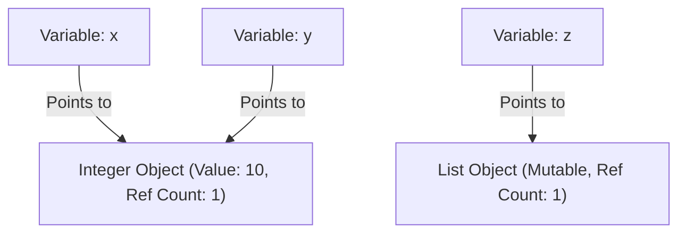
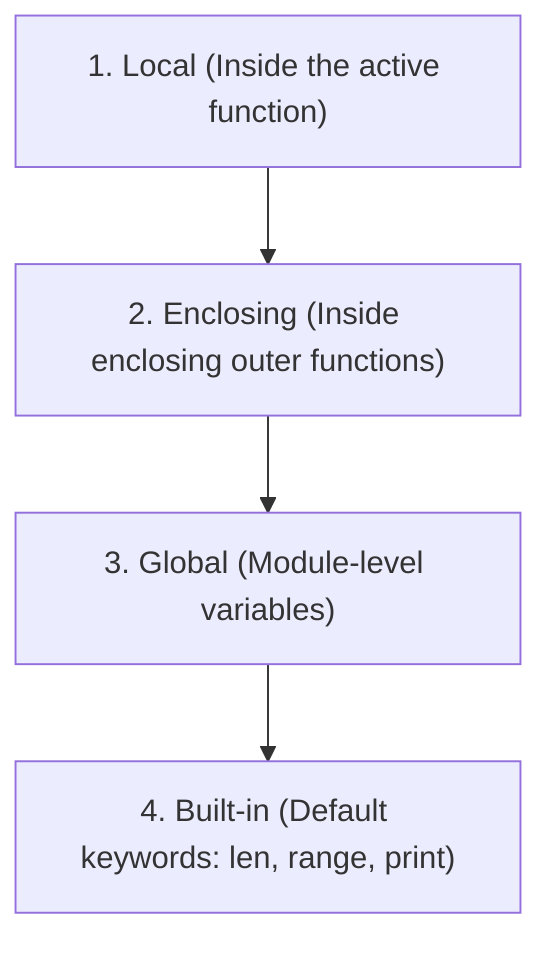

# Part 4: Python Mastery from Scratch

*[← Back to Master Index](/blog/it-career-guide)*

---

## 1. Introduction: Moving Beyond Dynamic Scripting

Many developers view Python as a simple scripting language. They write un-typed code, rely heavily on global state, ignore how variables are managed in memory, and build applications that leak resources and fail under load. If you write Python code like this, you will struggle to build enterprise-grade backend services.

In a professional systems engineering environment, Python is treated with the same architectural rigor as C++ or Java. To build high-performance APIs, distributed systems, and Generative AI microservices in **2026**, you must understand the **CPython runtime engine** from first principles. 

You must master the memory model, reference counting, variable scope (LEGB rule), functional closures, generators that prevent memory saturation, custom decorators with strict static typing, and the enforcement of static type constraints using `mypy`. 

This chapter is your deep-dive guide to transitioning from basic Python scripting to production-grade backend systems engineering.

---

## 2. Python Internals: Memory, References, and mutability

Unlike compiled languages like C or Rust where variables correspond to fixed locations in physical memory, **in Python, variables are merely names bound to objects**.



### A. Everything is an Object
In CPython, every variable, function, class, and value is a structure allocated on the heap (specifically, a `PyObject` C-struct). This struct contains:
1. A reference counter (`ob_refcnt`).
2. A pointer to the object's type structure (`ob_type`).
3. The actual raw value.

Because variables are merely pointers to these heap-allocated objects, assigning `y = x` does not copy the value `10`. It simply binds the name `y` to the **exact same integer object** that `x` points to.

You can verify this using the built-in `id()` function (which returns the memory address of the object) and the `is` operator (which checks if two variables point to the exact same memory address):
```python
x = 10
y = 10
print(x == y)  # True (Checks value equivalence)
print(x is y)  # True (Checks if they point to the exact same object in memory)
```
*Note: CPython pre-allocates and caches small integers (from -5 to 256) to optimize memory speed. If you create numbers in this range, they will always share the same ID.*

### B. Mutability vs. Immutability
Understanding the boundary between mutable and immutable data types is critical for preventing subtle runtime bugs:

- **Immutable Types:** `int`, `float`, `str`, `tuple`, `frozenset`. Once created, their value cannot be modified. If you alter an immutable object, Python generates a brand new object in memory and updates the variable name to point to it:
  ```python
  s = "hello"
  print(id(s))  # Address A
  s += " world"
  print(id(s))  # Address B (A new string was created on the heap!)
  ```
- **Mutable Types:** `list`, `dict`, `set`, `bytearray`. Their contents can be modified in-place without changing their memory address. This can lead to unexpected side effects when variables share references:
  ```python
  list_a = [1, 2, 3]
  list_b = list_a
  list_b.append(4)
  print(list_a)  # Output: [1, 2, 3, 4]! Both variables pointed to the same list.
  ```

---

### C. Reference Counting and Generational Garbage Collection

Python manages heap allocation and deallocation automatically using a dual-system approach:

#### 1. Reference Counting
This is the primary deallocation mechanism. Whenever a name is bound to an object, its `ob_refcnt` increments. When a variable goes out of scope, is deleted (`del`), or is reassigned, the ref count decrements.
```python
import sys

a = [1, 2, 3]
print(sys.getrefcount(a))  # Output: 2 (Name 'a' + argument inside getrefcount)
```
When `ob_refcnt` drops to **exactly zero**, Python immediately deallocates the object's memory back to the system.

#### 2. Generational Garbage Collection (GC)
Reference counting has one massive flaw: **circular references**. If Object A references Object B, and Object B references Object A, their reference counts can never drop to zero, even if they are completely unreachable from your main program code:

```mermaid
graph LR
    objA["Object A"] -->|References| objB["Object B"]
    objB -->|References| objA
    main["Main Program"] -.x|No longer references| objA
```

To resolve this circular memory leak, Python runs a background **Generational Garbage Collector**. It groups objects into three generations (Generation 0, 1, and 2). Newly allocated objects start in Gen 0. 

The GC runs periodic, cyclic audits. Surving objects are promoted to older generations. Because older generations are scanned less frequently, Python optimizes execution speed by focusing collection runs on short-lived objects (which represent the vast majority of temporary variables in standard algorithms).

---

## 3. Advanced Functions & Variable Scope (LEGB Rule)

To design high-quality Python APIs, you must understand variable resolution and local scope. When resolving a variable name, Python searches exactly four namespaces in sequence (the **LEGB Rule**):



If the name is not found in any of these four namespaces, Python raises a `NameError`.

### A. Functional Closures
A **closure** is a nested inner function that retains access to the local variables of its enclosing outer function, even after the outer function has finished executing. Closures are highly useful for factory patterns, data encapsulation, and building decorators.

```python
def make_multiplier(factor: int):
    # Enclosing namespace variable 'factor'
    def multiplier(number: int) -> int:
        # Local namespace uses factor from enclosing
        return number * factor
    return multiplier

double = make_multiplier(2)
triple = make_multiplier(3)

print(double(5))  # 10
print(triple(5))  # 15
```

---

## 4. Metaprogramming: Type-Safe Decorators & Generators

### A. Strict Type-Safe Decorators
A decorator is a function that takes another function as an argument, extends its behavior, and returns a new function. Decorators are heavily used in backend code for logging, timing, validation, and authentication.

When writing production decorators in **2026**, you must preserve the original function's metadata (docstrings, function names) using `@functools.wraps` and enforce strict type safety using `ParamSpec` and `TypeVar` so that static typecheckers like `mypy` can validate arguments.

Here is the industry-standard template for a type-safe database query timing decorator:

```python
import time
import functools
from typing import Callable, ParamSpec, TypeVar

# ParamSpec captures parameter signatures of the decorated function
P = ParamSpec("P")
# TypeVar captures the return type
R = TypeVar("R")

def monitor_query(func: Callable[P, R]) -> Callable[P, R]:
    """A decorator that logs execution time while preserving type safety."""
    @functools.wraps(func)
    def wrapper(*args: P.args, **kwargs: P.kwargs) -> R:
        start_time = time.perf_counter()
        try:
            # Execute original function with captured arguments
            result = func(*args, **kwargs)
            return result
        finally:
            execution_time = time.perf_counter() - start_time
            print(f"⏱️ Query '{func.__name__}' completed in {execution_time:.6f} seconds")
    return wrapper

@monitor_query
def fetch_users_by_role(role: str, limit: int = 10) -> list[str]:
    # Simulate DB latency
    time.sleep(0.05)
    return ["user1", "user2", "user3"][:limit]

# Mypy correctly verifies arguments and return type:
users: list[str] = fetch_users_by_role("admin", limit=2)
```

---

### B. Generators: Absolute Memory Efficiency
In a legacy support role, you might load entire dataset tables into list structures. If you attempt this with a 1-million-row database table in a production system, your container's memory will saturate, triggering an **OOM (Out Of Memory) crash**.

**Generators allow you to process massive data streams in a streaming fashion, using a constant, near-zero memory footprint.** Instead of calculating and storing a massive collection in memory all at once, generators produce items **one-by-one on demand** using the `yield` keyword.

```python
from typing import Generator

def stream_log_records(filepath: str) -> Generator[str, None, None]:
    """Streams lines from a massive log file one-by-one without memory saturation."""
    with open(filepath, "r") as file:
        for line in file:
            # Yield pauses the function execution, returning current line
            yield line.strip()

# Iterating over the generator utilizes a constant memory footprint (O(1) memory)
for record in stream_log_records("production_logs.txt"):
    if "ERROR" in record:
        print(f"⚠️ Flagged anomaly: {record}")
```

---

## 5. Clean Context Managers

A **Context Manager** is used to manage setup and teardown operations, ensuring that external resources (database sessions, network sockets, file pointers) are always closed cleanly, even if your code encounters runtime exceptions.

While the `with open()` pattern is common, you can build custom context managers to handle transaction state locks or connection lifecycles by defining the `__enter__` and `__exit__` magic methods, or by using the `@contextmanager` decorator.

```python
from contextlib import contextmanager
from typing import Generator

class DatabaseConnection:
    def connect(self) -> None: print("🔌 Connected to DB")
    def close(self) -> None: print("🔌 Connection closed safely")
    def execute(self, query: str) -> None: print(f"💾 Executing: {query}")

@contextmanager
def db_transaction_scope(db: DatabaseConnection) -> Generator[DatabaseConnection, None, None]:
    """Ensures database connections are opened and closed safely under any exceptions."""
    db.connect()
    try:
        # Yield control to the 'with' block context
        yield db
    except Exception as e:
        print(f"🚨 Transaction aborted due to exception: {e}")
        raise
    finally:
        # Guarantee teardown execution under any scenario
        db.close()

# Usage:
db_instance = DatabaseConnection()
with db_transaction_scope(db_instance) as conn:
    conn.execute("INSERT INTO users (name) VALUES ('Chirag')")
```

---

## 6. Static Typing with Mypy: Moving to Strict Type Safety

Python is dynamically typed at runtime, but to build robust backend systems, you must configure and enforce **Static Type Checking** in your local and CI/CD pipelines.

Create a `pyproject.toml` or `setup.cfg` file in your project's root folder to configure strict typing options:

```toml
[tool.mypy]
python_version = "3.11"
strict = true
warn_unused_configs = true
disallow_untyped_defs = true
disallow_incomplete_defs = true
no_implicit_optional = true
warn_redundant_casts = true
warn_unused_ignores = true
```

### Static Type Hinting Reference Guide:
```python
from typing import Union, Optional, Callable, Generic, TypeVar

# 1. Complex Types
UserData = dict[str, Union[int, str]]

# 2. Optional Types (Equivalent to Union[str, None])
def get_user_email(user_id: int) -> Optional[str]:
    return "hi@chirag127.in" if user_id == 1 else None

# 3. Callable Types (Functions passed as arguments)
def process_data(data: list[int], transformer: Callable[[int], int]) -> list[int]:
    return [transformer(item) for item in data]

# 4. Generics (Reusable templates)
T = TypeVar("T")

class Repository(Generic[T]):
    def __init__(self) -> None:
        self._store: list[T] = []
        
    def add(self, item: T) -> None:
        self._store.append(item)
```

Run mypy from your terminal to verify type safety:
```bash
mypy src/
```
If you pass arguments of the wrong type, mypy will raise build-time warnings, allowing you to catch bugs before your code ever runs.

---

## 7. TCS Curated Upskilling Resources

Use this curated table to guide your learning inside your corporate portals:

| Platform | Resource Title | Format | Target Skills Covered |
| :--- | :--- | :--- | :--- |
| **Udemy Business** | "100 Days of Code: The Complete Python Pro Bootcamp" by Angela Yu | Video | Comprehensive hands-on fundamentals, object-oriented coding, and syntax mastery |
| **Udemy Business** | "Python Mega Course: Learn Python in 60 Days" by Ardit Sulce | Video | Building practical database connections, automation, and basic logic loops |
| **O'Reilly Learning** | "Fluent Python: Clear, Concise, and Effective Programming" by Luciano Ramalho | Book | The gold-standard book for advanced Python internals, CPython heap structure, descriptors, and metaprogramming |
| **O'Reilly Learning** | "Python Crash Course" (3rd Edition) by Eric Matthes | Book | Rapid setup, clean object-oriented implementations, and data structures from scratch |
| **LinkedIn Learning** | "Advanced Python" by Joe Marini | Video | Metaprogramming, decorators, generator pipelines, and custom collection objects |

---

## 8. Hands-On Practical Lab: Memory-Profiled Pipeline

To consolidate your Python mastery, build a type-safe, memory-profiled pipeline that processes a large stream of records using a generator and a custom timing decorator.

### Step 1: Create the Project Files
```bash
mkdir -p ~/projects/python-lab
cd ~/projects/python-lab
touch pipeline.py
```

### Step 2: Write the Lab Code
Insert the complete, strictly-typed implementation:

```python
import time
import functools
import sys
from typing import Generator, Callable, ParamSpec, TypeVar

P = ParamSpec("P")
R = TypeVar("R")

def monitor_memory_and_time(func: Callable[P, R]) -> Callable[P, R]:
    """Decorator to output execution metrics and memory overhead."""
    @functools.wraps(func)
    def wrapper(*args: P.args, **kwargs: P.kwargs) -> R:
        start_time = time.perf_counter()
        result = func(*args, **kwargs)
        duration = time.perf_counter() - start_time
        
        # Calculate memory overhead of return object if it is a list
        size_kb = 0.0
        if isinstance(result, list):
            size_kb = sys.getsizeof(result) / 1024.0
            
        print(f"⏱️ '{func.__name__}' ran in {duration:.6f}s | Result Memory Overhead: {size_kb:.2f} KB")
        return result
    return wrapper

# 1. Generator function (processes data lazily with O(1) memory)
def generate_raw_user_records(count: int) -> Generator[dict[str, str], None, None]:
    for i in range(1, count + 1):
        yield {
            "id": str(i),
            "username": f"user_profile_{i}",
            "status": "active" if i % 2 == 0 else "inactive"
        }

# 2. Consuming function utilizing decorator
@monitor_memory_and_time
def filter_active_users(records: Generator[dict[str, str], None, None]) -> list[str]:
    active_usernames: list[str] = []
    for record in records:
        if record["status"] == "active":
            active_usernames.append(record["username"])
    return active_usernames

# Step 3: Run the pipeline
if __name__ == "__main__":
    print("🎬 Initializing 10,000 row simulation stream...")
    data_stream = generate_raw_user_records(10000)
    
    # Process the stream
    active_users = filter_active_users(data_stream)
    print(f"✅ Processed stream successfully. Active users compiled: {len(active_users)}")
```

### Step 4: Execute the Code
```bash
python3 pipeline.py
```
Observe the duration and memory footprints. You have successfully designed and executed a type-safe, memory-efficient data processing backend pipeline!

---

*[Proceed to Part 5: Async programming & FastAPI Backend Services →](/blog/it-career-guide/part-05-async-python-fastapi)*

---

### The 2026 IT Career Blueprint Series Navigation

- **[Master Index: The 2026 IT Career Blueprint](/blog/it-career-guide)**
- **Part 1:** [The Blueprint & Escape Plan →](/blog/it-career-guide/part-01-the-blueprint)
- **Part 2:** [Advanced Version Control & Git Mastery →](/blog/it-career-guide/part-02-git-github)
- **Part 3:** [The Elite Developer Toolkit & Workflows →](/blog/it-career-guide/part-03-developer-toolkit)
- **Part 4:** [Python Mastery from Scratch →](/blog/it-career-guide/part-04-python-mastery)
- **Part 5:** [Async programming & FastAPI Backend Services →](/blog/it-career-guide/part-05-async-python-fastapi)
- **Part 6:** [TypeScript & Node.js Backend Ecosystems →](/blog/it-career-guide/part-06-typescript-backend)
- **Part 7:** [Relational Databases & Advanced PostgreSQL →](/blog/it-career-guide/part-07-postgresql)
- **Part 8:** [NoSQL Databases (MongoDB & Redis Caching) →](/blog/it-career-guide/part-08-nosql-databases)
- **Part 9:** [Distributed Systems & Message Queues with Kafka →](/blog/it-career-guide/part-09-distributed-systems-kafka)
- **Part 10:** [System Design Principles & Scalable Architecture →](/blog/it-career-guide/part-10-system-design)
- **Part 11:** [Microservices Architecture Patterns →](/blog/it-career-guide/part-11-microservices)
- **Part 12:** [Docker & Containerization for Backend Developers →](/blog/it-career-guide/part-12-docker)
- **Part 13:** [Kubernetes & Container Orchestration →](/blog/it-career-guide/part-13-kubernetes)
- **Part 14:** [Continuous Integration & Deployment (CI/CD) with GitHub Actions →](/blog/it-career-guide/part-14-cicd)
- **Part 15:** [AWS Cloud & Serverless Architectures →](/blog/it-career-guide/part-15-aws-serverless)
- **Part 16:** [Front-End Mastery: React, Next.js & Client-Side Architectures →](/blog/it-career-guide/part-16-frontend-react)
- **Part 17:** [Generative AI & Large Language Models (LLM) Integration →](/blog/it-career-guide/part-17-genai-llms)
- **Part 18:** [Retrieval-Augmented Generation (RAG) & Vector Databases →](/blog/it-career-guide/part-18-rag-vector-db)
- **Part 19:** [AI Agents & Advanced Workflows with LangGraph →](/blog/it-career-guide/part-19-ai-agents-langgraph)
- **Part 20:** [Enterprise Security, Authentication & OWASP Top 10 →](/blog/it-career-guide/part-20-security-auth)
- **Part 21:** [Comprehensive Testing: Unit, Integration, & E2E Testing →](/blog/it-career-guide/part-21-testing)
- **Part 22:** [Data Structures & Algorithms (DSA) and LeetCode Blueprint →](/blog/it-career-guide/part-22-dsa-leetcode)
- **Part 23:** [Tech Interview Success: System Design & Behavioral STAR Method →](/blog/it-career-guide/part-23-tech-interviews)
- **Part 24:** [Global Remote Jobs and Freelancing Platforms →](/blog/it-career-guide/part-24-global-remote)
- **Part 25:** [Immigration, Visas & Tech Relocation →](/blog/it-nav-immigration-visas)
