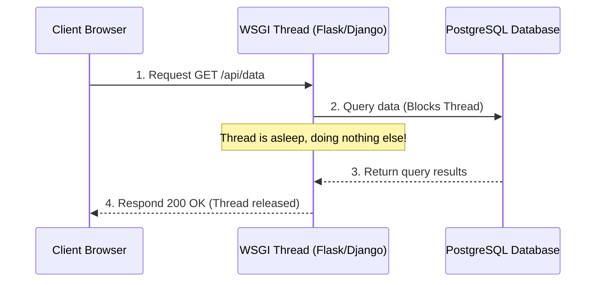
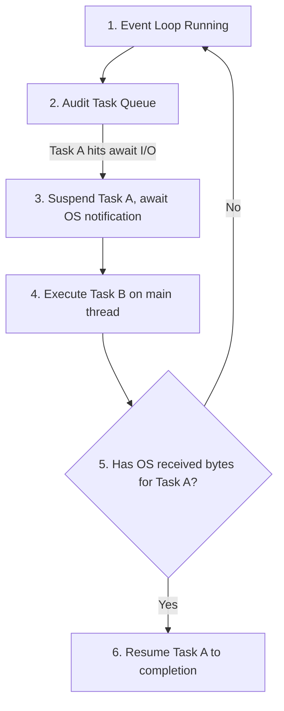

# Part 5: Async Programming & FastAPI Backend Services

*[← Back to Master Index](/blog/it-career-guide)*

---

## 1. Introduction: The High-Concurrency I/O Bottleneck

In traditional web development, frameworks like Django and Flask operate under a **Synchronous, Thread-Per-Request model**. When a user requests data, the web server allocates a dedicated operating system thread to handle the connection. If the backend code needs to execute a database query or fetch data from an external API, the thread halts, blocking execution while waiting for the network card to receive bytes:



If your server receives 1,000 concurrent requests, it must allocate 1,000 physical threads. Because operating system threads are heavy (costing ~8MB of RAM overhead each, along with high CPU context-switching costs), your server will rapidly exhaust its memory and crash.

In **2026**, modern high-throughput backend services are built using **Asynchronous, Event-Driven models**. Frameworks like **FastAPI** run on a single thread utilizing an **Event Loop**. When an I/O operation is triggered, the code releases control, allowing the event loop to handle thousands of other active requests while the network card works in the background.

By mastering asynchronous Python and FastAPI, you can build single-node backend services that handle tens of thousands of concurrent connections with a tiny memory footprint.

---

## 2. The Python Event Loop: Coroutines, Tasks, and Futures

To write async Python, you must understand how the **`asyncio`** library manages scheduling.

### A. The Event Loop Explained
The **Event Loop** is a continuous loop that monitors active tasks, runs them until they hit an I/O block, pauses them, and executes other waiting tasks. When the physical I/O card notifies the operating system that data has arrived, the event loop resumes the paused task to process the result.



### B. Coroutines, Tasks, and Futures
- **Coroutine:** A function defined with the `async def` keyword. Calling a coroutine does not execute it; it returns a **Coroutine Object** that must be scheduled on the event loop.
- **Task:** A wrapper around a coroutine that registers it on the event loop, allowing it to run concurrently.
- **Future:** A low-level object representing an eventual result that is not yet ready.

### C. The Core Rules of Async Python
1. **Always Await Coroutines:** If you call an `async def` function, you must prefix it with the `await` keyword to yield control to the event loop.
2. **Never Block the Event Loop:** You must never run synchronous, CPU-bound operations (like raw `time.sleep()`, heavy mathematical computations, or synchronous file operations) inside an async function. Doing so blocks the single thread, freezing the entire server for all users.
3. **Offloading CPU-bound tasks:** If you must run a CPU-heavy computation, offload it to a thread pool using `asyncio.to_thread()`:
   ```python
   # Correct async offloading of CPU work
   await asyncio.to_thread(heavy_prime_calculation, 1000000)
   ```

---

## 3. Enter FastAPI: The High-Performance Framework

**FastAPI** is a modern, high-speed web framework for building APIs with Python 3.8+ based on standard Python type hints. 

### Why is FastAPI the Industry Standard in 2026?
1. **Incredible Speed:** Built on top of **Starlette** (for web routing) and **Pydantic** (for data validation), its performance is comparable to Go and Node.js.
2. **Automatic Documentation:** It parses your type annotations and automatically generates interactive **OpenAPI/Swagger** documentation interfaces (accessible at `/docs`) out of the box.
3. **Type Safety:** It enforces strict type parsing, catching errors before they reach production.

---

### A. Data Validation with Pydantic v2
Pydantic is the core validation engine of FastAPI. Rebuilt in **Rust** for Pydantic v2, it is up to 10-20x faster than older versions. 

You define your API request and response data payloads using Pydantic **Schemas (Models)**. Pydantic automatically parses input JSON, validates fields, coerces types (e.g., converting the string `"123"` to an integer `123`), and raises clean error messages if validation fails.

```python
from pydantic import BaseModel, EmailStr, Field, field_validator
from datetime import datetime

class CreateUserSchema(BaseModel):
    # Field annotations with constraints
    username: str = Field(min_length=3, max_length=50)
    email: EmailStr
    age: int = Field(gt=18, lt=100)
    created_at: datetime = Field(default_factory=datetime.utcnow)

    # Custom field validator
    @field_validator("username")
    @classmethod
    def validate_username_chars(cls, value: str) -> str:
        if not value.isalnum():
            raise ValueError("Username must be alphanumeric.")
        return value
```

---

### B. Dependency Injection using `Annotated`
FastAPI features a highly powerful **Dependency Injection (DI)** system. Dependencies are functions that execute before your endpoint, resolving configurations, verifying database sessions, or validating security permissions.

Modern FastAPI uses the standard Python **`Annotated`** keyword, which improves type safety, readability, and compatibility with standard linters.

```python
from typing import Annotated
from fastapi import Depends, Header, HTTPException

# 1. Dependency function to verify API key
async def verify_api_token(x_api_token: Annotated[str, Header()]) -> str:
    if x_api_token != "super_secure_enterprise_secret":
        raise HTTPException(status_code=401, detail="Unauthorized API Token.")
    return x_api_token

# 2. Endpoint utilizing the dependency
@app.get("/api/secure-metrics")
async def read_metrics(token: Annotated[str, Depends(verify_api_token)]):
    return {"status": "success", "token_verified": True}
```

---

## 4. Production Project Directory Architecture

To transition to an enterprise backend role, you must structure your codebase using modular, clean architecture conventions. Do not dump all code into a single `main.py` file. Follow this industry-standard folder taxonomy:

```text
src/
├── main.py                 # Application bootstrapper and lifecycle events
├── config.py               # Settings and env variables using Pydantic-Settings
├── dependencies.py         # Global dependency injections (DB, Auth)
├── routers/
│   ├── __init__.py
│   ├── users.py            # Route controllers for users domain
│   └── metrics.py          # Route controllers for metrics domain
├── schemas/
│   ├── __init__.py
│   └── users.py            # Pydantic request/response schemas
└── services/
    ├── __init__.py
    └── db_connector.py     # Asynchronous database connection logic
```

---

## 5. TCS Curated Upskilling Resources

Use this curated table to guide your upskilling inside your corporate portals:

| Platform | Resource Title | Format | Target Skills Covered |
| :--- | :--- | :--- | :--- |
| **Udemy Business** | "FastAPI - The Complete Course (Novice to Advanced)" by Eric Roby | Video | FastAPI endpoints, routing, Pydantic validation, dependencies, database sessions, and JWT auth |
| **O'Reilly Learning** | "Building Data-Intensive Applications with FastAPI" | Book | Architectural design, structuring async database connections (SQLAlchemy Async), and middleware |
| **O'Reilly Learning** | "Python Concurrency with asyncio" by Matthew Fowler | Book | Deep-dive CPython event loop internals, task execution, futures, and thread-pool offloading |
| **LinkedIn Learning** | "Building RESTful APIs with Python" | Video | Basic REST structures, HTTP codes, and automatic routing configurations |
| **Official Docs** | [FastAPI Interactive Documentation](https://fastapi.tiangolo.com/) | Web Guide | Excellent step-by-step documentation detailing modern path operations, settings, and OAuth2 setups |

---

## 6. Hands-On Practical Lab: Asynchronous Diagnostic API

To consolidate your mastery, build a complete, production-ready, asynchronous diagnostic metrics API with Pydantic v2, dependency injection, simulated database delays, and custom exception routing.

### Step 1: Create the Lab Files
```bash
mkdir -p ~/projects/fastapi-lab/src/routers
mkdir -p ~/projects/fastapi-lab/src/schemas
cd ~/projects/fastapi-lab
touch src/main.py
touch src/schemas/metrics.py
touch src/routers/metrics.py
```

### Step 2: Write the Schema (`src/schemas/metrics.py`)
```python
from pydantic import BaseModel, Field

class DiagnosticRequestSchema(BaseModel):
    service_name: str = Field(min_length=2, max_length=100)
    cpu_utilization: float = Field(ge=0.0, le=100.0)
    memory_utilization: float = Field(ge=0.0, le=100.0)
    active_connections: int = Field(ge=0)

class DiagnosticResponseSchema(BaseModel):
    id: str
    service_name: str
    status: str
    active_connections: int
    alert_triggered: bool
```

### Step 3: Write the Router (`src/routers/metrics.py`)
```python
import asyncio
import uuid
from typing import Annotated
from fastapi import APIRouter, Depends, HTTPException
from src.schemas.metrics import DiagnosticRequestSchema, DiagnosticResponseSchema

router = APIRouter(prefix="/api/diagnostics", tags=["Diagnostics"])

# Dependency to check database availability (simulated async connection)
async def check_db_health() -> bool:
    await asyncio.sleep(0.02)  # Non-blocking simulated DB latency
    return True

@router.post("/evaluate", response_model=DiagnosticResponseSchema)
async def evaluate_metrics(
    payload: DiagnosticRequestSchema,
    db_healthy: Annotated[bool, Depends(check_db_health)]
) -> dict:
    if not db_healthy:
        raise HTTPException(status_code=503, detail="Database unavailable.")
    
    # Non-blocking latency simulation (representing write pipeline)
    await asyncio.sleep(0.05)
    
    # Determine alert trigger threshold
    alert = payload.cpu_utilization > 85.0 or payload.memory_utilization > 90.0
    status = "critical" if alert else "healthy"
    
    return {
        "id": str(uuid.uuid4()),
        "service_name": payload.service_name,
        "status": status,
        "active_connections": payload.active_connections,
        "alert_triggered": alert
    }
```

### Step 4: Write the Bootstrapper (`src/main.py`)
```python
from fastapi import FastAPI, Request
from fastapi.responses import JSONResponse
from src.routers.metrics import router as metrics_router

app = FastAPI(
    title="Async Enterprise Diagnostics API",
    description="Production-grade asynchronous monitoring service.",
    version="1.0.0"
)

# Custom exception handler for cleaner global errors
@app.exception_handler(Exception)
async def global_exception_handler(request: Request, exc: Exception):
    return JSONResponse(
        status_code=500,
        content={"detail": "Internal system failure.", "error_class": str(exc.__class__.__name__)}
    )

app.include_router(metrics_router)

if __name__ == "__main__":
    import uvicorn
    # Start the event-driven ASGI server
    uvicorn.run("src.main:app", host="127.0.0.1", port=8000, reload=True)
```

### Step 5: Test the API Locally
1. Run the application:
   ```bash
   uv run uvicorn src.main:app --reload
   ```
2. Open your web browser and navigate to `http://127.0.0.1:8000/docs`. You will see the interactive Swagger UI.
3. Use `httpie` or the Swagger UI to send a test request:
   ```bash
   http POST http://127.0.0.1:8000/api/diagnostics/evaluate service_name="SAP CPQ Integration Server" cpu_utilization=92.5 memory_utilization=40.0 active_connections=500
   ```
4. Observe the formatted JSON response and fast execution time:
   ```json
   {
       "id": "a5e9b8c7-...",
       "service_name": "SAP CPQ Integration Server",
       "status": "critical",
       "active_connections": 500,
       "alert_triggered": true
   }
   ```

You have successfully built, structured, and executed an asynchronous, high-concurrency, strictly-typed production API!

---

*[Proceed to Part 6: TypeScript & Node.js Backend Ecosystems →](/blog/it-career-guide/part-06-typescript-backend)*

---

### The 2026 IT Career Blueprint Series Navigation

- **[Master Index: The 2026 IT Career Blueprint](/blog/it-career-guide)**
- **Part 1:** [The Blueprint & Escape Plan →](/blog/it-career-guide/part-01-the-blueprint)
- **Part 2:** [Advanced Version Control & Git Mastery →](/blog/it-career-guide/part-02-git-github)
- **Part 3:** [The Elite Developer Toolkit & Workflows →](/blog/it-career-guide/part-03-developer-toolkit)
- **Part 4:** [Python Mastery from Scratch →](/blog/it-career-guide/part-04-python-mastery)
- **Part 5:** [Async programming & FastAPI Backend Services →](/blog/it-career-guide/part-05-async-python-fastapi)
- **Part 6:** [TypeScript & Node.js Backend Ecosystems →](/blog/it-career-guide/part-06-typescript-backend)
- **Part 7:** [Relational Databases & Advanced PostgreSQL →](/blog/it-career-guide/part-07-postgresql)
- **Part 8:** [NoSQL Databases (MongoDB & Redis Caching) →](/blog/it-career-guide/part-08-nosql-databases)
- **Part 9:** [Distributed Systems & Message Queues with Kafka →](/blog/it-career-guide/part-09-distributed-systems-kafka)
- **Part 10:** [System Design Principles & Scalable Architecture →](/blog/it-career-guide/part-10-system-design)
- **Part 11:** [Microservices Architecture Patterns →](/blog/it-career-guide/part-11-microservices)
- **Part 12:** [Docker & Containerization for Backend Developers →](/blog/it-career-guide/part-12-docker)
- **Part 13:** [Kubernetes & Container Orchestration →](/blog/it-career-guide/part-13-kubernetes)
- **Part 14:** [Continuous Integration & Deployment (CI/CD) with GitHub Actions →](/blog/it-career-guide/part-14-cicd)
- **Part 15:** [AWS Cloud & Serverless Architectures →](/blog/it-career-guide/part-15-aws-serverless)
- **Part 16:** [Front-End Mastery: React, Next.js & Client-Side Architectures →](/blog/it-career-guide/part-16-frontend-react)
- **Part 17:** [Generative AI & Large Language Models (LLM) Integration →](/blog/it-career-guide/part-17-genai-llms)
- **Part 18:** [Retrieval-Augmented Generation (RAG) & Vector Databases →](/blog/it-career-guide/part-18-rag-vector-db)
- **Part 19:** [AI Agents & Advanced Workflows with LangGraph →](/blog/it-career-guide/part-19-ai-agents-langgraph)
- **Part 20:** [Enterprise Security, Authentication & OWASP Top 10 →](/blog/it-career-guide/part-20-security-auth)
- **Part 21:** [Comprehensive Testing: Unit, Integration, & E2E Testing →](/blog/it-career-guide/part-21-testing)
- **Part 22:** [Data Structures & Algorithms (DSA) and LeetCode Blueprint →](/blog/it-career-guide/part-22-dsa-leetcode)
- **Part 23:** [Tech Interview Success: System Design & Behavioral STAR Method →](/blog/it-career-guide/part-23-tech-interviews)
- **Part 24:** [Global Remote Jobs and Freelancing Platforms →](/blog/it-career-guide/part-24-global-remote)
- **Part 25:** [Immigration, Visas & Tech Relocation →](/blog/it-career-guide/part-25-immigration-visas)
