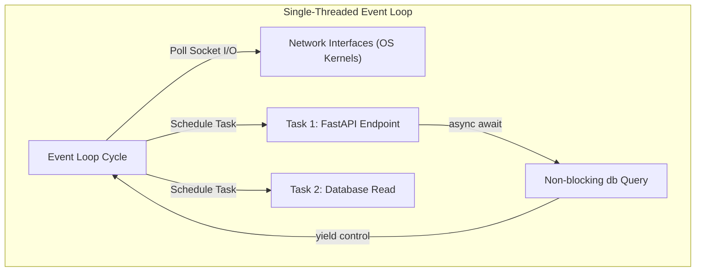

# Part 5: Async Programming & FastAPI Backend Services

*[← Back to Master Index](/blog/it-career-guide)*

---

## 1. Core Concept Refresher: Blocking I/O vs. Asynchronous Concurrency

Most traditional web servers (like Django or Flask) handle concurrent requests using a **Thread Pool**. Every incoming HTTP request is assigned a separate operating system thread. If the request needs to query a database, call an external API, or read a file, the thread **blocks**—sitting completely idle while waiting for the operating system to complete the physical network or disk input/output (I/O) operation.

This multi-threaded model has massive performance bottlenecks:
*   **Operating System Overhead:** Threads are heavy. Each thread consumes ~8MB of virtual memory. Spawning thousands of threads to handle concurrent users consumes gigabytes of memory.
*   **Context Switching Latency:** The operating system CPU must constantly switch execution focus between active threads, incurring high system overhead.

---

### Asynchronous Non-Blocking Concurrency
Asynchronous Python (`asyncio`) solves this by running on a **Single-Threaded Event Loop**:



*   Instead of blocking, when a task performs a network or disk operation, it explicitly **yields execution control** back to the Event Loop using the `await` keyword.
*   The single-threaded event loop continues to execute other active tasks concurrently.
*   When the physical network interface or kernel signals that the network operation has completed, the Event Loop schedules the suspended task to resume execution.
*   This enables a single Python process running on a single CPU core to handle tens of thousands of concurrent network connections using virtually zero extra memory overhead.

---

## 2. Under the Hood of Asyncio: Coroutines, Tasks & cooperative Multitasking

To write high-performance asynchronous systems, you must understand the core abstractions of the CPython `asyncio` library:

1.  **Coroutines:** Functions defined with the `async def` keyword. Calling a coroutine does *not* execute it. Instead, it returns a **Coroutine Object** that must be registered with the Event Loop using `await` or `asyncio.create_task()`.
2.  **Futures:** Low-level objects representing the eventual result of an asynchronous operation. A future starts in a 'Pending' state and eventually transitions to 'Finished' or 'Failed' when the operation returns data.
3.  **Tasks:** A high-level wrapper around a coroutine. Spawning a task (`asyncio.create_task(coro)`) registers it with the Event Loop, allowing it to execute concurrently.
4.  **Cooperative Multitasking:** Asynchronous Python relies entirely on cooperation. If a task contains blocking synchronous code (such as `time.sleep(5)` or a synchronous database query `requests.get()`), it will **block the entire event loop**, starving all other concurrent tasks. You must use non-blocking libraries (such as `asyncio.sleep()`, `httpx` instead of `requests`, and `asyncpg` instead of `psycopg2`).

---

## 3. Developing High-Performance FastAPI Services

**FastAPI** has emerged as the premier Python backend framework for high-performance microservices, machine learning gateways, and AI-native platforms. Built on top of **Starlette** (ASGI) and **Pydantic** (data validation), it enforces strict typing and modern asynchronous practices natively.

---

### ASGI (Asynchronous Server Gateway Interface) vs. WSGI
*   **WSGI (Web Server Gateway Interface):** The legacy standard (Gunicorn, uWSGI) built for synchronous, blocking, single-request-per-thread execution models.
*   **ASGI (Asynchronous Server Gateway Interface):** The modern standard (Uvicorn, Hypercorn) designed to handle concurrent asynchronous protocols like WebSockets, Server-Sent Events (SSE), and long-lived HTTP requests natively.

---

### Key Enterprise FastAPI Design Patterns

#### 1. Strictly Validated Pydantic v2 Request Pipelines:
Request bodies, path parameters, and query parameters are dynamically parsed, sanitized, and validated using strictly typed Pydantic models, guaranteeing that no corrupt payloads reach your database layers.

```python
from pydantic import BaseModel, EmailStr, Field

class UserSignupRequest(BaseModel):
    email: EmailStr
    password: str = Field(min_length=8, max_length=64)
    age: int = Field(gt=18, lt=100)
```

#### 2. Advanced Dependency Injection (DI) Graphs:
FastAPI features a highly modular Dependency Injection framework (`Depends`). This allows you to write decoupled, testable components, cleanly injecting database sessions, security tokens, or AI client wrappers:

```python
from fastapi import Depends, HTTPException, status
from fastapi.security import OAuth2PasswordBearer
from typing import AsyncGenerator

oauth2_scheme = OAuth2PasswordBearer(tokenUrl="token")

async def get_db() -> AsyncGenerator[Database, None]:
    db = DatabaseSession()
    try:
        yield db
    finally:
        await db.close()

async def get_current_user(
    token: str = Depends(oauth2_scheme), 
    db: Database = Depends(get_db)
) -> User:
    user = await db.fetch_user_by_token(token)
    if not user:
        raise HTTPException(
            status_code=status.HTTP_401_UNAUTHORIZED, 
            detail="Invalid Session Token"
        )
    return user
```

---

## 4. Part 5 Master Resource Directory: Async Python & FastAPI (30 Curated Resources)

Below is the definitive, prioritized resource collection to master asynchronous event loop execution, ASGI servers setups, Pydantic validations, and secure API routers:

---

### Sub-Topic A: Asyncio Event Loop & Concurrent I/O

#### 1. Python Concurrency with asyncio video course
*   **Direct URL:** https://www.udemy.com/course/python-concurrency-with-asyncio/
*   **Search Identification:** Search Udemy for: `"Python Concurrency with asyncio" (Instructor: Matthew Fowler)`
*   **Resource Type:** Video Course
*   **Access / Price:** Paid (Included in TCS Udemy Business)
*   **Status:** Required (Non-Negotiable)
*   **Description:** Deep visual video training on coroutines, task scheduling, event loop internals, exception handling, and concurrent I/O.
*   **Mutual Exclusivity Mapping:** If you take this, you can skip LinkedIn's *Asynchronous Programming* as Matthew Fowler covers task exceptions patterns with deeper structural context.

#### 2. Asynchronous Programming in Python
*   **Direct URL:** https://www.linkedin.com/learning/asynchronous-programming-in-python
*   **Search Identification:** Search LinkedIn Learning for: `"Asynchronous Programming in Python"`
*   **Resource Type:** Video Course
*   **Access / Price:** Paid (Included in TCS Enterprise Account)
*   **Status:** Alternative to: *Python Concurrency with asyncio video course* (Choose either to fulfill this module).
*   **Description:** Conceptual introduction to futures, non-blocking standard inputs/outputs, and event loop lifecycles.
*   **Mutual Exclusivity Mapping:** Shorter structural video alternative.

#### 3. Real Python Asynchronous Track
*   **Direct URL:** https://realpython.com/learning-paths/python-concurrency-asyncio/
*   **Search Identification:** Search Google/Web for: `"Real Python Asynchronous tutorials path"`
*   **Resource Type:** Written Publication & Reference
*   **Access / Price:** 100% Free
*   **Status:** Required
*   **Description:** Exceptional written diagnostic guides detailing async task creation, waiting gates, and loop profiling.
*   **Mutual Exclusivity Mapping:** Essential written reference for event loop mechanics.

#### 4. HTTPX Official Asynchronous Docs
*   **Direct URL:** https://www.python-httpx.org/
*   **Search Identification:** Search Web for: `"HTTPX async client documentation"`
*   **Resource Type:** Written Reference / Documentation
*   **Access / Price:** 100% Free
*   **Status:** Required
*   **Description:** Manual explaining how to perform non-blocking HTTP requests concurrently using `httpx.AsyncClient`.
*   **Mutual Exclusivity Mapping:** Gold standard library reference for async requests.

#### 5. Asyncio Official Library Manual
*   **Direct URL:** https://docs.python.org/3/library/asyncio.html
*   **Search Identification:** Search Web for: `"Python standard library asyncio reference docs"`
*   **Resource Type:** Written Reference / Documentation
*   **Access / Price:** 100% Free
*   **Status:** Optional
*   **Description:** Complete low-level standard docs mapping transport, protocol, and loop policies.
*   **Mutual Exclusivity Mapping:** Supplemental core reference guide.

---

### Sub-Topic B: Starlette ASGI Routing & Frameworks

#### 6. FastAPI — The Complete Course (Beginner + Advanced)
*   **Direct URL:** https://www.udemy.com/course/fastapi-the-complete-course-2024/
*   **Search Identification:** Search Udemy for: `"FastAPI Complete Course" (Instructor: Eric Roby)`
*   **Resource Type:** Video Course
*   **Access / Price:** Paid (Included in TCS Udemy Business)
*   **Status:** Required (Non-Negotiable)
*   **Description:** High-value RESTful API development: request parameters mapping, route decorators, schemas, database integrations, and dockerizing backends.
*   **Mutual Exclusivity Mapping:** If you take this, you can skip Stefan's *FastAPI Mastery* on Udemy as Eric Roby covers Postgres integrations with wider functional layouts.

#### 7. FastAPI Mastery: Build Modern APIs with Python
*   **Direct URL:** https://www.udemy.com/course/fastapi-mastery/
*   **Search Identification:** Search Udemy for: `"FastAPI Mastery" (Instructor: Catalin Stefan)`
*   **Resource Type:** Video Course
*   **Access / Price:** Paid (Included in TCS Udemy Business)
*   **Status:** Alternative to: *FastAPI — The Complete Course*.
*   **Description:** Focuses on dynamic routing, custom middleware configurations, and file uploads.
*   **Mutual Exclusivity Mapping:** Video alternative. Choose if you prefer Catalin Stefan's concise structure.

#### 8. FastAPITutorial.com - Browser Playground IDE
*   **Direct URL:** https://fastapitutorial.com/
*   **Search Identification:** Search Web for: `"FastAPI Tutorial online in browser IDE"`
*   **Resource Type:** Interactive Coding Sandbox
*   **Access / Price:** 100% Free
*   **Status:** Required
*   **Description:** Visual, in-browser sandbox where you write API routes, compile servers, and check responses without local configs.
*   **Mutual Exclusivity Mapping:** Standard playground tool.

#### 9. FastAPI Official Interactive Documentation
*   **Direct URL:** https://fastapi.tiangolo.com/
*   **Search Identification:** Search Google/Web for: `"FastAPI official documentation tutorial"`
*   **Resource Type:** Written Reference / Documentation
*   **Access / Price:** 100% Free
*   **Status:** Required
*   **Description:** Renowned as one of the best designed, most complete tech documentations globally.
*   **Mutual Exclusivity Mapping:** Standard baseline guide.

#### 10. Web Development with FastAPI
*   **Direct URL:** https://www.linkedin.com/learning/fastapi-web-development-with-python
*   **Search Identification:** Search LinkedIn Learning for: `"FastAPI Web Development with Python"`
*   **Resource Type:** Video Course
*   **Access / Price:** Paid (Included in TCS Enterprise Account)
*   **Status:** Optional
*   **Description:** High-efficiency introductory checklist for routing and inputs mapping.
*   **Mutual Exclusivity Mapping:** Optional certification path.

---

### Sub-Topic C: Pydantic v2 Schema Declarations

#### 11. Data Validation in Python with Pydantic v2
*   **Direct URL:** https://www.linkedin.com/learning/data-validation-in-python-with-pydantic-v2
*   **Search Identification:** Search LinkedIn Learning for: `"Data Validation in Python with Pydantic v2"`
*   **Resource Type:** Video Course
*   **Access / Price:** Paid (Included in TCS Enterprise Account)
*   **Status:** Required (Non-Negotiable)
*   **Description:** Video series explaining how to declare strictly typed models, write custom field validators, nest configurations, and serialize outputs.
*   **Mutual Exclusivity Mapping:** If you complete this, you can skip *Strict Type-Safe API Validation Masterclass* as this course details dynamic model serialization with more context.

#### 12. Strict Type-Safe API Validation Masterclass
*   **Direct URL:** https://www.udemy.com/course/pydantic-data-validation/
*   **Search Identification:** Search Udemy for: `"Pydantic Data Validation"`
*   **Resource Type:** Video Course
*   **Access / Price:** Paid (Included in TCS Udemy Business)
*   **Status:** Alternative to: *Data Validation in Python with Pydantic v2*.
*   **Description:** Detailed focus on model errors mapping, custom types, and JSON parsing.
*   **Mutual Exclusivity Mapping:** Video alternative. Choose if you prefer Udemy's course layout.

#### 13. Pydantic v2 Official Documentation
*   **Direct URL:** https://docs.pydantic.dev/latest/
*   **Search Identification:** Search Web for: `"Pydantic v2 official library guide"`
*   **Resource Type:** Written Reference / Documentation
*   **Access / Price:** 100% Free
*   **Status:** Required
*   **Description:** Complete guide to validators, performance benches, and schema integrations.
*   **Mutual Exclusivity Mapping:** Standard library schema reference.

#### 14. Strict Type Hints in Python (PEP 484)
*   **Direct URL:** https://peps.python.org/pep-0484/
*   **Search Identification:** Search Web for: `"PEP 484 standard type hints Python"`
*   **Resource Type:** Written Reference
*   **Access / Price:** 100% Free
*   **Status:** Required
*   **Description:** Standard specs for structural typing mapping.
*   **Mutual Exclusivity Mapping:** Standard PEP specs index.

#### 15. Mypy Static Type Validation Sandbox
*   **Direct URL:** https://mypy-play.net/
*   **Search Identification:** Search Web for: `"mypy play playground online compiler"`
*   **Resource Type:** Interactive Coding Sandbox
*   **Access / Price:** 100% Free
*   **Status:** Optional
*   **Description:** Online type check playgrounds.
*   **Mutual Exclusivity Mapping:** Supplemental static checking simulator.

---

### Sub-Topic D: Asynchronous Databases & ORMs

#### 16. Asynchronous Database Operations with SQLAlchemy
*   **Direct URL:** https://www.udemy.com/course/sqlalchemy-async/
*   **Search Identification:** Search Udemy for: `"SQLAlchemy Async" (Instructor: Fred Baptiste)`
*   **Resource Type:** Video Course
*   **Access / Price:** Paid (Included in TCS Udemy Business)
*   **Status:** Required (Non-Negotiable)
*   **Description:** Video training configuring `create_async_engine`, managing async ORM sessions, handling migrations via Alembic, and performance tuning.
*   **Mutual Exclusivity Mapping:** If you take this, you can skip the LinkedIn *Database Integrations* course as Fred Baptiste covers async transactions with more code.

#### 17. Database Integrations in FastAPI Systems
*   **Direct URL:** https://www.linkedin.com/learning/database-integrations-in-fastapi
*   **Search Identification:** Search LinkedIn Learning for: `"Database Integrations in FastAPI"`
*   **Resource Type:** Video Course
*   **Access / Price:** Paid (Included in TCS Enterprise Account)
*   **Status:** Alternative to: *Asynchronous Database Operations with SQLAlchemy*.
*   **Description:** Focuses on pg database pools, raw async queries, and error wrappers.
*   **Mutual Exclusivity Mapping:** Select this if you prefer LinkedIn Learning's short certification segments.

#### 18. Asyncpg (Fastest PostgreSQL Client) Manual
*   **Direct URL:** https://magicstack.github.io/asyncpg/current/
*   **Search Identification:** Search Web/GitHub for: `"magicstack asyncpg"`
*   **Resource Type:** Code Library & Written Reference
*   **Access / Price:** 100% Free
*   **Status:** Required
*   **Description:** Official manual detailing structural binary protocol mappings and connection pooling configurations.
*   **Mutual Exclusivity Mapping:** Core Postgres raw driver library.

#### 19. Alembic Database Migrations Guide
*   **Direct URL:** https://alembic.sqlalchemy.org/en/latest/
*   **Search Identification:** Search Web for: `"Alembic database migrations reference guide"`
*   **Resource Type:** Written Reference / Documentation
*   **Access / Price:** 100% Free
*   **Status:** Required
*   **Description:** Detailed reference on how to structure, version, and execute database revisions.
*   **Mutual Exclusivity Mapping:** Standard database migration tracker.

#### 20. SQLAlchemy Asyncio ORM Extensions Docs
*   **Direct URL:** https://docs.sqlalchemy.org/en/20/orm/extensions/asyncio.html
*   **Search Identification:** Search Web for: `"SQLAlchemy async extensions ORM documentation"`
*   **Resource Type:** Written Reference
*   **Access / Price:** 100% Free
*   **Status:** Optional
*   **Description:** Complete standard specifications for async engines.
*   **Mutual Exclusivity Mapping:** Standard extension index.

---

### Sub-Topic E: JWT Security & Stateless API Auth

#### 21. Stateless JWT Security & Token Authorization
*   **Direct URL:** https://www.udemy.com/course/jwt-token-authentication-python/
*   **Search Identification:** Search Udemy for: `"JWT Token Authentication Python" (Instructor: Catalin Stefan)`
*   **Resource Type:** Video Course
*   **Access / Price:** Paid (Included in TCS Udemy Business)
*   **Status:** Required (Non-Negotiable)
*   **Description:** Video guide implementing cryptographically signed JSON Web Tokens (JWT), setting session expirations, decoding payloads, and CORS configurations.
*   **Mutual Exclusivity Mapping:** If you complete this, you can skip LinkedIn's *API Security* course as Catalin Stefan covers actual JWT payload signing with deeper code walks.

#### 22. API Security and OAuth2 PKCE Patterns
*   **Direct URL:** https://www.linkedin.com/learning/api-security-and-oauth2-pkce
*   **Search Identification:** Search LinkedIn Learning for: `"API Security and OAuth2 PKCE"`
*   **Resource Type:** Video Course
*   **Access / Price:** Paid (Included in TCS Enterprise Account)
*   **Status:** Alternative to: *Stateless JWT Security & Token Authorization*.
*   **Description:** Talk-based video guide to secure client credentials and user authentication schemes.
*   **Mutual Exclusivity Mapping:** Select this if you prefer a conceptual/protocol-level security walk.

#### 23. OAuth 2.0 Security Best Current Practices
*   **Direct URL:** https://oauth.net/2/
*   **Search Identification:** Search Web for: `"OAuth 2.0 official standard protocols"`
*   **Resource Type:** Written Reference
*   **Access / Price:** 100% Free
*   **Status:** Required
*   **Description:** Industry-standard security specifications for stateless tokens.
*   **Mutual Exclusivity Mapping:** Standard baseline protocol.

#### 24. PyJWT Official Encryption Reference
*   **Direct URL:** https://pyjwt.readthedocs.io/en/stable/
*   **Search Identification:** Search Web for: `"PyJWT official documentation guide"`
*   **Resource Type:** Written Reference / Documentation
*   **Access / Price:** 100% Free
*   **Status:** Required
*   **Description:** Manual for coding and decoding JSON Web Tokens natively in Python.
*   **Mutual Exclusivity Mapping:** Core JWT parsing library.

#### 25. OWASP Top 10 API Security Risks
*   **Direct URL:** https://owasp.org/www-project-api-security/
*   **Search Identification:** Search Web for: `"OWASP Top 10 API security risks guidelines"`
*   **Resource Type:** Written Reference
*   **Access / Price:** 100% Free
*   **Status:** Optional
*   **Description:** Structural vulnerability checklists for securing endpoints from injection and breach.
*   **Mutual Exclusivity Mapping:** Standard vulnerability index.

---

### Sub-Topic F: Advanced API Testing & Mocking in Pytest

#### 26. Testing Python Code with pytest
*   **Direct URL:** https://www.linkedin.com/learning/testing-python-code-with-pytest
*   **Search Identification:** Search LinkedIn Learning for: `"Testing Python Code with pytest" (Instructor: Dave Astels)`
*   **Resource Type:** Video Course
*   **Access / Price:** Paid (Included in TCS Enterprise Account)
*   **Status:** Required (Non-Negotiable)
*   **Description:** Teaches how to write pytest assertions, use fixtures to manage state, organize test suites, and mock network calls.
*   **Mutual Exclusivity Mapping:** If you complete this, you can skip O'Reilly's *Python Testing with pytest* book stream as this course covers base API testing with more interactive video layouts.

#### 27. Python Testing with pytest (O'Reilly Book Stream)
*   **Direct URL:** https://www.oreilly.com/library/view/python-testing-with/9781680509618/
*   **Search Identification:** Search O'Reilly for: `"Python Testing with pytest" (Author: Brian Okken)`
*   **Resource Type:** Book
*   **Access / Price:** Paid (Included in TCS O'Reilly Enterprise benefit)
*   **Status:** Alternative to: *Testing Python Code with pytest*.
*   **Description:** The written bible on pytest, covering parametrized testing, custom plugins, and fixtures hierarchies.
*   **Mutual Exclusivity Mapping:** Book alternative. Choose if you prefer comprehensive text reference.

#### 28. Advanced Testing in FastAPI with Mocking
*   **Direct URL:** https://www.udemy.com/course/fastapi-testing/
*   **Search Identification:** Search Udemy for: `"FastAPI Testing with Pytest"`
*   **Resource Type:** Video Course
*   **Access / Price:** Paid (Included in TCS Udemy Business)
*   **Status:** Required
*   **Description:** Explains how to set up `TestClient` in FastAPI, mock database sessions dynamically, inject fake clients, and compute test coverages.
*   **Mutual Exclusivity Mapping:** Essential course for testing async ASGI routing gateways.

#### 29. Pytest Official Documentation and Plugins
*   **Direct URL:** https://docs.pytest.org/en/stable/
*   **Search Identification:** Search Web for: `"pytest official documentation guide"`
*   **Resource Type:** Written Reference / Documentation
*   **Access / Price:** 100% Free
*   **Status:** Required
*   **Description:** Core library reference for assertions, configuration parameters, and fixtures.
*   **Mutual Exclusivity Mapping:** Standard testing framework reference.

#### 30. pytest-asyncio: Asynchronous Testing in Python
*   **Direct URL:** https://github.com/pytest-dev/pytest-asyncio
*   **Search Identification:** Search GitHub for: `"pytest-dev pytest-asyncio"`
*   **Resource Type:** Code Library & Written Reference
*   **Access / Price:** 100% Free
*   **Status:** Optional
*   **Description:** A specialized plugin enabling seamless async tests using event loops.
*   **Mutual Exclusivity Mapping:** Custom async testing utility.

---

## 5. Hands-On Portfolio Lab Project: Async Telemetry Ingestion API & Secure JWT Router

To demonstrate your enterprise-grade async backend, static typing, database pooling, and API gateway security skills, you must construct a **High-Performance Async Telemetry Ingestion Service**.

### The Lab Project Guidelines:
1.  **Strict Async ASGI Gateway:** Create a FastAPI backend containing a POST endpoint `/telemetry/submit`.
2.  **Pydantic Input Sanitization:** Validate incoming telemetry payloads containing:
    *   `device_id`: A UUID string.
    *   `cpu_load`: Float value between 0.0 and 1.0.
    *   `memory_usage`: Float value between 0.0 and 1.0.
    *   `metrics`: Nested dictionary of strings.
3.  **Non-Blocking Async Client Operations:** Inside the endpoint, use `httpx.AsyncClient` to asynchronously forward the validated JSON payload to a mock central metrics server (e.g. `http://localhost:8080/metrics`). You must fully `await` this call asynchronously, preventing main thread blockages.
4.  **Secure JWT Authentication Guard:**
    *   Implement an OAuth2 request flow verifying bearer tokens.
    *   Secure the `/telemetry/submit` route so it blocks calls unless a valid, local cryptographic signature JWT is provided in headers.
    *   Commit the code to your public `2026-upskilling-roadmap` repository.

---

## 6. Technical Interview Self-Assessment

Use these questions to verify if you have successfully digested the principles of this async backend chapter:

| Concept | High-Frequency Interview Question | Expected Technical Answer Framework |
| :--- | :--- | :--- |
| **Blocking Event Loop** | What happens if you run a synchronous, blocking request like `requests.get()` inside an `async def` FastAPI endpoint? | It will completely block the single thread of the Event Loop. As a result, the Event Loop will freeze and cannot schedule or execute any other concurrent tasks, causing the entire backend to appear completely unresponsive to all other users. |
| **WSGI vs ASGI** | Why is FastAPI/ASGI significantly more performant than Flask/WSGI for WebSockets or streaming connections? | **WSGI:** Limits concurrency by requiring one operating system thread per request, failing under massive connections. **ASGI:** Utilizes a single-threaded event loop that handles connections asynchronously, yielding control on physical I/O boundaries and handling thousands of active WebSockets concurrently on negligible RAM. |
| **FastAPI DI** | What is the primary architectural benefit of utilizing FastAPI's Dependency Injection (`Depends`)? | It decouples endpoint routing logic from core resource creation (like database pools or security context). This makes database connections easy to manage, guarantees cleanup scopes, and allows developers to easily inject mock engines during unit testing. |

---

## 7. Exit Tasks for this Phase

Complete these verification steps before proceeding to Phase 2:

- [ ] Digested async task queuing and event loop coroutines in Matthew Fowler's *asyncio* training.
- [ ] Configured local virtual environment layouts containing `httpx`, `fastapi`, and `pydantic`.
- [ ] Set up, signed, and validated JWT cryptographic signatures in secure FastAPI router headers.
- [ ] Committed your verified static type-hints async API service on GitHub.

---

*[Proceed to Part 6: TypeScript & Node.js Backend Ecosystems →](/blog/it-career-guide/part-06-typescript-nodejs)*
