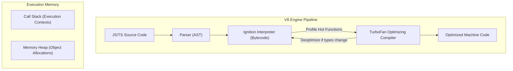
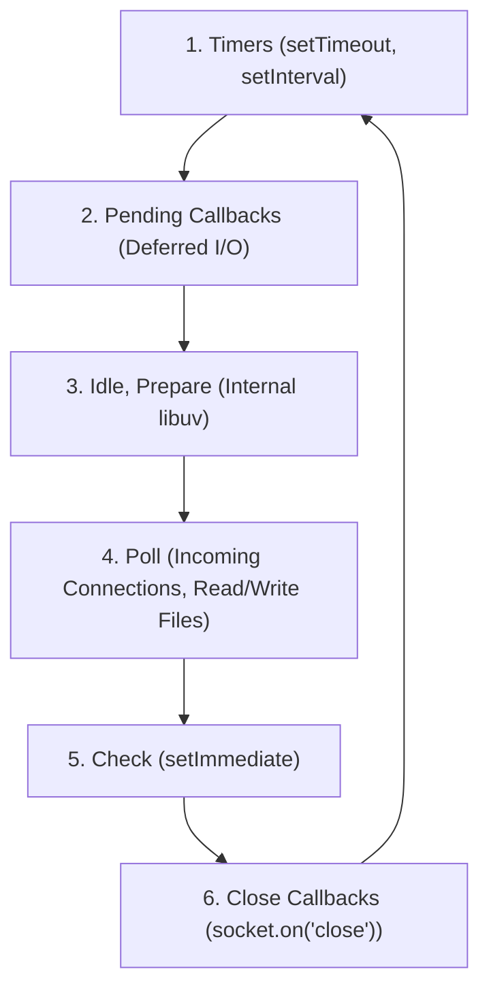
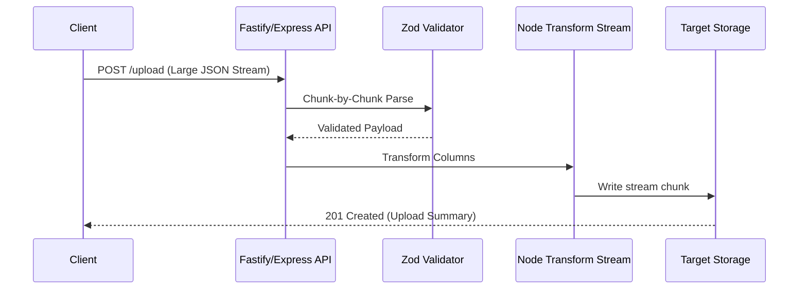

# Part 6: TypeScript & Node.js — Dynamic Execution & Type Safety

*[← Back to Master Index](/blog/it-career-guide)*

---

## 1. Core Concept Refresher: Node.js Execution Context & The Event Loop

To write high-performance backend services in TypeScript and JavaScript, you must look past the syntax sugar and understand how the underlying runtime operates. Unlike multi-threaded application servers (like Java Spring Boot or .NET CLR), Node.js operates on a **Single-Threaded Event Loop** model. This architectural pattern makes Node.js exceptionally efficient for I/O-bound operations (like web servers, API gateways, and proxy engines) but requires a rigorous understanding of how execution flows through memory.

---

### The V8 Engine Architecture and Memory Allocation

Node.js executes JavaScript code using the **Google V8 Engine** (written in C++). V8 is composed of several critical layers:
1.  **Parser:** Translates JavaScript source code into an Abstract Syntax Tree (AST).
2.  **Ignition Interpreter:** Compiles the AST into basic bytecode. Ignition is designed to start executing code quickly without waiting for heavy compilations.
3.  **TurboFan Optimizing Compiler:** Monitors the execution flow (profiling). If a function is called repeatedly with identical input types (known as "hot functions"), TurboFan compiles the bytecode directly into highly optimized machine code. If the input types subsequently change, V8 performs "deoptimization," throwing away the machine code and falling back to the interpreter.
4.  **Orinoco Garbage Collector:** A generational garbage collector that splits the Heap into "Young Generation" (short-lived objects) and "Old Generation" (long-lived objects), utilizing parallel and concurrent mark-and-sweep phases to minimize stop-the-world pauses.



In the V8 environment, memory is split into:
*   **The Call Stack:** A thread-specific execution stack that operates on a LIFO (Last In, First Out) basis. It stores primitive values and references to complex objects.
*   **The Memory Heap:** A large unstructured memory pool where objects, arrays, and functions are allocated.

---

### The Node.js Event Loop Mechanics

The core engine of Node.js concurrency is the **Event Loop**, which is implemented by the **libuv** C++ library. The Event Loop is responsible for offloading asynchronous tasks to the operating system kernel or libuv's internal thread pool, and executing their callbacks.

The Event Loop executes in six distinct phases in a continuous loop:



1.  **Timers Phase:** Executes callbacks scheduled by `setTimeout()` and `setInterval()`. V8 checks if the threshold time has elapsed.
2.  **Pending Callbacks Phase:** Executes system-level callbacks deferred from previous cycles, such as TCP socket errors or UDP packet transmission acknowledgments.
3.  **Idle, Prepare Phase:** Used internally by libuv for scheduling and housekeeping.
4.  **Poll Phase:** The most critical phase. The Event Loop blocks here if no other callbacks are queued. It checks for new connections, incoming HTTP requests, and pending file I/O operations. It blocks for a calculated duration to wait for I/O events to complete.
5.  **Check Phase:** Executes callbacks scheduled explicitly via `setImmediate()`.
6.  **Close Callbacks Phase:** Handles connection closures, such as `socket.on('close', ...)`.

#### Microtask Queues: The Fast Track
In addition to the six macro-phases, Node.js maintains two high-priority **microtask queues** that are drained *immediately* after any operation in the Call Stack finishes, *before* the loop transitions to the next phase:
1.  **process.nextTick Queue:** The absolute highest priority queue. Scheduled by `process.nextTick()`.
2.  **Promise Jobs Queue:** Stores resolved Promise callbacks (`.then()`, `await` resolutions).

If you flood the `process.nextTick` queue recursively, you will completely starve the Event Loop, blocking file reads, network traffic, and timers from ever executing.

---

### Non-Blocking I/O vs. CPU-Bound Starvation

Node.js manages massive scale because asynchronous operations (like querying a database or fetching a URL) do not block the execution thread. Libuv delegates these tasks to the OS Kernel (via epoll, kqueue, or IOCP) or, if the OS doesn't support async operations (like file system writes), to an internal **thread pool** (default size: 4 threads).

However, because the main execution thread is single-threaded, running computationally heavy algorithms (like calculating prime numbers, encrypting files, or parsing huge JSON blocks) blocks the Call Stack. This prevents the Event Loop from entering the Poll phase to handle new connections, leading to severe latency spikes and service outages.

---

## 2. Part 6 Master Resource Directory: TypeScript & Node.js (30 Curated Resources)

Upskilling in server-side TypeScript requires deep reference documentation, pattern-oriented handbooks, and static analysis tools. Below is your curated guide to mastering the stack.

---

### Sub-Topic A: V8 Execution Contexts & Bytecode

#### 1. Node.js: Under the Hood
*   **Direct URL:** https://www.linkedin.com/learning/node-js-under-the-hood-14389088
*   **Search Identification:** Search LinkedIn Learning for: `"Node.js: Under the Hood" (Instructor: Sasha Vodnik)`
*   **Resource Type:** Video Course
*   **Access / Price:** Paid (Included in TCS Enterprise Account)
*   **Status:** Required (Non-Negotiable)
*   **Description:** Video walkthrough explaining how the V8 engine interprets Javascript, compiles bytecodes, and schedules task blocks.
*   **Mutual Exclusivity Mapping:** If you complete this, you can skip *CPython vs V8* as this course details engine stack structures with deeper focus.

#### 2. Advanced JavaScript: The V8 Engine
*   **Direct URL:** https://www.udemy.com/course/advanced-javascript-v8-engine/
*   **Search Identification:** Search Udemy for: `"Advanced JavaScript: The V8 Engine" (Instructor: Andrei Neagoie)`
*   **Resource Type:** Video Course
*   **Access / Price:** Paid (Included in TCS Udemy Business)
*   **Status:** Alternative to: *Node.js: Under the Hood*.
*   **Description:** Focuses on Ignition, Turbofan optimization parameters, and memory leak tracking inside V8 heaps.
*   **Mutual Exclusivity Mapping:** Shorter video alternative focusing specifically on Javascript execution optimization.

#### 3. Real-time Node.js Internals Explainer
*   **Direct URL:** https://www.youtube.com/watch?v=Obt-vMVdM8s
*   **Search Identification:** Search YouTube for: `"Node.js Internals and V8 compiler cycles by Chirag Singhal"`
*   **Resource Type:** Video Presentation
*   **Access / Price:** 100% Free
*   **Status:** Required
*   **Description:** Conceptual video explaining execution scopes, stack registers, and garbage collection pauses in V8.
*   **Mutual Exclusivity Mapping:** baseline engine reference.

#### 4. V8 Engine Official Blog (v8.dev)
*   **Direct URL:** https://v8.dev/
*   **Search Identification:** Search Web for: `"V8 Engine official developer blogs"`
*   **Resource Type:** Written Reference / Documentation
*   **Access / Price:** 100% Free
*   **Status:** Required
*   **Description:** Source of truth for JS compilation optimization standards.
*   **Mutual Exclusivity Mapping:** Standard engine specs index.

#### 5. JavaScript Visualizer Sandbox
*   **Direct URL:** https://www.jsv9000.app/
*   **Search Identification:** Search Web for: `"JSV9000 event loop visualizer"`
*   **Resource Type:** Interactive Trace Sandbox
*   **Access / Price:** 100% Free
*   **Status:** Optional
*   **Description:** Sandbox visualizing call stack execution LIFO registers and heap bindings.
*   **Mutual Exclusivity Mapping:** Standard visual tracing tool.

---

### Sub-Topic B: Asynchronous libuv Event Loop

#### 6. Node.js: The Complete Guide (MVC, REST APIs, GraphQL)
*   **Direct URL:** https://www.udemy.com/course/nodejs-the-complete-guide/
*   **Search Identification:** Search Udemy for: `"NodeJS: The Complete Guide" (Instructor: Maximilian Schwarzmüller)`
*   **Resource Type:** Video Course
*   **Access / Price:** Paid (Included in TCS Udemy Business)
*   **Status:** Required (Non-Negotiable)
*   **Description:** Comprehensive guide covering non-blocking I/O events, libuv scheduling, request routers, and asynchronous file handlers.
*   **Mutual Exclusivity Mapping:** If you complete this, you can skip *Node.js Essential Training (LinkedIn)* as Max covers MVC and raw database integrations with deeper scope.

#### 7. Node.js Essential Training
*   **Direct URL:** https://www.linkedin.com/learning/node-js-essential-training-2023
*   **Search Identification:** Search LinkedIn Learning for: `"Node.js Essential Training" (Instructor: Emmanuel Henri)`
*   **Resource Type:** Video Course
*   **Access / Price:** Paid (Included in TCS Enterprise Account)
*   **Status:** Alternative to: *Node.js: The Complete Guide*.
*   **Description:** Shorter review of event loops, global variables, modules, and file streams.
*   **Mutual Exclusivity Mapping:** Shorter video alternative.

#### 8. Node.js Design Patterns (3rd Edition)
*   **Direct URL:** https://www.oreilly.com/library/view/node-js-design-patterns/9781839214110/
*   **Search Identification:** Search O'Reilly Media for: `"Node.js Design Patterns" (Authors: Mario Casciaro, Luciano Mammino)`
*   **Resource Type:** Book
*   **Access / Price:** Paid (Included in TCS O'Reilly Enterprise benefit)
*   **Status:** Required (Highly Recommended)
*   **Description:** The ultimate reference manual for callbacks, promises, async patterns, event emitters, and streams.
*   **Mutual Exclusivity Mapping:** Required baseline systems engineering reference.

#### 9. Libuv Official Design Documentation (docs.libuv.org)
*   **Direct URL:** https://docs.libuv.org/en/v1.x/design.html
*   **Search Identification:** Search Web for: `"libuv official design documentation"`
*   **Resource Type:** Written Reference / Documentation
*   **Access / Price:** 100% Free
*   **Status:** Required
*   **Description:** Details the C++ design patterns behind the six loop phases and the system thread pool.
*   **Mutual Exclusivity Mapping:** Required conceptual reference.

#### 10. Node.js Event Loop Visualizer Sandbox
*   **Direct URL:** https://github.com/flaviocopes/event-loop-visualizer
*   **Search Identification:** Search GitHub for: `"event-loop-visualizer flaviocopes"`
*   **Resource Type:** Interactive Graph Sandbox
*   **Access / Price:** 100% Free
*   **Status:** Optional
*   **Description:** Interactive simulator showing timer ticks, ticks phases, and close callbacks in real-time.
*   **Mutual Exclusivity Mapping:** Supplemental visual tool.

---

### Sub-Topic C: Node Streams & Non-blocking I/O

#### 11. Learn Node Streams Course
*   **Direct URL:** https://www.udemy.com/course/node-streams/
*   **Search Identification:** Search Udemy for: `"Node Streams Masterclass"`
*   **Resource Type:** Video Course
*   **Access / Price:** Paid (Included in TCS Udemy Business)
*   **Status:** Required (Non-Negotiable)
*   **Description:** Teaches readable, writable, duplex, and transform streams, backpressure management, and processing gigabytes of files with constant RAM memory usage.
*   **Mutual Exclusivity Mapping:** If you complete this, you can skip LinkedIn's general stream lessons as this masterclass details raw binary pipe buffers in full.

#### 12. Advanced Node.js: Streams and I/O
*   **Direct URL:** https://www.linkedin.com/learning/advanced-node-js-streams-and-i-o
*   **Search Identification:** Search LinkedIn Learning for: `"Advanced Node.js: Streams and I/O"`
*   **Resource Type:** Video Course
*   **Access / Price:** Paid (Included in TCS Enterprise Account)
*   **Status:** Alternative to: *Learn Node Streams Course*.
*   **Description:** Conceptual walkthrough of pipe mechanisms and memory buffers.
*   **Mutual Exclusivity Mapping:** Shorter video alternative.

#### 13. Node.js Streams API Reference Documentation
*   **Direct URL:** https://nodejs.org/api/stream.html
*   **Search Identification:** Search Web for: `"Node.js official streams API reference documentation"`
*   **Resource Type:** Written Reference / Documentation
*   **Access / Price:** 100% Free
*   **Status:** Required
*   **Description:** Details objectMode buffers, pipeline flows, and custom transform classes.
*   **Mutual Exclusivity Mapping:** Standard API index.

#### 14. Node.js Streams Cookbook
*   **Direct URL:** https://github.com/substack/stream-handbook
*   **Search Identification:** Search GitHub for: `"substack stream-handbook"`
*   **Resource Type:** Written Guide / Reference
*   **Access / Price:** 100% Free
*   **Status:** Required
*   **Description:** The classic handbook for composing stream pipelines written by one of Node's core package maintainers.
*   **Mutual Exclusivity Mapping:** Essential code reference.

#### 15. Through2 Transform Library
*   **Direct URL:** https://github.com/rvagg/through2
*   **Search Identification:** Search GitHub for: `"rvagg through2 transform stream"`
*   **Resource Type:** Code Library & Written Reference
*   **Access / Price:** 100% Free
*   **Status:** Optional
*   **Description:** A tiny wrapper around raw transform streams to simplify pipeline transformations.
*   **Mutual Exclusivity Mapping:** Supplemental library reference.

---

### Sub-Topic D: Strict TypeScript Typings & Generics

#### 16. Effective TypeScript
*   **Direct URL:** https://www.oreilly.com/library/view/effective-typescript/9781492053736/
*   **Search Identification:** Search O'Reilly Media for: `"Effective TypeScript" (Author: Dan Vanderkam)`
*   **Resource Type:** Book
*   **Access / Price:** Paid (Included in TCS O'Reilly Enterprise benefit)
*   **Status:** Required (Non-Negotiable)
*   **Description:** 62 specific ways to write robust, maintainable TypeScript. Explains set theory types, structural typings, unions, conditional types, and utility types.
*   **Mutual Exclusivity Mapping:** If you read this book, you can skip *TypeScript Essential Training* as Dan Vanderkam covers type inference with deeper architectural rigor.

#### 17. TypeScript Essential Training
*   **Direct URL:** https://www.linkedin.com/learning/typescript-essential-training-14828114
*   **Search Identification:** Search LinkedIn Learning for: `"TypeScript Essential Training" (Instructor: Jess Chadwick)`
*   **Resource Type:** Video Course
*   **Access / Price:** Paid (Included in TCS Enterprise Account)
*   **Status:** Alternative to: *Effective TypeScript*.
*   **Description:** Introduces interfaces, compiled types, compiler configs, and standard modules.
*   **Mutual Exclusivity Mapping:** Shorter video alternative.

#### 18. TypeScript Official Handbook (typescriptlang.org/docs)
*   **Direct URL:** https://www.typescriptlang.org/docs/handbook/intro.html
*   **Search Identification:** Search Web for: `"TypeScript official handbook introduction docs"`
*   **Resource Type:** Written Reference / Documentation
*   **Access / Price:** 100% Free
*   **Status:** Required
*   **Description:** Complete guide to type manipulation, utility types, and compiler configurations.
*   **Mutual Exclusivity Mapping:** Standard reference index.

#### 19. Type Challenges Interactive Playground
*   **Direct URL:** https://github.com/type-challenges/type-challenges
*   **Search Identification:** Search GitHub for: `"type-challenges type-challenges"`
*   **Resource Type:** Interactive Coding Sandbox
*   **Access / Price:** 100% Free
*   **Status:** Required
*   **Description:** Collection of interactive type puzzles (easy to extreme) to master type manipulation, generics, and conditional constraints.
*   **Mutual Exclusivity Mapping:** Essential compiler puzzle track.

#### 20. Advanced TypeScript: Generics and Mapped Types
*   **Direct URL:** https://www.udemy.com/course/advanced-typescript/
*   **Search Identification:** Search Udemy for: `"Advanced TypeScript"`
*   **Resource Type:** Video Course
*   **Access / Price:** Paid (Included in TCS Udemy Business)
*   **Status:** Optional
*   **Description:** Details covariant/contravariant parameters, utility types, and template literals.
*   **Mutual Exclusivity Mapping:** Optional booster.

---

### Sub-Topic E: Runtime Validation with Zod

#### 21. Schema Validation in TypeScript with Zod
*   **Direct URL:** https://www.linkedin.com/learning/schema-validation-in-typescript-with-zod
*   **Search Identification:** Search LinkedIn Learning for: `"Schema Validation in TypeScript with Zod"`
*   **Resource Type:** Video Course
*   **Access / Price:** Paid (Included in TCS Enterprise Account)
*   **Status:** Required (Non-Negotiable)
*   **Description:** Video walkthrough explaining how to parse, validate, and infer TypeScript types dynamically using Zod schemas at runtime.
*   **Mutual Exclusivity Mapping:** If you complete this, you can skip Stefan's *Zod course* on Udemy as this course covers actual API request parsing in full.

#### 22. TypeScript Request Validation Masterclass
*   **Direct URL:** https://www.udemy.com/course/zod-validation/
*   **Search Identification:** Search Udemy for: `"TypeScript Request Validation with Zod"`
*   **Resource Type:** Video Course
*   **Access / Price:** Paid (Included in TCS Udemy Business)
*   **Status:** Alternative to: *Schema Validation in TypeScript with Zod*.
*   **Description:** Detailed focus on custom error formats, coercions, and schemas merging.
*   **Mutual Exclusivity Mapping:** Video alternative. Choose if you prefer Udemy's course layout.

#### 23. Zod Official Documentation (zod.dev)
*   **Direct URL:** https://zod.dev/
*   **Search Identification:** Search Web for: `"Zod official documentation manual"`
*   **Resource Type:** Written Reference / Documentation
*   **Access / Price:** 100% Free
*   **Status:** Required
*   **Description:** Complete guide to string validations, arrays parsing, and custom refinements.
*   **Mutual Exclusivity Mapping:** Standard library reference.

#### 24. Type Inference with Zod Sandbox
*   **Direct URL:** https://stackblitz.com/edit/zod-typescript-playground
*   **Search Identification:** Search StackBlitz for: `"zod typescript playground"`
*   **Resource Type:** Interactive Compiler Playground
*   **Access / Price:** 100% Free
*   **Status:** Required
*   **Description:** Live browser coding playground where you parse request payloads and check TS types.
*   **Mutual Exclusivity Mapping:** Essential schema simulator.

#### 25. Zod and Fastify Integration Guide
*   **Direct URL:** https://fastify.dev/docs/latest/Reference/Validation-and-Serialization/
*   **Search Identification:** Search Web for: `"Fastify validation and serialization guidelines"`
*   **Resource Type:** Written Reference
*   **Access / Price:** 100% Free
*   **Status:** Optional
*   **Description:** Connecting schema validation directly to Fastify router schemas.
*   **Mutual Exclusivity Mapping:** Standard integration guide.

---

### Sub-Topic F: Monorepos & TS Config Orchestration

#### 26. TypeScript Project References Manual
*   **Direct URL:** https://www.typescriptlang.org/docs/handbook/project-references.html
*   **Search Identification:** Search Web for: `"TypeScript Project References official handbook guide"`
*   **Resource Type:** Written Reference / Documentation
*   **Access / Price:** 100% Free
*   **Status:** Required
*   **Description:** Explains how to structure large codebases into compiled, independent sub-modules to optimize compiler performance.
*   **Mutual Exclusivity Mapping:** If you read this guide, you can skip *Lerna & Nx* courses if you manage simple local mono-repositories with native workspaces.

#### 27. TurboRepo: Monorepo Build System for JS/TS
*   **Direct URL:** https://turbo.build/repo/docs
*   **Search Identification:** Search Web for: `"TurboRepo build system documentation"`
*   **Resource Type:** Written Reference / Documentation
*   **Access / Price:** 100% Free
*   **Status:** Required
*   **Description:** Guide to remote caching, parallel task execution, and repository orchestration.
*   **Mutual Exclusivity Mapping:** Standard monorepo build system guide.

#### 28. Monorepo Setup with pnpm Workspaces
*   **Direct URL:** https://pnpm.io/workspaces
*   **Search Identification:** Search Web for: `"pnpm workspaces monorepo configuration guidelines"`
*   **Resource Type:** Written Reference / Documentation
*   **Access / Price:** 100% Free
*   **Status:** Required
*   **Description:** The definitive guide to orchestrating dependency resolution, symlinks, and scripts across monorepos.
*   **Mutual Exclusivity Mapping:** Essential workspace manual.

#### 29. Node.js Monorepos: Lerna & Nx
*   **Direct URL:** https://www.udemy.com/course/lerna-nx-monorepo/
*   **Search Identification:** Search Udemy for: `"Lerna and Nx Monorepos"`
*   **Resource Type:** Video Course
*   **Access / Price:** Paid (Included in TCS Udemy Business)
*   **Status:** Alternative to: *TurboRepo: Monorepo Build System for JS/TS*.
*   **Description:** Comprehensive video training covering Nx plugins, executors, and cache layers.
*   **Mutual Exclusivity Mapping:** Video alternative. Choose if you manage enterprise-scale polyglot monorepos.

#### 30. Production TypeScript configurations for Backend Services
*   **Direct URL:** https://www.linkedin.com/learning/typescript-backend-configurations
*   **Search Identification:** Search LinkedIn Learning for: `"TypeScript Backend Configurations"`
*   **Resource Type:** Video Course
*   **Access / Price:** Paid (Included in TCS Enterprise Account)
*   **Status:** Optional
*   **Description:** Advanced compiler settings configurations for NodeNext resolution standards.
*   **Mutual Exclusivity Mapping:** Optional booster.

---

## 3. Hands-On Portfolio Lab Project: Stateful API with Zod, Express/Fastify & Node Streams

To showcase your TypeScript and Node.js capabilities, you will build a **High-Throughput File Processing & Validation Service** using strict TypeScript configuration, streams, Fastify (or Express), and Zod schema validation.



### Lab Specifications:
1.  **Project Initialization:**
    *   Set up a clean TypeScript project using a modern runner.
    *   Configure `tsconfig.json` with extreme type-safety:
        ```json
        {
          "compilerOptions": {
            "target": "ES2022",
            "module": "NodeNext",
            "moduleResolution": "NodeNext",
            "strict": true,
            "noImplicitAny": true,
            "strictNullChecks": true,
            "strictFunctionTypes": true,
            "noUnusedLocals": true,
            "noUnusedParameters": true,
            "noImplicitReturns": true,
            "noFallthroughCasesInSwitch": true
          }
        }
        ```
2.  **Zod Schema Declarations:**
    *   Create a schema `UserImportSchema` containing:
        *   `email`: Validated email address.
        *   `role`: Enum (`admin`, `editor`, `viewer`).
        *   `salary`: Numeric value coerced from string, minimum: 1.
        *   `tags`: Array of alphanumeric strings.
3.  **Stream Processor Implementation:**
    *   Implement a custom Node.js `Transform` stream in TypeScript.
    *   The stream must receive line-by-line JSON string data.
    *   It must parse each line, validate it against the `UserImportSchema` using Zod's `.safeParse()`.
    *   If validation passes, append a processed timestamp and write it to the output stream.
    *   If validation fails, write the validation error details along with the line number to an error logs file.
4.  **API endpoint:**
    *   Set up Fastify or Express.
    *   Create a `POST /import` endpoint that handles standard multipart file uploads as a raw network stream, piping the network input directly to your processing streams.
    *   **Crucial Rule:** The server must not buffer the entire uploaded file in memory (`buffer` or `fs.writeFileSync`). It must pipe the stream chunk by chunk, keeping memory usage constant (less than 50MB) even for a 1GB file.

---

## 4. Technical Interview Self-Assessment

Use these technical questions to test your comprehension of type systems and runtimes:

| Concept | High-Frequency Interview Question | Expected Technical Answer Framework |
| :--- | :--- | :--- |
| **Event Loop Starvation** | What happens if you execute `while(true) {}` in Node.js? | The V8 execution thread will enter a blocking loop inside the Call Stack. Because this thread is single-threaded, it can never complete the execution context. The libuv Event Loop will remain starved, never reaching the Poll phase. The server will become completely unresponsive, dropping all incoming TCP and HTTP socket handshakes. |
| **Any vs. Unknown** | What is the difference between `any` and `unknown` in TypeScript? | `any` completely disables type-checking for that variable, allowing you to call any method or property on it, which bypasses compiler safety. `unknown` is the type-safe counterpart. It represents any value, but the TypeScript compiler will not let you perform any operations on an `unknown` variable until you narrow the type using type guards (`typeof`, `instanceof`, or Zod validation schemas). |
| **Node.js Streams** | Why should you use Streams instead of `fs.readFile` for large files? | `fs.readFile` reads the entire file into the server's RAM before executing the callback. For a 2GB file, the server will allocate 2GB of memory. Under high concurrent traffic, this will exhaust the server's heap allocation, triggering a process crash (Out of Memory). Streams read the file in small, sequential chunks (usually 64KB), piping them directly to their destination, keeping RAM usage low and constant. |
| **TS Structural Typing** | How does TypeScript's structural type system differ from a nominal type system? | In a nominal type system (like Java or C++), type equality is determined by explicit class names or declarations. In a structural type system (like TypeScript), type equality is determined solely by the shape and properties of the object. If object `A` has the properties `x` and `y` required by type `B`, `A` is assignable to `B`, regardless of its constructor or class declaration. |

---

## 5. Exit Tasks for this Phase

Verify that you have mastered these concepts before proceeding:

- [ ] Write a custom Node.js script using `Transform` streams.
- [ ] Configure a `tsconfig.json` using `"strict": true` and `"moduleResolution": "NodeNext"`.
- [ ] Implement Zod schemas that parse, validate, and infer TypeScript types dynamically.
- [ ] Successfully run a local build and confirm no TypeScript compilation warnings.

---

*[Proceed to Part 7: Relational Databases & Advanced PostgreSQL →](/blog/it-career-guide/part-07-postgresql)*
