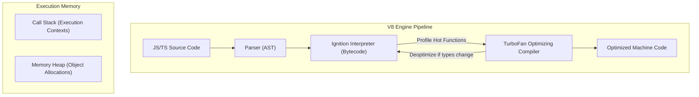
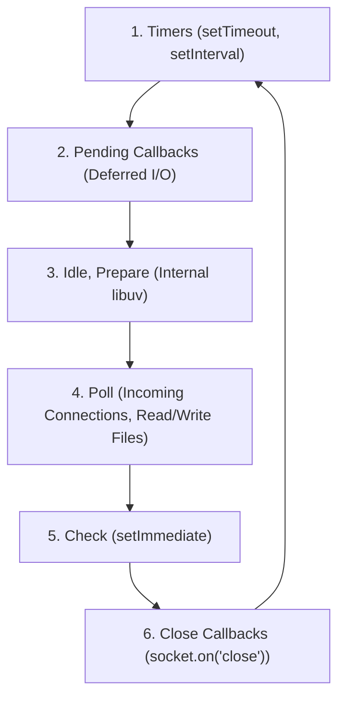
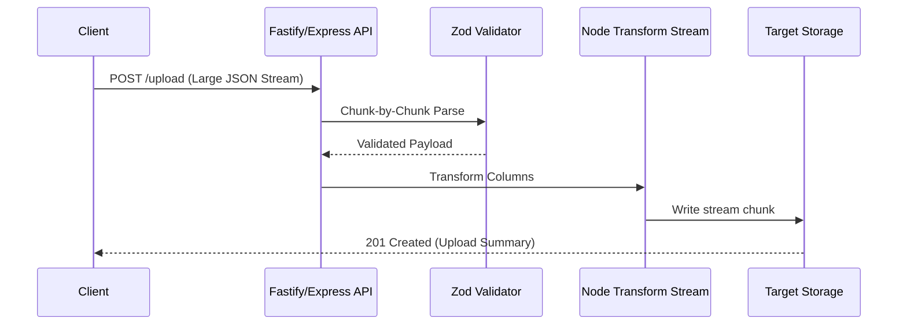

# Part 6: TypeScript & Node.js — Dynamic Execution & Type Safety

*[← Back to Master Index](/blog/it-career-guide)*

---

## 1. Core Concept Refresher: Node.js Execution Context & The Event Loop

To write high-performance backend services in TypeScript and JavaScript, you must look past the syntax sugar and understand how the underlying runtime operates. Unlike multi-threaded application servers (like Java Spring Boot or .NET CLR), Node.js operates on a **Single-Threaded Event Loop** model. This architectural pattern makes Node.js exceptionally efficient for I/O-bound operations (like web servers, API gateways, and proxy engines) but requires a rigorous understanding of how execution flows through memory.

---

### The V8 Engine Architecture and Memory Allocation

Node.js executes JavaScript code using the **Google V8 Engine** (written in C++). V8 is composed of several critical layers:
1.  **Parser:** Translates JavaScript source code into an Abstract Syntax Tree (AST).
2.  **Ignition Interpreter:** Compiles the AST into basic bytecode. Ignition is designed to start executing code quickly without waiting for heavy compilations.
3.  **TurboFan Optimizing Compiler:** Monitors the execution flow (profiling). If a function is called repeatedly with identical input types (known as "hot functions"), TurboFan compiles the bytecode directly into highly optimized machine code. If the input types subsequently change, V8 performs "deoptimization," throwing away the machine code and falling back to the interpreter.
4.  **Orinoco Garbage Collector:** A generational garbage collector that splits the Heap into "Young Generation" (short-lived objects) and "Old Generation" (long-lived objects), utilizing parallel and concurrent mark-and-sweep phases to minimize stop-the-world pauses.



In the V8 environment, memory is split into:
*   **The Call Stack:** A thread-specific execution stack that operates on a LIFO (Last In, First Out) basis. It stores primitive values and references to complex objects.
*   **The Memory Heap:** A large unstructured memory pool where objects, arrays, and functions are allocated.

---

### The Node.js Event Loop Mechanics

The core engine of Node.js concurrency is the **Event Loop**, which is implemented by the **libuv** C++ library. The Event Loop is responsible for offloading asynchronous tasks to the operating system kernel or libuv's internal thread pool, and executing their callbacks.

The Event Loop executes in six distinct phases in a continuous loop:



1.  **Timers Phase:** Executes callbacks scheduled by `setTimeout()` and `setInterval()`. V8 checks if the threshold time has elapsed.
2.  **Pending Callbacks Phase:** Executes system-level callbacks deferred from previous cycles, such as TCP socket errors or UDP packet transmission acknowledgments.
3.  **Idle, Prepare Phase:** Used internally by libuv for scheduling and housekeeping.
4.  **Poll Phase:** The most critical phase. The Event Loop blocks here if no other callbacks are queued. It checks for new connections, incoming HTTP requests, and pending file I/O operations. It blocks for a calculated duration to wait for I/O events to complete.
5.  **Check Phase:** Executes callbacks scheduled explicitly via `setImmediate()`.
6.  **Close Callbacks Phase:** Handles connection closures, such as `socket.on('close', ...)`.

#### Microtask Queues: The Fast Track
In addition to the six macro-phases, Node.js maintains two high-priority **microtask queues** that are drained *immediately* after any operation in the Call Stack finishes, *before* the loop transitions to the next phase:
1.  **process.nextTick Queue:** The absolute highest priority queue. Scheduled by `process.nextTick()`.
2.  **Promise Jobs Queue:** Stores resolved Promise callbacks (`.then()`, `await` resolutions).

If you flood the `process.nextTick` queue recursively, you will completely starve the Event Loop, blocking file reads, network traffic, and timers from ever executing.

---

### Non-Blocking I/O vs. CPU-Bound Starvation

Node.js manages massive scale because asynchronous operations (like querying a database or fetching a URL) do not block the execution thread. Libuv delegates these tasks to the OS Kernel (via epoll, kqueue, or IOCP) or, if the OS doesn't support async operations (like file system writes), to an internal **thread pool** (default size: 4 threads).

However, because the main execution thread is single-threaded, running computationally heavy algorithms (like calculating prime numbers, encrypting files, or parsing huge JSON blocks) blocks the Call Stack. This prevents the Event Loop from entering the Poll phase to handle new connections, leading to severe latency spikes and service outages.

---

## 2. Master Resource Directory: TypeScript & Node.js

Upskilling in server-side TypeScript requires deep reference documentation, pattern-oriented handbooks, and static analysis tools. Below is your curated guide to mastering the stack.

---

### Resource 1: *Effective TypeScript* by Dan Vanderkam
*   **Why It Was Selected:** TypeScript is not just "JavaScript with types." It is a structural type system with complex inference behaviors. Dan Vanderkam's book is selected because it is structured as 62 specific ways to write robust, maintainable TypeScript. It teaches you how to think in terms of set theory, distinguish between types and interfaces, utilize conditional typing, and write safe assertions, which are crucial skills for writing production-grade enterprise backend services.
*   **Target Syllabus Modules/Chapters:**
    *   Chapter 1: Getting to Know TypeScript
    *   Chapter 2: TypeScript's Type System
    *   Chapter 3: Type Inference & Structural Typing
    *   Chapter 5: Writing and Designing Types (Conditional Types, Distributive Types)
*   **Time Investment Required:** 20 hours of reading, highlighting, and writing test cases.
    *   *Week 1:* Chapters 1-2 (10 hours)
    *   *Week 2:* Chapters 3 & 5 (10 hours)
*   **Value Assessment:** Exceptional ($40 investment, yielding ₹5 LPA worth of technical depth and code quality improvements).
*   **Actionable Study Strategy:** Open a blank repository and install TypeScript. As you read each item in the book (e.g., "Item 7: Think of Types as Sets of Values"), write code snippets that trigger compile-time errors. Build utility types that use `keyof`, `typeof`, and template literal types to see how the compiler validates keys dynamically.

---

### Resource 2: *Node.js Design Patterns (3rd Edition)* by Mario Casciaro & Luciano Mammino
*   **Why It Was Selected:** This book is the definitive bible for server-side JavaScript engineering. Transitioning developers from service company backgrounds often write Node.js code as if they were writing Java or Python, which leads to race conditions, memory leaks, and unoptimized I/O. This resource is selected because it provides an exhaustive, pattern-driven layout of how Node.js architectures should be written (Callbacks, Promises, Streams, ESM vs CommonJS, Scalability patterns).
*   **Target Syllabus Modules/Chapters:**
    *   Chapter 2: The Developer Control Flow & Async Patterns
    *   Chapter 4: Asynchronous Control Flow Patterns with Promises and Async/Await
    *   Chapter 6: Coding with Streams (Writable, Readable, Transform, Duplex)
    *   Chapter 8: Structural Design Patterns (Proxy, Decorator)
*   **Time Investment Required:** 30 hours of reading and lab implementation.
    *   *Week 1:* Chapters 2 & 4 (15 hours)
    *   *Week 2:* Chapter 6 (Streams) and Chapter 8 (15 hours)
*   **Value Assessment:** Essential for any candidate aiming for Senior Backend roles. Streams alone save companies millions in server memory costs.
*   **Actionable Study Strategy:** Focus heavily on **Chapter 6: Streams**. Streams are the most misunderstood aspect of Node.js. Build a command-line script that parses a 2GB CSV file, transforms the columns using a `Transform` stream, and writes the output back to disk without exceeding 30MB of RAM. This project will instantly prove your systems capability to interviewer panels.

---

### Resource 3: *TypeScript Deep Dive* by Basarat Ali Syed
*   **Why It Was Selected:** An exceptional, open-source book that serves as the perfect companion to official docs. Basarat explains the JavaScript runtime quirks, compiler flags, AST representations, and advanced patterns in an incredibly clear, highly visual format.
*   **Target Syllabus Modules/Chapters:**
    *   TypeScript Type System section
    *   Generics, Union Types, and Intersection Types
    *   Compiler settings (`tsconfig.json` configurations)
*   **Time Investment Required:** 10 hours of active reading.
*   **Value Assessment:** High (Free, highly structured resource).
*   **Actionable Study Strategy:** Read the section on Generics thoroughly. Write functions that can accept generic constraints (`<T extends Record<string, any>>`) and return typed properties mapped from the inputs. Check how the VS Code autocomplete updates dynamically based on the constraints.

---

### Resource 4: *TypeScript Official Handbook* (typescriptlang.org/docs)
*   **Why It Was Selected:** TypeScript's documentation is exceptionally written and kept constantly up to date with new compiler releases. Using the official handbook ensures you avoid outdated third-party tutorials and grasp concepts like covariance, contravariance, and template literal types straight from the maintainers.
*   **Target Syllabus Modules/Chapters:**
    *   The Basics & Everyday Types
    *   More on Functions & Object Types
    *   Generics & Type Manipulation
    *   Utility Types (`Readonly`, `Partial`, `Pick`, `Omit`, `ReturnType`)
*   **Time Investment Required:** 15 hours.
*   **Value Assessment:** Critical. It is the absolute source of truth.
*   **Actionable Study Strategy:** Go through the **Utility Types** index. Re-implement each utility type (e.g., `MyReturnType<T>`) using conditional types (`infer`) to master TypeScript's type manipulation syntax.

---

### Resource 5: *Zod Official Documentation* (zod.dev)
*   **Why It Was Selected:** In backend engineering, validating untrusted client data is the single most critical security barrier. Standard TypeScript types do not exist at runtime (they are compiled away to vanilla JS). Zod solves this by creating schemas that validate data at runtime and automatically infer type definitions. It is the gold standard for validation in modern TypeScript stacks.
*   **Target Syllabus Modules/Chapters:**
    *   Basic Schemas (Strings, Numbers, Objects)
    *   Parsing and Safe Parsing
    *   Object Merging and Extending
    *   Coercion and Custom Validations
*   **Time Investment Required:** 8 hours of reference reading and API building.
*   **Value Assessment:** High. Using Zod prevents runtime errors and database corruptions.
*   **Actionable Study Strategy:** Create complex schemas representing user request payloads. Use `.refine()` to write custom validations (like validating that a password contains uppercase letters, numbers, and symbols). Export the inferred TypeScript types using `z.infer<typeof Schema>`.

---

## 3. Hands-On Portfolio Lab Project: Stateful API with Zod, Express/Fastify & Node Streams

To showcase your TypeScript and Node.js capabilities, you will build a **High-Throughput File Processing & Validation Service** using strict TypeScript configuration, streams, Fastify (or Express), and Zod schema validation.



### Lab Specifications:
1.  **Project Initialization:**
    *   Set up a clean TypeScript project using a modern runner.
    *   Configure `tsconfig.json` with extreme type-safety:
        ```json
        {
          "compilerOptions": {
            "target": "ES2022",
            "module": "NodeNext",
            "moduleResolution": "NodeNext",
            "strict": true,
            "noImplicitAny": true,
            "strictNullChecks": true,
            "strictFunctionTypes": true,
            "noUnusedLocals": true,
            "noUnusedParameters": true,
            "noImplicitReturns": true,
            "noFallthroughCasesInSwitch": true
          }
        }
        ```
2.  **Zod Schema Declarations:**
    *   Create a schema `UserImportSchema` containing:
        *   `email`: Validated email address.
        *   `role`: Enum (`admin`, `editor`, `viewer`).
        *   `salary`: Numeric value coerced from string, minimum: 1.
        *   `tags`: Array of alphanumeric strings.
3.  **Stream Processor Implementation:**
    *   Implement a custom Node.js `Transform` stream in TypeScript.
    *   The stream must receive line-by-line JSON string data.
    *   It must parse each line, validate it against the `UserImportSchema` using Zod's `.safeParse()`.
    *   If validation passes, append a processed timestamp and write it to the output stream.
    *   If validation fails, write the validation error details along with the line number to an error logs file.
4.  **API endpoint:**
    *   Set up Fastify or Express.
    *   Create a `POST /import` endpoint that handles standard multipart file uploads as a raw network stream, piping the network input directly to your processing streams.
    *   **Crucial Rule:** The server must not buffer the entire uploaded file in memory (`buffer` or `fs.writeFileSync`). It must pipe the stream chunk by chunk, keeping memory usage constant (less than 50MB) even for a 1GB file.

---

## 4. Technical Interview Self-Assessment

Use these technical questions to test your comprehension of type systems and runtimes:

| Concept | High-Frequency Interview Question | Expected Technical Answer Framework |
| :--- | :--- | :--- |
| **Event Loop Starvation** | What happens if you execute `while(true) {}` in Node.js? Can it process HTTP requests? | The V8 execution thread will enter a blocking loop inside the Call Stack. Because this thread is single-threaded, it can never complete the execution context. The libuv Event Loop will remain starved, never reaching the Poll phase. The server will become completely unresponsive, dropping all incoming TCP and HTTP socket handshakes. |
| **Any vs. Unknown** | What is the difference between `any` and `unknown` in TypeScript? | `any` completely disables type-checking for that variable, allowing you to call any method or property on it, which bypasses compiler safety. `unknown` is the type-safe counterpart. It represents any value, but the TypeScript compiler will not let you perform any operations on an `unknown` variable until you narrow the type using type guards (`typeof`, `instanceof`, or Zod validation schemas). |
| **Node.js Streams** | Why should you use Streams instead of `fs.readFile` for large files? | `fs.readFile` reads the entire file into the server's RAM before executing the callback. For a 2GB file, the server will allocate 2GB of memory. Under high concurrent traffic, this will exhaust the server's heap allocation, triggering a process crash (Out of Memory). Streams read the file in small, sequential chunks (usually 64KB), piping them directly to their destination, keeping RAM usage low and constant. |
| **TS Structural Typing** | How does TypeScript's structural type system differ from a nominal type system? | In a nominal type system (like Java or C++), type equality is determined by explicit class names or declarations. In a structural type system (like TypeScript), type equality is determined solely by the shape and properties of the object. If object `A` has the properties `x` and `y` required by type `B`, `A` is assignable to `B`, regardless of its constructor or class declaration. |

---

## 5. Exit Tasks for this Phase

Verify that you have mastered these concepts before proceeding:

- [ ] Write a custom Node.js script using `Transform` streams.
- [ ] Configure a `tsconfig.json` using `"strict": true` and `"moduleResolution": "NodeNext"`.
- [ ] Implement Zod schemas that parse, validate, and infer TypeScript types dynamically.
- [ ] Successfully run a local build and confirm no TypeScript compilation warnings.

---

*[Proceed to Part 7: Relational Databases & Advanced PostgreSQL →](/blog/it-career-guide/part-07-postgresql)*
