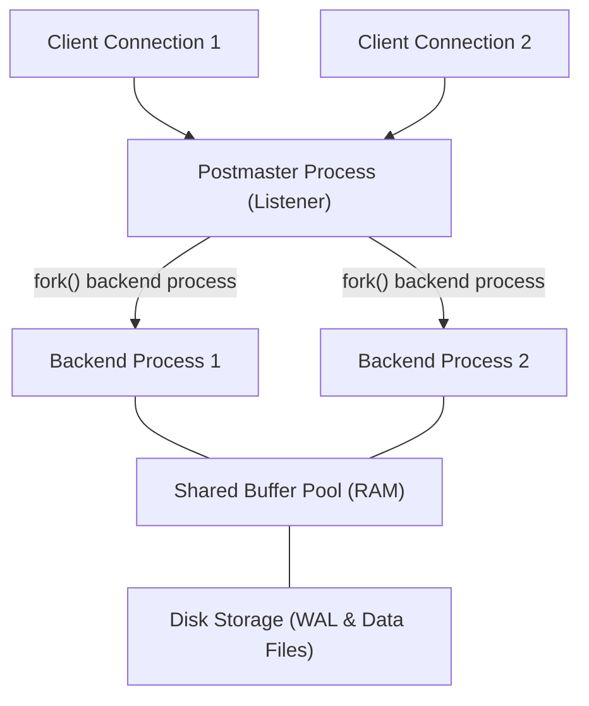
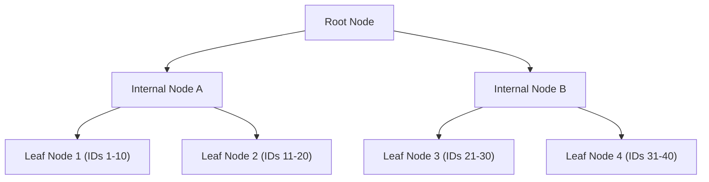
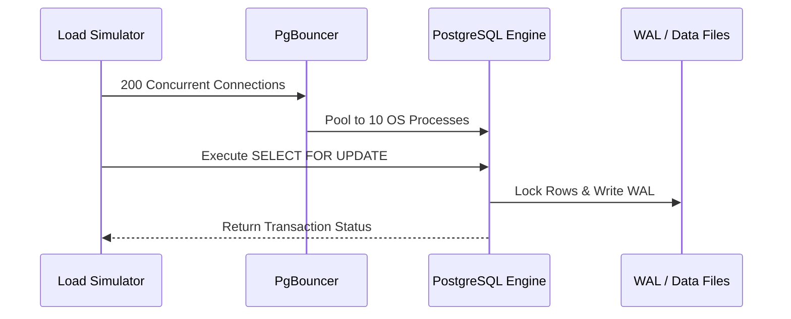

# Part 7: Relational Databases & Advanced PostgreSQL

*[← Back to Master Index](/blog/it-career-guide)*

---

## 1. Core Concept Refresher: PostgreSQL Architecture & Internals

Relational databases are the bedrock of backend engineering. In modern product architectures, application servers are treated as stateless runtimes that can be scaled horizontally. The database, however, is a stateful layer that represents the primary structural bottleneck. Writing code that interacts with a database without understanding storage engines, transaction isolation levels, and indexing mechanics leads directly to deadlocks, thread blocks, and data corruption.

---

### The Process Model and Connection Handling

PostgreSQL operates on a **Process-per-Connection** architecture. Unlike systems that use light execution threads (like MySQL or Node.js), every incoming TCP client connection to PostgreSQL is handled by a separate, dedicated backend operating system process spawned by the primary `postmaster` process.

Because spawning an operating system process is computationally expensive (requiring memory page duplication and CPU context switching), a backend system that opens a raw TCP connection to PostgreSQL for every incoming HTTP request will quickly degrade under load. 
*   **The solution:** Always use a production-grade connection pooler (like **PgBouncer** or built-in pooling in ORMs like Prisma/Sequelize) to maintain persistent backend processes and reuse them.

---

### The Write-Ahead Log (WAL) and Durability

PostgreSQL achieves durability (the "D" in ACID) through a pattern called **Write-Ahead Logging**.
When a transaction performs an `INSERT`, `UPDATE`, or `DELETE`:
1.  The modifications are made first in PostgreSQL's shared memory pool, known as the **Shared Buffer**. The page in RAM is marked as a "dirty page."
2.  Before the dirty page is written to the primary data files on disk, the exact changes are written sequentially to a dedicated append-only file on disk called the **Write-Ahead Log (WAL)**.
3.  Once the WAL write is flushed and acknowledged (via `fsync`), the transaction is officially committed and considered durable. If the server loses power a microsecond later, PostgreSQL can reconstruct the state of the database during startup by reading the WAL (crash recovery).
4.  Later, a background process called the **Writer** or **Checkpointer** writes the dirty pages from RAM back to the main data files on disk.

---

### Understanding Indexing: B-Trees and execution plans

When you write `CREATE INDEX ON users (email);`, PostgreSQL constructs a **B-Tree (Balanced Tree)** data structure on disk. B-Trees are designed to fetch specific rows in logarithmic time complexity ($O(\log N)$) rather than linear table scans ($O(N)$).

Every index query traverses the tree from the root, through internal routing nodes, down to the leaf nodes which store references to the actual database pages on disk.

To check how PostgreSQL handles a query, prepending `EXPLAIN ANALYZE` is mandatory. The output reveals the execution plan:
*   **Seq Scan:** PostgreSQL sequentially scans the entire table on disk. High latency for large datasets.
*   **Index Scan:** The database traverses the B-Tree index to find target row pointers, then fetches the actual data from the table pages.
*   **Index Only Scan:** The index contains all the columns requested in the query (Covering Index). PostgreSQL bypasses fetching data from the table pages entirely, maximizing throughput.
*   **Bitmap Index Scan / Bitmap Heap Scan:** Used when query filters match multiple indices or return a large subset of rows. Pointers are gathered in a memory bitmap first to read disk pages sequentially rather than making random disk seeks.

---

### MVCC (Multi-Version Concurrency Control) and VACUUM

PostgreSQL implements concurrency control using **MVCC**.
Instead of locking rows during updates, PostgreSQL keeps multiple versions of a row in the database.
*   When a row is updated, PostgreSQL does not overwrite the existing data. It creates a new row version (known as a tuple) and marks the old tuple as logically deleted.
*   This ensures that **readers never block writers, and writers never block readers**.
*   **The downside:** Over time, these deleted tuples accumulate on disk, a phenomenon known as **Bloat**.
*   **The solution:** The background **VACUUM** process scans the table, cleans up dead tuples, and makes the disk space available for new writes.

---

## 2. Master Resource Directory: Relational Databases & PostgreSQL

Relational database mastery separates junior application developers from senior systems engineers. Below are the definitive resources for database internals, performance tuning, and schema design.

---

### Resource 1: *Designing Data-Intensive Applications* by Martin Kleppmann
*   **Why It Was Selected:** Martin Kleppmann's book is the undisputed masterpiece of database and systems engineering. Relational databases do not exist in a vacuum; they must be evaluated against scalability, consistency, and network partitions. This book is selected because it goes deep into database storage engines (LSM-trees vs. B-Trees), transaction models, locking systems, and replication lags, providing the foundational theoretical frameworks you need to design production database architectures.
*   **Target Syllabus Modules/Chapters:**
    *   Chapter 3: Storage and Retrieval (B-Trees, SSTables, LSM-trees)
    *   Chapter 7: Transactions (ACID, Race conditions, Isolation Levels, 2PL)
    *   Chapter 9: Consistency and Consensus
*   **Time Investment Required:** 35 hours of reading and annotation.
    *   *Week 1:* Chapters 3 & 7 (20 hours)
    *   *Week 2:* Chapter 9 and review (15 hours)
*   **Value Assessment:** Critical. The concepts in this book represent 70% of the questions asked in Senior Backend and Systems Design interviews.
*   **Actionable Study Strategy:** Read each chapter twice. For Chapter 7, write down the exact scenarios for each transaction isolation level (Read Committed, Repeatable Read, Serializable). Draw step-by-step diagrams showing how two concurrent transactions can cause a "Write Skew" anomaly and how to resolve it.

---

### Resource 2: *SQL Performance Explained* by Markus Winand
*   **Why It Was Selected:** Junior developers often solve slow database queries by blindly adding indexes to every column. This leads to massive write overhead and bloated disk usage. Markus Winand's book is selected because it explains how database indexing works from a performance-centric perspective. It teaches you how to design multi-column indexes, use index-only scans, handle sorting, and speed up pagination.
*   **Target Syllabus Modules/Chapters:**
    *   Chapter 1: Anatomy of an Index
    *   Chapter 2: The Where Clause (Equality, Range, Compound Indexing)
    *   Chapter 4: Sorting and Grouping
    *   Chapter 5: Clustering and Pagination
*   **Time Investment Required:** 15 hours of study.
*   **Value Assessment:** Exceptional. Tuning index design can reduce database CPU utilization from 99% to 5% with zero code changes.
*   **Actionable Study Strategy:** Set up a local PostgreSQL database. Create a table with 10 million rows. Run a query that filters on two columns and sorts on a third. Prepend `EXPLAIN ANALYZE` and observe the plan. Build a compound index that conforms to the rules in the book, rebuild the stats, run the query again, and document the change in execution speed.

---

### Resource 3: *PostgreSQL Official Documentation* (postgresql.org/docs)
*   **Why It Was Selected:** The official PostgreSQL documentation is a comprehensive encyclopedia of SQL syntax, internal parameters, administration guides, and security protocols. It is written with extreme precision and is highly respected in the industry.
*   **Target Syllabus Modules/Chapters:**
    *   Part II: The SQL Language
    *   Chapter 13: Concurrency Control (MVCC, Lock levels)
    *   Chapter 14: Performance Tips (EXPLAIN, Statistics)
*   **Time Investment Required:** 20 hours of reference study.
*   **Value Assessment:** Critical.
*   **Actionable Study Strategy:** Read Chapter 13 on Concurrency Control. Pay close attention to table-level and row-level locks. Practice manually locking rows using `SELECT ... FOR UPDATE` in two separate psql terminal sessions to see how database engines resolve lock queues.

---

### Resource 4: *Database Internals* by Alex Petrov
*   **Why It Was Selected:** For developers who want to understand the exact C++ data structures under the hood. Alex Petrov explains how memory pages, WAL buffers, lock managers, and consensus logs are laid out at the low-level byte layer.
*   **Target Syllabus Modules/Chapters:**
    *   Part I: Storage Engines (B-Tree Internals, LSM Trees)
    *   Part II: Distributed Systems (Transactions, Concurrency, Consensus)
*   **Time Investment Required:** 25 hours.
*   **Value Assessment:** High (Useful for systems level engineering).
*   **Actionable Study Strategy:** Focus on the structural layout of a database page. Draw how data offsets and header bytes are written inside a single 8KB disk page.

---

## 3. Hands-On Portfolio Lab Project: Relational Schema, Index Profiling & PgBouncer Setup

To showcase your advanced database capabilities, you will build a **Database Tuning and Concurrency Simulation Lab** demonstrating compound indexes, lock contention resolution, and transaction isolation tests under load.

### Lab Specifications:
1.  **Environment Setup:**
    *   Spin up a local PostgreSQL instance inside Docker.
    *   Install **PgBouncer** in a secondary container, routing connections from port 6432 to PostgreSQL port 5432.
2.  **Dataset Construction:**
    *   Write a SQL script that creates a schema for an e-commerce platform:
        *   `users`: ID, Name, Email, Created At.
        *   `orders`: ID, User ID, Status, Amount, Created At.
        *   `order_items`: ID, Order ID, Product ID, Price, Quantity.
    *   Populate the tables with synthetic data using PostgreSQL's `generate_series()` function:
        *   100,000 users.
        *   1,000,000 orders.
        *   3,000,000 order items.
3.  **Performance Tuning & Profiling Tasks:**
    *   **Task A (Slow Query Optimization):** Identify queries that read the entire table on disk (Seq Scan) and convert them to Index Only Scans using compound indexing.
    *   **Task B (Pagination Optimization):** Profile pagination queries using offset-based (`LIMIT 10 OFFSET 500000`) vs key-based (keyset pagination) techniques. Document execution times.
    *   **Task C (Lock Contention Simulation):** Write a Python script that spawns 50 threads, each attempting to update the same product quantity in a transaction. Test how different isolation levels (`Read Committed` vs. `Serializable`) handle conflicts.

---

## 4. Technical Interview Self-Assessment

Use these questions to verify your database knowledge:

| Concept | High-Frequency Interview Question | Expected Technical Answer Framework |
| :--- | :--- | :--- |
| **Write Skew** | What is Write Skew and how do you prevent it in PostgreSQL? | Write Skew is a race condition anomaly that occurs under the Repeatable Read isolation level. It happens when two concurrent transactions read the same data, make calculations, and update separate rows that conflict with the overall business logic. It is prevented by either promoting the transaction isolation level to `Serializable` (which will fail one of the transactions on commit) or using explicit row locking (`SELECT ... FOR UPDATE`). |
| **Index Overhead** | Why shouldn't you index every column in a table? | Every index adds a B-Tree data structure on disk. While this speeds up reads, it introduces write overhead. Every `INSERT`, `UPDATE`, or `DELETE` transaction must modify the index trees on disk as well as the data pages. In addition, indexes occupy disk space and RAM, reducing the space available for caching other active data pages in PostgreSQL's shared buffer. |
| **Reindexing / Vacuum** | What is MVCC bloat, and how does VACUUM help? | Under PostgreSQL's MVCC model, updates do not modify row values in place. Instead, a new version of the row is created, and the old version is logically marked as deleted. If the table experiences high write traffic, these logically deleted tuples stack up on disk (bloat). `VACUUM` scans pages, removes these dead tuples, and makes the space reusable for new inserts. |

---

## 5. Exit Tasks for this Phase

Verify these checklist items before moving forward:

- [ ] Execute `EXPLAIN ANALYZE` on a complex query and read the execution tree.
- [ ] Implement keyset pagination inside a SQL script.
- [ ] Connect to PostgreSQL via PgBouncer and test pooling parameters.
- [ ] Successfully write a multi-column compound index query that performs an Index Only Scan.

---

*[Proceed to Part 8: NoSQL Databases (MongoDB & Redis Caching) →](/blog/it-career-guide/part-08-nosql-redis)*
