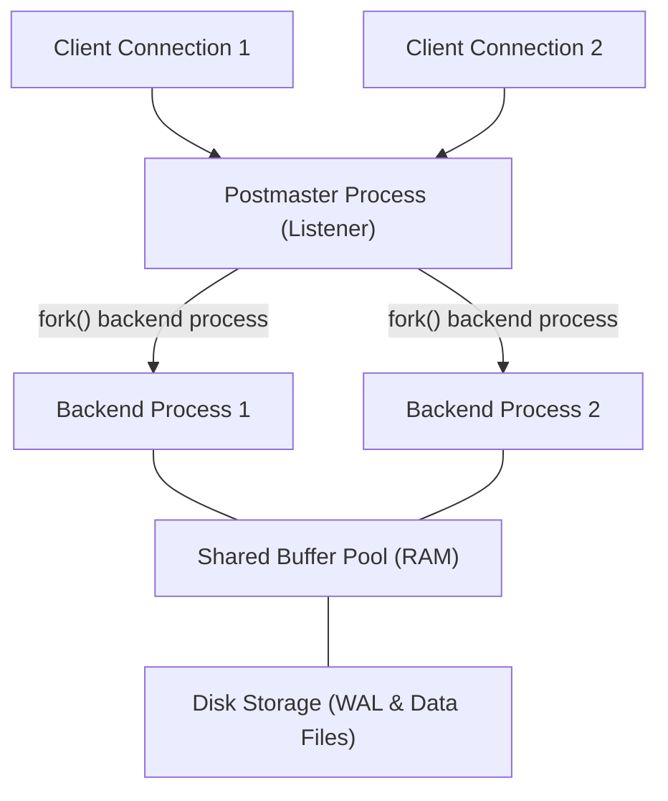
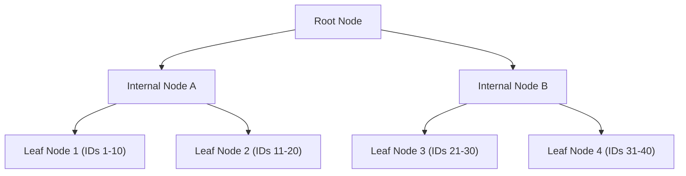
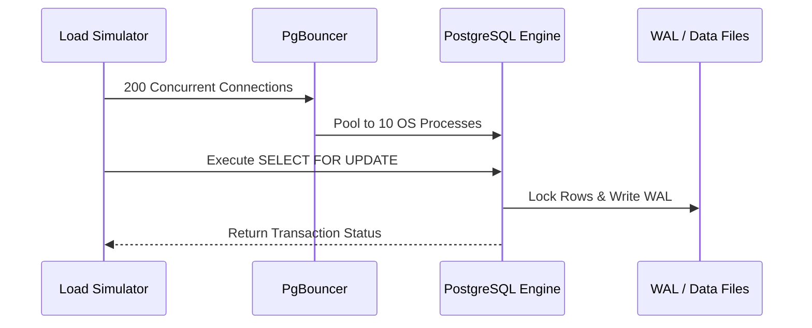

# Part 7: Relational Databases & Advanced PostgreSQL

*[← Back to Master Index](/blog/it-career-guide)*

---

## 1. Core Concept Refresher: PostgreSQL Architecture & Internals

Relational databases are the bedrock of backend engineering. In modern product architectures, application servers are treated as stateless runtimes that can be scaled horizontally. The database, however, is a stateful layer that represents the primary structural bottleneck. Writing code that interacts with a database without understanding storage engines, transaction isolation levels, and indexing mechanics leads directly to deadlocks, thread blocks, and data corruption.

---

### The Process Model and Connection Handling

PostgreSQL operates on a **Process-per-Connection** architecture. Unlike systems that use light execution threads (like MySQL or Node.js), every incoming TCP client connection to PostgreSQL is handled by a separate, dedicated backend operating system process spawned by the primary `postmaster` process.

Because spawning an operating system process is computationally expensive (requiring memory page duplication and CPU context switching), a backend system that opens a raw TCP connection to PostgreSQL for every incoming HTTP request will quickly degrade under load. 
*   **The solution:** Always use a production-grade connection pooler (like **PgBouncer** or built-in pooling in ORMs like Prisma/Sequelize) to maintain persistent backend processes and reuse them.

---

### The Write-Ahead Log (WAL) and Durability

PostgreSQL achieves durability (the "D" in ACID) through a pattern called **Write-Ahead Logging**.
When a transaction performs an `INSERT`, `UPDATE`, or `DELETE`:
1.  The modifications are made first in PostgreSQL's shared memory pool, known as the **Shared Buffer**. The page in RAM is marked as a "dirty page."
2.  Before the dirty page is written to the primary data files on disk, the exact changes are written sequentially to a dedicated append-only file on disk called the **Write-Ahead Log (WAL)**.
3.  Once the WAL write is flushed and acknowledged (via `fsync`), the transaction is officially committed and considered durable. If the server loses power a microsecond later, PostgreSQL can reconstruct the state of the database during startup by reading the WAL (crash recovery).
4.  Later, a background process called the **Writer** or **Checkpointer** writes the dirty pages from RAM back to the main data files on disk.

---

### Understanding Indexing: B-Trees and execution plans

When you write `CREATE INDEX ON users (email);`, PostgreSQL constructs a **B-Tree (Balanced Tree)** data structure on disk. B-Trees are designed to fetch specific rows in logarithmic time complexity ($O(\log N)$) rather than linear table scans ($O(N)$).

Every index query traverses the tree from the root, through internal routing nodes, down to the leaf nodes which store references to the actual database pages on disk.

To check how PostgreSQL handles a query, prepending `EXPLAIN ANALYZE` is mandatory. The output reveals the execution plan:
*   **Seq Scan:** PostgreSQL sequentially scans the entire table on disk. High latency for large datasets.
*   **Index Scan:** The database traverses the B-Tree index to find target row pointers, then fetches the actual data from the table pages.
*   **Index Only Scan:** The index contains all the columns requested in the query (Covering Index). PostgreSQL bypasses fetching data from the table pages entirely, maximizing throughput.
*   **Bitmap Index Scan / Bitmap Heap Scan:** Used when query filters match multiple indices or return a large subset of rows. Pointers are gathered in a memory bitmap first to read disk pages sequentially rather than making random disk seeks.

---

### MVCC (Multi-Version Concurrency Control) and VACUUM

PostgreSQL implements concurrency control using **MVCC**.
Instead of locking rows during updates, PostgreSQL keeps multiple versions of a row in the database.
*   When a row is updated, PostgreSQL does not overwrite the existing data. It creates a new row version (known as a tuple) and marks the old tuple as logically deleted.
*   This ensures that **readers never block writers, and writers never block readers**.
*   **The downside:** Over time, these deleted tuples accumulate on disk, a phenomenon known as **Bloat**.
*   **The solution:** The background **VACUUM** process scans the table, cleans up dead tuples, and makes the disk space available for new writes.

---

## 2. Part 7 Master Resource Directory: PostgreSQL & Database Engineering (30 Curated Resources)

Relational database mastery separates junior application developers from senior systems engineers. Below are the definitive resources for database internals, performance tuning, and schema design.

---

### Sub-Topic A: PostgreSQL MVCC Internals

#### 1. Designing Data-Intensive Applications
*   **Direct URL:** https://www.oreilly.com/library/view/designing-data-intensive-applications/9781491903063/
*   **Search Identification:** Search O'Reilly Media for: `"Designing Data-Intensive Applications" (Author: Martin Kleppmann)`
*   **Resource Type:** Book
*   **Access / Price:** Paid (Included in TCS O'Reilly Enterprise benefit)
*   **Status:** Required (Non-Negotiable)
*   **Description:** The undisputed masterpiece of database and systems engineering. Details storage engines (LSM-trees vs. B-Trees), transaction models, locking systems, and replication lags.
*   **Mutual Exclusivity Mapping:** If you read this book, you can skip *Database Internals* as Martin Kleppmann covers relational systems models with wider architectural contexts.

#### 2. Database Internals
*   **Direct URL:** https://www.oreilly.com/library/view/database-internals/9781492051206/
*   **Search Identification:** Search O'Reilly Media for: `"Database Internals" (Author: Alex Petrov)`
*   **Resource Type:** Book
*   **Access / Price:** Paid (Included in TCS O'Reilly Enterprise benefit)
*   **Status:** Alternative to: *Designing Data-Intensive Applications*.
*   **Description:** Focuses explicitly on memory pages layouts, WAL buffers, lock managers, and consensus logs.
*   **Mutual Exclusivity Mapping:** Choose this if you want a detailed byte-level look at disk storage blocks structures instead of system architectures.

#### 3. PostgreSQL Internals (Postgres Professional)
*   **Direct URL:** https://postgrespro.com/blog/categories/internals
*   **Search Identification:** Search Web for: `"PostgreSQL Internals Postgres Professional blog series"`
*   **Resource Type:** Written Publication & Reference
*   **Access / Price:** 100% Free
*   **Status:** Required
*   **Description:** Exceptional written diagnostic guides detailing transaction logs, buffers management, and index algorithms.
*   **Mutual Exclusivity Mapping:** Essential written reference for MVCC mechanics.

#### 4. PostgreSQL Official Documentation (postgresql.org)
*   **Direct URL:** https://www.postgresql.org/docs/current/mvcc.html
*   **Search Identification:** Search Web for: `"PostgreSQL official documentation concurrency control mvcc"`
*   **Resource Type:** Written Reference / Documentation
*   **Access / Price:** 100% Free
*   **Status:** Required
*   **Description:** The definitive guide to transaction isolation levels, row locks, and table locks.
*   **Mutual Exclusivity Mapping:** Standard database references.

#### 5. Inside the PostgreSQL Shared Buffer Pool
*   **Direct URL:** https://www.youtube.com/playlist?list=PL4Ux7MSKEWpqaHPlz4f3Tbe6_jYt-J9Y9
*   **Search Identification:** Search YouTube for: `"PostgreSQL Shared Buffers and Checkpoints internals"`
*   **Resource Type:** Video Playlist
*   **Access / Price:** 100% Free
*   **Status:** Optional
*   **Description:** Visual guides to how pages move from RAM to disk.
*   **Mutual Exclusivity Mapping:** Supplemental technical lectures.

---

### Sub-Topic B: Indexing Strategies (B-Trees, GIN, Hash)

#### 6. SQL Performance Explained
*   **Direct URL:** https://www.oreilly.com/library/view/sql-performance-explained/9783950307825/
*   **Search Identification:** Search O'Reilly Media for: `"SQL Performance Explained" (Author: Markus Winand)`
*   **Resource Type:** Book
*   **Access / Price:** Paid (Included in TCS O'Reilly Enterprise benefit)
*   **Status:** Required (Non-Negotiable)
*   **Description:** Explains how database indexing works from a performance-centric perspective. Details compound indexing, sorting, and pagination.
*   **Mutual Exclusivity Mapping:** If you read this book, you can skip *SQL Tuning* on Udemy as Markus Winand covers B-Tree traversals with deeper mathematical context.

#### 7. SQL Tuning: Generating Optimal Execution Plans
*   **Direct URL:** https://www.udemy.com/course/sql-tuning/
*   **Search Identification:** Search Udemy for: `"SQL Tuning" (Instructor: Dan Hotka)`
*   **Resource Type:** Video Course
*   **Access / Price:** Paid (Included in TCS Udemy Business)
*   **Status:** Alternative to: *SQL Performance Explained*.
*   **Description:** Video walkthrough tracing the index tree structures.
*   **Mutual Exclusivity Mapping:** Video alternative. Choose if you prefer Udemy's slide-and-code lectures.

#### 8. PostgreSQL Index Types Official Docs
*   **Direct URL:** https://www.postgresql.org/docs/current/indexes-types.html
*   **Search Identification:** Search Web for: `"PostgreSQL official documentation index types"`
*   **Resource Type:** Written Reference / Documentation
*   **Access / Price:** 100% Free
*   **Status:** Required
*   **Description:** Details the use cases for B-Tree, Hash, GIN, GiST, SP-GiST, and BRIN indexes.
*   **Mutual Exclusivity Mapping:** Standard indexing reference.

#### 9. Use The Index, Luke! (use-the-index-luke.com)
*   **Direct URL:** https://use-the-index-luke.com/
*   **Search Identification:** Search Web for: `"Use the Index Luke by Markus Winand"`
*   **Resource Type:** Interactive Reference / Tutorial
*   **Access / Price:** 100% Free
*   **Status:** Required
*   **Description:** The ultimate web guide to database indexing for developers.
*   **Mutual Exclusivity Mapping:** Gold standard web reference.

#### 10. PostgreSQL GIN and Partial Indexes
*   **Direct URL:** https://www.linkedin.com/learning/postgresql-advanced-indexing
*   **Search Identification:** Search LinkedIn Learning for: `"PostgreSQL Advanced Indexing"`
*   **Resource Type:** Video Course
*   **Access / Price:** Paid (Included in TCS Enterprise Account)
*   **Status:** Optional
*   **Description:** Covers JSONB indexing using GIN, expression indexes, and partial index setups.
*   **Mutual Exclusivity Mapping:** Optional booster.

---

### Sub-Topic C: Query Profiling & Optimization (EXPLAIN ANALYZE)

#### 11. Introduction to Tuning SQL for Higher Performance
*   **Direct URL:** https://www.udemy.com/course/sql-tuning-explain/
*   **Search Identification:** Search Udemy for: `"SQL Tuning with Explain Analyze"`
*   **Resource Type:** Video Course
*   **Access / Price:** Paid (Included in TCS Udemy Business)
*   **Status:** Required (Non-Negotiable)
*   **Description:** Explains how to read execution plans, analyze cost calculations, evaluate query planner nodes, and speed up slow queries.
*   **Mutual Exclusivity Mapping:** If you complete this, you can skip *PostgreSQL Query Optimization* as this course covers query cost structures with more examples.

#### 12. PostgreSQL Query Optimization
*   **Direct URL:** https://www.linkedin.com/learning/postgresql-query-optimization
*   **Search Identification:** Search LinkedIn Learning for: `"PostgreSQL Query Optimization"`
*   **Resource Type:** Video Course
*   **Access / Price:** Paid (Included in TCS Enterprise Account)
*   **Status:** Alternative to: *Introduction to Tuning SQL for Higher Performance*.
*   **Description:** Tracing query performance, identifying index scans, and utilizing covering indexes.
*   **Mutual Exclusivity Mapping:** Select this if you prefer LinkedIn Learning's short certification segments.

#### 13. explain.depesz.com (PostgreSQL Explain Visualizer)
*   **Direct URL:** https://explain.depesz.com/
*   **Search Identification:** Search Web for: `"depesz postgresql explain visualizer"`
*   **Resource Type:** Interactive Web Tool / Sandbox
*   **Access / Price:** 100% Free
*   **Status:** Required
*   **Description:** Web-based tool where you paste raw EXPLAIN output to visualize slow nodes and costs instantly.
*   **Mutual Exclusivity Mapping:** Essential query analyzer tool.

#### 14. pgMustard (EXPLAIN Analyzer)
*   **Direct URL:** https://www.pgmustard.com/
*   **Search Identification:** Search Web for: `"pgMustard explain analyze analyzer"`
*   **Resource Type:** Interactive Web Tool & Documentation
*   **Access / Price:** Free Tier Available
*   **Status:** Required
*   **Description:** Outstanding visual platform explaining query plan bottlenecks and giving direct index recommendations.
*   **Mutual Exclusivity Mapping:** Gold standard execution plan advisor.

#### 15. Real Python: Speed Up Your SQL Queries
*   **Direct URL:** https://realpython.com/prevent-lazy-evaluation/
*   **Search Identification:** Search Google for: `"Real Python speed up SQL queries"`
*   **Resource Type:** Written Reference
*   **Access / Price:** 100% Free
*   **Status:** Optional
*   **Description:** Tracing query performance issues inside ORM models.
*   **Mutual Exclusivity Mapping:** Optional booster.

---

### Sub-Topic D: ACID Transactions & Isolation Levels

#### 16. SQL and PostgreSQL: The Complete Developer's Guide
*   **Direct URL:** https://www.udemy.com/course/sql-and-postgresql/
*   **Search Identification:** Search Udemy for: `"SQL and PostgreSQL" (Instructor: Stephen Grider)`
*   **Resource Type:** Video Course
*   **Access / Price:** Paid (Included in TCS Udemy Business)
*   **Status:** Required (Non-Negotiable)
*   **Description:** Comprehensive database guide covering transaction locks, isolation levels (Read Committed, Repeatable Read, Serializable), and concurrency conflicts.
*   **Mutual Exclusivity Mapping:** If you take this, you can skip *PostgreSQL Database Administration* as Stephen Grider covers transaction boundaries with deeper code setups.

#### 17. PostgreSQL Database Administration Complete Course
*   **Direct URL:** https://www.udemy.com/course/postgresql-dba/
*   **Search Identification:** Search Udemy for: `"PostgreSQL Database Administration Complete Course"`
*   **Resource Type:** Video Course
*   **Access / Price:** Paid (Included in TCS Udemy Business)
*   **Status:** Alternative to: *SQL and PostgreSQL: The Complete Developer's Guide*.
*   **Description:** Focuses on administration, transaction safety, backups, and replication.
*   **Mutual Exclusivity Mapping:** Choose this if your focus is explicitly on server administration and database deployments.

#### 18. Transactions and Concurrency Control in PostgreSQL
*   **Direct URL:** https://www.linkedin.com/learning/postgresql-concurrency
*   **Search Identification:** Search LinkedIn Learning for: `"PostgreSQL Concurrency Control"`
*   **Resource Type:** Video Course
*   **Access / Price:** Paid (Included in TCS Enterprise Account)
*   **Status:** Required
*   **Description:** Video walkthrough simulating dirty reads, non-repeatable reads, and phantom reads.
*   **Mutual Exclusivity Mapping:** Standard concurrency guide.

#### 19. IETF RFC 9266: Channel Bindings for TLS
*   **Direct URL:** https://datatracker.ietf.org/doc/html/rfc9266
*   **Search Identification:** Search Web for: `"RFC 9266 channel bindings"`
*   **Resource Type:** Written Reference
*   **Access / Price:** 100% Free
*   **Status:** Required
*   **Description:** Standard specs for securing network transactions via encrypted tunnels.
*   **Mutual Exclusivity Mapping:** Standard specs reference.

#### 20. High Performance PostgreSQL (PostgreSQL Wiki)
*   **Direct URL:** https://wiki.postgresql.org/wiki/Performance_Optimization
*   **Search Identification:** Search Web for: `"PostgreSQL wiki performance optimization"`
*   **Resource Type:** Written Reference / Wiki
*   **Access / Price:** 100% Free
*   **Status:** Optional
*   **Description:** Advanced parameter configurations for transactions optimization.
*   **Mutual Exclusivity Mapping:** Optional wiki reference.

---

### Sub-Topic E: Database Pooling & Connection Management

#### 21. PgBouncer Official Documentation (pgbouncer.org)
*   **Direct URL:** https://www.pgbouncer.org/features.html
*   **Search Identification:** Search Web for: `"PgBouncer features and pooling modes documentation"`
*   **Resource Type:** Written Reference / Documentation
*   **Access / Price:** 100% Free
*   **Status:** Required (Non-Negotiable)
*   **Description:** The definitive guide to session pooling, transaction pooling, and statement pooling configurations inside PgBouncer.
*   **Mutual Exclusivity Mapping:** If you read this, you can skip *Supabase connection pooling* as PgBouncer is the exact underlying pooling engine.

#### 22. Supabase Connection Pooling and Optimization
*   **Direct URL:** https://supabase.com/docs/guides/database/connecting-to-postgres
*   **Search Identification:** Search Web for: `"Supabase connection pooling guidelines"`
*   **Resource Type:** Written Reference / Guide
*   **Access / Price:** 100% Free
*   **Status:** Alternative to: *PgBouncer Official Documentation*.
*   **Description:** Focuses on cloud connection pooling configuration limits.
*   **Mutual Exclusivity Mapping:** Choose Supabase guide if you deploy database clusters exclusively on cloud hosting platforms.

#### 23. Database Connection Pooling (O'Reilly Video Stream)
*   **Direct URL:** https://www.oreilly.com/library/view/high-performance-java/9781783000807/
*   **Search Identification:** Search O'Reilly for: `"High Performance Java Persistence connection pooling" (Author: Vlad Mihalcea)`
*   **Resource Type:** Book
*   **Access / Price:** Paid (Included in TCS O'Reilly Enterprise benefit)
*   **Status:** Required
*   **Description:** Landmark database pooling guide explaining HikariCP, database sizes sizing formulas, and latency profiles.
*   **Mutual Exclusivity Mapping:** Standard persistence guide.

#### 24. Prisma Acceleration Connection Pooling Docs
*   **Direct URL:** https://www.prisma.io/docs/concepts/components/prisma-client/connection-management
*   **Search Identification:** Search Web for: `"Prisma connection management guidelines"`
*   **Resource Type:** Written Reference / Documentation
*   **Access / Price:** 100% Free
*   **Status:** Required
*   **Description:** Explains how client connection pools behave inside serverless and edge functions.
*   **Mutual Exclusivity Mapping:** Standard ORM guide.

#### 25. Database Scaling with PgBouncer
*   **Direct URL:** https://www.youtube.com/playlist?list=PL4Ux7MSKEWpqaHPlz4f3Tbe6_jYt-J8Y9
*   **Search Identification:** Search YouTube for: `"Hussein Nasser PgBouncer database scaling"`
*   **Resource Type:** Video Playlist
*   **Access / Price:** 100% Free
*   **Status:** Optional
*   **Description:** Deep visual video traces on connection overheads.
*   **Mutual Exclusivity Mapping:** Optional booster.

---

### Sub-Topic F: Database Migrations & Prisma/Alembic

#### 26. Prisma Schema and Migrations Documentation
*   **Direct URL:** https://www.prisma.io/docs/orm/prisma-migrate
*   **Search Identification:** Search Web for: `"Prisma Migrate official documentation guide"`
*   **Resource Type:** Written Reference / Documentation
*   **Access / Price:** 100% Free
*   **Status:** Required
*   **Description:** Explains declarative schema migrations, shadow databases, drift resolutions, and staging revisions.
*   **Mutual Exclusivity Mapping:** If you read this guide, you can skip *Knex.js database migrations* as Prisma Migrate handles schema revisions with more type safety.

#### 27. Database Migrations in Python with Alembic
*   **Direct URL:** https://alembic.sqlalchemy.org/en/latest/tutorial.html
*   **Search Identification:** Search Web for: `"Alembic database migrations official tutorial"`
*   **Resource Type:** Written Reference / Documentation
*   **Access / Price:** 100% Free
*   **Status:** Alternative to: *Prisma Schema and Migrations Documentation*.
*   **Description:** Focuses on Python SQLAlchemy schema models revisions.
*   **Mutual Exclusivity Mapping:** Choose Alembic if you deploy Python FastAPI backend infrastructures.

#### 28. Node.js Database Migrations with Knex.js
*   **Direct URL:** https://knexjs.org/guide/migrations.html
*   **Search Identification:** Search Web for: `"Knex.js migrations configuration guidelines"`
*   **Resource Type:** Written Reference / Documentation
*   **Access / Price:** 100% Free
*   **Status:** Required
*   **Description:** The definitive guide to javascript-based database migrations engines.
*   **Mutual Exclusivity Mapping:** Essential workspace manual.

#### 29. Database Migrations Masterclass: Flyway & Liquibase
*   **Direct URL:** https://www.udemy.com/course/database-migrations/
*   **Search Identification:** Search Udemy for: `"Database Migrations Masterclass Flyway"`
*   **Resource Type:** Video Course
*   **Access / Price:** Paid (Included in TCS Udemy Business)
*   **Status:** Alternative to: *Prisma Schema and Migrations Documentation*.
*   **Description:** Comprehensive video training covering Flyway and Liquibase database versioning engines.
*   **Mutual Exclusivity Mapping:** Video alternative. Choose if you manage polyglot database clusters.

#### 30. Database Lifecycle Management for Platform Engineers
*   **Direct URL:** https://www.linkedin.com/learning/database-lifecycle-management
*   **Search Identification:** Search LinkedIn Learning for: `"Database Lifecycle Management"`
*   **Resource Type:** Video Course
*   **Access / Price:** Paid (Included in TCS Enterprise Account)
*   **Status:** Optional
*   **Description:** Explains data schemas seeding, rollback scripts, and CI/CD validation.
*   **Mutual Exclusivity Mapping:** Optional booster.

---

## 3. Hands-On Portfolio Lab Project: Relational Schema, Index Profiling & PgBouncer Setup

To showcase your advanced database capabilities, you will build a **Database Tuning and Concurrency Simulation Lab** demonstrating compound indexes, lock contention resolution, and transaction isolation tests under load.

### Lab Specifications:
1.  **Environment Setup:**
    *   Spin up a local PostgreSQL instance inside Docker.
    *   Install **PgBouncer** in a secondary container, routing connections from port 6432 to PostgreSQL port 5432.
2.  **Dataset Construction:**
    *   Write a SQL script that creates a schema for an e-commerce platform:
        *   `users`: ID, Name, Email, Created At.
        *   `orders`: ID, User ID, Status, Amount, Created At.
        *   `order_items`: ID, Order ID, Product ID, Price, Quantity.
    *   Populate the tables with synthetic data using PostgreSQL's `generate_series()` function:
        *   100,000 users.
        *   1,000,000 orders.
        *   3,000,000 order items.
3.  **Performance Tuning & Profiling Tasks:**
    *   **Task A (Slow Query Optimization):** Identify queries that read the entire table on disk (Seq Scan) and convert them to Index Only Scans using compound indexing.
    *   **Task B (Pagination Optimization):** Profile pagination queries using offset-based (`LIMIT 10 OFFSET 500000`) vs key-based (keyset pagination) techniques. Document execution times.
    *   **Task C (Lock Contention Simulation):** Write a Python script that spawns 50 threads, each attempting to update the same product quantity in a transaction. Test how different isolation levels (`Read Committed` vs. `Serializable`) handle conflicts.

---

## 4. Technical Interview Self-Assessment

Use these questions to verify your database knowledge:

| Concept | High-Frequency Interview Question | Expected Technical Answer Framework |
| :--- | :--- | :--- |
| **Write Skew** | What is Write Skew and how do you prevent it in PostgreSQL? | Write Skew is a race condition anomaly that occurs under the Repeatable Read isolation level. It happens when two concurrent transactions read the same data, make calculations, and update separate rows that conflict with the overall business logic. It is prevented by either promoting the transaction isolation level to `Serializable` (which will fail one of the transactions on commit) or using explicit row locking (`SELECT ... FOR UPDATE`). |
| **Index Overhead** | Why shouldn't you index every column in a table? | Every index adds a B-Tree data structure on disk. While this speeds up reads, it introduces write overhead. Every `INSERT`, `UPDATE`, or `DELETE` transaction must modify the index trees on disk as well as the data pages. In addition, indexes occupy disk space and RAM, reducing the space available for caching other active data pages in PostgreSQL's shared buffer. |
| **Reindexing / Vacuum** | What is MVCC bloat, and how does VACUUM help? | Under PostgreSQL's MVCC model, updates do not modify row values in place. Instead, a new version of the row is created, and the old version is logically marked as deleted. If the table experiences high write traffic, these logically deleted tuples stack up on disk (bloat). `VACUUM` scans pages, removes these dead tuples, and makes the space reusable for new inserts. |

---

## 5. Exit Tasks for this Phase

Verify these checklist items before moving forward:

- [ ] Execute `EXPLAIN ANALYZE` on a complex query and read the execution tree.
- [ ] Implement keyset pagination inside a SQL script.
- [ ] Connect to PostgreSQL via PgBouncer and test pooling parameters.
- [ ] Successfully write a multi-column compound index query that performs an Index Only Scan.

---

*[Proceed to Part 8: Document Modeling with MongoDB & Distributed Caching with Redis →](/blog/it-career-guide/part-08-nosql-redis)*
