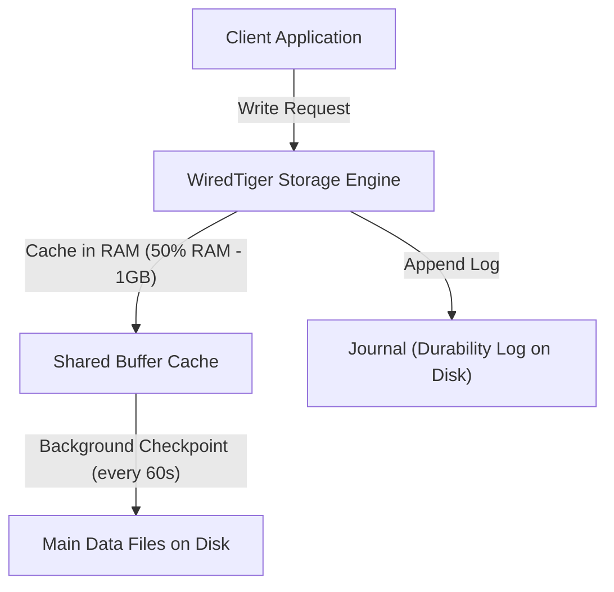

# Part 8: NoSQL & Document Modeling — MongoDB Deep Dive

*[← Back to Master Index](/blog/it-career-guide)*

---

## 1. Core Concept Refresher: Document Databases and WiredTiger

Relational SQL databases (like PostgreSQL) excel at preserving strict, highly normalized tabular schemas with rigid transactional boundaries. However, when application data is hierarchical, unstructured, or rapidly changing, normalization forces heavy joins that degrade query latency. Document-oriented databases, with **MongoDB** as the industry standard, solve this by storing data as self-contained, flexible schema documents.

To succeed in systems architect roles, backend engineers must master how MongoDB stores data on disk and handles memory caching.

---

### BSON (Binary JSON) Serialization Format
Although developers write queries using standard JSON, MongoDB stores and transmits data internally in **BSON (Binary JSON)** format. JSON is a text-based serialization format with parsing overhead (e.g., converting text strings back to floats or dates). BSON is a binary representation that introduces critical advantages:
*   **Speed:** Fast traversal of document structures; fields are prefixed with their length and data type, allowing the query parser to skip unrelated fields without reading the entire document.
*   **Data Types:** Supports additional types that JSON lacks, such as `Date`, `ObjectId` (a 12-byte unique identifier), and `Binary Data`.

---

### WiredTiger Storage Engine Internals
Since MongoDB 3.2, **WiredTiger** has been the default storage engine. It provides the low-level read and write paths to disk. WiredTiger’s architecture includes:
1.  **Document-Level Concurrency Control:** Unlike early MongoDB engines that locked the entire database or collection during writes, WiredTiger uses optimistic concurrency control. It allows multiple client threads to update different documents in a collection concurrently, resorting to thread locks only if two writes target the same document.
2.  **Shared Memory Cache:** Reserves 50% of the server's physical RAM minus 1GB for caching uncompressed data. This memory cache acts as the main hot pool for queries, writing changes to disk in background checkpoint cycles.
3.  **Journaling:** An append-only write-ahead log on disk that ensures durability. Writes are logged to the journal before being flushed to database files.

---

### Document Modeling: Embedding vs. Referencing
In MongoDB schema design, developers must evaluate access patterns to choose between **Embedding** (nesting data within a single document) and **Referencing** (linking documents across collections via IDs):

*   **Embedding (Denormalization):** Storing child data directly inside the parent document (e.g., a `User` document containing an array of `Address` objects).
    *   *Rule of Thumb:* Best for $1:1$ or bounded $1:N$ relationships where the child data is logically dependent on the parent and rarely modified independently. It guarantees that all relevant data is retrieved in a single read.
    *   *The Limit:* A single BSON document **cannot exceed 16MB**. If you embed unbounded arrays (like a `Post` document containing millions of comments), your document will grow until it triggers database exceptions.
*   **Referencing (Normalization):** Storing the `ObjectId` of the target document in another collection, mimicking a relational foreign key.
    *   *Rule of Thumb:* Best for unbounded $1:N$ or $M:N$ relationships where child data is large or frequently updated independently.

---

## 2. MongoDB Master Resource Directory (30 Curated Resources)

Mastering MongoDB requires a balance of database administration courses, schema design guides, and performance tuning manuals. Below is the directory to master this stack.

---

### Sub-Topic A: BSON & WiredTiger Storage Engine Internals

#### 1. MongoDB: The Definitive Guide (3rd Edition)
*   **Direct URL:** https://www.oreilly.com/library/view/mongodb-the-definitive/9781492054108/
*   **Search Identification:** Search O'Reilly Media for: `"MongoDB: The Definitive Guide" (Authors: Shannon Bradshaw, Kristina Chodorow)`
*   **Resource Type:** Book
*   **Access / Price:** Paid (Included in TCS O'Reilly Enterprise benefit)
*   **Status:** Required (Non-Negotiable)
*   **Description:** The ultimate reference manual. Chapters 1–3 detail BSON formats, storage layouts, and basic query engines.
*   **Mutual Exclusivity Mapping:** If you read this, you can skip *MongoDB Essentials* as this book covers internal bytes with deeper detail.

#### 2. Advanced MongoDB: WiredTiger Internals
*   **Direct URL:** https://www.linkedin.com/learning/advanced-mongodb-internals
*   **Search Identification:** Search LinkedIn Learning for: `"Advanced MongoDB Internals" (Instructor: Erin Allard)`
*   **Resource Type:** Video Course
*   **Access / Price:** Paid (Included in TCS Enterprise Account)
*   **Status:** Required
*   **Description:** Video walkthrough detailing memory page allocations, transaction logs, and checkpoint sweeps in WiredTiger.
*   **Mutual Exclusivity Mapping:** Essential video companion for database mechanics.

#### 3. WiredTiger Storage Engine Official Manual
*   **Direct URL:** https://source.wiredtiger.com/develop/index.html
*   **Search Identification:** Search Web for: `"WiredTiger Developer Suite official documentation"`
*   **Resource Type:** Written Reference / Documentation
*   **Access / Price:** 100% Free
*   **Status:** Required
*   **Description:** Raw C++ architecture specifications behind page eviction, block management, and memory allocations.
*   **Mutual Exclusivity Mapping:** Standard reference index.

#### 4. MongoDB Storage Engine Deep Dive (Udemy)
*   **Direct URL:** https://www.udemy.com/course/mongodb-administration/
*   **Search Identification:** Search Udemy for: `"MongoDB Administration and Internals"`
*   **Resource Type:** Video Course
*   **Access / Price:** Paid (Included in TCS Udemy Business)
*   **Status:** Alternative to: *Advanced MongoDB: WiredTiger Internals*.
*   **Description:** Focused course covering internal cache sizing, journaling limits, and disk compaction strategies.
*   **Mutual Exclusivity Mapping:** Alternative choice if your focus is explicitly administrative.

#### 5. BSON Specification Manual
*   **Direct URL:** https://bsonspec.org/
*   **Search Identification:** Search Web for: `"BSON binary serialization specification version 1.1"`
*   **Resource Type:** Written Reference / Spec Sheet
*   **Access / Price:** 100% Free
*   **Status:** Optional
*   **Description:** Low-level specification mapping how integer, boolean, and date bytes are organized in memory buffers.
*   **Mutual Exclusivity Mapping:** Optional technical reference.

---

### Sub-Topic B: Document Modeling (Embedding vs. Referencing)

#### 6. MongoDB Applied Design Patterns
*   **Direct URL:** https://www.oreilly.com/library/view/mongodb-applied-design/9781449340049/
*   **Search Identification:** Search O'Reilly Media for: `"MongoDB Applied Design Patterns" (Author: Rick Copeland)`
*   **Resource Type:** Book
*   **Access / Price:** Paid (Included in TCS O'Reilly Enterprise benefit)
*   **Status:** Required (Non-Negotiable)
*   **Description:** Landmark textbook illustrating schema modeling patterns (Polymorphic, Schema Versioning, Bucket, Attribute, and Subset patterns) across industries.
*   **Mutual Exclusivity Mapping:** If you read this, you can skip *Schema Design Patterns on Udemy* as Rick Copeland provides much wider industry case studies.

#### 7. MongoDB University: M320 - MongoDB Data Modeling
*   **Direct URL:** https://learn.mongodb.com/courses/m320-mongodb-data-modeling
*   **Search Identification:** Search Google/Web for: `"MongoDB learn course M320 Data Modeling"`
*   **Resource Type:** Written & Hands-On Lab Course
*   **Access / Price:** 100% Free
*   **Status:** Required (Highly Recommended)
*   **Description:** The official course mapping embedding ratios, referencing bounds, schema anti-patterns, and calculation of read/write costs.
*   **Mutual Exclusivity Mapping:** Essential database certification path.

#### 8. Data Modeling for MongoDB (Udemy)
*   **Direct URL:** https://www.udemy.com/course/mongodb-data-modeling/
*   **Search Identification:** Search Udemy for: `"Data Modeling for MongoDB"`
*   **Resource Type:** Video Course
*   **Access / Price:** Paid (Included in TCS Udemy Business)
*   **Status:** Alternative to: *M320 - MongoDB Data Modeling*.
*   **Description:** Practical walks modeling e-commerce catalogs and message boards using embedding structures.
*   **Mutual Exclusivity Mapping:** Shorter video alternative.

#### 9. Schema Validation in MongoDB
*   **Direct URL:** https://www.linkedin.com/learning/mongodb-schema-validation
*   **Search Identification:** Search LinkedIn Learning for: `"MongoDB Schema Validation"`
*   **Resource Type:** Video Course
*   **Access / Price:** Paid (Included in TCS Enterprise Account)
*   **Status:** Required
*   **Description:** Implementing JSON Schema validators directly in MongoDB to enforce strict structural types on writes.
*   **Mutual Exclusivity Mapping:** Essential validation guide.

#### 10. Awesome MongoDB Schema Design Patterns (GitHub)
*   **Direct URL:** https://github.com/mongodb/developer-resources
*   **Search Identification:** Search GitHub for: `"mongodb developer-resources schema design patterns"`
*   **Resource Type:** Written Case Studies / Repositories
*   **Access / Price:** 100% Free
*   **Status:** Optional
*   **Description:** Code templates demonstrating how bucket patterns optimize time-series metrics storage.
*   **Mutual Exclusivity Mapping:** Supplemental library.

---

### Sub-Topic C: High-Performance Compound Indexing

#### 11. MongoDB University: M201 - MongoDB Performance
*   **Direct URL:** https://learn.mongodb.com/courses/m201-mongodb-performance
*   **Search Identification:** Search Google/Web for: `"MongoDB learn course M201 Performance"`
*   **Resource Type:** Interactive Lab Course
*   **Access / Price:** 100% Free
*   **Status:** Required (Non-Negotiable)
*   **Description:** Crucial training detailing execution stats, covering single field, compound index, and geospatial indexes.
*   **Mutual Exclusivity Mapping:** If you complete this, you can skip *Index Tuning on LinkedIn* as M201 covers query analyzers with higher authority.

#### 12. Performance Tuning in MongoDB
*   **Direct URL:** https://www.linkedin.com/learning/performance-tuning-in-mongodb
*   **Search Identification:** Search LinkedIn Learning for: `"Performance Tuning in MongoDB" (Instructor: Barron Stone)`
*   **Resource Type:** Video Course
*   **Access / Price:** Paid (Included in TCS Enterprise Account)
*   **Status:** Alternative to: *M201 - MongoDB Performance*.
*   **Description:** Identifying slow queries using query logs, index scans, and collection sweeps.
*   **Mutual Exclusivity Mapping:** Shorter video alternative.

#### 13. MongoDB Indexing Strategies (O'Reilly Video)
*   **Direct URL:** https://www.oreilly.com/library/view/mongodb-indexing-strategies/9781491979921/
*   **Search Identification:** Search O'Reilly Media for: `"MongoDB Indexing Strategies"`
*   **Resource Type:** Video Lecture
*   **Access / Price:** Paid (Included in TCS O'Reilly Enterprise benefit)
*   **Status:** Required
*   **Description:** Details the Equality, Sort, Range (ESR) rule for compiling multi-key compound indexes.
*   **Mutual Exclusivity Mapping:** Critical design rule checklist.

#### 14. MongoDB Indexing Cheat Sheet (Awesome Guides)
*   **Direct URL:** https://www.mongodb.com/docs/manual/indexes/
*   **Search Identification:** Search Web for: `"MongoDB official documentation index manual types"`
*   **Resource Type:** Written Reference / Manual
*   **Access / Price:** 100% Free
*   **Status:** Required
*   **Description:** Lists details for partial indexes, TTL indexes, sparse indexes, and hashed indexes.
*   **Mutual Exclusivity Mapping:** Standard query reference.

#### 15. MongoDB Explain Analyzer Sandbox
*   **Direct URL:** https://www.mongodb.com/products/tools/compass
*   **Search Identification:** Search Web for: `"MongoDB Compass visual explain plans tuning"`
*   **Resource Type:** Desktop Client / Interactive Diagnostic
*   **Access / Price:** 100% Free
*   **Status:** Optional
*   **Description:** GUI visualizer translating raw JSON explain statistics into node charts.
*   **Mutual Exclusivity Mapping:** Standard diagnostic sandbox.

---

### Sub-Topic D: Aggregation Pipeline & Analytics

#### 16. MongoDB - The Complete Developer's Guide (Udemy)
*   **Direct URL:** https://www.udemy.com/course/mongodb-the-complete-developers-guide/
*   **Search Identification:** Search Udemy for: `"MongoDB - The Complete Developer's Guide" (Instructor: Maximilian Schwarzmüller)`
*   **Resource Type:** Video Course
*   **Access / Price:** Paid (Included in TCS Udemy Business)
*   **Status:** Required (Non-Negotiable)
*   **Description:** The leading video course covering aggregation operations (`$match`, `$group`, `$project`, `$unwind`, `$lookup`) and database schemas.
*   **Mutual Exclusivity Mapping:** Essential frontend-to-backend database guide.

#### 17. Learning MongoDB (LinkedIn Learning)
*   **Direct URL:** https://www.linkedin.com/learning/learning-mongodb-14392688
*   **Search Identification:** Search LinkedIn Learning for: `"Learning MongoDB" (Instructor: Justin Yost)`
*   **Resource Type:** Video Course
*   **Access / Price:** Paid (Included in TCS Enterprise Account)
*   **Status:** Alternative to: *MongoDB - The Complete Developer's Guide*.
*   **Description:** Fast overview of basic query layouts, filter stages, and document joins.
*   **Mutual Exclusivity Mapping:** Shorter video alternative.

#### 18. MongoDB Aggregation Framework manual
*   **Direct URL:** https://www.mongodb.com/docs/manual/aggregation/
*   **Search Identification:** Search Web for: `"MongoDB official documentation aggregation pipeline guide"`
*   **Resource Type:** Written Reference / Documentation
*   **Access / Price:** 100% Free
*   **Status:** Required
*   **Description:** The ultimate source of truth for query stages, operators, and pipeline performance limits (such as the 100MB RAM limit per stage).
*   **Mutual Exclusivity Mapping:** Standard specification reference.

#### 19. Practical MongoDB Aggregations Book
*   **Direct URL:** https://www.practical-mongodb-aggregations.com/
*   **Search Identification:** Search Google/Web for: `"Practical MongoDB Aggregations book by Paul Done"`
*   **Resource Type:** Book / Interactive Guide
*   **Access / Price:** 100% Free
*   **Status:** Required
*   **Description:** Outstanding collection of real-world aggregation templates, array manipulations, and performance optimization guides.
*   **Mutual Exclusivity Mapping:** Essential cookbook reference.

#### 20. Aggregation Pipeline Builder Sandbox
*   **Direct URL:** https://www.mongodb.com/products/tools/atlas-charts
*   **Search Identification:** Search Web for: `"MongoDB Atlas Charts dashboard analytics builder"`
*   **Resource Type:** Cloud Analytics / Visual Playground
*   **Access / Price:** Free Tier Available
*   **Status:** Optional
*   **Description:** Build complex charts by visually designing multi-stage aggregation runs.
*   **Mutual Exclusivity Mapping:** Optional data analytics playground.

---

### Sub-Topic E: MongoDB Replica Sets & Write Concerns

#### 21. MongoDB Replica Sets Deep Dive (O'Reilly Video)
*   **Direct URL:** https://www.oreilly.com/library/view/mongodb-replica-sets/9781491979891/
*   **Search Identification:** Search O'Reilly Media for: `"MongoDB Replica Sets and Clustering"`
*   **Resource Type:** Video Course
*   **Access / Price:** Paid (Included in TCS O'Reilly Enterprise benefit)
*   **Status:** Required (Non-Negotiable)
*   **Description:** High-end guide explaining primary elections, heartbeats, read preferences, and write concern configurations (`w:1`, `w:majority`, `j:true`).
*   **Mutual Exclusivity Mapping:** If you complete this, you can skip general LinkedIn replication lessons as this covers failover mechanics in full detail.

#### 22. Designing Scalable MongoDB Clusters
*   **Direct URL:** https://www.linkedin.com/learning/designing-scalable-databases
*   **Search Identification:** Search LinkedIn Learning for: `"Designing Scalable Databases" (Instructor: Barron Stone)`
*   **Resource Type:** Video Course
*   **Access / Price:** Paid (Included in TCS Enterprise Account)
*   **Status:** Required
*   **Description:** Visual guide mapping active database configurations, failovers, and secondary sync delays.
*   **Mutual Exclusivity Mapping:** Essential system architecture companion.

#### 23. MongoDB Replica Set Official Deployment Manual
*   **Direct URL:** https://www.mongodb.com/docs/manual/replication/
*   **Search Identification:** Search Web for: `"MongoDB official documentation replication replication manual"`
*   **Resource Type:** Written Reference / Documentation
*   **Access / Price:** 100% Free
*   **Status:** Required
*   **Description:** Configurations for deployment of primary, secondary, and arbiter nodes.
*   **Mutual Exclusivity Mapping:** Standard reference index.

#### 24. High Availability MongoDB (Udemy)
*   **Direct URL:** https://www.udemy.com/course/high-availability-mongodb/
*   **Search Identification:** Search Udemy for: `"High Availability MongoDB"`
*   **Resource Type:** Video Course
*   **Access / Price:** Paid (Included in TCS Udemy Business)
*   **Status:** Alternative to: *MongoDB Replica Sets Deep Dive*.
*   **Description:** Focused course covering failover thresholds, election configurations, and networking setup for replica sets.
*   **Mutual Exclusivity Mapping:** Alternative choice for deployment engineers.

#### 25. MongoDB Atlas Cluster Playground
*   **Direct URL:** https://www.mongodb.com/cloud/atlas/register
*   **Search Identification:** Search Web for: `"MongoDB Atlas free tier cluster registration"`
*   **Resource Type:** Cloud Deployment / Sandbox
*   **Access / Price:** Free Tier Available
*   **Status:** Required
*   **Description:** Provision a free 3-node replica set in the cloud to test automatic failover triggers and latency delays.
*   **Mutual Exclusivity Mapping:** Baseline cloud testing grounds.

---

### Sub-Topic F: Sharding & Horizontal Partitioning

#### 26. Scaling MongoDB: Sharding and Clusters (O'Reilly Video)
*   **Direct URL:** https://www.oreilly.com/library/view/scaling-mongodb-sharding/9781491979952/
*   **Search Identification:** Search O'Reilly Media for: `"Scaling MongoDB: Sharding and Clusters"`
*   **Resource Type:** Video Course
*   **Access / Price:** Paid (Included in TCS O'Reilly Enterprise benefit)
*   **Status:** Required (Non-Negotiable)
*   **Description:** Deep dive into how MongoDB partitions databases horizontally using mongos routing engines, config servers, and chunk balancers.
*   **Mutual Exclusivity Mapping:** If you take this, you can skip Pluralsight's general scaling modules as this covers shard key selection math.

#### 27. MongoDB Atlas: Cloud Sharding & Clustering
*   **Direct URL:** https://www.linkedin.com/learning/mongodb-atlas-cloud-sharding
*   **Search Identification:** Search LinkedIn Learning for: `"MongoDB Atlas Cloud Sharding"`
*   **Resource Type:** Video Course
*   **Access / Price:** Paid (Included in TCS Enterprise Account)
*   **Status:** Required
*   **Description:** Setting up and autoscaling global shard distributions inside cloud architectures.
*   **Mutual Exclusivity Mapping:** Essential cloud scaling guide.

#### 28. MongoDB Official Sharding Reference Guide
*   **Direct URL:** https://www.mongodb.com/docs/manual/sharding/
*   **Search Identification:** Search Web for: `"MongoDB official documentation sharding guide"`
*   **Resource Type:** Written Reference / Documentation
*   **Access / Price:** 100% Free
*   **Status:** Required
*   **Description:** The ultimate source of truth for sharding ranges, hashed sharding keys, and balancing operations.
*   **Mutual Exclusivity Mapping:** Standard reference index.

#### 29. Designing Shard Keys for High Traffic MongoDB (Udemy)
*   **Direct URL:** https://www.udemy.com/course/scaling-mongodb-databases/
*   **Search Identification:** Search Udemy for: `"Scaling MongoDB Databases"`
*   **Resource Type:** Video Course
*   **Access / Price:** Paid (Included in TCS Udemy Business)
*   **Status:** Alternative to: *Scaling MongoDB: Sharding and Clusters*.
*   **Description:** Mathematical guidelines for selecting shard keys with high cardinality and even distribution.
*   **Mutual Exclusivity Mapping:** Focused engineering alternative.

#### 30. Local Sharded Cluster Docker Sandbox (Awesome Compose)
*   **Direct URL:** https://github.com/docker/awesome-compose/tree/master/mongodb-sharded
*   **Search Identification:** Search GitHub for: `"docker awesome-compose mongodb-sharded"`
*   **Resource Type:** Interactive Code Template / Infrastructure-as-Code
*   **Access / Price:** 100% Free
*   **Status:** Optional
*   **Description:** Provision a complete local sharded cluster (config servers, mongos router, two shards) using a single Docker Compose script.
*   **Mutual Exclusivity Mapping:** Standard local scaling playground.

---

## 3. Hands-On Portfolio Lab Project: Compound Indexing & Aggregation Engine

To demonstrate your database engineering and NoSQL optimization capabilities to product-firm recruiters, you must build and commit a **NoSQL Document Schema and Aggregation Optimizer Repository** to your public GitHub profile (`github.com/chirag127`).

### The Lab Project Guidelines:
1.  **System Target:** You will construct a high-throughput **E-commerce Analytics Service** using Python, `pymongo`, and MongoDB Atlas.
2.  **Dataset Construction:**
    *   Write a seed script that generates **100,000 mock Order documents**.
    *   Each document must contain `userId`, `items` (array of objects with `productId`, `category`, `price`, `qty`), `status` ("pending", "completed", "cancelled"), `orderDate`, and `paymentDetails` (embedded subdocument).
3.  **Aggregation Performance Test:**
    *   Write a complex aggregation pipeline to fetch the **Top 5 Users by Revenue** who ordered items in the "Electronics" category with a "completed" status in the last 30 days.
    *   The pipeline must look like:
        `$match` (status/date) $\rightarrow$ `$unwind` (items) $\rightarrow$ `$match` (category) $\rightarrow$ `$group` (by user sum total) $\rightarrow$ `$sort` $\rightarrow$ `$limit`.
4.  **Diagnostic Tuning:**
    *   Execute the aggregation pipeline and capture execution metrics using the `.explain("executionStats")` command. Record the **Execution Time** (in milliseconds) and the number of documents examined (`totalDocsExamined`).
    *   Observe the query planner choosing a **COLLSCAN** (Collection Scan) since no indexes exist.
5.  **Index Optimization:**
    *   Apply the Equality, Sort, Range (ESR) rule to create a high-performance **Compound Index** on the collection:
        `db.orders.createIndex({"status": 1, "orderDate": -1, "items.category": 1})`
    *   Re-run the `.explain("executionStats")` pipeline.
    *   Verify that the query planner now uses an **IXSCAN** (Index Scan) node, showing execution times dropping towards **$<2\text{ms}$** and `totalDocsExamined` dropping to match the exact output document subset size.
6.  **GitHub Commitment:** Commit the complete Python optimizer script (`mongo_tuner.py`), raw JSON explain outputs (before and after indexing), and a `README.md` containing performance comparison tables to your public `2026-upskilling-roadmap` repository.

---

## 4. Technical Interview Self-Assessment

Use these questions to verify if you have successfully digested the principles of this NoSQL chapter:

| Concept | High-Frequency Interview Question | Expected Technical Answer Framework |
| :--- | :--- | :--- |
| **ESR Indexing Rule** | Explain the ESR (Equality, Sort, Range) rule when designing a MongoDB compound index. | The **ESR rule** dictates the correct order of fields in a compound index: **1. Equality:** Place fields that undergo exact equality matches first (e.g. `status: "active"`). **2. Sort:** Place fields that determine sorting order next (e.g. `orderDate: -1`). **3. Range:** Place fields that undergo range queries last (e.g. `price: {$gt: 100}`). Ordering this way ensures the index handles equalities, avoids sorting in RAM (in-memory blocking sort), and filters ranges at the end, maximizing throughput. |
| **16MB BSON Limit** | What happens when a MongoDB document exceeds the 16MB BSON limit, and how do you mitigate this? | If a document mutation (like pushing an item to an array) causes the size to exceed **16MB**, MongoDB rejects the write and throws a system error. To mitigate this: **1. Subset Pattern:** Keep only the most recent $N$ items embedded, moving older entries to a referenced historical collection. **2. Document References:** Fully normalize the relationship by splitting the array entries into independent documents in a separate collection, using `ObjectId` links and resolving queries using `$lookup` stages. |
| **WiredTiger Cache** | Why is configuring WiredTiger cache sizes critical in containers, and what happens if memory limits are ignored? | By default, WiredTiger reserves **50% of physical RAM minus 1GB** for its uncompressed cache. If MongoDB runs inside a Docker/Kubernetes container with a memory limit (e.g., restricted to 4GB RAM) but WiredTiger checks the host machine's total RAM (e.g., 32GB), it will attempt to allocate a cache far larger than the container's limits. This triggers the host system's Out-Of-Memory (OOM) killer, immediately crashing the database container. |

---

## 5. Exit Tasks for this Phase

Complete these verification steps before proceeding to Part 9:

- [ ] Provisions a free-tier MongoDB Atlas cluster or sets up a local Docker database container.
- [ ] Successfully loads the 100,000 document mock dataset and runs the baseline explain diagnostic.
- [ ] Deploys the compound index using the ESR rule and records before/after query plans.
- [ ] Commits `mongo_tuner.py` and the explain logs to your public Git repository.

---

*[Proceed to Part 9: In-Memory Databases & Caching — Redis →](/blog/it-career-guide/part-09-redis-caching)*