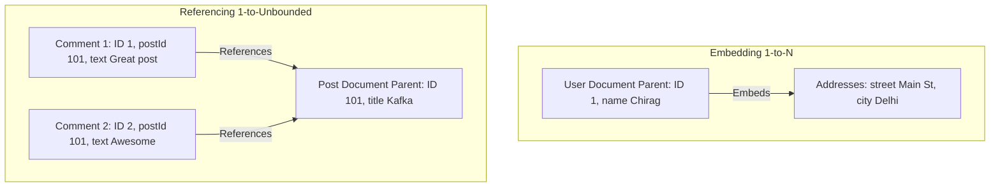
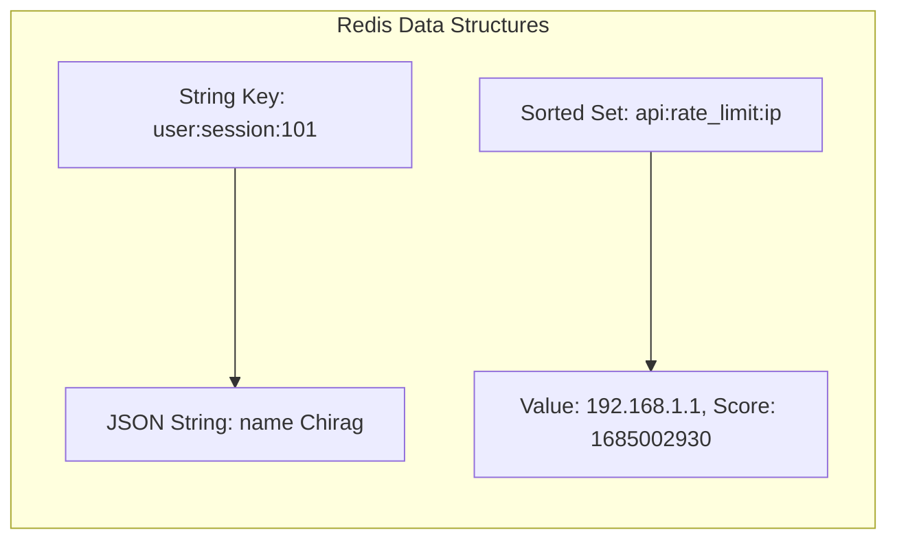
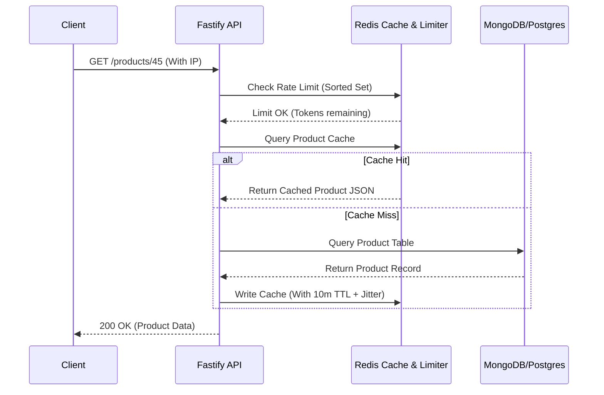

# Part 8: NoSQL Databases (MongoDB & Redis Caching)

*[← Back to Master Index](/blog/it-career-guide)*

---

## 1. Core Concept Refresher: Document Stores vs. In-Memory Caches

Relational databases excel at maintaining rigid structures and data integrity, but their scaling properties degrade under massive, unpredictable write loads or high-concurrency request spikes. To build systems that handle millions of users, backend developers must utilize secondary database systems: **NoSQL Document Databases** (like MongoDB) and **In-Memory Key-Value Caches** (like Redis).

---

### MongoDB Internals: BSON, WiredTiger, and Document Modeling

MongoDB stores data as **BSON (Binary JSON)** documents. BSON extends JSON to support additional data types (like `Date`, `ObjectId`, and `Binary Data`) and allows for fast parsing inside the database engine.

Unlike PostgreSQL's process-per-connection model, MongoDB uses the **WiredTiger storage engine**, which handles concurrent queries using multi-threaded execution and optimistic concurrency control. Key aspects of WiredTiger include:
*   **Document-Level Locking:** Multiple clients can write to different documents inside a single collection simultaneously without blocking each other.
*   **Compression:** Data and indexes are compressed in memory and on disk, reducing storage footprint.
*   **Shared Buffer Cache:** WiredTiger reserves 50% of the server's RAM minus 1GB for caching documents and indexes, reducing disk reads.

#### Document Modeling: Embedding vs. Referencing
In relational SQL, normalize-first is the default pattern. In NoSQL, design-for-access is the golden rule:
*   **Embedding (Denormalization):** Storing child data directly inside the parent document as an array or nested object. Best for $1:1$ or bounded $1:N$ relationships (e.g., a user and their shipping addresses). It guarantees that all relevant data can be retrieved in a single disk seek.
*   **Referencing (Normalization):** Storing the `ObjectId` of the target document in another collection. Best for unbounded $1:N$ (e.g., a post and millions of comments) or $M:N$ relationships. It prevents documents from exceeding MongoDB's strict **16MB limit** and avoids performance degradation from massive document mutations.

---

### Redis Caching Topologies & Data Structures

Redis is a single-threaded, in-memory key-value data store. Because it runs in memory, read and write operations execute in sub-millisecond durations ($<1\text{ms}$). Redis is single-threaded to avoid lock contention overhead, relying on the OS non-blocking multiplexed I/O loop (`epoll`) to handle tens of thousands of concurrent client requests.

#### Primary Redis Data Structures:
1.  **Strings:** Basic key-values. Max size: 512MB. Used for session data and HTML fragments.
2.  **Hashes:** Fields and values. Perfect for representing database object profiles.
3.  **Lists:** Ordered collections of strings. Used as simple message queues.
4.  **Sets:** Unordered collections of unique strings. Perfect for tracking unique user visitors.
5.  **Sorted Sets (ZSETs):** Sets where every member is associated with a numeric score. Members are kept ordered by score. Essential for leaderboards and rate limiters.

---

### Cache Update Policies & Mitigation Strategies

When implementing Redis as a cache in front of a primary database (like PostgreSQL), you must choose an update topology:

*   **Cache-Aside (Lazy Loading):**
    1.  The application receives a read request.
    2.  It queries Redis. If the key exists (Cache Hit), return the data.
    3.  If the key is missing (Cache Miss), query the primary database, write the result to Redis with a Time-To-Live (TTL), and return the data.
*   **Write-Through:**
    1.  The application writes data.
    2.  It writes first to the cache, then to the database, ensuring consistency at the cost of write latency.

#### Cache Failures and Mitigation:
*   **Cache Penetration:** Requests target keys that never exist in the database (e.g., malicious requests targeting ID `-999`). Since these are cache misses, they hit the primary database every time, overloading it.
    *   *Solution:* Store empty/null placeholders in the cache with a short TTL, or use a **Bloom Filter** to reject invalid keys before hitting the cache.
*   **Cache Avalanche:** Multiple cached keys expire at the exact same second, or the Redis container crashes. All incoming traffic routes to the primary database, crashing it.
    *   *Solution:* Add a random "jitter" to TTL expirations (e.g., `3600 + random(0, 300)` seconds) so keys expire at staggered intervals.
*   **Cache Stampede (Thundering Herd):** A highly popular cached key expires. Multiple concurrent request threads observe a cache miss and all execute the same heavy database query simultaneously.
    *   *Solution:* Implement locking mechanisms, or pre-warm keys in the background before they expire.

---

## 2. Part 8 Master Resource Directory: NoSQL & Distributed Caching (30 Curated Resources)

Transitioning developers must understand when to use SQL vs NoSQL, and how to apply caching without introducing data inconsistencies. Below are the top resources.

---

### Sub-Topic A: Cache-Aside & Write-Through Topologies

#### 1. Designing Data-Intensive Applications
*   **Direct URL:** https://www.oreilly.com/library/view/designing-data-intensive-applications/9781491903063/
*   **Search Identification:** Search O'Reilly Media for: `"Designing Data-Intensive Applications" (Author: Martin Kleppmann)`
*   **Resource Type:** Book
*   **Access / Price:** Paid (Included in TCS O'Reilly Enterprise benefit)
*   **Status:** Required (Non-Negotiable)
*   **Description:** The undisputed masterpiece of database architectures. Explains consistency limits, write pathways, and caching boundaries.
*   **Mutual Exclusivity Mapping:** If you read this book, you can skip *Redis Enterprise Caching* on O'Reilly as Martin covers basic caching topologies with wider architectural scope.

#### 2. Redis Caching Topologies and Architectures
*   **Direct URL:** https://www.linkedin.com/learning/redis-caching-topologies
*   **Search Identification:** Search LinkedIn Learning for: `"Redis Caching Topologies and Architectures"`
*   **Resource Type:** Video Course
*   **Access / Price:** Paid (Included in TCS Enterprise Account)
*   **Status:** Required
*   **Description:** Video series detailing Cache-Aside, Write-Through, Write-Behind queues configurations.
*   **Mutual Exclusivity Mapping:** Required video companion.

#### 3. System Design Primer Caching Guide by Donne Martin
*   **Direct URL:** https://github.com/donnemartin/system-design-primer#caching
*   **Search Identification:** Search GitHub for: `"donnemartin system-design-primer caching"`
*   **Resource Type:** Interactive Graph Reference
*   **Access / Price:** 100% Free
*   **Status:** Required
*   **Description:** Exceptional quick reference detailing eviction policies (LRU, LFU) and caching parameters.
*   **Mutual Exclusivity Mapping:** Essential checklist reference.

#### 4. Caching Strategies on AWS Redis
*   **Direct URL:** https://www.udemy.com/course/aws-redis-caching/
*   **Search Identification:** Search Udemy for: `"AWS Redis Caching"`
*   **Resource Type:** Video Course
*   **Access / Price:** Paid (Included in TCS Udemy Business)
*   **Status:** Alternative to: *Redis Caching Topologies and Architectures*.
*   **Description:** Setting up Redis ElastiCache with Cache-Aside configurations.
*   **Mutual Exclusivity Mapping:** Choose this if your focus is explicitly on AWS cloud deployments.

#### 5. Redis Enterprise Caching Patterns
*   **Direct URL:** https://redis.io/solutions/caching/
*   **Search Identification:** Search Web for: `"Redis solutions caching patterns official manual"`
*   **Resource Type:** Written Reference / Documentation
*   **Access / Price:** 100% Free
*   **Status:** Optional
*   **Description:** Official guidelines for data structures configurations.
*   **Mutual Exclusivity Mapping:** Standard guide.

---

### Sub-Topic B: Redis In-Memory Data Structures

#### 6. RU101: Introduction to Redis Data Structures
*   **Direct URL:** https://university.redis.io/courses/ru101/
*   **Search Identification:** Search Web for: `"Redis University RU101 official course portal"`
*   **Resource Type:** Video Course & Labs
*   **Access / Price:** 100% Free
*   **Status:** Required (Non-Negotiable)
*   **Description:** The premier video guide to hashes, sets, sorted sets, lists, strings, and keys sizing calculations.
*   **Mutual Exclusivity Mapping:** If you take this, you can skip *Redis Crash Course for Developers* as RU101 covers C-level memory structures with deeper context.

#### 7. Redis Crash Course for Developers
*   **Direct URL:** https://www.udemy.com/course/redis-crash-course/
*   **Search Identification:** Search Udemy for: `"Redis Crash Course for Developers"`
*   **Resource Type:** Video Course
*   **Access / Price:** Paid (Included in TCS Udemy Business)
*   **Status:** Alternative to: *RU101: Introduction to Redis Data Structures*.
*   **Description:** Video walkthrough configuring local caches, lists, and basic keys.
*   **Mutual Exclusivity Mapping:** Choose this if you want a fast, concise Udemy-based overview.

#### 8. Redis Essentials
*   **Direct URL:** https://www.oreilly.com/library/view/redis-essentials/9781785281853/
*   **Search Identification:** Search O'Reilly Media for: `"Redis Essentials" (Authors: Maxwell Dayvson Da Silva, Hugo Lopes Tavares)`
*   **Resource Type:** Book
*   **Access / Price:** Paid (Included in TCS O'Reilly Enterprise benefit)
*   **Status:** Required
*   **Description:** Landmark guide explaining Sorted Sets algorithms and memory configurations.
*   **Mutual Exclusivity Mapping:** Required baseline reference.

#### 9. Learning Redis (LinkedIn Learning)
*   **Direct URL:** https://www.linkedin.com/learning/learning-redis-14389146
*   **Search Identification:** Search LinkedIn Learning for: `"Learning Redis" (Instructor: Broadus)`
*   **Resource Type:** Video Course
*   **Access / Price:** Paid (Included in TCS Enterprise Account)
*   **Status:** Optional
*   **Description:** Visual guides to Redis CLI commands.
*   **Mutual Exclusivity Mapping:** Optional booster.

#### 10. Redis Command Reference Guides
*   **Direct URL:** https://redis.io/commands/
*   **Search Identification:** Search Web for: `"Redis commands official reference guides"`
*   **Resource Type:** Written Reference / Documentation
*   **Access / Price:** 100% Free
*   **Status:** Optional
*   **Description:** Complete low-level standard docs mapping execution cost complexities ($O(1)$ vs $O(N)$).
*   **Mutual Exclusivity Mapping:** Standard reference index.

---

### Sub-Topic C: Cache Stampede & TTL Jitter Prevention

#### 11. Advanced Caching: Stampede and Avalanche Prevention
*   **Direct URL:** https://www.udemy.com/course/advanced-caching-architectures/
*   **Search Identification:** Search Udemy for: `"Advanced Caching Architectures" (Instructor: Academind)`
*   **Resource Type:** Video Course
*   **Access / Price:** Paid (Included in TCS Udemy Business)
*   **Status:** Required (Non-Negotiable)
*   **Description:** Video training configuring mutex locking, distributed locks (`Redlock`), and TTL randomizers to prevent database overloads.
*   **Mutual Exclusivity Mapping:** If you complete this, you can skip *High Performance Caching* as this course covers probabilistic expirations with deeper code.

#### 12. High Performance Caching Topologies
*   **Direct URL:** https://www.pluralsight.com/courses/high-performance-caching
*   **Search Identification:** Search Pluralsight/Google for: `"Pluralsight High Performance Caching"`
*   **Resource Type:** Video Course
*   **Access / Price:** Paid / Free Trial Available
*   **Status:** Alternative to: *Advanced Caching: Stampede and Avalanche Prevention*.
*   **Description:** Focuses on cache invalidation strategies and database pools protection.
*   **Mutual Exclusivity Mapping:** Shorter video alternative.

#### 13. Mitigating Cache Avalanche on Cloud Architectures
*   **Direct URL:** https://aws.amazon.com/blogs/database/database-caching-strategies-using-redis/
*   **Search Identification:** Search Web for: `"AWS database caching strategies using Redis"`
*   **Resource Type:** Written Publication & Reference
*   **Access / Price:** 100% Free
*   **Status:** Required
*   **Description:** Landmark guide explaining TTL jitter configurations on high-scale cloud clusters.
*   **Mutual Exclusivity Mapping:** Essential scaling reference.

#### 14. Probabilistic Early Expiration Algorithms for Caching
*   **Direct URL:** https://vldb.org/pvldb/vol8/p1478-vattani.pdf
*   **Search Identification:** Search Google for: `"VLDB Probabilistic Early Expiration database caching paper"`
*   **Resource Type:** Research PDF / Scientific Reference
*   **Access / Price:** 100% Free
*   **Status:** Required
*   **Description:** The original mathematical research paper detailing how to prevent cache stampedes using probability equations.
*   **Mutual Exclusivity Mapping:** Theoretical baseline reference.

#### 15. Redis Security and Performance Optimization
*   **Direct URL:** https://www.linkedin.com/learning/redis-security-and-performance-optimization
*   **Search Identification:** Search LinkedIn Learning for: `"Redis Security and Performance"`
*   **Resource Type:** Video Course
*   **Access / Price:** Paid (Included in TCS Enterprise Account)
*   **Status:** Optional
*   **Description:** Explains memory allocations and maxmemory policies (volatile-lru, allkeys-lru).
*   **Mutual Exclusivity Mapping:** Optional booster.

---

### Sub-Topic D: Sliding-Window Rate Limiting

#### 16. API Rate Limiting with Redis Sorted Sets
*   **Direct URL:** https://www.udemy.com/course/redis-rate-limiting/
*   **Search Identification:** Search Udemy for: `"API Rate Limiting with Redis Sorted Sets"`
*   **Resource Type:** Video Course
*   **Access / Price:** Paid (Included in TCS Udemy Business)
*   **Status:** Required (Non-Negotiable)
*   **Description:** Video walkthrough implementing sliding window limiters, token bucket limiters, and Lua scripting in Redis.
*   **Mutual Exclusivity Mapping:** If you take this, you can skip Upstash SDK tutorials as this course teaches you how to implement the math natively without frameworks.

#### 17. Rate Limiting Architectures for Platform Engineers
*   **Direct URL:** https://www.linkedin.com/learning/rate-limiting-architectures-for-platform-engineers
*   **Search Identification:** Search LinkedIn Learning for: `"Rate Limiting Architectures"`
*   **Resource Type:** Video Course
*   **Access / Price:** Paid (Included in TCS Enterprise Account)
*   **Status:** Alternative to: *API Rate Limiting with Redis Sorted Sets*.
*   **Description:** Explains gateway rate limiters setups (Nginx, Kong) and Redis integration.
*   **Mutual Exclusivity Mapping:** Choose this if you prefer system configurations over raw code scripts.

#### 18. Upstash Redis Rate Limiting SDK and Docs
*   **Direct URL:** https://upstash.com/docs/redis/sdks/ratelimit/overview
*   **Search Identification:** Search Web for: `"Upstash ratelimit SDK overview guide"`
*   **Resource Type:** Written Reference / Documentation
*   **Access / Price:** 100% Free
*   **Status:** Required
*   **Description:** Complete guide to serverless rate limit algorithms (sliding window, fixed window).
*   **Mutual Exclusivity Mapping:** Standard developer guide.

#### 19. Redis Rate Limiter Algorithms Cookbook
*   **Direct URL:** https://redis.io/glossary/rate-limiting/
*   **Search Identification:** Search Web for: `"Redis glossary rate limiting algorithms"`
*   **Resource Type:** Written Reference
*   **Access / Price:** 100% Free
*   **Status:** Required
*   **Description:** Conceptual recipes mapping ZSET operations.
*   **Mutual Exclusivity Mapping:** Standard guide.

#### 20. Distributed Token Buckets with Redis Lua Scripting
*   **Direct URL:** https://github.com/redis/redis-ratelimit
*   **Search Identification:** Search GitHub for: `"redis redis-ratelimit Lua script"`
*   **Resource Type:** Code Repository
*   **Access / Price:** 100% Free
*   **Status:** Optional
*   **Description:** High-performance rate limiting module executing Lua scripts atomically inside Redis.
*   **Mutual Exclusivity Mapping:** Optional booster.

---

### Sub-Topic E: Document Modeling with MongoDB

#### 21. MongoDB - The Complete Developer's Guide
*   **Direct URL:** https://www.udemy.com/course/mongodb-the-complete-developers-guide/
*   **Search Identification:** Search Udemy for: `"MongoDB Complete Developer's Guide" (Instructor: Academind / Maximilian Schwarzmüller)`
*   **Resource Type:** Video Course
*   **Access / Price:** Paid (Included in TCS Udemy Business)
*   **Status:** Required (Non-Negotiable)
*   **Description:** Comprehensive guide covering denormalized schemas, referenced vs embedded models, transaction borders, and WiredTiger layouts.
*   **Mutual Exclusivity Mapping:** If you complete this, you can skip *Designing Document Databases* as Max covers schema design patterns with more code-along modules.

#### 22. MongoDB Document Modeling and Schema Design
*   **Direct URL:** https://university.mongodb.com/courses/M320/about
*   **Search Identification:** Search Web for: `"MongoDB University M320 schema design"`
*   **Resource Type:** Video Course & Labs
*   **Access / Price:** 100% Free
*   **Status:** Required
*   **Description:** Official advanced training on modeling $1:N$ and $M:N$ boundaries, avoiding massive document arrays, and performance tradeoffs.
*   **Mutual Exclusivity Mapping:** Essential database scaling design course.

#### 23. MongoDB Schema Design Patterns
*   **Direct URL:** https://www.oreilly.com/library/view/mongodb-applied-design/9781449340049/
*   **Search Identification:** Search O'Reilly Media for: `"MongoDB Applied Design Patterns" (Author: Rick Copeland)`
*   **Resource Type:** Book
*   **Access / Price:** Paid (Included in TCS O'Reilly Enterprise benefit)
*   **Status:** Required
*   **Description:** Explains how to model operational data (e-commerce, social grids, telemetry) natively inside document databases.
*   **Mutual Exclusivity Mapping:** Baseline systems design text.

#### 24. Designing Document Databases
*   **Direct URL:** https://www.linkedin.com/learning/designing-document-databases
*   **Search Identification:** Search LinkedIn Learning for: `"Designing Document Databases"`
*   **Resource Type:** Video Course
*   **Access / Price:** Paid (Included in TCS Enterprise Account)
*   **Status:** Alternative to: *MongoDB - The Complete Developer's Guide*.
*   **Description:** High-efficiency introductory checklist for document structures and referencing.
*   **Mutual Exclusivity Mapping:** Shorter video alternative.

#### 25. MongoDB Schema Design Best Practices
*   **Direct URL:** https://www.mongodb.com/developer/products/mongodb/schema-design-anti-patterns/
*   **Search Identification:** Search Web for: `"MongoDB developer schema design anti-patterns guidelines"`
*   **Resource Type:** Written Reference
*   **Access / Price:** 100% Free
*   **Status:** Optional
*   **Description:** Details common schema mistakes (e.g. unbounded arrays, massive documents) and how to avoid them.
*   **Mutual Exclusivity Mapping:** Optional booster.

---

### Sub-Topic F: MongoDB Aggregations & Compound Indexing

#### 26. MongoDB Aggregation Framework Course
*   **Direct URL:** https://university.mongodb.com/courses/M121/about
*   **Search Identification:** Search Web for: `"MongoDB University M121 aggregation framework"`
*   **Resource Type:** Video Course & Practical Labs
*   **Access / Price:** 100% Free
*   **Status:** Required (Non-Negotiable)
*   **Description:** Teaches how to build complex aggregate operations pipelines, filter datasets (`$match`), group values (`$group`), project properties (`$project`), and perform multi-collection lookups (`$lookup`).
*   **Mutual Exclusivity Mapping:** If you complete this, you can skip Udemy's *Advanced MongoDB* as this official framework course covers aggregate nodes with more diagnostic checks.

#### 27. MongoDB Performance Tuning and Indexing (M201)
*   **Direct URL:** https://university.mongodb.com/courses/M201/about
*   **Search Identification:** Search Web for: `"MongoDB University M201 performance tuning indexing"`
*   **Resource Type:** Video Course & Practical Labs
*   **Access / Price:** 100% Free
*   **Status:** Required
*   **Description:** Details query optimization, reading execution plans (`explain()`), compound indexing rules (ESR), and WiredTiger memory constraints.
*   **Mutual Exclusivity Mapping:** Essential database tuning course.

#### 28. Advanced MongoDB: Indexes and Aggregations
*   **Direct URL:** https://www.udemy.com/course/advanced-mongodb/
*   **Search Identification:** Search Udemy for: `"Advanced MongoDB"`
*   **Resource Type:** Video Course
*   **Access / Price:** Paid (Included in TCS Udemy Business)
*   **Status:** Alternative to: *MongoDB Aggregation Framework Course*.
*   **Description:** Focuses on pipeline stages, indexes, and write locks.
*   **Mutual Exclusivity Mapping:** Video alternative. Choose if you prefer Udemy's slide layouts.

#### 29. MongoDB Aggregations Cookbook
*   **Direct URL:** https://www.mongodb.com/developer/quickstart/aggregation-quick-start/
*   **Search Identification:** Search Web for: `"MongoDB aggregations quick start cookbook guidelines"`
*   **Resource Type:** Written Reference / Recipes
*   **Access / Price:** 100% Free
*   **Status:** Required
*   **Description:** Practical recipes for standard aggregation queries.
*   **Mutual Exclusivity Mapping:** Standard query reference.

#### 30. Designing MongoDB Indexes for High Scale
*   **Direct URL:** https://www.linkedin.com/learning/mongodb-advanced-indexing
*   **Search Identification:** Search LinkedIn Learning for: `"MongoDB Advanced Indexing"`
*   **Resource Type:** Video Course
*   **Access / Price:** Paid (Included in TCS Enterprise Account)
*   **Status:** Optional
*   **Description:** Covers single, compound, TTL, text, and geospatial index schemas.
*   **Mutual Exclusivity Mapping:** Optional booster.

---

## 3. Hands-On Portfolio Lab Project: Cache-Aside Framework & Rate Limiter

To showcase your caching and database engineering skills, you will build a **Rate-Limited, Cached Product API** using PostgreSQL, MongoDB, Redis, and Express/Fastify.

### Lab Specifications:
1.  **Database Integration:**
    *   Spin up PostgreSQL (storing transactions/orders), MongoDB (storing user product catalog metadata), and Redis (caching and rate-limiting) inside a Docker Compose mesh.
2.  **API Construction:**
    *   Write a Node.js/TypeScript Fastify API.
    *   Implement `GET /products/:id` with Cache-Aside logic:
        *   Look up product in Redis.
        *   On cache miss, fetch from MongoDB, cache the BSON converted JSON in Redis with a TTL of 300 seconds, and return the data.
3.  **Distributed Sliding Window Rate Limiter:**
    *   Write a custom middleware using Redis **Sorted Sets (ZSETs)** to implement a sliding-window rate limiter.
    *   The limiter must restrict client IPs to 100 requests per minute.
    *   For every request:
        *   Add a member to the ZSET: key = `rate_limit:<IP>`, value = current timestamp, score = current timestamp.
        *   Remove ZSET elements with scores older than `current_timestamp - 60`.
        *   Check the card of the ZSET (`ZCARD`). If it exceeds 100, reject the request with HTTP `429 Too Many Requests`.

---

## 4. Technical Interview Self-Assessment

Use these questions to verify your caching and document database skills:

| Concept | High-Frequency Interview Question | Expected Technical Answer Framework |
| :--- | :--- | :--- |
| **Cache Stampede** | How do you prevent a Cache Stampede when a high-traffic key expires? | A Cache Stampede can be prevented using **Mutex Locking** or **Probabilistic Early Expiration**. With locking, the first request thread that notices a cache miss acquires a distributed lock (e.g. via Redis `SETNX`) to query the database and rebuild the cache. Other threads wait, preventing database overload. With probabilistic expiration, the application checks the remaining TTL; as it nears expiration, a background thread recalculates the key early with a calculated probability. |
| **BSON Limits** | Why does MongoDB enforce a strict 16MB document limit? | The 16MB limit is designed to prevent performance degradation. During query execution, MongoDB transmits entire documents over the network to the application layer. Massive documents require significant memory allocation, CPU serialization overhead, and network bandwidth. If your schema design exceeds 16MB, it indicates a structural design flaw (such as unbounded arrays), which should be refactored into normalized collections. |
| **Eviction Policies** | What is the difference between volatile-lru and allkeys-lru eviction in Redis? | Under `volatile-lru`, Redis only evicts keys that have an explicit expiration (TTL) set, using the Least Recently Used algorithm. Under `allkeys-lru`, Redis scans all keys in the database for eviction, regardless of whether they have a TTL or not. If your cache stores persistent keys (like application settings) alongside temporary cached data, `volatile-lru` prevents the persistent data from being evicted under memory pressure. |

---

## 5. Exit Tasks for this Phase

Confirm these objectives are complete before proceeding:

- [ ] Write a script that implements sliding window rate-limiting using Redis Sorted Sets.
- [ ] Connect a Node.js API to MongoDB and execute an Aggregation Pipeline.
- [ ] Set up Redis and simulate cache penetration and eviction behaviors.
- [ ] Implement TTL jitter in a backend script to prevent cache avalanches.

---

*[Proceed to Part 9: Distributed Message Queues with Apache Kafka →](/blog/it-career-guide/part-09-kafka)*
