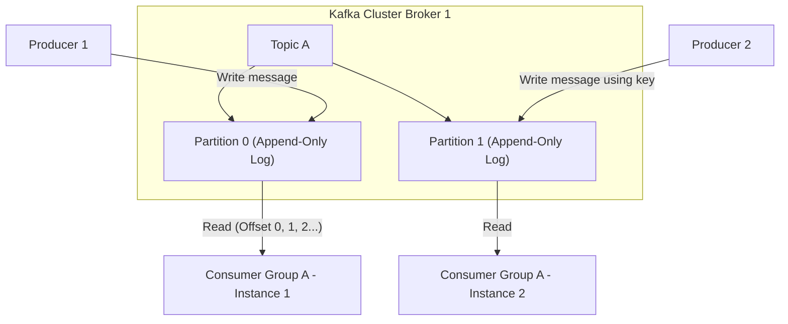
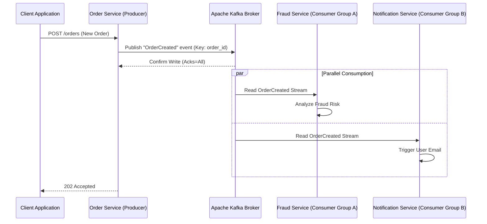

# Part 9: Distributed Systems & Message Queues with Kafka

*[← Back to Master Index](/blog/it-career-guide)*

---

## 1. Core Concept Refresher: Event-Driven Architectures & Kafka Internals

In monolithic applications, modules communicate via direct, synchronous in-memory function calls. When systems are decomposed into distributed microservices, communicating via synchronous HTTP/REST or gRPC calls introduces heavy temporal coupling: if Service A calls Service B, and Service B calls Service C, the failure of Service C cascades instantly, taking down the entire system.

To build highly resilient, decoupled systems, backend architects transition to **Event-Driven Architecture (EDA)**, with **Apache Kafka** serving as the core distributed message log.

---

### What is Apache Kafka?

Kafka is not a simple message queue like RabbitMQ or ActiveMQ. It is a **Distributed Append-Only Commit Log** designed to process massive streams of real-time data. 

Key structural differences include:
*   **Persistent Storage:** Unlike traditional brokers that delete messages as soon as they are acknowledged by consumers, Kafka writes messages to disk sequentially, persisting them based on retention policies (e.g., store for 7 days, or keep forever).
*   **Smart Client, Dumb Broker:** Traditional brokers track which messages have been read by which consumers. Kafka brokers do not maintain this state. Instead, messages are read by consumers who track their own progress using a numeric pointer known as an **Offset**. This allows multiple consumer groups to read the same data streams at their own pace without interference.

---

### Topics, Partitions, and Consumer Groups

*   **Topics:** A logical stream of messages (analogous to a database table).
*   **Partitions:** Topics are divided into physical partitions. A partition is an ordered, immutable sequence of records that is continually appended to. **Partitions are the unit of scalability in Kafka.** A single partition can only sit on a single server (Broker), but a topic with 10 partitions can be distributed across 10 brokers, allowing writes and reads to execute in parallel.
*   **Message Keys & Ordering:** Kafka guarantees strict message ordering *only* within a single partition. If a producer writes messages without a key, the broker distributes them round-robin across partitions, losing overall order. If the producer includes a message key (e.g. `user_id`), Kafka hashes the key to route all messages with that key to the same partition, guaranteeing ordered processing for that user.
*   **Consumer Groups:** A group of consumers that cooperate to read a topic. Each partition of a topic is assigned to exactly one consumer instance within a consumer group. If you have 4 partitions and 4 consumers in a group, each consumer reads 1 partition. If you add a 5th consumer, it will sit idle. Therefore, you cannot scale consumers beyond the number of partitions.

---

### Replication, Consensus, and Durability Guarantees

Kafka achieves high availability by replicating partitions across multiple brokers.
*   **Leader Partition:** The primary partition where all writes and reads are handled.
*   **Follower Partitions:** Replication copies that pull data from the leader to stay synchronized.
*   **In-Sync Replicas (ISR):** The subset of follower partitions that are actively keeping up with the leader.
*   **ACKS Configurations (Producer Durability):**
    *   `acks=0`: Producer does not wait for any acknowledgment. Extreme speed, high risk of data loss.
    *   `acks=1`: Producer waits until the Leader partition writes the message to disk. Moderate safety.
    *   `acks=all` (or `-1`): Producer waits until the leader and all In-Sync Replicas write the message. Guaranteed durability.

---

## 2. Master Resource Directory: Distributed Event Streams

Distributed messaging requires deep theoretical understanding of consensus protocols, network layouts, and stream semantics. Below are the essential resources.

---

### Resource 1: *Designing Data-Intensive Applications* by Martin Kleppmann
*   **Why It Was Selected:** Kleppmann's book is critical for understanding the theoretical difference between message brokers and event logs. It covers database replication logs, transaction logging, dual-write split-brain hazards, and event sourcing. It provides the foundation to argue system architecture choices during architectural reviews.
*   **Target Syllabus Modules/Chapters:**
    *   Chapter 11: Stream Processing (Message Brokers, Event-Sourcing, Streams)
    *   Chapter 8: The Trouble with Distributed Systems
*   **Time Investment Required:** 20 hours.
*   **Value Assessment:** Exceptional.
*   **Actionable Study Strategy:** Read Chapter 11. Compare the mechanics of AMQP brokers (like RabbitMQ) against commit logs (like Kafka). Write a table comparing their storage models, consumption scaling properties, and recovery designs.

---

### Resource 2: *Kafka: The Definitive Guide (2nd Edition)* by Gwen Shapira et al.
*   **Why It Was Selected:** Written by core contributors and engineers at Confluent, this is the industry-standard textbook for Apache Kafka. It covers producer API design, consumer rebalance protocols, internal storage layouts, schema registries, and operational best practices, ensuring you write highly optimized clients.
*   **Target Syllabus Modules/Chapters:**
    *   Chapter 3: Kafka Producers (Writing Messages)
    *   Chapter 4: Kafka Consumers (Reading Messages)
    *   Chapter 6: Reliable Data Delivery (Consensus, ISRs, Acks)
*   **Time Investment Required:** 25 hours.
    *   *Week 1:* Chapters 3 & 4 (15 hours)
    *   *Week 2:* Chapter 6 and API configs (10 hours)
*   **Value Assessment:** Essential for backend systems roles. Kafka optimization is a highly paid, niche skill.
*   **Actionable Study Strategy:** Focus on Chapter 4's section on **Consumer Rebalances**. Study what triggers a rebalance (adding consumers, network timeouts) and how it affects message processing latency. Replicate configuration options (`session.timeout.ms`, `max.poll.interval.ms`) in a test script.

---

### Resource 3: *Designing Event-Driven Systems* by Ben Stopford
*   **Why It Was Selected:** An exceptional book that explains how to construct complete microservices architectures around Kafka. It covers event collaboration, CQRS (Command Query Responsibility Segregation), stateful streaming, and schema management.
*   **Target Syllabus Modules/Chapters:**
    *   Part I: Event-Driven Basics
    *   Part II: Patterns for Microservices
*   **Time Investment Required:** 12 hours of reading.
*   **Value Assessment:** High (Free PDF download available from Confluent).
*   **Actionable Study Strategy:** Study the **CQRS Pattern**. Draw an architecture showing how write requests go to a primary command database, publish events to Kafka, and update read-only Elasticsearch indexes asynchronously.

---

### Resource 4: *Confluent Developer Library* (developer.confluent.io)
*   **Why It Was Selected:** An interactive tutorials and video course hub maintained by Confluent. It provides step-by-step code setups for Kafka clients in Python, Java, Node.js, and Go, alongside schema validation tutorials.
*   **Target Syllabus Modules/Chapters:**
    *   Kafka 101 Course
    *   Kafka Consumer & Producer Internals
*   **Time Investment Required:** 15 hours.
*   **Value Assessment:** High.
*   **Actionable Study Strategy:** Watch the video tutorials on **Partition Assignment Strategies**. Understand how cooperative sticky assignors prevent consumer group outages during restarts.

---

## 3. Hands-On Portfolio Lab Project: Real-Time Event Pipeline with Kafka & Node.js

To demonstrate event-driven backend engineering, you will build a **Real-Time Fraud Detection Engine** using Kafka brokers, a Node.js/TypeScript producer, and parallel Node.js consumers.

### Lab Specifications:
1.  **Broker Deployment:**
    *   Create a `docker-compose.yml` deploying a single-node Kafka broker using KRaft mode (no Zookeeper).
    *   Expose Kafka on port 9092.
2.  **Order Service (Producer):**
    *   Write a Fastify/Express service in TypeScript using the `kafkajs` library.
    *   Expose `POST /orders` receiving an order payload (amount, user_id, product_id).
    *   Publish an event to a topic named `order-events` with a key of `user_id`. Use `acks=all` to guarantee durability.
3.  **Fraud Detection Service (Consumer Group A):**
    *   Write a background Node.js process that listens to the `order-events` topic as part of consumer group `fraud-detection-group`.
    *   If order amount $> \$10,000$, publish a warning log or write a notification event to a secondary topic `fraud-alerts`.
4.  **Notification Service (Consumer Group B):**
    *   Write a secondary background process that listens to `order-events` as part of group `notification-group`.
    *   Simulate sending a confirmation email to the user.
    *   **Demonstrate Parallel Processing:** Verify that both consumer groups receive the exact same messages independently.

---

## 4. Technical Interview Self-Assessment

Use these questions to verify your distributed systems and event-streaming knowledge:

| Concept | High-Frequency Interview Question | Expected Technical Answer Framework |
| :--- | :--- | :--- |
| **Kafka vs. RabbitMQ** | When would you choose Apache Kafka over RabbitMQ? | Choose **RabbitMQ** when you need complex routing logic (using Exchange bindings), message filtering, and immediate deletion of messages on acknowledgment. Choose **Kafka** when you need high-throughput stream processing, historical message replayability (event log), strict ordering per key, or need multiple independent consumer groups to read the exact same data stream without duplicating data. |
| **At-Least-Once Delivery** | How do you handle duplicate messages in an Event-Driven System? | Kafka guarantees At-Least-Once delivery by default, which can cause duplicate events during consumer crashes. To prevent duplicate processing, consumers must be **Idempotent**. This is achieved by storing processed message IDs in a unique database index (e.g., Redis or Postgres) or designing database writes as `UPSERT` operations based on a unique transaction ID. |
| **Partition Rebalance** | What causes consumer rebalances in Kafka, and how do you mitigate their impact? | A rebalance occurs when a consumer leaves or joins a group, or when a broker detects a heartbeat loss (meaning the consumer is blocked by CPU starvation or network issues). Rebalances stop all consumption briefly. It is mitigated by using the `CooperativeStickyAssignor` (which only reassigns affected partitions), tuning heartbeat timeouts (`max.poll.interval.ms`), and ensuring consumers do not execute blocking operations. |

---

## 5. Exit Tasks for this Phase

Verify these checkmarks before moving on:

- [ ] Spin up a Kafka cluster locally inside Docker and verify logs.
- [ ] Write a script that dynamically publishes messages to partitions based on hash keys.
- [ ] Connect multiple consumer instances to the same group and observe partition assignment.
- [ ] Test system behavior when a consumer instance is killed mid-stream.

---

*[Proceed to Part 10: System Design Principles & Scalable Architecture →](/blog/it-career-guide/part-10-system-design)*
