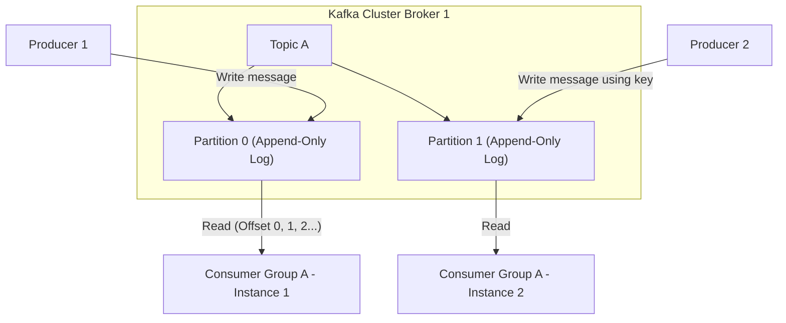
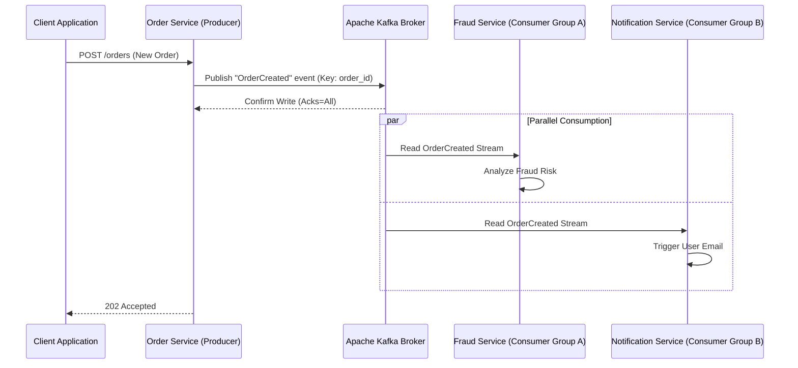

# Part 9: Distributed Systems & Message Queues with Kafka

*[← Back to Master Index](/blog/it-career-guide)*

---

## 1. Core Concept Refresher: Event-Driven Architectures & Kafka Internals

In monolithic applications, modules communicate via direct, synchronous in-memory function calls. When systems are decomposed into distributed microservices, communicating via synchronous HTTP/REST or gRPC calls introduces heavy temporal coupling: if Service A calls Service B, and Service B calls Service C, the failure of Service C cascades instantly, taking down the entire system.

To build highly resilient, decoupled systems, backend architects transition to **Event-Driven Architecture (EDA)**, with **Apache Kafka** serving as the core distributed message log.

---

### What is Apache Kafka?

Kafka is not a simple message queue like RabbitMQ or ActiveMQ. It is a **Distributed Append-Only Commit Log** designed to process massive streams of real-time data. 

Key structural differences include:
*   **Persistent Storage:** Unlike traditional brokers that delete messages as soon as they are acknowledged by consumers, Kafka writes messages to disk sequentially, persisting them based on retention policies (e.g., store for 7 days, or keep forever).
*   **Smart Client, Dumb Broker:** Traditional brokers track which messages have been read by which consumers. Kafka brokers do not maintain this state. Instead, messages are read by consumers who track their own progress using a numeric pointer known as an **Offset**. This allows multiple consumer groups to read the same data streams at their own pace without interference.

---

### Topics, Partitions, and Consumer Groups

*   **Topics:** A logical stream of messages (analogous to a database table).
*   **Partitions:** Topics are divided into physical partitions. A partition is an ordered, immutable sequence of records that is continually appended to. **Partitions are the unit of scalability in Kafka.** A single partition can only sit on a single server (Broker), but a topic with 10 partitions can be distributed across 10 brokers, allowing writes and reads to execute in parallel.
*   **Message Keys & Ordering:** Kafka guarantees strict message ordering *only* within a single partition. If a producer writes messages without a key, the broker distributes them round-robin across partitions, losing overall order. If the producer includes a message key (e.g. `user_id`), Kafka hashes the key to route all messages with that key to the same partition, guaranteeing ordered processing for that user.
*   **Consumer Groups:** A group of consumers that cooperate to read a topic. Each partition of a topic is assigned to exactly one consumer instance within a consumer group. If you have 4 partitions and 4 consumers in a group, each consumer reads 1 partition. If you add a 5th consumer, it will sit idle. Therefore, you cannot scale consumers beyond the number of partitions.

---

### Replication, Consensus, and Durability Guarantees

Kafka achieves high availability by replicating partitions across multiple brokers.
*   **Leader Partition:** The primary partition where all writes and reads are handled.
*   **Follower Partitions:** Replication copies that pull data from the leader to stay synchronized.
*   **In-Sync Replicas (ISR):** The subset of follower partitions that are actively keeping up with the leader.
*   **ACKS Configurations (Producer Durability):**
    *   `acks=0`: Producer does not wait for any acknowledgment. Extreme speed, high risk of data loss.
    *   `acks=1`: Producer waits until the Leader partition writes the message to disk. Moderate safety.
    *   `acks=all` (or `-1`): Producer waits until the leader and all In-Sync Replicas write the message. Guaranteed durability.

---

## 2. Part 9 Master Resource Directory: Distributed Event Streams (30 Curated Resources)

Distributed messaging requires deep theoretical understanding of consensus protocols, network layouts, and stream semantics. Below are the essential resources.

---

### Sub-Topic A: Pub-Sub & Competing Consumer Patterns

#### 1. Designing Data-Intensive Applications
*   **Direct URL:** https://www.oreilly.com/library/view/designing-data-intensive-applications/9781491903063/
*   **Search Identification:** Search O'Reilly Media for: `"Designing Data-Intensive Applications" (Author: Martin Kleppmann)`
*   **Resource Type:** Book
*   **Access / Price:** Paid (Included in TCS O'Reilly Enterprise benefit)
*   **Status:** Required (Non-Negotiable)
*   **Description:** Landmark textbook explaining the differences between commit logs, event streams, AMQP brokers, and database replication boundaries.
*   **Mutual Exclusivity Mapping:** If you read this book, you can skip *Distributed Messaging Patterns (LinkedIn)* as Martin covers messaging models with deeper theoretical detail.

#### 2. Apache Kafka 4.0 Masterclass - Complete Beginners Guide
*   **Direct URL:** https://www.udemy.com/course/apache-kafka/
*   **Search Identification:** Search Udemy for: `"Apache Kafka 4.0 Masterclass" (Instructor: Stephane Maarek)`
*   **Resource Type:** Video Course
*   **Access / Price:** Paid (Included in TCS Udemy Business)
*   **Status:** Required (Non-Negotiable)
*   **Description:** The undisputed premier video masterclass covering brokers, topics, partitions, CLI commands, and consumer group rebalances.
*   **Mutual Exclusivity Mapping:** Gold standard practical course; no direct equivalent.

#### 3. Designing Event-Driven Systems
*   **Direct URL:** https://www.confluent.io/designing-event-driven-systems/
*   **Search Identification:** Search Google/Web for: `"Designing Event-Driven Systems book by Ben Stopford Confluent"`
*   **Resource Type:** Book
*   **Access / Price:** 100% Free
*   **Status:** Required
*   **Description:** Explains how to decompose monolithic databases into event streams and CQRS architectures.
*   **Mutual Exclusivity Mapping:** Essential architecture reference guide.

#### 4. Distributed Messaging Patterns (LinkedIn Learning)
*   **Direct URL:** https://www.linkedin.com/learning/distributed-messaging-patterns
*   **Search Identification:** Search LinkedIn Learning for: `"Distributed Messaging Patterns"`
*   **Resource Type:** Video Course
*   **Access / Price:** Paid (Included in TCS Enterprise Account)
*   **Status:** Alternative to: *Designing Data-Intensive Applications*.
*   **Description:** Introduces point-to-point queues, publish-subscribe brokers, and routing keys.
*   **Mutual Exclusivity Mapping:** Shorter video alternative.

#### 5. RabbitMQ vs Apache Kafka (Coursera)
*   **Direct URL:** https://www.coursera.org/learn/message-brokers
*   **Search Identification:** Search Coursera for: `"Message Brokers in Distributed Systems"`
*   **Resource Type:** Video Course
*   **Access / Price:** Free Audit Tier Available
*   **Status:** Optional
*   **Description:** Compares RabbitMQ's exchange routing models with Kafka's commit log storage models.
*   **Mutual Exclusivity Mapping:** Optional booster.

---

### Sub-Topic B: Kafka Partition Models & Rebalancing

#### 6. Kafka: The Definitive Guide (2nd Edition)
*   **Direct URL:** https://www.oreilly.com/library/view/kafka-the-definitive/9781492043072/
*   **Search Identification:** Search O'Reilly Media for: `"Kafka: The Definitive Guide" (Authors: Gwen Shapira, Todd Palino)`
*   **Resource Type:** Book
*   **Access / Price:** Paid (Included in TCS O'Reilly Enterprise benefit)
*   **Status:** Required (Non-Negotiable)
*   **Description:** The ultimate standard reference manual for producer batching, consumer group offsets commit policies, and partition rebalancing algorithms.
*   **Mutual Exclusivity Mapping:** If you read this book, you can skip *Scaling Apache Kafka (LinkedIn)* as Gwen Shapira details client configuration parameters with deeper technical rigor.

#### 7. Apache Kafka for Event-Driven Microservices
*   **Direct URL:** https://www.udemy.com/course/apache-kafka-for-microservices/
*   **Search Identification:** Search Udemy for: `"Apache Kafka for Event-Driven Spring Boot Microservices" (Instructor: Nam Ha Minh)`
*   **Resource Type:** Video Course
*   **Access / Price:** Paid (Included in TCS Udemy Business)
*   **Status:** Alternative to: *Kafka: The Definitive Guide (2nd Edition)*.
*   **Description:** Video walkthrough configuring partition assignments, consumers groups, and heartbeats.
*   **Mutual Exclusivity Mapping:** Choose this if you prefer a framework-driven video guide.

#### 8. Kafka Consumer & Producer Internals
*   **Direct URL:** https://developer.confluent.io/courses/architecture/get-started/
*   **Search Identification:** Search Web for: `"Confluent Developer Kafka internals and client architecture"`
*   **Resource Type:** Written Reference & Interactive Tutorials
*   **Access / Price:** 100% Free
*   **Status:** Required
*   **Description:** Details partition routing hashes, batch configurations, and consumer loops.
*   **Mutual Exclusivity Mapping:** Essential written reference for partition strategies.

#### 9. Scaling Apache Kafka: Partitions & Consumer Groups
*   **Direct URL:** https://www.linkedin.com/learning/scaling-apache-kafka
*   **Search Identification:** Search LinkedIn Learning for: `"Scaling Apache Kafka"`
*   **Resource Type:** Video Course
*   **Access / Price:** Paid (Included in TCS Enterprise Account)
*   **Status:** Required
*   **Description:** Explains partition scalability limits and consumer cooperative rebalance protocols.
*   **Mutual Exclusivity Mapping:** Standard partition scaling guide.

#### 10. Kafka Rebalance Protocols and Assignment Configurations
*   **Direct URL:** https://learn.confluent.io/lessons/consumer-rebalance-protocol
*   **Search Identification:** Search Web for: `"Confluent learn consumer rebalance protocol"`
*   **Resource Type:** Written Documentation
*   **Access / Price:** 100% Free
*   **Status:** Optional
*   **Description:** Technical walkthrough of cooperative sticky assignor behaviors during cluster changes.
*   **Mutual Exclusivity Mapping:** Optional booster.

---

### Sub-Topic C: Event Sourcing & Transactional Messaging

#### 11. CQRS and Event Sourcing with Apache Kafka
*   **Direct URL:** https://www.udemy.com/course/cqrs-event-sourcing-kafka/
*   **Search Identification:** Search Udemy for: `"CQRS and Event Sourcing with Apache Kafka"`
*   **Resource Type:** Video Course
*   **Access / Price:** Paid (Included in TCS Udemy Business)
*   **Status:** Required (Non-Negotiable)
*   **Description:** Teaches how to separate command write databases from query read databases, synchronizing state asynchronously via Kafka event logs.
*   **Mutual Exclusivity Mapping:** If you complete this, you can skip *Building Event-Driven Microservices* on Pluralsight as this course covers actual transactional outbox patterns with deeper code implementations.

#### 12. Building Event-Driven Microservices
*   **Direct URL:** https://www.pluralsight.com/courses/building-event-driven-microservices
*   **Search Identification:** Search Pluralsight/Google for: `"Pluralsight Building Event-Driven Microservices"`
*   **Resource Type:** Video Course
*   **Access / Price:** Paid / Free Trial Available
*   **Status:** Alternative to: *CQRS and Event Sourcing with Apache Kafka*.
*   **Description:** Focuses on inter-service communications schemas, schema evolution, and Saga orchestrations.
*   **Mutual Exclusivity Mapping:** Shorter video alternative.

#### 13. Transactional Messaging and the Outbox Pattern
*   **Direct URL:** https://www.oreilly.com/library/view/designing-data-intensive-applications/9781491903063/
*   **Search Identification:** Search O'Reilly Media for: `"Designing Data-Intensive Applications" (Author: Martin Kleppmann)`
*   **Resource Type:** Book
*   **Access / Price:** Paid (Included in TCS O'Reilly Enterprise benefit)
*   **Status:** Required
*   **Description:** The standard guide to atomic database updates and event publishing via the Outbox Pattern.
*   **Mutual Exclusivity Mapping:** Core pattern reference.

#### 14. Kafka Streams: Real-time Stream Processing
*   **Direct URL:** https://www.linkedin.com/learning/kafka-streams-real-time-stream-processing
*   **Search Identification:** Search LinkedIn Learning for: `"Kafka Streams"`
*   **Resource Type:** Video Course
*   **Access / Price:** Paid (Included in TCS Enterprise Account)
*   **Status:** Required
*   **Description:** Introduces stream-table dualities (KStream, KTable) and stateful window transformations.
*   **Mutual Exclusivity Mapping:** Standard streams API guide.

#### 15. Enterprise Integration Patterns: Event Sourcing
*   **Direct URL:** https://www.enterpriseintegrationpatterns.com/patterns/messaging/EventSourcing.html
*   **Search Identification:** Search Web for: `"Enterprise Integration Patterns Event Sourcing Fowler"`
*   **Resource Type:** Written Reference / Documentation
*   **Access / Price:** 100% Free
*   **Status:** Optional
*   **Description:** Classic pattern definition detailing state reconstruction from commit logs.
*   **Mutual Exclusivity Mapping:** Optional booster.

---

### Sub-Topic D: DLQ & Automatic Retries

#### 16. Error Handling in Apache Kafka: Retries & Dead Letter Queues
*   **Direct URL:** https://www.udemy.com/course/kafka-error-handling/
*   **Search Identification:** Search Udemy for: `"Error Handling in Apache Kafka"`
*   **Resource Type:** Video Course
*   **Access / Price:** Paid (Included in TCS Udemy Business)
*   **Status:** Required (Non-Negotiable)
*   **Description:** Video series explaining retry loops, backoff delays, staging topics, and Dead Letter Queues (DLQ) structures to isolate poisoned messages.
*   **Mutual Exclusivity Mapping:** If you complete this, you can skip Maarek's Spring Cloud Stream error lessons as this course covers non-blocking retry routing with deeper Python and Node.js client contexts.

#### 17. Modern Event-Driven Spring Boot: Kafka & Spring Cloud Stream
*   **Direct URL:** https://www.udemy.com/course/spring-cloud-stream-kafka/
*   **Search Identification:** Search Udemy for: `"Spring Cloud Stream Kafka" (Instructor: Stephane Maarek)`
*   **Resource Type:** Video Course
*   **Access / Price:** Paid (Included in TCS Udemy Business)
*   **Status:** Alternative to: *Error Handling in Apache Kafka: Retries & Dead Letter Queues*.
*   **Description:** Details Spring Boot's built-in DLQ, retry configurations, and listener containers.
*   **Mutual Exclusivity Mapping:** Choose this if you deploy microservices exclusively inside the Java Spring Boot ecosystem.

#### 18. Kafka Failures and Resiliency Patterns
*   **Direct URL:** https://developer.confluent.io/courses/architecture/resiliency-patterns/
*   **Search Identification:** Search Web for: `"Confluent Developer Kafka resiliency patterns guide"`
*   **Resource Type:** Written Reference & Interactive Tutorials
*   **Access / Price:** 100% Free
*   **Status:** Required
*   **Description:** Technical guide explaining producer retries limits, network timeouts, and duplication preventions.
*   **Mutual Exclusivity Mapping:** Standard resiliency reference.

#### 19. Designing Fault Tolerant Event Pipelines
*   **Direct URL:** https://www.pluralsight.com/courses/fault-tolerant-event-pipelines
*   **Search Identification:** Search Pluralsight for: `"Pluralsight Fault Tolerant Event Pipelines"`
*   **Resource Type:** Video Course
*   **Access / Price:** Paid / Free Trial Available
*   **Status:** Required
*   **Description:** Tracing pipelines failure boundaries, message skips, and logging.
*   **Mutual Exclusivity Mapping:** Standard pipeline validation guide.

#### 20. Apache Kafka Error Handling and DLQ Best Practices
*   **Direct URL:** https://www.baeldung.com/spring-kafka-dlt
*   **Search Identification:** Search Web for: `"Baeldung Spring Kafka Dead Letter Topic DLT"`
*   **Resource Type:** Written Reference
*   **Access / Price:** 100% Free
*   **Status:** Optional
*   **Description:** Practical guide to redirecting poisoned payloads to dead letter structures.
*   **Mutual Exclusivity Mapping:** Optional booster.

---

### Sub-Topic E: Kafka Broker Clustering (KRaft)

#### 21. Apache Kafka Administration and Clustering
*   **Direct URL:** https://www.udemy.com/course/kafka-administration/
*   **Search Identification:** Search Udemy for: `"Apache Kafka Administration and Clustering"`
*   **Resource Type:** Video Course
*   **Access / Price:** Paid (Included in TCS Udemy Business)
*   **Status:** Required (Non-Negotiable)
*   **Description:** Complete guide to operating Kafka brokers, configuring KRaft controller nodes, managing cluster state, and tracking disk/network metrics.
*   **Mutual Exclusivity Mapping:** If you take this, you can skip Pluralsight's *Operating Kafka* as this course covers KRaft metadata logs with deeper structural setup walks.

#### 22. Kafka KRaft Mode Architecture Deep Dive
*   **Direct URL:** https://developer.confluent.io/courses/kraft/overview/
*   **Search Identification:** Search Web for: `"Confluent Developer Kafka KRaft mode metadata log"`
*   **Resource Type:** Video Course & Labs
*   **Access / Price:** 100% Free
*   **Status:** Alternative to: *Apache Kafka Administration and Clustering*.
*   **Description:** Explains the removal of Zookeeper and how metadata is stored natively inside Raft controller quorums.
*   **Mutual Exclusivity Mapping:** Shorter video alternative focusing specifically on KRaft controller setups.

#### 23. Operating Apache Kafka at Scale
*   **Direct URL:** https://www.pluralsight.com/courses/operating-kafka-scale
*   **Search Identification:** Search Pluralsight for: `"Pluralsight Operating Apache Kafka at Scale"`
*   **Resource Type:** Video Course
*   **Access / Price:** Paid / Free Trial Available
*   **Status:** Required
*   **Description:** Details partition rebalancing under high load, disk partition sizes tuning, and network brokers balancing.
*   **Mutual Exclusivity Mapping:** Standard cluster operations guide.

#### 24. Kafka Cluster Setup and Operations (LinkedIn Learning)
*   **Direct URL:** https://www.linkedin.com/learning/kafka-cluster-setup-and-operations
*   **Search Identification:** Search LinkedIn Learning for: `"Kafka Cluster Setup"`
*   **Resource Type:** Video Course
*   **Access / Price:** Paid (Included in TCS Enterprise Account)
*   **Status:** Required
*   **Description:** Step-by-step guides configuring multi-broker nodes.
*   **Mutual Exclusivity Mapping:** Standard setup guide.

#### 25. Apache Kafka 4.0 Zookeeperless Clustering Specs
*   **Direct URL:** https://kafka.apache.org/documentation/#kraft
*   **Search Identification:** Search Web for: `"Apache Kafka official documentation KRaft configuration"`
*   **Resource Type:** Written Reference / Documentation
*   **Access / Price:** 100% Free
*   **Status:** Optional
*   **Description:** Complete standard specifications for Zookeeperless setup variables.
*   **Mutual Exclusivity Mapping:** Standard reference index.

---

### Sub-Topic F: Kafka Connect & Schema Registry Integration

#### 26. Kafka Connect & Schema Registry Masterclass
*   **Direct URL:** https://www.udemy.com/course/kafka-connect-schema-registry/
*   **Search Identification:** Search Udemy for: `"Kafka Connect & Schema Registry" (Instructor: Stephane Maarek)`
*   **Resource Type:** Video Course
*   **Access / Price:** Paid (Included in TCS Udemy Business)
*   **Status:** Required (Non-Negotiable)
*   **Description:** Video walkthrough detailing Avro schemas, Confluent Schema Registry, evolution rules (backward, forward, full compatibility), and database connectors.
*   **Mutual Exclusivity Mapping:** If you complete this, you can skip *Data Ingestion with Kafka Connect* as Maarek covers Schema Registry evolution parameters in full.

#### 27. Confluent Schema Registry & Avro Serializers
*   **Direct URL:** https://developer.confluent.io/courses/schema-registry/key-concepts/
*   **Search Identification:** Search Web for: `"Confluent Developer Schema Registry key concepts"`
*   **Resource Type:** Written Reference & Interactive Tutorials
*   **Access / Price:** 100% Free
*   **Status:** Alternative to: *Kafka Connect & Schema Registry Masterclass*.
*   **Description:** Focuses on serializing BSON/JSON data into binary Avro payloads validating against schemas.
*   **Mutual Exclusivity Mapping:** Written alternative.

#### 28. Data Ingestion with Kafka Connect
*   **Direct URL:** https://www.pluralsight.com/courses/data-ingestion-kafka-connect
*   **Search Identification:** Search Pluralsight for: `"Pluralsight Data Ingestion with Kafka Connect"`
*   **Resource Type:** Video Course
*   **Access / Price:** Paid / Free Trial Available
*   **Status:** Required
*   **Description:** The definitive guide to source connectors (pulling from databases) and sink connectors (pushing to search/warehouses).
*   **Mutual Exclusivity Mapping:** Standard connectors manual.

#### 29. Data Integration with Apache Kafka (LinkedIn Learning)
*   **Direct URL:** https://www.linkedin.com/learning/data-integration-with-apache-kafka
*   **Search Identification:** Search LinkedIn Learning for: `"Data Integration with Apache Kafka"`
*   **Resource Type:** Video Course
*   **Access / Price:** Paid (Included in TCS Enterprise Account)
*   **Status:** Required
*   **Description:** Connecting Kafka directly to corporate data layers.
*   **Mutual Exclusivity Mapping:** Standard integration guide.

#### 30. Apache Kafka Connectors Cookbook
*   **Direct URL:** https://docs.confluent.io/cloud/current/connectors/index.html
*   **Search Identification:** Search Web for: `"Confluent Cloud official connectors cookbook"`
*   **Resource Type:** Written Reference / Recipes
*   **Access / Price:** 100% Free
*   **Status:** Optional
*   **Description:** Practical configurations recipes for JDBC, S3, and Elasticsearch connectors.
*   **Mutual Exclusivity Mapping:** Optional booster.

---

## 3. Hands-On Portfolio Lab Project: Real-Time Event Pipeline with Kafka & Node.js

To demonstrate event-driven backend engineering, you will build a **Real-Time Fraud Detection Engine** using Kafka brokers, a Node.js/TypeScript producer, and parallel Node.js consumers.

### Lab Specifications:
1.  **Broker Deployment:**
    *   Create a `docker-compose.yml` deploying a single-node Kafka broker using KRaft mode (no Zookeeper).
    *   Expose Kafka on port 9092.
2.  **Order Service (Producer):**
    *   Write a Fastify/Express service in TypeScript using the `kafkajs` library.
    *   Expose `POST /orders` receiving an order payload (amount, user_id, product_id).
    *   Publish an event to a topic named `order-events` with a key of `user_id`. Use `acks=all` to guarantee durability.
3.  **Fraud Detection Service (Consumer Group A):**
    *   Write a background Node.js process that listens to the `order-events` topic as part of consumer group `fraud-detection-group`.
    *   If order amount $> \$10,000$, publish a warning log or write a notification event to a secondary topic `fraud-alerts`.
4.  **Notification Service (Consumer Group B):**
    *   Write a secondary background process that listens to `order-events` as part of group `notification-group`.
    *   Simulate sending a confirmation email to the user.
    *   **Demonstrate Parallel Processing:** Verify that both consumer groups receive the exact same messages independently.

---

## 4. Technical Interview Self-Assessment

Use these questions to verify your distributed systems and event-streaming knowledge:

| Concept | High-Frequency Interview Question | Expected Technical Answer Framework |
| :--- | :--- | :--- |
| **Kafka vs. RabbitMQ** | When would you choose Apache Kafka over RabbitMQ? | Choose **RabbitMQ** when you need complex routing logic (using Exchange bindings), message filtering, and immediate deletion of messages on acknowledgment. Choose **Kafka** when you need high-throughput stream processing, historical message replayability (event log), strict ordering per key, or need multiple independent consumer groups to read the exact same data stream without duplicating data. |
| **At-Least-Once Delivery** | How do you handle duplicate messages in an Event-Driven System? | Kafka guarantees At-Least-Once delivery by default, which can cause duplicate events during consumer crashes. To prevent duplicate processing, consumers must be **Idempotent**. This is achieved by storing processed message IDs in a unique database index (e.g., Redis or Postgres) or designing database writes as `UPSERT` operations based on a unique transaction ID. |
| **Partition Rebalance** | What causes consumer rebalances in Kafka, and how do you mitigate their impact? | A rebalance occurs when a consumer leaves or joins a group, or when a broker detects a heartbeat loss (meaning the consumer is blocked by CPU starvation or network issues). Rebalances stop all consumption briefly. It is mitigated by using the `CooperativeStickyAssignor` (which only reassigns affected partitions), tuning heartbeat timeouts (`max.poll.interval.ms`), and ensuring consumers do not execute blocking operations. |

---

## 5. Exit Tasks for this Phase

Verify these checkmarks before moving on:

- [ ] Spin up a Kafka cluster locally inside Docker and verify logs.
- [ ] Write a script that dynamically publishes messages to partitions based on hash keys.
- [ ] Connect multiple consumer instances to the same group and observe partition assignment.
- [ ] Test system behavior when a consumer instance is killed mid-stream.

---

*[Proceed to Part 10: System Design Foundations for High Scale →](/blog/it-career-guide/part-10-system-design)*
