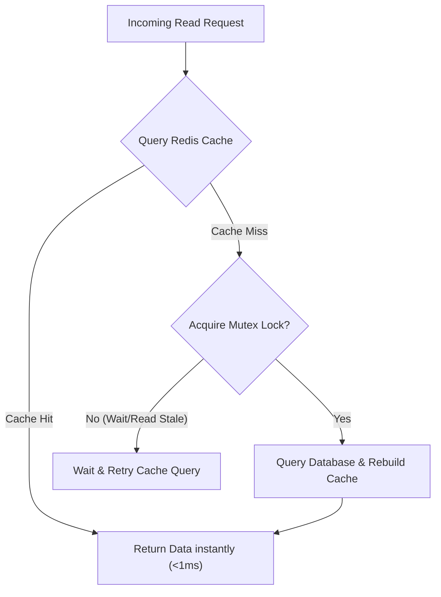

# Part 9: In-Memory Databases & Caching — Redis

*[← Back to Master Index](/blog/it-career-guide)*

---

## 1. Core Concept Refresher: Redis Execution Context and Topologies

Relational databases (like PostgreSQL) and document stores (like MongoDB) write changes to disk files during transactions. While they use in-memory buffers to optimize reads, every disk seek introduces significant latency. For operations that must execute with sub-millisecond durations at massive concurrency levels (like user session storage, API rate limit counters, or distributed synchronization locks), software architects use **Redis**.

To succeed in systems engineering, backend developers must look past simple key-value structures and understand Redis's single-threaded nature and distributed locking mechanics.

---

### Redis Single-Threaded Event Loop Architecture
Unlike multi-threaded databases, Redis executes all core commands on a **Single-Threaded Event Loop**. 
*   **Why Single-Threaded?** Running on a single thread avoids the massive CPU context-switching and lock-contention overheads that multi-threaded designs experience when managing in-memory state. It makes the codebase simpler and guarantees that every command is atomic.
*   **The Multiplexing Engine:** To handle tens of thousands of concurrent client connections on a single thread, Redis utilizes non-blocking socket multiplexing via operating system kernels (using `epoll` on Linux, `kqueue` on macOS, or `select` systems).
*   **CPU Starvation Risk:** Since Redis runs commands sequentially, executing a time-consuming $O(N)$ operation (such as `KEYS *` to search millions of entries, or heavy data refactoring) blocks the single thread. During this block, all incoming client queries wait in socket buffers, causing timeouts and downstream system crashes.

---

### Caching Topologies and Mitigations
When implementing Redis as a cache in front of a primary database, you must choose an update topology:
1.  **Cache-Aside (Lazy Loading):** The application reads from the cache first. If a cache miss occurs, it queries the database, writes the result to the cache with a Time-to-Live (TTL) expiration, and returns the data.
2.  **Write-Through:** The application writes directly to the cache, and the cache synchronizes that change to the primary database before acknowledging the write.

#### Mitigating Production Caching Failures:
*   **Cache Penetration:** Requests target keys that never exist in the database (e.g., malicious requests targeting ID `-999`). Since these are misses, they hit the primary database every time, overloading it.
    *   *Solution:* Cache empty/null values with a short TTL, or deploy a **Bloom Filter** in front of the cache to instantly reject non-existent keys.
*   **Cache Avalanche:** Multiple cached keys expire at the exact same second, or the Redis container crashes. Incoming traffic falls through to the primary database, crashing it.
    *   *Solution:* Add a random "jitter" (e.g., `3600 + random(0, 300)` seconds) to expirations so keys expire at staggered times.
*   **Cache Stampede (Thundering Herd):** A highly popular cached key (e.g., home page data) expires. Multiple concurrent request threads observe a cache miss at the same microsecond and all execute the same heavy database query simultaneously.
    *   *Solution:* Use mutex locking to allow only the first thread to rebuild the cache, forcing others to wait or read stale data.

---

## 2. Redis Master Resource Directory (30 Curated Resources)

Upskilling in caching requires deep architectural manuals, command reference guides, and distributed locking case studies. Below is the directory to master this stack.

---

### Sub-Topic A: Redis Single-Threaded Event Loop & Architecture

#### 1. Redis Essentials
*   **Direct URL:** https://www.oreilly.com/library/view/redis-essentials/9781785281846/
*   **Search Identification:** Search O'Reilly Media for: `"Redis Essentials" (Authors: Maxwell Dayvson da Silva, Hugo Lopes Tavares)`
*   **Resource Type:** Book
*   **Access / Price:** Paid (Included in TCS O'Reilly Enterprise benefit)
*   **Status:** Required (Non-Negotiable)
*   **Description:** Covers memory optimization configurations, internal event loops, persistence modes (RDB snapshotting and AOF journaling), and replication mechanics.
*   **Mutual Exclusivity Mapping:** If you read this, you can skip *Redis in Action* as this book covers modern performance parameters with tighter layouts.

#### 2. Redis Caching Topologies and Architectures (LinkedIn Learning)
*   **Direct URL:** https://www.linkedin.com/learning/redis-caching-topologies
*   **Search Identification:** Search LinkedIn Learning for: `"Redis Caching Topologies and Architectures"`
*   **Resource Type:** Video Course
*   **Access / Price:** Paid (Included in TCS Enterprise Account)
*   **Status:** Required
*   **Description:** Video series detailing cache-aside, write-through, write-behind queues configurations, and deployment strategies.
*   **Mutual Exclusivity Mapping:** Essential video companion.

#### 3. Redis University: RU101 - Introduction to Redis Data Structures
*   **Direct URL:** https://university.redis.io/courses/ru101/
*   **Search Identification:** Search Google/Web for: `"Redis University RU101 Introduction to Redis Data Structures"`
*   **Resource Type:** Video & Lab Course
*   **Access / Price:** 100% Free
*   **Status:** Required (Highly Recommended)
*   **Description:** The official foundational course covering single-threaded mechanics, client buffers, and memory storage layouts.
*   **Mutual Exclusivity Mapping:** Standard certification path.

#### 4. Advanced In-Memory Databases: Redis (Udemy)
*   **Direct URL:** https://www.udemy.com/course/advanced-redis/
*   **Search Identification:** Search Udemy for: `"Advanced Redis: Caching and Clusters"`
*   **Resource Type:** Video Course
*   **Access / Price:** Paid (Included in TCS Udemy Business)
*   **Status:** Alternative to: *Redis Caching Topologies and Architectures*.
*   **Description:** Detailed walks configuring sentinel nodes for high availability and automatic failovers.
*   **Mutual Exclusivity Mapping:** Choose this if your focus is explicitly cluster operations.

#### 5. Redis official Command Reference Guides
*   **Direct URL:** https://redis.io/commands/
*   **Search Identification:** Search Web for: `"Redis official documentation commands library"`
*   **Resource Type:** Written Reference / API Docs
*   **Access / Price:** 100% Free
*   **Status:** Required
*   **Description:** Time complexity ($O(1)$ vs $O(N)$) specifications for every command, listing CPU blocker commands.
*   **Mutual Exclusivity Mapping:** Standard query reference.

---

### Sub-Topic B: Redis Core Data Structures (Hashes, Sorted Sets)

#### 6. Redis in Action
*   **Direct URL:** https://www.oreilly.com/library/view/redis-in-action/9781617290824/
*   **Search Identification:** Search O'Reilly Media for: `"Redis in Action" (Author: Josiah L. Carlson)`
*   **Resource Type:** Book
*   **Access / Price:** Paid (Included in TCS O'Reilly Enterprise benefit)
*   **Status:** Required (Highly Recommended)
*   **Description:** Landmark textbook illustrating how to design web-scale architectures using hashes, sets, and sorted sets (ZSETs).
*   **Mutual Exclusivity Mapping:** If you read this, you can skip *Redis Essentials* as both detail basic commands. Choose this for practical scripts.

#### 7. Redis University: RU201 - Redis in Action (Case Studies)
*   **Direct URL:** https://university.redis.io/courses/ru201/
*   **Search Identification:** Search Google/Web for: `"Redis University RU201 Redis in Action"`
*   **Resource Type:** Video & Lab Course
*   **Access / Price:** 100% Free
*   **Status:** Required (Highly Recommended)
*   **Description:** Advanced design scenarios showing how to choose correct data structures for low-memory storage.
*   **Mutual Exclusivity Mapping:** Essential database certification path.

#### 8. Caching with Redis in Spring Boot & Node.js (Udemy)
*   **Direct URL:** https://www.udemy.com/course/redis-caching-bootcamp/
*   **Search Identification:** Search Udemy for: `"The Redis Caching Bootcamp"`
*   **Resource Type:** Video Course
*   **Access / Price:** Paid (Included in TCS Udemy Business)
*   **Status:** Alternative to: *RU201 - Redis in Action*.
*   **Description:** Programming setups writing cache serializers and deserializers in backend runtimes.
*   **Mutual Exclusivity Mapping:** Shorter framework-focused alternative.

#### 9. Mastering Redis Core Structures
*   **Direct URL:** https://www.linkedin.com/learning/mastering-redis-core-structures
*   **Search Identification:** Search LinkedIn Learning for: `"Mastering Redis Core Structures"`
*   **Resource Type:** Video Course
*   **Access / Price:** Paid (Included in TCS Enterprise Account)
*   **Status:** Required
*   **Description:** Explains sorting parameters, hashes allocations, and hyperloglogs unique tracking.
*   **Mutual Exclusivity Mapping:** Essential command guide.

#### 10. Redis interactive Playground (try.redis.io)
*   **Direct URL:** https://try.redis.io/
*   **Search Identification:** Search Web for: `"Try Redis interactive command line interpreter"`
*   **Resource Type:** Interactive Terminal Sandbox
*   **Access / Price:** 100% Free
*   **Status:** Optional
*   **Description:** Web-based raw CLI terminal to run keys, hashes, and sorted sets commands without local setup.
*   **Mutual Exclusivity Mapping:** Optional practice sandbox.

---

### Sub-Topic C: Caching Topologies (Cache-Aside, Write-Through)

#### 11. System Design Primer Caching Guide by Donne Martin
*   **Direct URL:** https://github.com/donnemartin/system-design-primer#caching
*   **Search Identification:** Search GitHub for: `"donnemartin system-design-primer caching"`
*   **Resource Type:** Interactive Graph Reference
*   **Access / Price:** 100% Free
*   **Status:** Required (Non-Negotiable)
*   **Description:** Classic guide detailing eviction policies (LRU, LFU, FIFO) and caching topologies parameters.
*   **Mutual Exclusivity Mapping:** Essential checklist reference.

#### 12. Caching Strategies on AWS Redis (Udemy)
*   **Direct URL:** https://www.udemy.com/course/aws-redis-caching/
*   **Search Identification:** Search Udemy for: `"AWS Redis Caching"`
*   **Resource Type:** Video Course
*   **Access / Price:** Paid (Included in TCS Udemy Business)
*   **Status:** Required
*   **Description:** Setting up Redis ElastiCache with Cache-Aside configurations, sync rules, and cloud monitoring.
*   **Mutual Exclusivity Mapping:** Essential cloud deployment companion.

#### 13. High Performance Caching Topologies (Pluralsight)
*   **Direct URL:** https://www.pluralsight.com/courses/caching-topologies
*   **Search Identification:** Search Pluralsight for: `"Caching Topologies and Architectures"`
*   **Resource Type:** Video Course
*   **Access / Price:** Paid / Free Trial Available
*   **Status:** Alternative to: *Redis Caching Topologies and Architectures*.
*   **Description:** Theoretical walkthroughs of write-behind, write-through, and read-through caching paths.
*   **Mutual Exclusivity Mapping:** Choose this if you prefer Pluralsight's slide layout.

#### 14. Redis Solutions: Caching Patterns Manual
*   **Direct URL:** https://redis.io/solutions/caching/
*   **Search Identification:** Search Web for: `"Redis solutions caching patterns official manual"`
*   **Resource Type:** Written Reference / Documentation
*   **Access / Price:** 100% Free
*   **Status:** Required
*   **Description:** Official implementation guidelines for managing cache synchronization and cache invalidation.
*   **Mutual Exclusivity Mapping:** Standard database manual.

#### 15. Eviction Policies in Redis (Official Docs)
*   **Direct URL:** https://redis.io/docs/reference/eviction/
*   **Search Identification:** Search Web for: `"Redis official documentation memory optimization eviction"`
*   **Resource Type:** Written Reference / Spec Sheet
*   **Access / Price:** 100% Free
*   **Status:** Optional
*   **Description:** Details of volatile-lru, allkeys-lru, volatile-lfu, and volatile-ttl eviction behaviors under memory constraints.
*   **Mutual Exclusivity Mapping:** Optional hardware reference.

---

### Sub-Topic D: Caching Pitfalls (Penetration, Avalanche, Stampede)

#### 16. Advanced Caching: Stampede and Avalanche Prevention (Udemy)
*   **Direct URL:** https://www.udemy.com/course/system-design-caching/
*   **Search Identification:** Search Udemy for: `"System Design: Caching and distributed systems"`
*   **Resource Type:** Video Course
*   **Access / Price:** Paid (Included in TCS Udemy Business)
*   **Status:** Required (Non-Negotiable)
*   **Description:** Excellent scaling walks explaining mutex-locking implementations, jitter ranges calculations, and bloom filters.
*   **Mutual Exclusivity Mapping:** Essential backend scalability guide.

#### 17. Mitigating Cache Avalanche on Cloud Architectures (LinkedIn Learning)
*   **Direct URL:** https://www.linkedin.com/learning/mitigating-cache-avalanche
*   **Search Identification:** Search LinkedIn Learning for: `"Mitigating Cache Avalanche"`
*   **Resource Type:** Video Course
*   **Access / Price:** Paid (Included in TCS Enterprise Account)
*   **Status:** Required
*   **Description:** Explains multi-region replication layers, active-active failovers, and caching pre-warm loops.
*   **Mutual Exclusivity Mapping:** Essential cloud reliability guide.

#### 18. Bloom Filters in Caching Architectures (GeeksforGeeks)
*   **Direct URL:** https://www.geeksforgeeks.org/bloom-filter-in-caching/
*   **Search Identification:** Search Web for: `"GeeksforGeeks bloom filter caching implementation"`
*   **Resource Type:** Written Tutorial / Code Snippets
*   **Access / Price:** 100% Free
*   **Status:** Required
*   **Description:** Algorithmic walkthrough of bloom filters hashing ranges and how they prevent database queries for missing records.
*   **Mutual Exclusivity Mapping:** Standard code tutorial.

#### 19. Probabilistic Early Expiration Algorithms for Caching (Paper)
*   **Direct URL:** https://vldb.org/pvldb/vol8/p806-vengerov.pdf
*   **Search Identification:** Search Google for: `"Optimal Probabilistic Cache Expiration VLDB paper"`
*   **Resource Type:** Academic Research Paper / Written Spec
*   **Access / Price:** 100% Free
*   **Status:** Optional
*   **Description:** The formal mathematics behind the XFetch algorithm for complete cache stampede prevention.
*   **Mutual Exclusivity Mapping:** Advanced mathematical reference.

#### 20. Redis Bloom Filter Module (RedisUniversity)
*   **Direct URL:** https://university.redis.io/courses/ru203/
*   **Search Identification:** Search Google/Web for: `"Redis University RU203 Redis probabilistic data structures"`
*   **Resource Type:** Video & Lab Course
*   **Access / Price:** 100% Free
*   **Status:** Optional
*   **Description:** Details the setup of RedisBloom extension modules (Bloom filters, Cuckoo filters) directly in Redis clusters.
*   **Mutual Exclusivity Mapping:** Advanced optional scaling module.

---

### Sub-Topic E: API Rate Limiting (Token Bucket & Sliding Window)

#### 21. System Design Interview – An Easy Guide (Volume 1)
*   **Direct URL:** https://bytebytego.com/
*   **Search Identification:** Search Web for: `"System Design Interview Volume 1" (Author: Alex Xu)`
*   **Resource Type:** Book
*   **Access / Price:** Paid (Included in TCS O'Reilly Enterprise benefit)
*   **Status:** Required (Non-Negotiable)
*   **Description:** Volume 1, Chapter 4 is the industry-standard blueprint for designing distributed rate limiters using Redis.
*   **Mutual Exclusivity Mapping:** If you read this, you can skip *Rate Limiting on Udemy* as Alex Xu covers sliding-window loops with superior visual charts.

#### 22. Rate Limiting Architectures for Platform Engineers (LinkedIn)
*   **Direct URL:** https://www.linkedin.com/learning/rate-limiting-architectures
*   **Search Identification:** Search LinkedIn Learning for: `"Rate Limiting Architectures"`
*   **Resource Type:** Video Course
*   **Access / Price:** Paid (Included in TCS Enterprise Account)
*   **Status:** Required
*   **Description:** Setting up Nginx, API Gateways, and custom Redis scripts to enforce user API budgets.
*   **Mutual Exclusivity Mapping:** Essential gateway architecture companion.

#### 23. Upstash Redis Rate Limiting SDK and Docs
*   **Direct URL:** https://github.com/upstash/ratelimit
*   **Search Identification:** Search GitHub for: `"upstash ratelimit sliding window"`
*   **Resource Type:** Code Library / Written Docs
*   **Access / Price:** 100% Free
*   **Status:** Required
*   **Description:** Production-grade implementation of token bucket and sliding-window algorithms using Redis Lua scripts.
*   **Mutual Exclusivity Mapping:** Standard deployment library.

#### 24. Designing Rate Limiters for REST APIs (Udemy)
*   **Direct URL:** https://www.udemy.com/course/api-rate-limiting/
*   **Search Identification:** Search Udemy for: `"API Rate Limiting Masterclass"`
*   **Resource Type:** Video Course
*   **Access / Price:** Paid (Included in TCS Udemy Business)
*   **Status:** Alternative to: *System Design Interview – An Easy Guide*.
*   **Description:** Focused course covering leaky bucket, token bucket, and fixed-window database counters.
*   **Mutual Exclusivity Mapping:** Slower coding alternative.

#### 25. Redis Rate Limiter Algorithms Cookbook (Redis)
*   **Direct URL:** https://redis.io/glossary/rate-limiting/
*   **Search Identification:** Search Web for: `"Redis glossary rate limiting algorithms implementation"`
*   **Resource Type:** Written Tutorial / Specs
*   **Access / Price:** 100% Free
*   **Status:** Required
*   **Description:** Guide showing the raw Redis sorted sets (`ZSET`) commands used to execute sliding-window rate limit checks.
*   **Mutual Exclusivity Mapping:** Standard coding template.

---

### Sub-Topic F: Redis Distributed Locks (Redlock & Lua Scripting)

#### 26. Distributed Locks with Redis (Redlock Spec)
*   **Direct URL:** https://redis.io/docs/manual/patterns/distributed-locks/
*   **Search Identification:** Search Web for: `"Redis official documentation distributed locks redlock"`
*   **Resource Type:** Written Spec / Documentation
*   **Access / Price:** 100% Free
*   **Status:** Required (Non-Negotiable)
*   **Description:** The authoritative specification for the Redlock algorithm written by Redis creator Salvatore Sanfilippo.
*   **Mutual Exclusivity Mapping:** Essential distributed engineering reference.

#### 27. Redis Lua Scripting & Dynamic Commands
*   **Direct URL:** https://www.linkedin.com/learning/redis-lua-scripting
*   **Search Identification:** Search LinkedIn Learning for: `"Redis Lua Scripting"`
*   **Resource Type:** Video Course
*   **Access / Price:** Paid (Included in TCS Enterprise Account)
*   **Status:** Required
*   **Description:** Explains how to compile, load, and execute transaction Lua scripts inside Redis engines atomicity.
*   **Mutual Exclusivity Mapping:** Essential custom scripting companion.

#### 28. Distributed Transactions and Locks in Microservices (Udemy)
*   **Direct URL:** https://www.udemy.com/course/distributed-transactions/
*   **Search Identification:** Search Udemy for: `"Distributed Transactions and Locks"`
*   **Resource Type:** Video Course
*   **Access / Price:** Paid (Included in TCS Udemy Business)
*   **Status:** Required
*   **Description:** Covers distributed mutex patterns, consensus, and split-brain scenarios in multi-node clusters.
*   **Mutual Exclusivity Mapping:** High-end microservices scaling companion.

#### 29. Redisson: Distributed Locks for Java & Spring (GitHub)
*   **Direct URL:** https://github.com/redisson/redisson#distributed-locks-and-synchronizers
*   **Search Identification:** Search GitHub for: `"redisson distributed locks lock"`
*   **Resource Type:** Code Library / Written Docs
*   **Access / Price:** 100% Free
*   **Status:** Optional
*   **Description:** Source code for Java Redisson lock managers showing lease renewals and watchdog thread patterns.
*   **Mutual Exclusivity Mapping:** Language-specific library reference.

#### 30. Redlock Node.js Implementation (GitHub)
*   **Direct URL:** https://github.com/mike-marcacci/node-redlock
*   **Search Identification:** Search GitHub for: `"mike-marcacci node-redlock"`
*   **Resource Type:** Code Library / API Specs
*   **Access / Price:** 100% Free
*   **Status:** Optional
*   **Description:** Complete Node.js lock library showing quorum-checking loops and retry schedules.
*   **Mutual Exclusivity Mapping:** Language-specific library reference.

---

## 3. Hands-On Portfolio Lab Project: Sliding-Window Rate Limiter in Redis ZSET

To demonstrate your platform engineering capabilities, you must build and commit a complete **Distributed sliding-window Rate Limiter** using Python, `redis-py`, and a local Redis container.

### The Lab Project Guidelines:
1.  **System Target:** You will construct a custom **API Security Gateway** that rejects requests exceeding a strict budget: **5 requests per 10 seconds per IP address**.
2.  **Why Hashing Fails:** Standard fixed-window algorithms (e.g., `INCR key` with a 10s TTL) suffer from "border spikes"—a user can send 5 requests at second 9 and 5 requests at second 11, successfully executing 10 requests in 2 seconds. You must implement a **Sliding-Window Log** using Redis **Sorted Sets (ZSETs)** to achieve precision.
3.  **Algorithmic Architecture:**
    *   For every incoming request:
        1.  **Define Key:** Set the Redis key as the client's IP address (e.g., `rate_limit:192.168.1.1`).
        2.  **Define Timestamp:** Get the current high-resolution Unix timestamp (in milliseconds).
        3.  **Clean Log:** Remove all elements in the sorted set whose scores are older than the window boundary (Current Timestamp - 10,000ms) using `ZREMRANGEBYSCORE`.
        4.  **Count Active Logs:** Fetch the remaining element count in the set using `ZCARD`.
        5.  **Evaluate:** 
            - If `ZCARD` count $<5$: Accept the request. Write the current timestamp into the sorted set using `ZADD` (using the timestamp as both member and score). Set a cache expiry (TTL) of 15 seconds to auto-clean inactive logs.
            - If `ZCARD` count $\ge 5$: Reject the request. Return a custom JSON response with status code `429 Too Many Requests` and headers indicating retry intervals.
4.  **Resiliency Optimization:**
    *   Since these commands (`ZREMRANGEBYSCORE`, `ZCARD`, `ZADD`) must execute without race conditions, wrap them inside a **Redis Transaction Pipeline** (`pipe.multi()`) or write them into a raw **Lua Script** and load it via `evalsha()`.
5.  **GitHub Commitment:** Commit the complete Python rate-limiter middleware (`rate_limiter.py`), a quick load-test script that hits the mock API to verify rate-limiting triggers, and a `README.md` containing explanation charts to your public `2026-upskilling-roadmap` repository.

---

## 4. Technical Interview Self-Assessment

Use these questions to verify if you have successfully digested the principles of this caching chapter:

| Concept | High-Frequency Interview Question | Expected Technical Answer Framework |
| :--- | :--- | :--- |
| **Redis Threading** | If Redis is single-threaded, how does it handle concurrency and execute tens of thousands of requests per second? | Redis executes commands on a single thread to avoid memory locks, multi-threaded context switches, and CPU starvation. It achieves concurrency by utilizing **Non-Blocking I/O Multiplexing** (via system calls like `epoll` or `kqueue`). It reads incoming TCP socket requests, schedules them as events, and drains the event queue sequentially. Since all operations are in-memory, command execution takes nanoseconds, preventing the queue from piling up. |
| **Cache Stampede** | What is a Cache Stampede (Thundering Herd) and how does a developer mitigate this? | A **Cache Stampede** occurs when a highly popular cached key expires, and a flood of concurrent client requests observe the cache miss at the same millisecond. All requests route to the primary database to execute the same heavy query, overloading the database server. Mitigation involves: **1. Mutex Locking:** Using a Redis distributed lock (`SET NX`) to allow only one thread to access the database and rebuild the cache, forcing other threads to sleep or read stale data. **2. Probabilistic Expiration:** Rebuilding the cache in the background before the key officially expires. |
| **Redlock Algorithm** | Explain the Redlock algorithm and why a single-node Redis lock is unsafe in production. | A single-node Redis lock (`SET lock_key unique_token NX PX 10000`) is unsafe because if the master node crashes *before* the write is replicated to a secondary node, the failover promotes the secondary node to master. Since the secondary node lacks the lock key, another client can acquire the same lock, violating mutual exclusion. **Redlock** resolves this by acquiring locks across $N$ independent master nodes (usually 5). A client must acquire locks in a majority of nodes ($\ge 3$) within a fraction of the lock validity time, validating quorum before considering the lock officially acquired. |

---

## 5. Exit Tasks for this Phase

Complete these verification steps before proceeding to Part 10:

- [ ] Provisions a local Redis instance using Docker: `docker run -d --name my-redis -p 6379:6379 redis:alpine`.
- [ ] Writes and runs the ZSET sliding-window rate limiter middleware in Python or Node.js.
- [ ] Executes the rate limiter using a high-concurrency load testing script, verifying that the 6th concurrent request returns a `429` status.
- [ ] Commits the middleware and explanation logs to your public Git repository.

---

*[Proceed to Part 10: Distributed Systems & Event Streaming — Apache Kafka →](/blog/it-career-guide/part-10-kafka)*