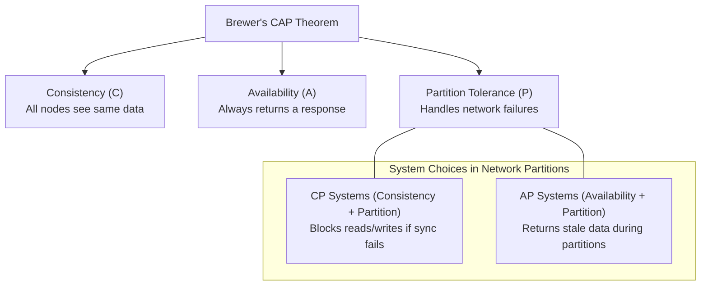
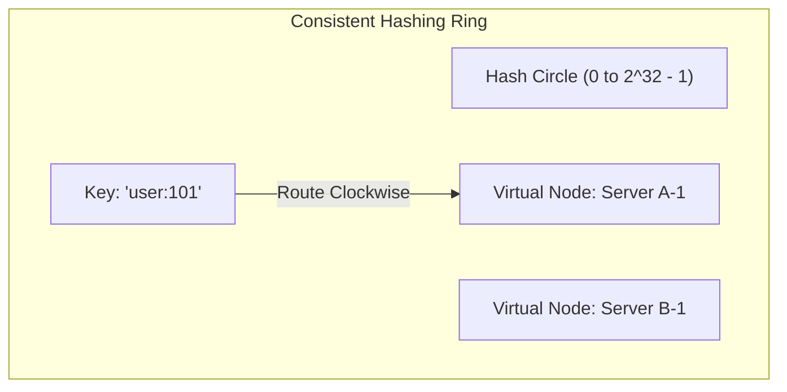
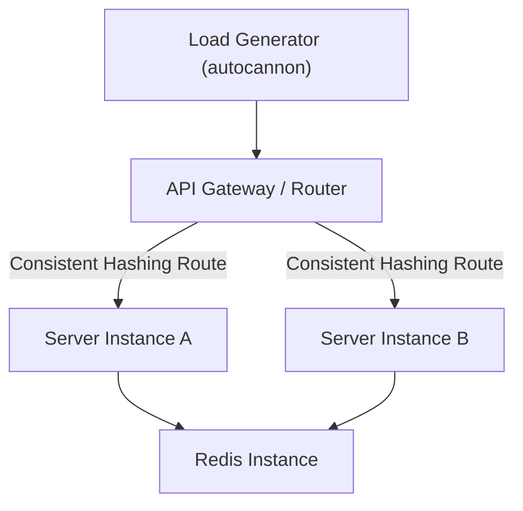

# Part 10: System Design Principles & Scalable Architecture

*[← Back to Master Index](/blog/it-career-guide)*

---

## 1. Core Concept Refresher: High-Scale System Design Mechanics

When scaling backend architectures to handle millions of requests per second (RPS), standard framework design patterns fade in relevance. Systems design forces engineers to evaluate physical limits: network bandwidth, disk I/O, database lock contention, and the physics of data propagation delays.

To succeed in systems architect roles, you must master the fundamental mathematical models and patterns used to scale web platforms globally.

---

### The CAP Theorem and Distributed Trade-Offs

Coined by Eric Brewer, the **CAP Theorem** states that a distributed data store can simultaneously provide at most two of the following three guarantees:
1.  **Consistency (C):** Every read receives the most recent write or an error.
2.  **Availability (A):** Every non-failing node returns a non-error response, without guaranteeing it contains the most recent write.
3.  **Partition Tolerance (P):** The system continues to operate despite an arbitrary number of messages being dropped or delayed by the network between nodes.



In a physical network, network partitions (drops in communication between servers) are inevitable. Therefore, **we must always choose Partition Tolerance (P)**. The actual trade-off is always between **Consistency** and **Availability**:
*   **CP Systems:** If a network partition occurs, PostgreSQL replica nodes reject updates because they cannot synchronize with the leader. The system prioritizes data correctness over availability.
*   **AP Systems:** If a network partition occurs, DynamoDB or Cassandra nodes accept write requests locally, returning stale or conflicting data during reads. The system prioritizes uptime over absolute consistency, resolving conflicts later using CRDTs (Conflict-Free Replicated Data Types) or Last-Write-Wins (LWW) rules.

---

### Consistent Hashing Rings

When caching objects across multiple servers, a naive hashing function (e.g. `ServerIndex = Hash(key) % N`) behaves terribly if the number of servers $N$ changes. If a single cache node crashes or a new node is added, almost all cached keys map to new servers. This triggers a total cache miss across the entire system, overloading the primary database.

To resolve this, systems architects use **Consistent Hashing**:
1.  A hash space is represented as a circular ring (e.g., integers from $0$ to $2^{32}-1$).
2.  Both the keys and the database/cache servers are hashed onto this ring.
3.  To locate a server for a key, the system traverses clockwise from the key's position on the ring until it encounters the first server.
4.  **Virtual Nodes (Vnodes):** To prevent hotspots (where one server gets assigned a disproportionate number of keys), each physical server is represented by multiple virtual nodes mapped randomly across the ring.
5.  *Result:* When a node is added or removed, only a small fraction of keys ($\approx K/N$, where $K$ is the total keys and $N$ is the servers) are remapped.



---

### Database Sharding and Horizontal Scaling

When a database becomes too large for a single machine, we must partition the dataset across multiple database instances. This is known as **Sharding**.
*   **Sharding Key Selection:** The single most critical decision in database architecture. You must partition tables based on a key that aligns with your access patterns. For example, in a SaaS platform, sharding by `tenant_id` ensures that all data for a specific client is stored on the same machine, allowing fast local queries.
*   **The Bottlenecks:** Sharding makes cross-shard joins practically impossible, and requires distributed transaction managers (using Two-Phase Commit protocols) to execute multi-shard updates, which introduces significant latency.

---

## 2. Part 10 Master Resource Directory: Systems Architecture (30 Curated Resources)

Mastering systems design requires studying real-world corporate architectures, mathematical consensus papers, and high-level structural guides. Below are the elite resources.

---

### Sub-Topic A: Consistent Hashing Rings

#### 1. System Design Interview – An Easy Guide (Volume 1)
*   **Direct URL:** https://bytebytego.com/
*   **Search Identification:** Search Web for: `"System Design Interview Volume 1" (Author: Alex Xu)`
*   **Resource Type:** Book
*   **Access / Price:** Paid (Included in TCS O'Reilly Enterprise benefit)
*   **Status:** Required (Non-Negotiable)
*   **Description:** Volume 1, Chapter 5 details consistent hashing designs, virtual nodes layouts, and keys remapping calculations.
*   **Mutual Exclusivity Mapping:** If you read this book, you can skip *Consistent Hashing Algorithmic Foundations (Coursera)* as Alex Xu covers virtual nodes with much tighter visual blueprints.

#### 2. Designing Data-Intensive Applications (Chapter 6)
*   **Direct URL:** https://www.oreilly.com/library/view/designing-data-intensive-applications/9781491903063/
*   **Search Identification:** Search O'Reilly Media for: `"Designing Data-Intensive Applications" (Author: Martin Kleppmann)`
*   **Resource Type:** Book
*   **Access / Price:** Paid (Included in TCS O'Reilly Enterprise benefit)
*   **Status:** Required (Non-Negotiable)
*   **Description:** Details partitioning algorithms, consistent hashing, hotspots mitigations, and cross-shard join boundaries.
*   **Mutual Exclusivity Mapping:** Required baseline systems engineering reference.

#### 3. Consistent Hashing Algorithmic Foundations
*   **Direct URL:** https://www.coursera.org/learn/algorithms-part2
*   **Search Identification:** Search Coursera for: `"Algorithms, Part II" (Princeton University)`
*   **Resource Type:** Video Course
*   **Access / Price:** Free Audit Tier Available
*   **Status:** Alternative to: *System Design Interview – An Easy Guide (Volume 1)*.
*   **Description:** Academic video course explaining search trees, hashing algorithms, and distributed hash tables.
*   **Mutual Exclusivity Mapping:** Shorter academic alternative.

#### 4. Visualizing Consistent Hashing Rings
*   **Direct URL:** https://www.toptal.com/web/consistent-hashing
*   **Search Identification:** Search Google/Web for: `"Toptal consistent hashing database guide"`
*   **Resource Type:** Written Reference & Interactive Diagrams
*   **Access / Price:** 100% Free
*   **Status:** Required
*   **Description:** Outstanding interactive visual guide explaining how keys remap when cache nodes crash.
*   **Mutual Exclusivity Mapping:** Standard visual guide.

#### 5. Distributed Hash Tables and Ring Topologies
*   **Direct URL:** https://web.stanford.edu/class/cs244b/
*   **Search Identification:** Search Web for: `"Stanford CS244b distributed systems lecture notes"`
*   **Resource Type:** Written Reference / Lecture Notes
*   **Access / Price:** 100% Free
*   **Status:** Optional
*   **Description:** Low-level theoretical specs on chord ring protocols and peer-to-peer hash routing.
*   **Mutual Exclusivity Mapping:** Optional booster.

---

### Sub-Topic B: Horizontal vs Vertical Auto-Scaling

#### 6. Scale Up vs Scale Out: AWS & Azure Auto-Scaling
*   **Direct URL:** https://www.pluralsight.com/courses/aws-azure-auto-scaling
*   **Search Identification:** Search Pluralsight/Google for: `"Pluralsight AWS Azure Auto Scaling"`
*   **Resource Type:** Video Course
*   **Access / Price:** Paid / Free Trial Available
*   **Status:** Required (Non-Negotiable)
*   **Description:** Video guide explaining vertical scaling limits, load balancers target groups, CPU threshold rules, and horizontal cluster scaling.
*   **Mutual Exclusivity Mapping:** If you take this, you can skip *Designing Scalable Web Applications* as this course covers actual cloud configuration steps in full.

#### 7. Designing Scalable Web Applications
*   **Direct URL:** https://www.udemy.com/course/designing-scalable-web-applications/
*   **Search Identification:** Search Udemy for: `"Designing Scalable Web Applications" (Instructor: Zeal Vora)`
*   **Resource Type:** Video Course
*   **Access / Price:** Paid (Included in TCS Udemy Business)
*   **Status:** Alternative to: *Scale Up vs Scale Out: AWS & Azure Auto-Scaling*.
*   **Description:** Video walkthrough configuring scalable load balanced instances.
*   **Mutual Exclusivity Mapping:** Choose this if you prefer a detailed code-level look at Linux cluster configurations.

#### 8. Scaling Systems Horizontally: Load & Bottlenecks
*   **Direct URL:** https://www.linkedin.com/learning/scaling-systems-horizontally
*   **Search Identification:** Search LinkedIn Learning for: `"Scaling Systems Horizontally"`
*   **Resource Type:** Video Course
*   **Access / Price:** Paid (Included in TCS Enterprise Account)
*   **Status:** Required
*   **Description:** Details database bottleneck profiles and temporal processing caps under heavy load.
*   **Mutual Exclusivity Mapping:** Required scaling reference.

#### 9. AWS Auto Scaling Groups & Rules
*   **Direct URL:** https://docs.aws.amazon.com/autoscaling/ec2/userguide/what-is-amazon-ec2-auto-scaling.html
*   **Search Identification:** Search Web for: `"Amazon EC2 Auto Scaling official user guide"`
*   **Resource Type:** Written Reference / Documentation
*   **Access / Price:** 100% Free
*   **Status:** Required
*   **Description:** Complete AWS operational guide to scaling metrics, warm pools, and cooldown durations.
*   **Mutual Exclusivity Mapping:** Standard cloud manual.

#### 10. The Art of Scalability
*   **Direct URL:** https://www.oreilly.com/library/view/the-art-of/9780134032801/
*   **Search Identification:** Search O'Reilly Media for: `"The Art of Scalability" (Authors: Martin L. Abbott, Michael T. Fisher)`
*   **Resource Type:** Book
*   **Access / Price:** Paid (Included in TCS O'Reilly Enterprise benefit)
*   **Status:** Optional
*   **Description:** Landmark guide defining the Scale Cube ($X$, $Y$, $Z$ scaling axes).
*   **Mutual Exclusivity Mapping:** Optional booster.

---

### Sub-Topic C: Load Balancing Algorithms

#### 11. System Design: Load Balancers and API Gateways
*   **Direct URL:** https://www.udemy.com/course/load-balancers-api-gateways/
*   **Search Identification:** Search Udemy for: `"Load Balancers and API Gateways" (Instructor: Hussein Nasser)`
*   **Resource Type:** Video Course
*   **Access / Price:** Paid (Included in TCS Udemy Business)
*   **Status:** Required (Non-Negotiable)
*   **Description:** Complete guide to layer 4 (TCP) versus layer 7 (HTTP) load balancing, reverse proxies, and Nginx proxy setups.
*   **Mutual Exclusivity Mapping:** If you complete this, you can skip *Nginx and HAProxy Load Balancing* as Hussein Nasser covers proxy TCP connections with deeper C-level socket details.

#### 12. Nginx and HAProxy Load Balancing Masterclass
*   **Direct URL:** https://www.udemy.com/course/nginx-haproxy/
*   **Search Identification:** Search Udemy for: `"Nginx HAProxy Load Balancing Masterclass"`
*   **Resource Type:** Video Course
*   **Access / Price:** Paid (Included in TCS Udemy Business)
*   **Status:** Alternative to: *System Design: Load Balancers and API Gateways*.
*   **Description:** Focuses on HAProxy stats, session stickiness, and SSL terminations.
*   **Mutual Exclusivity Mapping:** Shorter video alternative.

#### 13. Load Balancing Algorithms (Round Robin, Least Connections, IP Hash)
*   **Direct URL:** https://www.linkedin.com/learning/load-balancing-algorithms
*   **Search Identification:** Search LinkedIn Learning for: `"Load Balancing Algorithms"`
*   **Resource Type:** Video Course
*   **Access / Price:** Paid (Included in TCS Enterprise Account)
*   **Status:** Required
*   **Description:** Video walkthrough explaining Round Robin, Weighted Least Connections, and IP Hash algorithms.
*   **Mutual Exclusivity Mapping:** Standard algorithms guide.

#### 14. DNS Load Balancing and Geo-Routing
*   **Direct URL:** https://www.cloudflare.com/learning/performance/what-is-dns-load-balancing/
*   **Search Identification:** Search Web for: `"Cloudflare learning what is DNS load balancing"`
*   **Resource Type:** Written Reference / Documentation
*   **Access / Price:** 100% Free
*   **Status:** Required
*   **Description:** Explains how DNS servers route clients based on geographic coordinates.
*   **Mutual Exclusivity Mapping:** Standard routing guide.

#### 15. Load Balancing at Scale (Google Maglev Paper)
*   **Direct URL:** https://research.google/pubs/pub44824/
*   **Search Identification:** Search Web for: `"Google Maglev load balancer research paper"`
*   **Resource Type:** Research PDF / Scientific Reference
*   **Access / Price:** 100% Free
*   **Status:** Optional
*   **Description:** Google's original engineering specs for high-performance software network load balancing.
*   **Mutual Exclusivity Mapping:** Optional booster.

---

### Sub-Topic D: Reverse Proxies & CDN Caching

#### 16. Nginx HTTP Server and Reverse Proxy Mastery
*   **Direct URL:** https://www.udemy.com/course/nginx-reverse-proxy/
*   **Search Identification:** Search Udemy for: `"Nginx Reverse Proxy Masterclass"`
*   **Resource Type:** Video Course
*   **Access / Price:** Paid (Included in TCS Udemy Business)
*   **Status:** Required (Non-Negotiable)
*   **Description:** Video masterclass covering Nginx configuration directives, reverse proxy headers routing, and local file caches setups.
*   **Mutual Exclusivity Mapping:** If you complete this, you can skip Varnish edge caching guides as Nginx handles basic edge proxies with native syntax.

#### 17. Cloudflare Edge CDN Configurations
*   **Direct URL:** https://developers.cloudflare.com/cache/
*   **Search Identification:** Search Web for: `"Cloudflare developers cache documentation guides"`
*   **Resource Type:** Written Reference / Documentation
*   **Access / Price:** 100% Free
*   **Status:** Required
*   **Description:** Explains Edge TTL, cache rules, origin shield, and bypass parameters.
*   **Mutual Exclusivity Mapping:** Standard CDN manual.

#### 18. CDN Pull vs Push Architectures
*   **Direct URL:** https://bytebytego.com/
*   **Search Identification:** Search Web for: `"ByteByteGo CDN pull vs push architectures"`
*   **Resource Type:** Written Publication & Reference
*   **Access / Price:** 100% Free
*   **Status:** Required
*   **Description:** Explains edge pull caching vs asset staging push models.
*   **Mutual Exclusivity Mapping:** Essential scaling guide.

#### 19. Caching at the Edge with Varnish
*   **Direct URL:** https://www.oreilly.com/library/view/caching-at-the/9781491931899/
*   **Search Identification:** Search O'Reilly Media for: `"Caching at the Edge" (Author: Varnish Software)`
*   **Resource Type:** Book
*   **Access / Price:** Paid (Included in TCS O'Reilly Enterprise benefit)
*   **Status:** Required
*   **Description:** Standard guide to Varnish Configuration Language (VCL), edge caching, and invalidation rules.
*   **Mutual Exclusivity Mapping:** Standard edge caching manual.

#### 20. Understanding DNS, CDN and Edge Caching (LinkedIn Learning)
*   **Direct URL:** https://www.linkedin.com/learning/understanding-dns-cdn-and-edge-caching
*   **Search Identification:** Search LinkedIn Learning for: `"Understanding DNS CDN"`
*   **Resource Type:** Video Course
*   **Access / Price:** Paid (Included in TCS Enterprise Account)
*   **Status:** Optional
*   **Description:** Shorter video alternative covering edge caching loops.
*   **Mutual Exclusivity Mapping:** Optional booster.

---

### Sub-Topic E: High Availability & Mitigation of SPOF

#### 21. System Design Primer (GitHub Repository)
*   **Direct URL:** https://github.com/donnemartin/system-design-primer
*   **Search Identification:** Search GitHub for: `"donnemartin system-design-primer"`
*   **Resource Type:** Interactive Graph Reference
*   **Access / Price:** 100% Free
*   **Status:** Required (Non-Negotiable)
*   **Description:** The absolute premier open-source study roadmap covering DNS, CDNs, Load Balancers, CAP theorem, and High Availability.
*   **Mutual Exclusivity Mapping:** Gold standard reference; no direct equivalent.

#### 22. Designing High Availability Systems
*   **Direct URL:** https://www.pluralsight.com/courses/designing-high-availability-systems
*   **Search Identification:** Search Pluralsight for: `"Pluralsight Designing High Availability Systems"`
*   **Resource Type:** Video Course
*   **Access / Price:** Paid / Free Trial Available
*   **Status:** Alternative to: *System Design Primer*.
*   **Description:** Focuses on master-slave topologies, automated failovers, and backup scripts.
*   **Mutual Exclusivity Mapping:** Choose this if you prefer a detailed video guide to failover scripts.

#### 23. Chaos Engineering and High Availability (Gremlin)
*   **Direct URL:** https://www.udemy.com/course/chaos-engineering/
*   **Search Identification:** Search Udemy for: `"Chaos Engineering Masterclass"`
*   **Resource Type:** Video Course
*   **Access / Price:** Paid (Included in TCS Udemy Business)
*   **Status:** Required
*   **Description:** Video walkthrough simulating server failures, network latency, and memory exhausts to verify resiliency.
*   **Mutual Exclusivity Mapping:** Essential chaos engineering course.

#### 24. Resilient System Designs: Circuit Breakers and Fallbacks
*   **Direct URL:** https://www.linkedin.com/learning/resilient-system-designs-circuit-breakers-and-fallbacks
*   **Search Identification:** Search LinkedIn Learning for: `"Resilient System Designs"`
*   **Resource Type:** Video Course
*   **Access / Price:** Paid (Included in TCS Enterprise Account)
*   **Status:** Required
*   **Description:** Explains how to implement circuit breaker patterns (e.g. Hystrix, Resilience4j) to prevent cascading failures.
*   **Mutual Exclusivity Mapping:** Standard resiliency guide.

#### 25. Designing Distributed Systems
*   **Direct URL:** https://www.oreilly.com/library/view/designing-distributed-systems/9781491983638/
*   **Search Identification:** Search O'Reilly Media for: `"Designing Distributed Systems" (Author: Brendan Burns)`
*   **Resource Type:** Book
*   **Access / Price:** Paid (Included in TCS O'Reilly Enterprise benefit)
*   **Status:** Optional
*   **Description:** Focuses on container-based design patterns (sidecar, ambassador) for high availability.
*   **Mutual Exclusivity Mapping:** Optional booster.

---

### Sub-Topic F: Real-World Architecture Deep Dives (Uber/Netflix)

#### 26. ByteByteGo Blog & Newsletter
*   **Direct URL:** https://bytebytego.com/
*   **Search Identification:** Search Google/Web for: `"ByteByteGo newsletter system design teardowns"`
*   **Resource Type:** Written Publication & Reference
*   **Access / Price:** Free Tier Available
*   **Status:** Required (Non-Negotiable)
*   **Description:** Weekly visual system design teardowns of companies like Uber, Netflix, Discord, and Slack.
*   **Mutual Exclusivity Mapping:** If you subscribe to this, you can skip *Netflix Engineering Blog* as ByteByteGo translates their architectures into clear, digestible blueprints.

#### 27. System Design Interview – Volume 2
*   **Direct URL:** https://bytebytego.com/
*   **Search Identification:** Search Web for: `"System Design Interview Volume 2" (Author: Alex Xu)`
*   **Resource Type:** Book
*   **Access / Price:** Paid (Included in TCS O'Reilly Enterprise benefit)
*   **Status:** Required
*   **Description:** Volume 2 details geo-distributed databases, S3-like object storage, digital wallets, and hotel reservation systems.
*   **Mutual Exclusivity Mapping:** Essential architecture book.

#### 28. How Netflix Scales: Distributed Systems Architecture
*   **Direct URL:** https://netflixtechblog.com/
*   **Search Identification:** Search Web for: `"Netflix Tech Blog distributed systems microservices"`
*   **Resource Type:** Written Publication / Tech Blog
*   **Access / Price:** 100% Free
*   **Status:** Required
*   **Description:** Direct articles written by Netflix engineers detailing Chaos Monkey, Cassandra migrations, and video streaming.
*   **Mutual Exclusivity Mapping:** Core real-world reference.

#### 29. Uber's Microservices Architecture and Scalability
*   **Direct URL:** https://www.uber.com/en-IN/blog/engineering/
*   **Search Identification:** Search Web for: `"Uber Engineering Blog microservices scalability"`
*   **Resource Type:** Written Publication / Tech Blog
*   **Access / Price:** 100% Free
*   **Status:** Required
*   **Description:** Teardowns of Uber's geo-routing systems, Kafka event hubs, and distributed ledger databases.
*   **Mutual Exclusivity Mapping:** Essential real-world reference.

#### 30. Discord's Backend Scalability: Moving from MongoDB to ScyllaDB
*   **Direct URL:** https://discord.com/blog/how-discord-stores-billions-of-messages
*   **Search Identification:** Search Web for: `"Discord Engineering Blog stores billions of messages"`
*   **Resource Type:** Written Publication
*   **Access / Price:** 100% Free
*   **Status:** Optional
*   **Description:** Outstanding case study detailing how Discord scaled their chat backend storage by migrating to ScyllaDB.
*   **Mutual Exclusivity Mapping:** Optional booster.

---

## 3. Hands-On Portfolio Lab Project: Whiteboard to Code — Scaling an API to 10k RPS

To showcase your systems engineering capabilities, you will build a **High-Scale API Mock Lab** demonstrating consistent hashing routing, load balancing, and local caching.



### Lab Specifications:
1.  **Architecture Setup:**
    *   Write a Node.js API Gateway / Router script in TypeScript.
    *   Spin up two instances of a backend API server (`Server A` on port 3001, `Server B` on port 3002).
2.  **Consistent Hashing Router Implementation:**
    *   Do not use an external hashing library. Write a basic consistent hashing ring implementation in TypeScript.
    *   Map `Server A` and `Server B` to the ring using 10 virtual nodes each.
    *   The Gateway must receive requests on port 3000, parse the HTTP request query parameter `user_id`, map the `user_id` to the consistent hashing ring, and proxy the HTTP request to the designated server.
3.  **Benchmark Testing:**
    *   Install a load testing tool (e.g. `autocannon` or `k6`).
    *   Run a test suite:
        ```bash
        npx autocannon -c 100 -d 10 http://localhost:3000/api?user_id=45
        ```
    *   Verify in your server logs that all requests for `user_id=45` route exclusively to the same server node.
    *   Kill one of the server instances mid-test. Verify that the Gateway re-routes requests to the remaining instance without crashing.

---

## 4. Technical Interview Self-Assessment

Use these questions to verify your systems design knowledge:

| Concept | High-Frequency Interview Question | Expected Technical Answer Framework |
| :--- | :--- | :--- |
| **SQL vs NoSQL** | When would you choose a Relational Database over a NoSQL Document Store? | Choose a **Relational Database** (PostgreSQL) when your application requires strong ACID transaction guarantees (like financial transactions), complex queries with relational joins, and has a highly structured, stable data schema. Choose a **NoSQL Document Store** (MongoDB) when your data schema is dynamic, hierarchical, or unstructured, you need high write throughput, and can scale out horizontally using built-in sharding without needing complex join operations. |
| **Consistent Hashing** | What problem does consistent hashing solve in distributed caching systems? | Consistent hashing resolves the cache stampede and total cache invalidation problem that occurs in traditional round-robin hashing (`hash % nodes`) when the number of servers changes. By hashing both keys and servers onto a circular ring, adding or removing a node only impacts a minimal fraction of keys ($\approx 1/N$), preventing a total cache miss cascade to the primary database. |
| **Long Polling vs. WebSockets** | When should you use WebSockets instead of HTTP Long Polling for real-time applications? | Use **WebSockets** for high-frequency, bidirectional, low-latency communication (e.g., real-time multiplayer gaming, collaborative editors) because it establishes a single persistent TCP connection with low frame overhead. Use **HTTP Long Polling** for low-frequency, unidirectional server-to-client updates where clients are behind restrictive firewalls that block non-HTTP protocols, and where reconnect overhead is acceptable. |

---

## 5. Exit Tasks for this Phase

Verify these objectives are complete before ending this phase:

- [ ] Write a script that routes keys clockwise on a simulated hashing ring.
- [ ] Perform a load test on a local server using `autocannon` and record CPU metrics.
- [ ] Draw a complete systems architecture diagram using standard UML/Mermaid symbols.
- [ ] Complete the basic scaling questions in the System Design Primer.

---

*[Proceed to Part 11: Microservices: Boundaries, Communication, and Fault Tolerance →](/blog/it-career-guide/part-11-microservices)*
