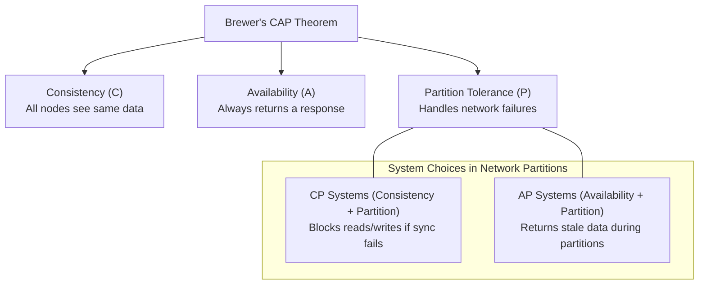
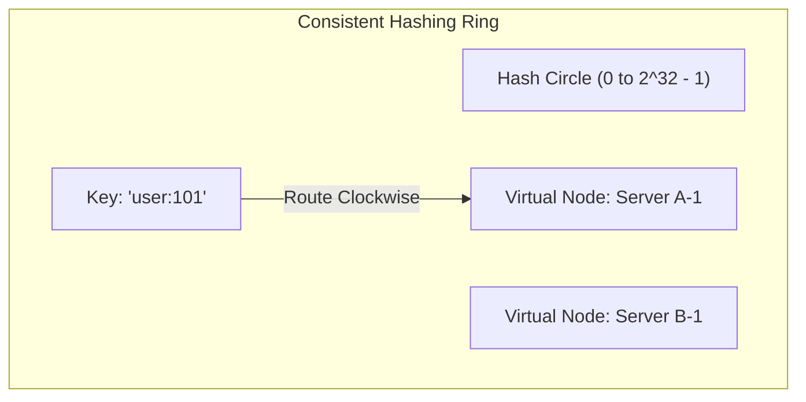
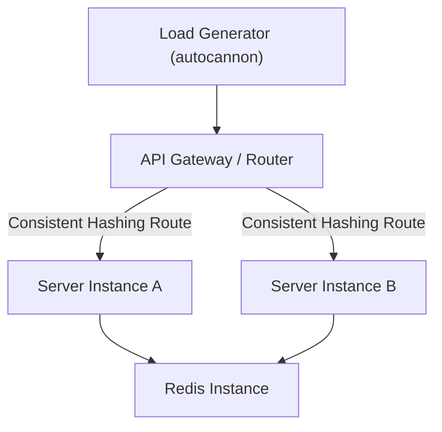

# Part 10: System Design Principles & Scalable Architecture

*[← Back to Master Index](/blog/it-career-guide)*

---

## 1. Core Concept Refresher: High-Scale System Design Mechanics

When scaling backend architectures to handle millions of requests per second (RPS), standard framework design patterns fade in relevance. Systems design forces engineers to evaluate physical limits: network bandwidth, disk I/O, database lock contention, and the physics of data propagation delays.

To succeed in systems architect roles, you must master the fundamental mathematical models and patterns used to scale web platforms globally.

---

### The CAP Theorem and Distributed Trade-Offs

Coined by Eric Brewer, the **CAP Theorem** states that a distributed data store can simultaneously provide at most two of the following three guarantees:
1.  **Consistency (C):** Every read receives the most recent write or an error.
2.  **Availability (A):** Every non-failing node returns a non-error response, without guaranteeing it contains the most recent write.
3.  **Partition Tolerance (P):** The system continues to operate despite an arbitrary number of messages being dropped or delayed by the network between nodes.



In a physical network, network partitions (drops in communication between servers) are inevitable. Therefore, **we must always choose Partition Tolerance (P)**. The actual trade-off is always between **Consistency** and **Availability**:
*   **CP Systems:** If a network partition occurs, PostgreSQL replica nodes reject updates because they cannot synchronize with the leader. The system prioritizes data correctness over availability.
*   **AP Systems:** If a network partition occurs, DynamoDB or Cassandra nodes accept write requests locally, returning stale or conflicting data during reads. The system prioritizes uptime over absolute consistency, resolving conflicts later using CRDTs (Conflict-Free Replicated Data Types) or Last-Write-Wins (LWW) rules.

---

### Consistent Hashing Rings

When caching objects across multiple servers, a naive hashing function (e.g. `ServerIndex = Hash(key) % N`) behaves terribly if the number of servers $N$ changes. If a single cache node crashes or a new node is added, almost all cached keys map to new servers. This triggers a total cache miss across the entire system, overloading the primary database.

To resolve this, systems architects use **Consistent Hashing**:
1.  A hash space is represented as a circular ring (e.g., integers from $0$ to $2^{32}-1$).
2.  Both the keys and the database/cache servers are hashed onto this ring.
3.  To locate a server for a key, the system traverses clockwise from the key's position on the ring until it encounters the first server.
4.  **Virtual Nodes (Vnodes):** To prevent hotspots (where one server gets assigned a disproportionate number of keys), each physical server is represented by multiple virtual nodes mapped randomly across the ring.
5.  *Result:* When a node is added or removed, only a small fraction of keys ($\approx K/N$, where $K$ is the total keys and $N$ is the servers) are remapped.



---

### Database Sharding and Horizontal Scaling

When a database becomes too large for a single machine, we must partition the dataset across multiple database instances. This is known as **Sharding**.
*   **Sharding Key Selection:** The single most critical decision in database architecture. You must partition tables based on a key that aligns with your access patterns. For example, in a SaaS platform, sharding by `tenant_id` ensures that all data for a specific client is stored on the same machine, allowing fast local queries.
*   **The Bottlenecks:** Sharding makes cross-shard joins practically impossible, and requires distributed transaction managers (using Two-Phase Commit protocols) to execute multi-shard updates, which introduces significant latency.

---

## 2. Master Resource Directory: Systems Architecture

Mastering systems design requires studying real-world corporate architectures, mathematical consensus papers, and high-level structural guides. Below are the elite resources.

---

### Resource 1: *System Design Interview – An Easy Guide (Vols 1 & 2)* by Alex Xu
*   **Why It Was Selected:** Alex Xu is the master of visual systems design analysis. These books are selected because they break down real-world enterprise architectures (such as building a Web Crawler, designing a Chat System, scaling a video platform like YouTube, or building a Notification service) into step-by-step design steps. It teaches you how to estimate traffic bandwidth (Back-of-the-envelope calculations) and draw clear architectural blocks, which is crucial for passing systems design loops in product interviews.
*   **Target Syllabus Modules/Chapters:**
    *   Volume 1, Chapter 5: Design Consistent Hashing
    *   Volume 1, Chapter 11: Design a News Feed System
    *   Volume 2, Chapter 4: Distributed Message Queue
    *   Volume 2, Chapter 9: S3-like Object Storage
*   **Time Investment Required:** 30 hours of reading, drawing, and calculations.
    *   *Week 1:* Volume 1 (15 hours)
    *   *Week 2:* Volume 2 (15 hours)
*   **Value Assessment:** Essential. It acts as the direct template for how to structure and present designs during interview panels.
*   **Actionable Study Strategy:** Do not just read the chapters. For each design question (e.g., "Design a Rate Limiter"), close the book and attempt to draw the architecture yourself on a whiteboard. Write down the API endpoints, list the database tables and schemas, estimate the write/read QPS, and then compare your design against Alex's templates to identify gaps in your scaling logic.

---

### Resource 2: *Designing Data-Intensive Applications* by Martin Kleppmann
*   **Why It Was Selected:** Alex Xu teaches you how to draw the architectural blocks; Martin Kleppmann teaches you how the databases and message logs inside those blocks actually process bytes. This book is selected to provide the deep, theoretical foundation underneath systems design. It ensures that when you suggest "Redis" or "Kafka" in a system design interview, you can defend the decision under questioning by senior architects.
*   **Target Syllabus Modules/Chapters:**
    *   Chapter 5: Replication (Single-leader, Multi-leader, Leaderless)
    *   Chapter 6: Partitioning (Sharding, Secondary Indexing)
    *   Chapter 8: The Trouble with Distributed Systems (Network delays, clocks, consensus)
*   **Time Investment Required:** 25 hours.
*   **Value Assessment:** Exceptional.
*   **Actionable Study Strategy:** Focus on Chapter 8 on Distributed Systems. Understand why system clocks cannot be trusted to order events in distributed nodes, and study how logical time systems (like Lamport timestamps) solve ordering problems.

---

### Resource 3: *System Design Primer* by Donne Martin (GitHub repository)
*   **Why It Was Selected:** The single most comprehensive, open-source systems design resource in the world. It contains detailed reviews, study roadmaps, and step-by-step guides for multiple systems scenarios.
*   **Target Syllabus Modules/Chapters:**
    *   All system design index topics (Caching, DNS, Load Balancers, Databases, CAP theorem)
    *   Step-by-step guide on how to approach a system design interview question
*   **Time Investment Required:** 20 hours.
*   **Value Assessment:** Critical.
*   **Actionable Study Strategy:** Print out the **System design interview template**. Memorize the structure: Define requirements, design high-level blocks, dive deep into constraints, write down scale parameters, and evaluate bottlenecks. Apply this exact structure to every problem.

---

### Resource 4: *ByteByteGo Blog & Newsletter* (bytebytego.com)
*   **Why It Was Selected:** A highly visual, constantly updated system design newsletter that analyzes recent scaling outages, modern architecture updates, and API standards.
*   **Target Syllabus Modules/Chapters:**
    *   Weekly architecture teardowns
    *   HTTP/3 vs HTTP/2 profiles, RPC comparison guides
*   **Time Investment Required:** 2 hours per week.
*   **Value Assessment:** High. Keeps your knowledge updated with current tech shifts.
*   **Actionable Study Strategy:** Read the weekly articles. Keep a running document in your notes tracking how companies like Netflix, Discord, or Uber design their real-time notification systems and geo-distributed databases.

---

## 3. Hands-On Portfolio Lab Project: Whiteboard to Code — Scaling an API to 10k RPS

To showcase your systems engineering capabilities, you will build a **High-Scale API Mock Lab** demonstrating consistent hashing routing, load balancing, and local caching.



### Lab Specifications:
1.  **Architecture Setup:**
    *   Write a Node.js API Gateway / Router script in TypeScript.
    *   Spin up two instances of a backend API server (`Server A` on port 3001, `Server B` on port 3002).
2.  **Consistent Hashing Router Implementation:**
    *   Do not use an external hashing library. Write a basic consistent hashing ring implementation in TypeScript.
    *   Map `Server A` and `Server B` to the ring using 10 virtual nodes each.
    *   The Gateway must receive requests on port 3000, parse the HTTP request query parameter `user_id`, map the `user_id` to the consistent hashing ring, and proxy the HTTP request to the designated server.
3.  **Benchmarking & Tuning:**
    *   Install a load testing tool (e.g. `autocannon` or `k6`).
    *   Run a test suite:
        ```bash
        npx autocannon -c 100 -d 10 http://localhost:3000/api?user_id=45
        ```
    *   Verify in your server logs that all requests for `user_id=45` route exclusively to the same server node.
    *   Kill one of the server instances mid-test. Verify that the Gateway re-routes requests to the remaining instance without crashing.

---

## 4. Technical Interview Self-Assessment

Use these questions to verify your systems design knowledge:

| Concept | High-Frequency Interview Question | Expected Technical Answer Framework |
| :--- | :--- | :--- |
| **SQL vs NoSQL** | When would you choose a Relational Database over a NoSQL Document Store? | Choose a **Relational Database** (PostgreSQL) when your application requires strong ACID transaction guarantees (like financial transactions), complex queries with relational joins, and has a highly structured, stable data schema. Choose a **NoSQL Document Store** (MongoDB) when your data schema is dynamic, hierarchical, or unstructured, you need high write throughput, and can scale out horizontally using built-in sharding without needing complex join operations. |
| **Consistent Hashing** | What problem does consistent hashing solve in distributed caching systems? | Consistent hashing resolves the cache stampede and total cache invalidation problem that occurs in traditional round-robin hashing (`hash % nodes`) when the number of servers changes. By hashing both keys and servers onto a circular ring, adding or removing a node only impacts a minimal fraction of keys ($\approx 1/N$), preventing a total cache miss cascade to the primary database. |
| **Long Polling vs. WebSockets** | When should you use WebSockets instead of HTTP Long Polling for real-time applications? | Use **WebSockets** for high-frequency, bidirectional, low-latency communication (e.g., real-time multiplayer gaming, collaborative editors) because it establishes a single persistent TCP connection with low frame overhead. Use **HTTP Long Polling** for low-frequency, unidirectional server-to-client updates where clients are behind restrictive firewalls that block non-HTTP protocols, and where reconnect overhead is acceptable. |

---

## 5. Exit Tasks for this Phase

Verify these objectives are complete before ending this phase:

- [ ] Write a script that routes keys clockwise on a simulated hashing ring.
- [ ] Perform a load test on a local server using `autocannon` and record CPU metrics.
- [ ] Draw a complete systems architecture diagram using standard UML/Mermaid symbols.
- [ ] Complete the basic scaling questions in the System Design Primer.

---

*[Proceed to Part 11: Microservices Architecture Patterns →](/blog/it-career-guide/part-11-microservices)*
