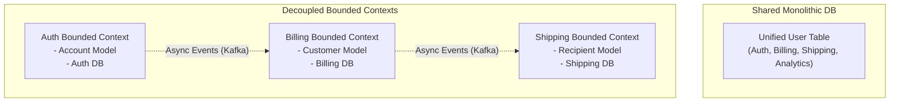
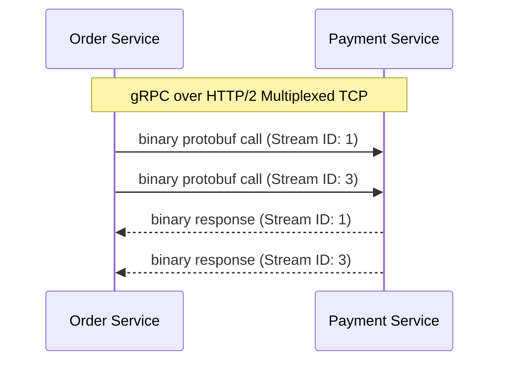
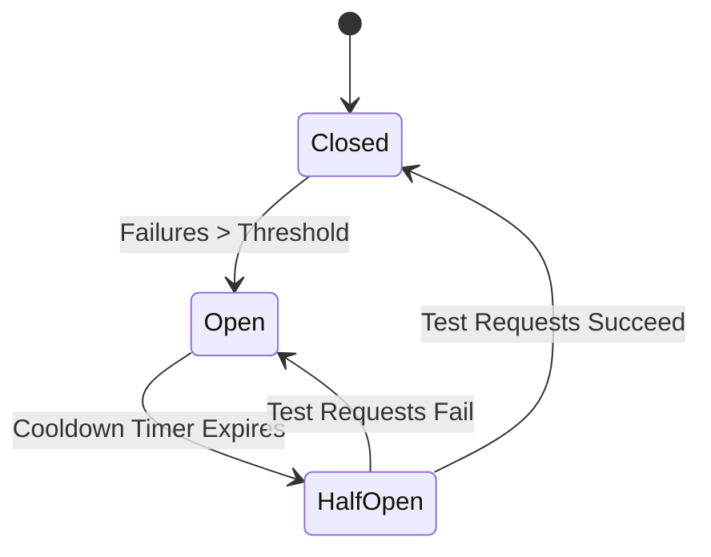
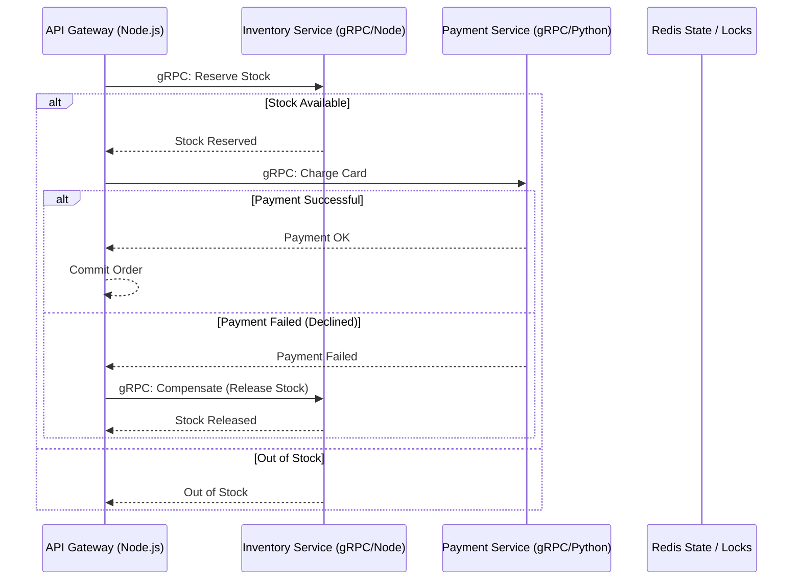

# Part 11: Microservices Architecture Patterns

*[← Back to Master Index](/blog/it-career-guide)*

---

## 1. Core Concept Refresher: The Microservice Paradigm and Bounded Contexts

Decomposing a massive monolithic codebase into a network of independent services is one of the most common challenges in modern software engineering. If done incorrectly, teams build a **Distributed Monolith**—a system with all the operational complexity of microservices but still tightly coupled, requiring synchronized deployments and suffering from cascading runtime failures.

To build clean microservices, systems architects apply **Domain-Driven Design (DDD)** and message-oriented integration patterns.

---

### Bounded Contexts: Decoupling Data and Domains

The foundation of microservices is the DDD concept of a **Bounded Context**.
In a monolith, developers create a single unified data model. For example, a `User` class contains billing columns, shipping profiles, authentication tokens, and shopping preferences.
*   **The Problem:** Changes to the billing schema force re-testing of the authentication module. The code becomes highly coupled, and database migrations are high-risk events.
*   **The DDD Solution:** Divide the business domain into logical boundaries (Bounded Contexts) where specific terminology and models are strictly isolated.

*   **Identity Service Context:** The user is represented as an `Account` with credential columns.
*   **Billing Context:** The user is represented as a `Customer` with billing tokens.
*   **Shipping Context:** The user is represented as a `Recipient` with physical addresses.

Each Bounded Context owns its own database (Database-per-Service pattern). If Shipping needs to know about a new user, it listens to an asynchronous lifecycle event published by the Identity Service. Direct database joins across contexts are strictly prohibited.

---

### gRPC vs. REST/JSON Protocol Selection

Microservices must communicate with each other. While REST with JSON payloads is common, it is highly inefficient for high-throughput, internal service-to-service communication.

| Protocol / Parameter | REST (JSON) | gRPC (HTTP/2 & Protobuf) |
| :--- | :--- | :--- |
| **Payload Format** | Text-based (JSON strings) | Binary (Protobuf serialization) |
| **Transport Layer** | HTTP/1.1 (One request per TCP connect) | HTTP/2 (Multiplexed bidirectional streams) |
| **Type Safety** | Implicit (Requires runtime validation) | Strict (Compile-time code generation) |
| **Performance** | High serialization & parsing CPU cost | Low parsing overhead, minimal payload size |

gRPC utilizes **Protocol Buffers (Protobuf)** as its interface definition language. It compiles strict contracts (`.proto` files) directly into native TypeScript or Python client code, ensuring that services cannot make mismatched calls at compile-time.

---

### Saga Pattern: Managing Distributed Transactions

Since each service owns its database, performing updates that span multiple services (e.g. creating an order, charging a credit card, and reserving inventory) cannot use standard SQL transactions.

To solve this, architects use the **Saga Pattern** (a sequence of local transactions):
1.  **Orchestrator-Based Saga:** A centralized service coordinates the execution flow, calling each participant sequentially.
2.  **Choreography-Based Saga:** Participants listen to events from a broker (like Kafka) and execute local transactions asynchronously.

#### Compensating Transactions:
If any step in a Saga fails (e.g., card declined during payment), the system must execute **Compensating Transactions** in reverse order to undo the previous successful steps (e.g., release reserved inventory and mark the order as cancelled). This guarantees **Eventual Consistency**.

---

### Circuit Breakers: Preventing Cascading Failures

If a downstream service (e.g., Payment Gateway) experiences high latency or crashes, upstream services calling it will block their execution threads waiting for timeouts. Under high traffic, this will exhaust the server's thread pool, taking down the entire gateway.

A **Circuit Breaker** (e.g., implemented via libraries like Polly or opossum) wraps network calls and operates in three states:
1.  **Closed:** Requests route normally. The breaker monitors failure rates.
2.  **Open:** If failure rate exceeds a threshold (e.g., 50% failures in 10 seconds), the breaker trips. Subsequent requests fail immediately *without* calling the downstream service, preventing thread blockages.
3.  **Half-Open:** After a cooldown duration (e.g., 30 seconds), the breaker lets a few test requests pass. If they succeed, it closes the circuit. If they fail, it trips back to Open.

---

## 2. Master Resource Directory: Microservices

Building resilient decoupled systems requires studying enterprise architecture books, domain-driven design practices, and serialization protocols. Below are the definitive resources.

---

### Resource 1: *Microservices Patterns* by Chris Richardson
*   **Why It Was Selected:** Chris Richardson is one of the original pioneers of microservices architecture. This book is selected because it bypasses generic theory and provides concrete, pattern-oriented blueprints for all microservice design challenges (Saga patterns, CQRS, Event Sourcing, API Gateways, Service Discovery, and Testing patterns). It teaches you exactly how to design decoupled architectures that are scalable and resilient.
*   **Target Syllabus Modules/Chapters:**
    *   Chapter 2: Decomposing an Application into Services
    *   Chapter 3: Inter-Service Communication (gRPC, REST, Message Queues)
    *   Chapter 4: Managing Transactions with Sagas
    *   Chapter 7: Implementing Queries in a Microservice Architecture (CQRS)
*   **Time Investment Required:** 30 hours.
    *   *Week 1:* Chapters 2, 3 & 4 (18 hours)
    *   *Week 2:* Chapter 7 and review (12 hours)
*   **Value Assessment:** Essential. It acts as the core manual for designing distributed backend systems.
*   **Actionable Study Strategy:** Focus on **Chapter 4: Sagas**. Compare Choreography-based Sagas against Orchestrator-based Sagas. Draw step-by-step state transition diagrams for both patterns, highlighting how message losses or out-of-order events are handled.

---

### Resource 2: *Domain-Driven Design* by Eric Evans
*   **Why It Was Selected:** The seminal textbook that defined modern software design patterns. Evans teaches you how to map complex business requirements into clean, maintainable software architectures. It is selected to teach you how to set up aggregates, entities, value objects, and bounded contexts, preventing you from building distributed monoliths.
*   **Target Syllabus Modules/Chapters:**
    *   Part I: Putting the Domain Model to Work
    *   Part II: The Building Blocks of a Model-Driven Design
    *   Part IV: Strategic Design (Bounded Contexts, Context Maps, Shared Kernels)
*   **Time Investment Required:** 25 hours.
*   **Value Assessment:** High. Understanding DDD changes how you write and organize code at all scale levels.
*   **Actionable Study Strategy:** Read Part IV slowly. Study the different types of relationships between Bounded Contexts (Customer-Supplier, Conformist, Anti-Corruption Layer). Design a context map showing how a new microservice integrates with a legacy system using an Anti-Corruption Layer (ACL).

---

### Resource 3: *gRPC Official Documentation & Guides* (grpc.io/docs)
*   **Why It Was Selected:** The official reference manuals for gRPC. It covers protocol buffers, stream configurations (unary, client streaming, server streaming, bidirectional), deadliness, and interceptors across multiple backend languages.
*   **Target Syllabus Modules/Chapters:**
    *   What is gRPC? & Core Concepts
    *   Protocol Buffers Guide (Language Guide proto3)
    *   gRPC Basics (TypeScript / Python guides)
*   **Time Investment Required:** 15 hours.
*   **Value Assessment:** High.
*   **Actionable Study Strategy:** Create a `.proto` file defining a user management service. Compile the proto file using `protoc` into TypeScript interfaces and generate a gRPC mock server and client.

---

### Resource 4: *Microservices Architecture Guide* by Microsoft Learn
*   **Why It Was Selected:** A highly practical, production-oriented guide outlining cloud-native patterns, container deployments, security boundaries, and API Gateways.
*   **Target Syllabus Modules/Chapters:**
    *   Microservice Architecture style
    *   Designing, building, and operating microservices on Azure/AWS
*   **Time Investment Required:** 10 hours.
*   **Value Assessment:** Medium-High.
*   **Actionable Study Strategy:** Review the sections on **API Gateways** (Backends for Frontends - BFF pattern). Understand why mobile devices should call a dedicated BFF gateway rather than calling individual internal microservices.

---

## 3. Hands-On Portfolio Lab Project: Decomposing a Monolith with gRPC and Saga Orchestrator

To showcase your microservices credentials, you will build a **Choreographed Saga Transaction System** using gRPC, Node.js, Python, and a local Redis container.

### Lab Specifications:
1.  **Service Declarations:**
    *   Create a `.proto` file defining:
        *   `InventoryService`: RPC methods `ReserveStock(id, qty)` and `ReleaseStock(id, qty)`.
        *   `PaymentService`: RPC method `ProcessPayment(user_id, amount)`.
2.  **Order Orchestrator Gateway (Node.js):**
    *   Write a Node.js API Gateway that exposes `POST /orders`.
    *   When an order comes in:
        *   Call `InventoryService.ReserveStock()` via gRPC.
        *   If successful, call `PaymentService.ProcessPayment()` via gRPC.
        *   If payment fails, initiate the compensating step: call `InventoryService.ReleaseStock()` to release the inventory.
3.  **Payment Service (Python):**
    *   Write a Python backend using `grpcio` and `grpcio-tools` that implements `PaymentService`.
    *   Implement logic to simulate payment declines for specific card tokens to verify your orchestrator triggers compensating rollbacks.
4.  **Resiliency Wrapping:**
    *   Wrap your gRPC calls inside the Node.js orchestrator using a Circuit Breaker library. Simulate network failures to confirm the circuit trips, throwing immediate fallback messages without blocking the thread pool.

---

## 4. Technical Interview Self-Assessment

Use these questions to verify your microservices architecture knowledge:

| Concept | High-Frequency Interview Question | Expected Technical Answer Framework |
| :--- | :--- | :--- |
| **Saga vs. 2PC** | Why is the Saga Pattern preferred over Two-Phase Commit (2PC) for microservices? | **Two-Phase Commit (2PC)** is a synchronous, blocking protocol. It requires all participant databases to lock target rows until the coordinator commits. This introduces latency, locks database connections, and creates single points of failure. The **Saga Pattern** executes local transactions asynchronously, releasing locks immediately. Resiliency is managed via compensating transactions, sacrificing immediate consistency for scale and availability (Eventual Consistency). |
| **API Gateways** | What is the purpose of an API Gateway in a microservice architecture? | An **API Gateway** acts as the single entry point for all client requests. It handles cross-cutting concerns such as TLS termination, user authentication/authorization, rate limiting, request routing, and payload aggregation. By using a gateway, you protect internal microservices from exposure to the public internet, reduce client roundtrips, and simplify client-side integrations. |
| **Cascade Failures** | How does a Circuit Breaker prevent cascading failures in a microservices mesh? | When a downstream microservice experiences high latency or crashes, calling services would normally block their execution threads waiting for network timeouts. Under traffic, this starves the caller's resources, causing it to crash and cascade failures upstream. A **Circuit Breaker** tracks failure rates; if they cross a threshold, it trips to `Open` and rejects calls instantly with fallback values, protecting caller resources. |

---

## 5. Exit Tasks for this Phase

Verify these objectives are complete before ending this phase:

- [ ] Write a `.proto` file defining message types and RPC methods.
- [ ] Compile Protobuf contracts into Node.js and Python clients.
- [ ] Implement a coordinated rollback transaction across two services.
- [ ] Configure and test a local circuit breaker using a load testing tool.

---

*[Proceed to Part 12: Docker & Containerization for Backend Developers →](/blog/it-career-guide/part-12-docker)*
