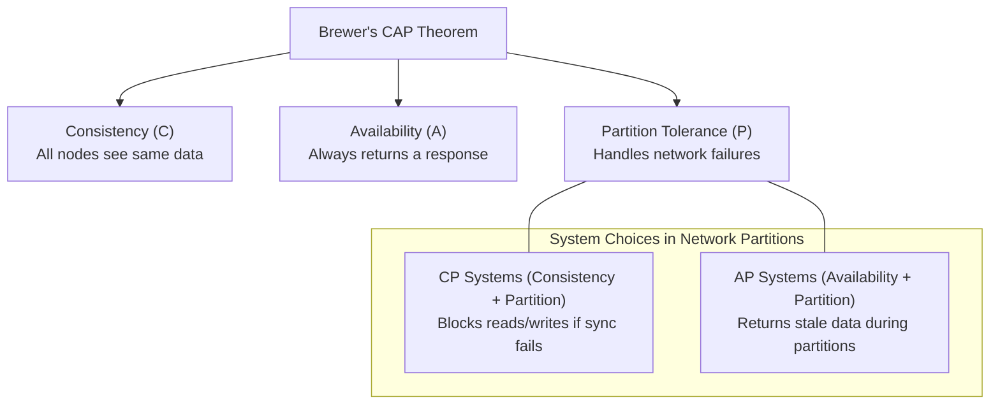
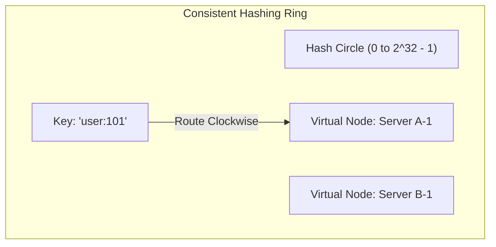

# Part 11: System Design & Scalability Fundamentals

*[← Back to Master Index](/blog/it-career-guide)*

---

## 1. Core Concept Refresher: High-Scale System Design Mechanics

When scaling backend architectures to handle millions of requests per second (RPS), standard framework design patterns fade in relevance. Systems design forces engineers to evaluate physical limits: network bandwidth, disk I/O, database lock contention, and the physics of data propagation delays.

To succeed in systems architect roles, you must master the fundamental mathematical models and patterns used to scale web platforms globally.

---

### Brewer's CAP Theorem and Distributed Trade-offs
Coined by Eric Brewer, the **CAP Theorem** states that a distributed data store can simultaneously provide at most two of the following three guarantees:
1.  **Consistency (C):** Every read receives the most recent write or an error.
2.  **Availability (A):** Every non-failing node returns a non-error response, without guaranteeing it contains the most recent write.
3.  **Partition Tolerance (P):** The system continues to operate despite an arbitrary number of messages being dropped or delayed by the network between nodes.

In a physical network, network partitions (drops in communication between servers) are inevitable. Therefore, **we must always choose Partition Tolerance (P)**. The actual trade-off is always between **Consistency** and **Availability**:
*   **CP Systems:** If a network partition occurs, the database replica nodes reject updates because they cannot synchronize with the leader. The system prioritizes data correctness over availability (e.g., standard PostgreSQL master-replica setups or MongoDB clusters).
*   **AP Systems:** If a network partition occurs, nodes accept write requests locally, returning stale or conflicting data during reads. The system prioritizes uptime over absolute consistency, resolving conflicts later using CRDTs (Conflict-Free Replicated Data Types) or Last-Write-Wins (LWW) rules (e.g., Cassandra or DynamoDB).

---

### Consistent Hashing Rings & Virtual Nodes
When caching objects across multiple servers, a naive hashing function (e.g. `ServerIndex = Hash(key) % N`) behaves terribly if the number of servers $N$ changes. If a single cache node crashes or a new node is added, almost all cached keys map to new servers. This triggers a total cache miss across the entire system, overloading the primary database.

To resolve this, systems architects use **Consistent Hashing**:
1.  A hash space is represented as a circular ring (e.g., integers from $0$ to $2^{32}-1$).
2.  Both the keys and the database/cache servers are hashed onto this ring.
3.  To locate a server for a key, the system traverses clockwise from the key's position on the ring until it encounters the first server.
4.  **Virtual Nodes (Vnodes):** To prevent hotspots (where one server gets assigned a disproportionate number of keys), each physical server is represented by multiple virtual nodes mapped randomly across the ring.
5.  *Result:* When a node is added or removed, only a small fraction of keys ($\approx K/N$, where $K$ is the total keys and $N$ is the servers) are remapped.

---

## 2. System Design Master Resource Directory (30 Curated Resources)

Mastering systems design requires studying real-world corporate architectures, mathematical consensus papers, and high-level structural guides. Below are the elite resources.

---

### Sub-Topic A: Vertical vs. Horizontal Scaling

#### 1. System Design Interview – An Easy Guide (Volume 1)
*   **Direct URL:** https://bytebytego.com/
*   **Search Identification:** Search Web for: `"System Design Interview Volume 1" (Author: Alex Xu)`
*   **Resource Type:** Book
*   **Access / Price:** Paid (Included in TCS O'Reilly Enterprise benefit)
*   **Status:** Required (Non-Negotiable)
*   **Description:** Volume 1, Chapter 1 details basic database scalings, master-replica setups, horizontal replication paths, and vertical sizing.
*   **Mutual Exclusivity Mapping:** If you read this, you can skip *Designing Scalable Web Applications* on O'Reilly as Alex Xu covers scaling layers with superior visual charts.

#### 2. Scale Up vs Scale Out: AWS & Azure Auto-Scaling
*   **Direct URL:** https://www.pluralsight.com/courses/aws-azure-auto-scaling
*   **Search Identification:** Search Pluralsight for: `"Pluralsight AWS Azure Auto Scaling"`
*   **Resource Type:** Video Course
*   **Access / Price:** Paid / Free Trial Available
*   **Status:** Required
*   **Description:** Video guide explaining vertical scaling limits, load balancers target groups, CPU threshold rules, and horizontal cluster scaling.
*   **Mutual Exclusivity Mapping:** Essential cloud scaling video companion.

#### 3. Designing Data-Intensive Applications (Chapter 1)
*   **Direct URL:** https://www.oreilly.com/library/view/designing-data-intensive-applications/9781491903063/
*   **Search Identification:** Search O'Reilly Media for: `"Designing Data-Intensive Applications" (Author: Martin Kleppmann)`
*   **Resource Type:** Book
*   **Access / Price:** Paid (Included in TCS O'Reilly Enterprise benefit)
*   **Status:** Required (Highly Recommended)
*   **Description:** Masterpiece. Explains core parameters behind scalability, calculating percentile latency spikes, and reliability engineering.
*   **Mutual Exclusivity Mapping:** Required baseline systems engineering reference.

#### 4. High-Performance Web Scaling (Udemy)
*   **Direct URL:** https://www.udemy.com/course/web-scaling/
*   **Search Identification:** Search Udemy for: `"High-Performance Web Scaling: Database and Cache Clusters"`
*   **Resource Type:** Video Course
*   **Access / Price:** Paid (Included in TCS Udemy Business)
*   **Status:** Alternative to: *Scale Up vs Scale Out*.
*   **Description:** Details setting up multi-region read replicas and load balancer thresholds.
*   **Mutual Exclusivity Mapping:** Focused database clustering video alternative.

#### 5. Scalability Rules: 50 Principles for Web Scaling
*   **Direct URL:** https://www.oreilly.com/library/view/scalability-rules-50/9780132617604/
*   **Search Identification:** Search O'Reilly Media for: `"Scalability Rules" (Authors: Martin L. Abbott, Michael T. Fisher)`
*   **Resource Type:** Book
*   **Access / Price:** Paid (Included in TCS O'Reilly Enterprise benefit)
*   **Status:** Optional
*   **Description:** Practical architectural checklists mapping the AKF Scale Cube (X, Y, and Z scaling coordinates).
*   **Mutual Exclusivity Mapping:** Optional checklists reference.

---

### Sub-Topic B: Brewer's CAP Theorem under Partitions

#### 6. Distributed Systems: Principles and Paradigms
*   **Direct URL:** https://www.oreilly.com/library/view/distributed-systems-principles/9781509301423/
*   **Search Identification:** Search O'Reilly Media for: `"Distributed Systems: Principles and Paradigms" (Authors: Andrew S. Tanenbaum, Maarten van Steen)`
*   **Resource Type:** Book
*   **Access / Price:** Paid (Included in TCS O'Reilly Enterprise benefit)
*   **Status:** Required (Highly Recommended)
*   **Description:** Academic textbook explaining consensus algorithms, distributed clocks, replication networks, and CAP theorem proofs.
*   **Mutual Exclusivity Mapping:** If you read this, you can skip *Cloud Computing Concepts* as Tanenbaum covers distributed systems theory with higher density.

#### 7. Cloud Computing Concepts (Coursera)
*   **Direct URL:** https://www.coursera.org/learn/cloud-computing
*   **Search Identification:** Search Coursera for: `"Cloud Computing Concepts, Part 1" (University of Illinois)`
*   **Resource Type:** Video Course
*   **Access / Price:** Free Audit Tier Available
*   **Status:** Required (Highly Recommended)
*   **Description:** Leading university course covering distributed key-value store architectures, membership protocols, and CAP theorem limits.
*   **Mutual Exclusivity Mapping:** Essential database theory path.

#### 8. Brewer's CAP Theorem: 12 Years Later (Eric Brewer)
*   **Direct URL:** https://www.infoq.com/articles/cap-twelve-years-later-how-the-rules-have-changed/
*   **Search Identification:** Search Web for: `"Eric Brewer CAP Theorem twelve years later InfoQ"`
*   **Resource Type:** Written Analysis / Research Paper
*   **Access / Price:** 100% Free
*   **Status:** Required
*   **Description:** Outstanding analysis clarifying that CAP is not a simple "pick-two" choice, explaining how modern networks balance latency and consistency.
*   **Mutual Exclusivity Mapping:** Essential conceptual reference.

#### 9. Distributed Systems Foundations (Pluralsight)
*   **Direct URL:** https://www.pluralsight.com/courses/distributed-systems-foundations
*   **Search Identification:** Search Pluralsight for: `"Distributed Systems Foundations"`
*   **Resource Type:** Video Course
*   **Access / Price:** Paid / Free Trial Available
*   **Status:** Alternative to: *Cloud Computing Concepts*.
*   **Description:** Introduces consensus, active replication, data partitions, and Paxos algorithms.
*   **Mutual Exclusivity Mapping:** Shorter video alternative.

#### 10. PACELC Theorem Specification (VLDB paper)
*   **Direct URL:** https://www.cs.umd.edu/~abadi/papers/abadi-pacelc.pdf
*   **Search Identification:** Search Google for: `"Daniel Abadi PACELC Theorem paper"`
*   **Resource Type:** Academic Research Paper / Written Spec
*   **Access / Price:** 100% Free
*   **Status:** Optional
*   **Description:** The formal expansion of CAP, explaining how database engines operate during normal runs (Latency vs. Consistency) and partitions (Availability vs. Consistency).
*   **Mutual Exclusivity Mapping:** Advanced mathematical reference.

---

### Sub-Topic C: Consistent Hashing Rings & Virtual Nodes

#### 11. System Design Interview – An Easy Guide (Volume 1 - Chapter 5)
*   **Direct URL:** https://bytebytego.com/
*   **Search Identification:** Search Web for: `"System Design Interview Volume 1" (Author: Alex Xu)`
*   **Resource Type:** Book
*   **Access / Price:** Paid (Included in TCS O'Reilly Enterprise benefit)
*   **Status:** Required (Non-Negotiable)
*   **Description:** Dedicated chapter outlining consistent hashing rings design, virtual nodes setups, and keys allocations.
*   **Mutual Exclusivity Mapping:** Required baseline systems engineering reference.

#### 12. Algorithms, Part II (Coursera)
*   **Direct URL:** https://www.coursera.org/learn/algorithms-part2
*   **Search Identification:** Search Coursera for: `"Algorithms, Part II" (Princeton University)`
*   **Resource Type:** Video Course
*   **Access / Price:** Free Audit Tier Available
*   **Status:** Required (Highly Recommended)
*   **Description:** Explains hash tables, search trees, and algorithmic structures behind distributed hashing systems.
*   **Mutual Exclusivity Mapping:** Essential data structures path.

#### 13. Toptal: Consistent Hashing Interactive Guide
*   **Direct URL:** https://www.toptal.com/web/consistent-hashing
*   **Search Identification:** Search Google/Web for: `"Toptal consistent hashing database guide"`
*   **Resource Type:** Written Reference & Interactive Diagrams
*   **Access / Price:** 100% Free
*   **Status:** Required
*   **Description:** Exceptional visual guide mapping how keys are reallocated clockwise across rings when node additions or crashes occur.
*   **Mutual Exclusivity Mapping:** Essential visual reference.

#### 14. Stanford CS244b: Distributed Systems Lecture Notes
*   **Direct URL:** https://web.stanford.edu/class/cs244b/
*   **Search Identification:** Search Web for: `"Stanford CS244b distributed systems lecture notes consistent hashing"`
*   **Resource Type:** Written Reference / Lecture Notes
*   **Access / Price:** 100% Free
*   **Status:** Required
*   **Description:** Deep academic notes covering peer-to-peer routing tables and chord ring systems.
*   **Mutual Exclusivity Mapping:** Standard reference specs.

#### 15. Dynamo: Amazon's Highly Available Key-Value Store (Paper)
*   **Direct URL:** https://www.allthingsdistributed.com/files/amazon-dynamo-sosp2007.pdf
*   **Search Identification:** Search Google for: `"Amazon Dynamo paper SOSP 2007"`
*   **Resource Type:** Academic Research Paper / Written Spec
*   **Access / Price:** 100% Free
*   **Status:** Optional
*   **Description:** The seminal research paper that popularized consistent hashing with virtual nodes and vector clocks.
*   **Mutual Exclusivity Mapping:** Classic distributed systems reading.

---

### Sub-Topic D: Load Balancing Algorithms & Target Groups

#### 16. Load Balancing and Reverse Proxies (LinkedIn Learning)
*   **Direct URL:** https://www.linkedin.com/learning/load-balancing-and-reverse-proxies
*   **Search Identification:** Search LinkedIn Learning for: `"Load Balancing and Reverse Proxies" (Instructor: Kevin Skoglund)`
*   **Resource Type:** Video Course
*   **Access / Price:** Paid (Included in TCS Enterprise Account)
*   **Status:** Required (Non-Negotiable)
*   **Description:** Video series detailing round-robin, least-connections, source-IP hashing, Layer 4 (TCP) vs. Layer 7 (HTTP) routing, and health checks.
*   **Mutual Exclusivity Mapping:** Essential operational network guide.

#### 17. High Performance Nginx Load Balancing (Udemy)
*   **Direct URL:** https://www.udemy.com/course/nginx-load-balancing/
*   **Search Identification:** Search Udemy for: `"NGINX, Apache, SSL Encryption & Load Balancing"`
*   **Resource Type:** Video Course
*   **Access / Price:** Paid (Included in TCS Udemy Business)
*   **Status:** Required
*   **Description:** Practical coding walks configuring Nginx config blocks, SSL termination, and proxy buffers.
*   **Mutual Exclusivity Mapping:** Essential deployment companion.

#### 18. AWS Application Load Balancer (ALB) Official Docs
*   **Direct URL:** https://docs.aws.amazon.com/elasticloadbalancing/latest/application/
*   **Search Identification:** Search Web for: `"AWS Application Load Balancer official documentation"`
*   **Resource Type:** Written Reference / Cloud Manual
*   **Access / Price:** 100% Free
*   **Status:** Required
*   **Description:** Technical specifications detailing target groups, path-based routing rules, host headers, and sticky session cookies.
*   **Mutual Exclusivity Mapping:** Standard cloud reference manual.

#### 19. Nginx Reverse Proxy & Load Balancing Manual
*   **Direct URL:** https://docs.nginx.com/nginx/admin-guide/load-balancer/http-load-balancer/
*   **Search Identification:** Search Web for: `"Nginx admin guide HTTP load balancing configuration"`
*   **Resource Type:** Written Reference / Documentation
*   **Access / Price:** 100% Free
*   **Status:** Required
*   **Description:** Detailed directives config manuals for upstream groups, failover parameters, and connection limits.
*   **Mutual Exclusivity Mapping:** Standard infrastructure specs.

#### 20. HAProxy Architecture Guide
*   **Direct URL:** https://www.haproxy.org/download/1.8/doc/architecture.txt
*   **Search Identification:** Search Web for: `"HAProxy core architecture design manual"`
*   **Resource Type:** Written Reference / Spec Sheet
*   **Access / Price:** 100% Free
*   **Status:** Optional
*   **Description:** Deep network specifications on proxy event loops, non-blocking I/O execution, and thread architectures.
*   **Mutual Exclusivity Mapping:** Advanced optional systems spec.

---

### Sub-Topic E: CDNs & Dynamic Edge Caching

#### 21. Cloudflare Workers and Edge Compute (Udemy)
*   **Direct URL:** https://www.udemy.com/course/cloudflare-workers/
*   **Search Identification:** Search Udemy for: `"Cloudflare Workers and Edge Compute Masterclass"`
*   **Resource Type:** Video Course
*   **Access / Price:** Paid (Included in TCS Udemy Business)
*   **Status:** Required (Non-Negotiable)
*   **Description:** Video course covering CDN edge nodes cache configurations, writing edge serverless workers, and caching dynamic APIs.
*   **Mutual Exclusivity Mapping:** Essential edge compute video course.

#### 22. Designing Scalable Web Applications (O'Reilly Video)
*   **Direct URL:** https://www.oreilly.com/library/view/designing-scalable-web/9781491903063/
*   **Search Identification:** Search O'Reilly Media for: `"Designing Scalable Web Applications: CDNs and Caching"`
*   **Resource Type:** Video Course
*   **Access / Price:** Paid (Included in TCS O'Reilly Enterprise benefit)
*   **Status:** Required
*   **Description:** Focuses on CDN cache pull/push configurations, HTTP caching headers (`Cache-Control`, `ETag`, `Vary`), and edge eviction.
*   **Mutual Exclusivity Mapping:** Essential web architecture guide.

#### 23. Cloudflare Learning Center: What is a CDN?
*   **Direct URL:** https://www.cloudflare.com/learning/cdn/what-is-a-cdn/
*   **Search Identification:** Search Web for: `"Cloudflare learning center content delivery network"`
*   **Resource Type:** Written Tutorial / Spec Sheet
*   **Access / Price:** 100% Free
*   **Status:** Required
*   **Description:** Introduces edge nodes caching, Anycast routing networks, geographic latency delays, and DDoS protections.
*   **Mutual Exclusivity Mapping:** Standard reference index.

#### 24. AWS CloudFront CDN Masterclass (Udemy)
*   **Direct URL:** https://www.udemy.com/course/aws-cloudfront/
*   **Search Identification:** Search Udemy for: `"AWS CloudFront Masterclass"`
*   **Resource Type:** Video Course
*   **Access / Price:** Paid (Included in TCS Udemy Business)
*   **Status:** Alternative to: *Cloudflare Workers and Edge Compute*.
*   **Description:** Configuring origins, behaviors, SSL policies, and cache invalidations in CloudFront.
*   **Mutual Exclusivity Mapping:** Choose this if your focus is AWS cloud deployments.

#### 25. HTTP Caching Specification (RFC 9111)
*   **Direct URL:** https://datatracker.ietf.org/doc/html/rfc9111
*   **Search Identification:** Search Web for: `"RFC 9111 HTTP Caching"`
*   **Resource Type:** Written Reference / Spec Sheet (IETF RFC)
*   **Access / Price:** 100% Free
*   **Status:** Optional
*   **Description:** The official specification defining how browsers, intermediate proxies, and CDNs must parse cache control fields.
*   **Mutual Exclusivity Mapping:** Advanced system specification reference.

---

### Sub-Topic F: Microservices API Gateways & BFF Pattern

#### 26. Designing Microservices Architecture with API Gateways (O'Reilly Video)
*   **Direct URL:** https://www.oreilly.com/library/view/designing-microservices-architecture/9781491979921/
*   **Search Identification:** Search O'Reilly Media for: `"Designing Microservices Architecture with API Gateways"`
*   **Resource Type:** Video Course
*   **Access / Price:** Paid (Included in TCS O'Reilly Enterprise benefit)
*   **Status:** Required (Non-Negotiable)
*   **Description:** Architectural walkthrough of the API Gateway pattern, mapping routing paths, rate limiting, and authentications.
*   **Mutual Exclusivity Mapping:** If you take this, you can skip Pluralsight's general gateway modules as this covers Backend-for-Frontends (BFF) patterns in detail.

#### 27. Microsoft Learn: Backends for Frontends (BFF) pattern
*   **Direct URL:** https://learn.microsoft.com/en-us/azure/architecture/patterns/backends-for-frontends
*   **Search Identification:** Search Google/Web for: `"Microsoft Azure patterns Backends for Frontends"`
*   **Resource Type:** Written Reference / Design Spec
*   **Access / Price:** 100% Free
*   **Status:** Required
*   **Description:** Highly respected design document explaining why mobile, desktop, and third-party APIs should connect to separate BFF gateways.
*   **Mutual Exclusivity Mapping:** Essential design checklist.

#### 28. Kong API Gateway Complete Guide (Udemy)
*   **Direct URL:** https://www.udemy.com/course/kong-api-gateway/
*   **Search Identification:** Search Udemy for: `"Kong API Gateway Complete Guide"`
*   **Resource Type:** Video Course
*   **Access / Price:** Paid (Included in TCS Udemy Business)
*   **Status:** Required
*   **Description:** Practical course setting up Kong, writing routing rules, enabling authentication plugins, and configuring rate limiters.
*   **Mutual Exclusivity Mapping:** High-end deployment manual.

#### 29. Apache APISIX Gateway Architecture (GitHub)
*   **Direct URL:** https://github.com/apache/apisix#architecture
*   **Search Identification:** Search GitHub for: `"apache apisix architecture gateway"`
*   **Resource Type:** Written Reference / Documentation
*   **Access / Price:** 100% Free
*   **Status:** Optional
*   **Description:** Low-level architectures detailing etcd state configurations, nginx integrations, and plugin executions.
*   **Mutual Exclusivity Mapping:** Advanced optional systems spec.

#### 30. Local Kong Gateway Docker Compose Sandbox
*   **Direct URL:** https://github.com/Kong/docker-kong
*   **Search Identification:** Search GitHub for: `"Kong docker-kong docker-compose"`
*   **Resource Type:** Interactive Code Template / Infrastructure-as-Code
*   **Access / Price:** 100% Free
*   **Status:** Optional
*   **Description:** Configures a local Kong container instance with PostgreSQL databases for testing routing configs.
*   **Mutual Exclusivity Mapping:** Standard local practice playground.

---

## 3. Hands-On Portfolio Lab Project: Consistent Hashing Simulator

To demonstrate your systems design capabilities to product-firm recruiters, you must build and commit a complete **Consistent Hashing Ring Simulator** in Python.

### The Lab Project Guidelines:
1.  **System Target:** You will construct a Python class representing a **Consistent Hashing Ring** with support for **Virtual Nodes**.
2.  **The Goal:** Prove mathematically how adding a node to a naive hashing ring triggers a $>90\%$ cache miss rate, whereas consistent hashing remaps only a fraction ($\approx 1/N$) of keys.
3.  **Algorithmic Architecture:**
    *   Write a Python file `consistent_hashing.py` implementing:
        *   `HashRing` class:
            *   Properties: `num_replicas` (Virtual Nodes count, default: 100), `ring` (a sorted list of hashed integer values representing node placements), `nodes` (dictionary mapping hashed positions back to physical server names).
            *   Method `_hash(key)`: Returns an MD5 hash of the string, converted to a large integer (representing positions on the $0$ to $2^{32}-1$ ring).
            *   Method `add_node(node)`: Hashes `num_replicas` virtual keys (e.g. `node-0`, `node-1`...) and places them onto the ring. Keeps the ring sorted.
            *   Method `remove_node(node)`: Removes all virtual node hashes from the ring.
            *   Method `get_node(key)`: Hashes the object key. Traverses the ring clockwise (using binary search `bisect_left`) to locate the first node hash $\ge$ the key's hash. Returns the node name. If key's hash is greater than all nodes on the ring, wrap around to return the first node on the ring.
4.  **Simulation Test:**
    *   Initialize the ring with 4 physical servers (e.g., `Server-A`, `Server-B`...).
    *   Map 10,000 keys (e.g., `user:101`, `user:102`...) to their respective servers on the ring. Record the distribution.
    *   Add a 5th server (`Server-E`). Re-evaluate where the 10,000 keys map.
    *   **Calculate remap ratio:** Verify that only $\approx 20\%$ of the keys changed their server mappings, proving the caching safety of consistent hashing.
5.  **GitHub Commitment:** Commit `consistent_hashing.py`, a simulation run log displaying key-distribution metrics, and a `README.md` containing explanation charts to your public `2026-upskilling-roadmap` repository.

---

## 4. Technical Interview Self-Assessment

Use these questions to verify if you have successfully digested the principles of this systems design chapter:

| Concept | High-Frequency Interview Question | Expected Technical Answer Framework |
| :--- | :--- | :--- |
| **Virtual Nodes** | Why are Virtual Nodes critical when implementing Consistent Hashing in production? | Without virtual nodes, physical servers are hashed onto the ring only once. Due to hashing randomness, the distances between nodes will be highly uneven. One server might inherit a massive segment of the ring, storing $80\%$ of the keys, creating hot-spots. **Virtual Nodes** represent each physical server multiple times (e.g., 100 virtual nodes per server) mapped randomly across the ring. This balances segment sizes, distributing traffic evenly across all physical resources. |
| **Layer 4 vs 7** | Explain the difference between Layer 4 (TCP) and Layer 7 (HTTP) Load Balancers. | **Layer 4 (L4):** Operates at the transport layer, routing traffic based on packet data (IP addresses and ports). It does not inspect the message body, which is fast and requires minimal CPU, but cannot make path-based routing decisions. **Layer 7 (L7):** Operates at the application layer. It terminates the SSL connection, inspects HTTP headers, cookies, and URI paths, routing traffic dynamically (e.g. routing `/api/users` to the User Microservice). It consumes more CPU but offers high routing flexibility. |
| **Edge Compute** | What is the difference between static CDN caching and Dynamic Edge Compute? | **Static CDN Caching:** Replicates static files (HTML, CSS, images) on edge servers close to the user, using standard cache-control headers. **Dynamic Edge Compute (like Cloudflare Workers):** Runs lightweight Javascript/V8 scripts directly on edge servers. It executes business logic (like geo-routing, A/B testing, header injections, or database queries via edge-replicas) at the nearest network boundary, bypassing the origin server entirely, lowering LCP metrics. |

---

## 5. Exit Tasks for this Phase

Complete these verification steps before proceeding to Part 12:

- [ ] Writes the `HashRing` class in Python, complete with virtual node mapping and binary search traversing.
- [ ] Runs the 10,000-key simulation to verify key reallocations when adding/removing servers.
- [ ] Confirms the calculated key-shift ratio matches the mathematical expectation ($\approx 1/N$).
- [ ] Commits the simulator code and simulation logs to your public Git repository.

---

*[Proceed to Part 12: Microservices Architecture Patterns →](/blog/it-career-guide/part-12-microservices)*