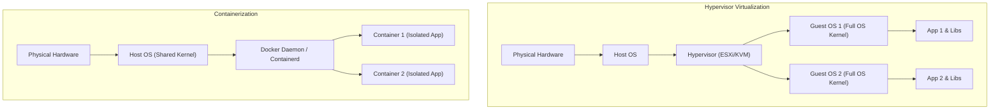
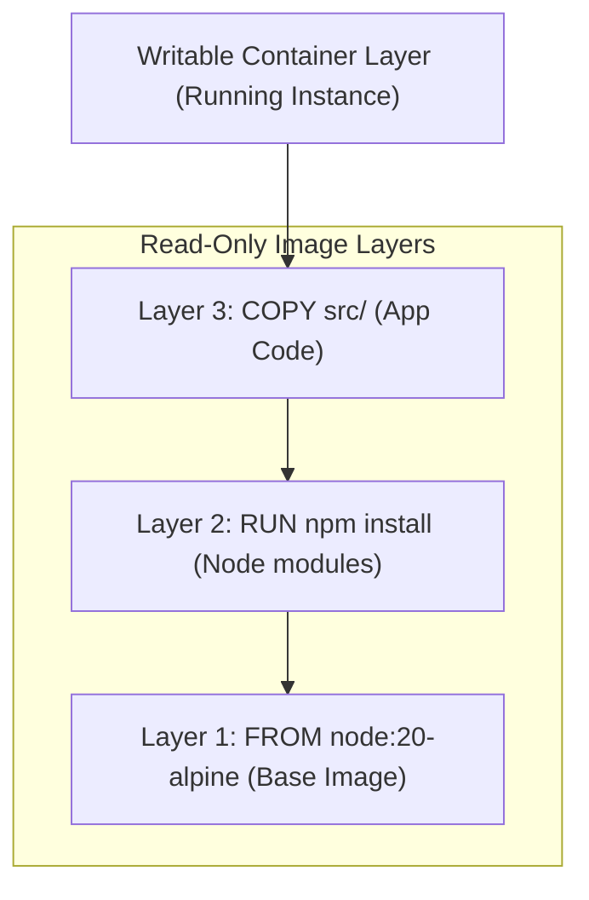
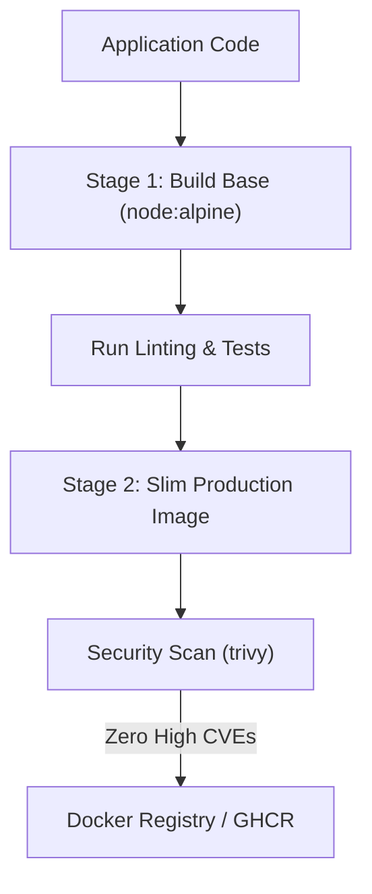

# Part 12: Docker & Containerization for Backend Developers

*[← Back to Master Index](/blog/it-career-guide)*

---

## 1. Core Concept Refresher: Containerization Internals & Optimization

For years, software deployment was plagued by the classic problem: *"It works on my machine."* Differences in operating system distributions, dependency versions, file permissions, and environment variables made shipping software a high-risk operational task.

**Docker** solved this by containerizing software—packaging application code, runtimes, system tools, and libraries into a single, immutable container image that executes identically on any machine. To build production-grade containerized systems, backend developers must understand the underlying Linux kernel mechanics, image layering, and security boundaries.

---

### Containerization vs. Virtualization

Many developers mistake Docker containers for lightweight Virtual Machines (VMs). In reality, they are fundamentally different technologies.



*   **Virtual Machines:** Run on a Hypervisor (like VMware or KVM). Each VM includes a full copy of a guest operating system, virtual device drivers, and application binaries. Spawning a VM takes minutes and requires gigabytes of memory.
*   **Docker Containers:** Do not package a guest operating system. Instead, they run directly on the **Host OS Kernel** and share its resources. A container is simply a standard Linux process isolated using kernel features. Spawning a container takes milliseconds and requires virtually zero overhead.

---

### The Linux Kernel Foundations: Namespaces and Cgroups

Docker achieves isolation through two key features of the Linux Kernel:

1.  **Namespaces (Isolation):** Isolate what a process can *see*.
    *   `PID Namespace:` Isolates process IDs. Inside the container, your application process thinks it is PID 1, while on the host OS, it might be PID 45029.
    *   `NET Namespace:` Isolates network interfaces. Each container gets its own virtual network stack and IP address.
    *   `MNT Namespace:` Isolates file system mount points.
    *   `UTS Namespace:` Isolates hostname and domain name.
    *   `IPC Namespace:` Isolates Inter-Process Communication resources.
    *   `USER Namespace:` Isolates user and group IDs.
2.  **Control Groups / cgroups (Resource Limits):** Limit what a process can *use*.
    *   Cgroups restrict the amount of CPU, memory, network bandwidth, and disk I/O a container process can consume. This prevents a single resource-heavy container from starvation-crashing the host machine (Noisy Neighbor problem).

---

### Docker Image Layering and copy-on-write (CoW)

Docker images are composed of read-only layers. Each instruction in a `Dockerfile` (e.g. `FROM`, `RUN`, `COPY`) creates a new layer representing the differences from the previous layer.



When you run a container:
*   Docker mounts all the read-only layers sequentially.
*   It adds a thin, temporary **Writable Layer** (the Container Layer) on top. All changes made to the running container (writing files, modifying configurations) are written to this writable layer using a **Copy-on-Write (CoW)** system, keeping the underlying image immutable.

---

### Writing Highly Optimized, Multi-Stage Dockerfiles

A poorly written Dockerfile leads to bloated images ($>1\text{GB}$), slow build cycles, and security vulnerabilities. Below is an optimized, multi-stage, non-root `Dockerfile` template for a production Node.js application:

```dockerfile
# Stage 1: Build & Dependency Resolution
FROM node:20-alpine AS builder
WORKDIR /app
COPY package*.json ./
RUN npm ci
COPY . .
RUN npm run build

# Stage 2: Production Execution Runtime
FROM node:20-alpine AS runner
WORKDIR /app
ENV NODE_ENV=production
COPY package*.json ./
RUN npm ci --only=production

# Copy only compiled assets from stage 1
COPY --from=builder /app/dist ./dist

# Create a non-privileged system user for security
RUN addgroup -g 1001 -S nodejs && adduser -S nextjs -u 1001
USER nextjs

EXPOSE 3000
CMD ["node", "dist/main.js"]
```

#### Optimization Techniques Applied:
*   **Alpine Base Image:** Utilizing `node:20-alpine` reduces the base size from 900MB to under 100MB by stripping out legacy tools and shells.
*   **Multi-Stage Build:** Dependencies and build tools (like compilers, typescript packages) are kept in the `builder` stage. The final `runner` stage copies *only* the production runtime assets, keeping the final production image small and secure.
*   **Non-Root User:** By default, Docker executes processes as `root`. If a hacker compromises your containerized application, they gain root access to the host kernel. Spawning a custom non-privileged user and running `USER nextjs` mitigates this risk.
*   **Layer Caching Optimization:** Copying `package*.json` and running `npm ci` *before* copying the rest of the application source code ensures that Docker caches the dependency layer. If you only change a line of source code, Docker skips running `npm ci` during the next build run, reducing build times from minutes to seconds.

---

## 2. Master Resource Directory: Containerization

Mastering containerization requires deep understanding of image layers, kernel boundaries, and security controls. Below are the elite resources.

---

### Resource 1: *Docker Deep Dive* by Nigel Poulton
*   **Why It Was Selected:** Nigel Poulton's book is widely recognized as the best guide to learning container mechanics. It explains Docker architectures, image layout structures, networking parameters, volume mounting, and security options in an incredibly clear, highly visual format. For developers transitioning from a support background, this book bridges the gap between using basic Docker commands and understanding how container engines operate under the hood.
*   **Target Syllabus Modules/Chapters:**
    *   Chapter 4: The Core Engine (containerd, runc)
    *   Chapter 5: Docker Images (Layers, Storage Drivers, Registries)
    *   Chapter 6: Docker Containers (Isolation, Lifecycle)
    *   Chapter 8: Docker Networking (Bridge, Overlay, Host networks)
*   **Time Investment Required:** 20 hours of reading and labs.
    *   *Week 1:* Chapters 4, 5 & 6 (12 hours)
    *   *Week 2:* Chapter 8 and networking configurations (8 hours)
*   **Value Assessment:** Exceptional. It builds the system-level vocabulary required to debug container network drops and storage issues.
*   **Actionable Study Strategy:** Replicate the storage driver labs. Run `docker image inspect` on a local image and analyze the `RootFS` section to map the individual SHA-256 hashes of each image layer to the physical storage paths on your Linux host.

---

### Resource 2: *Docker Security Best Practices* (docs.docker.com/develop/develop-images/dockerfile_best-practices/)
*   **Why It Was Selected:** The official documentation guide outlining how to write secure, clean, and performant Dockerfiles. It covers caching mechanisms, dependency pinning, and security scanning tools.
*   **Target Syllabus Modules/Chapters:**
    *   Best practices for writing Dockerfiles
    *   Docker Security (Namespaces, Capabilities, Seccomp profiles)
*   **Time Investment Required:** 10 hours.
*   **Value Assessment:** High. Writing secure containers is a key differentiator during senior developer interviews.
*   **Actionable Study Strategy:** Focus on **Linux Capabilities**. Practice running containers with limited root privileges using the `--cap-drop` and `--cap-add` flags. Try dropping all capabilities (`--cap-drop=all`) and verify if your server can still bind to port 80.

---

### Resource 3: *Docker in Action (2nd Edition)* by Jeff Nickoloff
*   **Why It Was Selected:** A highly practical book focusing on real-world orchestration, volume setups, multi-container systems, and log aggregation topologies.
*   **Target Syllabus Modules/Chapters:**
    *   Part 1: Keeping a Tidy Workspace (Volume mounts, bind mounts)
    *   Part 2: Running Software in Containers (Ports, Linking, Networks)
*   **Time Investment Required:** 15 hours.
*   **Value Assessment:** Medium-High.
*   **Actionable Study Strategy:** Study the difference between **Bind Mounts** (mounting local host directories) and **Named Volumes** (managed storage inside Docker's directory). Implement database data persistence using named volumes and test if data survives container deletions.

---

### Resource 4: *Containers Core Concepts* by Confluent / Sysdig Developer Libraries
*   **Why It Was Selected:** High-quality developer articles detailing low-level container internals: namespaces, cgroups, LSMs (AppArmor/SELinux), and system call filtering (`seccomp`).
*   **Target Syllabus Modules/Chapters:**
    *   Linux Namespaces & cgroups deep dive
    *   Understanding container escapes and kernel vulnerabilities
*   **Time Investment Required:** 8 hours.
*   **Value Assessment:** Medium.
*   **Actionable Study Strategy:** Read the sections on system call filtering. Use a custom seccomp profile to block a container from executing specific system calls (like `mkdir` or `chmod`) and test if the container blocks those operations.

---

## 3. Hands-On Portfolio Lab Project: Hardening and Optimizing a Container Pipeline

To showcase your containerization capabilities, you will package, optimize, and scan a backend microservice stack using Docker Compose, multi-stage builds, and vulnerability scanners.



### Lab Specifications:
1.  **Application Packaging:**
    *   Create a simple TypeScript API.
    *   Write an optimized, multi-stage `Dockerfile` using the production template (using `node:20-alpine`, caching `package*.json`, executing as a non-privileged `node` user, and exposing port 3000).
2.  **Multi-Container Compose Mesh:**
    *   Write a `docker-compose.yml` file that orchestrates:
        *   `api-service`: Built from your Dockerfile, exposing port 3000.
        *   `database`: PostgreSQL, utilizing a persistent named volume mounted to `/var/lib/postgresql/data`.
    *   **Healthcheck Checks:** Ensure the `api-service` does not boot until the `database` is healthy. Use Compose `depends_on` with `condition: service_healthy` configurations.
3.  **Vulnerability Scanning (Security Auditing):**
    *   Install **Trivy** (a security vulnerability scanner) on your local machine or run it inside Docker.
    *   Scan your production image:
        ```bash
        docker run --rm -v /var/run/docker.sock:/var/run/docker.sock aquasec/trivy image my-app-name:latest
        ```
    *   Verify that your image contains zero **HIGH** or **CRITICAL** vulnerabilities. If vulnerabilities are found, resolve them by updating the base image or dependencies.

---

## 4. Technical Interview Self-Assessment

Use these questions to verify your containerization knowledge:

| Concept | High-Frequency Interview Question | Expected Technical Answer Framework |
| :--- | :--- | :--- |
| **Namespace Isolation** | How does Docker isolate a container process's network from the host OS? | Docker utilizes Linux **Network Namespaces (NET)**. When a container is spawned, Docker creates a new network namespace for the process, isolating its network interfaces, routing tables, and port bindings. It then creates a virtual ethernet pair (`veth` interface), placing one end inside the container and the other end in the host's bridge network (typically `docker0`), allowing routed communication through the host network. |
| **Root Vulnerabilities** | Why is running a container process as root dangerous? | By default, Docker executes container processes as `root`. While namespaces isolate the process, the container still shares the host operating system's kernel. If a hacker exploits a vulnerability in the application (like a remote code execution exploit) and escapes the container namespace limits, they immediately possess root permissions on the host system, allowing complete control over all other containers and host resources. |
| **Layer Caching** | How does Docker's layer caching work, and how do you optimize it? | Docker builds images sequentially. For each instruction in a Dockerfile, it checks if the instruction and the input files match previous builds. If they match, Docker reuses the cached layer. To optimize caching, place static instructions that rarely change (like base images, installing system tools, and copying dependencies) at the top of the Dockerfile, and place dynamic instructions (like copying source code) at the bottom. |

---

## 5. Exit Tasks for this Phase

Verify these objectives are complete before ending this phase:

- [ ] Write a multi-stage Dockerfile that compiles TS code and outputs a slim runtime image.
- [ ] Run a container as a non-root user and verify permissions inside the terminal.
- [ ] Write a Docker Compose config with dependency healthcheck bounds.
- [ ] Scan an image using Trivy and fix all reported security alerts.

---

*[Proceed to Part 13: Kubernetes & Container Orchestration →](/blog/it-career-guide/part-13-kubernetes)*
