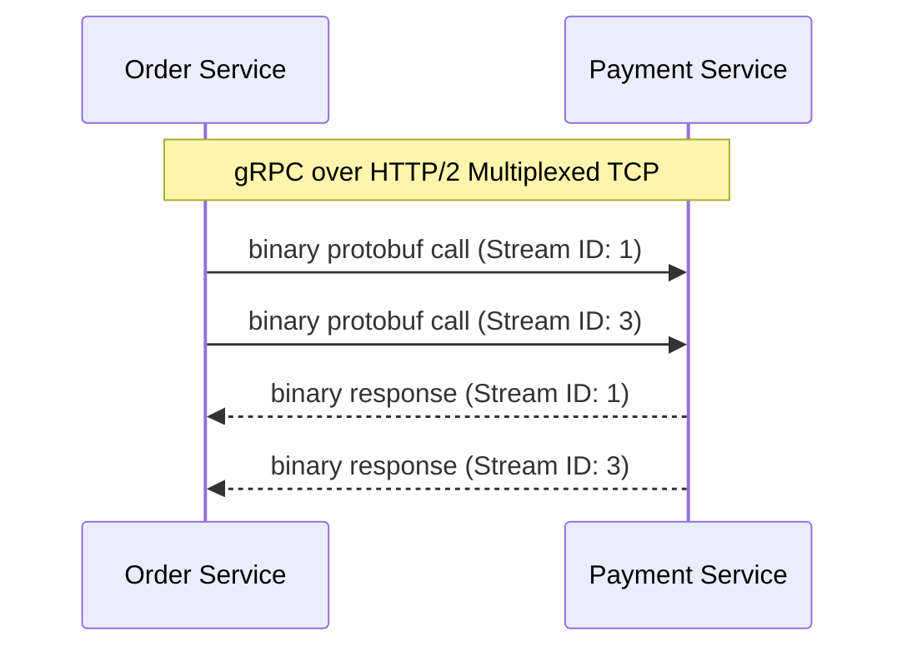

# Part 12: Microservices Architecture Patterns

*[← Back to Master Index](/blog/it-career-guide)*

---

## 1. Core Concept Refresher: The Microservice Paradigm and Bounded Contexts

Decomposing a massive monolithic codebase into a network of independent, isolated services is one of the most common challenges in modern software engineering. If done incorrectly, development teams build a **Distributed Monolith**—a system with all the operational complexity of microservices but still tightly coupled, requiring synchronized deployments, and suffering from cascading runtime failures.

To build clean microservices, systems architects apply **Domain-Driven Design (DDD)** and message-oriented integration patterns.

---

### Bounded Contexts: Decoupling Data and Domains
The foundation of microservices is the DDD concept of a **Bounded Context**.
In a monolith, developers create a single unified data model. For example, a `User` class contains billing columns, shipping profiles, authentication tokens, and shopping preferences.
*   **The Problem:** Changes to the billing schema force re-testing of the authentication module. The code becomes highly coupled, and database migrations are high-risk events.
*   **The DDD Solution:** Divide the business domain into logical boundaries (Bounded Contexts) where specific terminology and models are strictly isolated.

```mermaid
graph TD
    subgraph Shared Monolithic DB
        monolithUser["Unified User Table<br>(Auth, Billing, Shipping, Analytics)"]
    end
    subgraph Decoupled Bounded Contexts
        authContext["Auth Bounded Context<br>- Account Model<br>- Auth DB"]
        billingContext["Billing Bounded Context<br>- Customer Model<br>- Billing DB"]
        shippingContext["Shipping Bounded Context<br>- Recipient Model<br>- Shipping DB"]
    end
    authContext -.-->|"Async Events (Kafka)"| billingContext
    billingContext -.-->|"Async Events (Kafka)"| shippingContext
```

*   **Identity Service Context:** The user is represented as an `Account` with credential columns.
*   **Billing Context:** The user is represented as a `Customer` with billing tokens.
*   **Shipping Context:** The user is represented as a `Recipient` with physical addresses.

Each Bounded Context owns its own database (Database-per-Service pattern). If Shipping needs to know about a new user, it listens to an asynchronous lifecycle event published by the Identity Service. Direct database joins across contexts are strictly prohibited.

---

### gRPC vs. REST/JSON Protocol Selection
Microservices must communicate with each other. While REST with JSON payloads is common, it is highly inefficient for high-throughput, internal service-to-service communication.

| Protocol / Parameter | REST (JSON) | gRPC (HTTP/2 & Protobuf) |
| :--- | :--- | :--- |
| **Payload Format** | Text-based (JSON strings) | Binary (Protobuf serialization) |
| **Transport Layer** | HTTP/1.1 (One request per TCP connect) | HTTP/2 (Multiplexed bidirectional streams) |
| **Type Safety** | Implicit (Requires runtime validation) | Strict (Compile-time code generation) |
| **Performance** | High serialization & parsing CPU cost | Low parsing overhead, minimal payload size |



gRPC utilizes **Protocol Buffers (Protobuf)** as its interface definition language. It compiles strict contracts (`.proto` files) directly into native TypeScript or Python client code, ensuring that services cannot make mismatched calls at compile-time.

---

## 2. Microservices Master Resource Directory (30 Curated Resources)

Building resilient decoupled systems requires studying enterprise architecture books, domain-driven design practices, and serialization protocols. Below are the definitive resources.

---

### Sub-Topic A: Domain-Driven Design (DDD) & Bounded Contexts

#### 1. Domain-Driven Design
*   **Direct URL:** https://www.oreilly.com/library/view/domain-driven-design-tackling/0321125215/
*   **Search Identification:** Search O'Reilly Media for: `"Domain-Driven Design" (Author: Eric Evans)`
*   **Resource Type:** Book
*   **Access / Price:** Paid (Included in TCS O'Reilly Enterprise benefit)
*   **Status:** Required (Non-Negotiable)
*   **Description:** The seminal textbook that defined modern software design patterns. Evans teaches how to map complex business requirements into aggregates, entities, and bounded contexts.
*   **Mutual Exclusivity Mapping:** If you read this, you can skip *Implementing Domain-Driven Design* as Eric Evans provides the original, fundamental conceptual architecture.

#### 2. Domain-Driven Design Distilled
*   **Direct URL:** https://www.linkedin.com/learning/domain-driven-design-distilled
*   **Search Identification:** Search LinkedIn Learning for: `"Domain-Driven Design Distilled" (Instructor: Vaughn Vernon)`
*   **Resource Type:** Video Course
*   **Access / Price:** Paid (Included in TCS Enterprise Account)
*   **Status:** Required
*   **Description:** Video series detailing strategic design maps, bounded contexts, domain events, and context mapping.
*   **Mutual Exclusivity Mapping:** Essential video companion for Evans's book.

#### 3. Microsoft Learn: Strategic DDD Patterns
*   **Direct URL:** https://learn.microsoft.com/en-us/azure/architecture/microservices/model/domain-analysis
*   **Search Identification:** Search Google/Web for: `"Microsoft Azure Architecture Strategic Domain Analysis DDD"`
*   **Resource Type:** Written Reference / Design Spec
*   **Access / Price:** 100% Free
*   **Status:** Required
*   **Description:** Production-grade guides showing how to decompose an application into domain boundaries and context maps.
*   **Mutual Exclusivity Mapping:** Standard reference index.

#### 4. Implementing Domain-Driven Design
*   **Direct URL:** https://www.oreilly.com/library/view/implementing-domain-driven-design/9780133039900/
*   **Search Identification:** Search O'Reilly Media for: `"Implementing Domain-Driven Design" (Author: Vaughn Vernon)`
*   **Resource Type:** Book
*   **Access / Price:** Paid (Included in TCS O'Reilly Enterprise benefit)
*   **Status:** Alternative to: *Domain-Driven Design*.
*   **Description:** Detailed C# and Java implementations of aggregates, entities, and repositories.
*   **Mutual Exclusivity Mapping:** Choose this if you prefer code implementation over high-level strategic architecture.

#### 5. Domain Modeling Made Functional
*   **Direct URL:** https://www.oreilly.com/library/view/domain-modeling-made/9781680506228/
*   **Search Identification:** Search O'Reilly Media for: `"Domain Modeling Made Functional" (Author: Scott Wlaschin)`
*   **Resource Type:** Book
*   **Access / Price:** Paid (Included in TCS O'Reilly Enterprise benefit)
*   **Status:** Optional
*   **Description:** Visualizing domain models as type constraints and functional boundaries.
*   **Mutual Exclusivity Mapping:** Optional booster.

---

### Sub-Topic B: Database-per-Service & Eventual Consistency

#### 6. Microservices Patterns
*   **Direct URL:** https://www.oreilly.com/library/view/microservices-patterns/9781617294549/
*   **Search Identification:** Search O'Reilly Media for: `"Microservices Patterns" (Author: Chris Richardson)`
*   **Resource Type:** Book
*   **Access / Price:** Paid (Included in TCS O'Reilly Enterprise benefit)
*   **Status:** Required (Non-Negotiable)
*   **Description:** Landmark textbook detailing Database-per-Service, CQRS, Sagas, and event-driven data consistency.
*   **Mutual Exclusivity Mapping:** If you read this, you can skip *Designing Microservices on Udemy* as Chris Richardson covers architectural patterns with deeper structural rigor.

#### 7. Event-Driven Microservices: Data Consistency
*   **Direct URL:** https://www.linkedin.com/learning/event-driven-microservices-data-consistency
*   **Search Identification:** Search LinkedIn Learning for: `"Event-Driven Microservices: Data Consistency"`
*   **Resource Type:** Video Course
*   **Access / Price:** Paid (Included in TCS Enterprise Account)
*   **Status:** Required
*   **Description:** Video series detailing transactional outbox pattern implementations, duplicate event detections, and CDC pipelines.
*   **Mutual Exclusivity Mapping:** Essential video companion for Richardson's book.

#### 8. Building Microservices: Designing Fine-Grained Systems (2nd Edition)
*   **Direct URL:** https://www.oreilly.com/library/view/building-microservices-2nd/9781492034018/
*   **Search Identification:** Search O'Reilly Media for: `"Building Microservices" (Author: Sam Newman)`
*   **Resource Type:** Book
*   **Access / Price:** Paid (Included in TCS O'Reilly Enterprise benefit)
*   **Status:** Required (Highly Recommended)
*   **Description:** Standard guide to microservice lifecycles, database splits, testing strategies, and orchestration boundaries.
*   **Mutual Exclusivity Mapping:** Essential baseline microservices systems guide.

#### 9. Designing Microservices with Spring Boot & Spring Cloud (Udemy)
*   **Direct URL:** https://www.udemy.com/course/microservices-with-spring-boot-and-spring-cloud/
*   **Search Identification:** Search Udemy for: `"Microservices with Spring Boot and Spring Cloud"`
*   **Resource Type:** Video Course
*   **Access / Price:** Paid (Included in TCS Udemy Business)
*   **Status:** Alternative to: *Building Microservices*.
*   **Description:** Focused course covering Eureka discovery, config servers, and Spring Cloud OpenFeign communication.
*   **Mutual Exclusivity Mapping:** Choose this if you prefer Java frameworks.

#### 10. Debezium Change Data Capture (CDC) documentation
*   **Direct URL:** https://debezium.io/documentation/
*   **Search Identification:** Search Web for: `"Debezium Change Data Capture official documentation"`
*   **Resource Type:** Written Reference / Documentation
*   **Access / Price:** 100% Free
*   **Status:** Optional
*   **Description:** Operational guide setting up outbox patterns by streaming database transactional logs directly into Kafka.
*   **Mutual Exclusivity Mapping:** Optional replication technology reference.

---

### Sub-Topic C: Inter-Service Communication (gRPC vs. REST)

#### 11. Learning gRPC
*   **Direct URL:** https://www.oreilly.com/library/view/learning-grpc/9781492058329/
*   **Search Identification:** Search O'Reilly Media for: `"Learning gRPC" (Authors: Kasun Indrasiri, Danesh Kuruppu)`
*   **Resource Type:** Book
*   **Access / Price:** Paid (Included in TCS O'Reilly Enterprise benefit)
*   **Status:** Required (Non-Negotiable)
*   **Description:** Exceptional guide detailing HTTP/2 multiplexing, protocol buffers, and unary, client-streaming, and server-streaming architectures.
*   **Mutual Exclusivity Mapping:** If you read this, you can skip *gRPC Fundamentals on Udemy* as this book covers multi-language code generation with superior detail.

#### 12. gRPC: The Complete Guide (Udemy)
*   **Direct URL:** https://www.udemy.com/course/grpc-the-complete-guide/
*   **Search Identification:** Search Udemy for: `"gRPC [Node.js] Masterclass"`
*   **Resource Type:** Video Course
*   **Access / Price:** Paid (Included in TCS Udemy Business)
*   **Status:** Required
*   **Description:** Video series implementing gRPC services, authentication intercepts, metadata, and error codes in JavaScript.
*   **Mutual Exclusivity Mapping:** Essential video companion for *Learning gRPC*.

#### 13. REST vs gRPC in Microservices (LinkedIn Learning)
*   **Direct URL:** https://www.linkedin.com/learning/rest-vs-grpc-in-microservices
*   **Search Identification:** Search LinkedIn Learning for: `"REST vs gRPC in Microservices"`
*   **Resource Type:** Video Course
*   **Access / Price:** Paid (Included in TCS Enterprise Account)
*   **Status:** Required
*   **Description:** Visual analysis detailing serialization metrics, network packet size compression, and CPU consumption comparisons.
*   **Mutual Exclusivity Mapping:** Standard performance reference.

#### 14. gRPC official Documentation
*   **Direct URL:** https://grpc.io/docs/
*   **Search Identification:** Search Web for: `"gRPC official developer documentation guides"`
*   **Resource Type:** Written Reference / Documentation
*   **Access / Price:** 100% Free
*   **Status:** Required
*   **Description:** The ultimate source of truth for proto compiler flags, transport security configuration, and status code codes.
*   **Mutual Exclusivity Mapping:** Standard query reference.

#### 15. JSON-RPC & SOAP Legacy Protocols (W3C Spec)
*   **Direct URL:** https://www.w3.org/TR/soap/
*   **Search Identification:** Search Web for: `"W3C SOAP version 1.2 specifications"`
*   **Resource Type:** Written Reference / Spec Sheet
*   **Access / Price:** 100% Free
*   **Status:** Optional
*   **Description:** Low-level specification mapping how XML-based payloads are formatted for remote procedure calls.
*   **Mutual Exclusivity Mapping:** Optional legacy reference.

---

### Sub-Topic D: gRPC Protocol Buffers & Code Generation

#### 16. Protocol Buffers v3 Spec Manual
*   **Direct URL:** https://protobuf.dev/
*   **Search Identification:** Search Web for: `"Protocol Buffers developer documentation Google"`
*   **Resource Type:** Written Reference / Spec Sheet
*   **Access / Price:** 100% Free
*   **Status:** Required (Non-Negotiable)
*   **Description:** The official Google protobuf specification defining syntax proto3, scalar types, maps, and imports.
*   **Mutual Exclusivity Mapping:** Essential syntax reference guide.

#### 17. Advanced gRPC & Protocol Buffers (Udemy)
*   **Direct URL:** https://www.udemy.com/course/advanced-grpc/
*   **Search Identification:** Search Udemy for: `"Advanced gRPC and Protocol Buffers" (Instructor: Stephane Maarek)`
*   **Resource Type:** Video Course
*   **Access / Price:** Paid (Included in TCS Udemy Business)
*   **Status:** Required
*   **Description:** Setting up complex proto imports, compiling nested messages, and implementing backward-compatible API updates.
*   **Mutual Exclusivity Mapping:** Essential compiler setup guide.

#### 18. Protocol Buffers with Go and Java (LinkedIn Learning)
*   **Direct URL:** https://www.linkedin.com/learning/protocol-buffers-with-go-and-java
*   **Search Identification:** Search LinkedIn Learning for: `"Protocol Buffers with Go and Java"`
*   **Resource Type:** Video Course
*   **Access / Price:** Paid (Included in TCS Enterprise Account)
*   **Status:** Alternative to: *Advanced gRPC & Protocol Buffers*.
*   **Description:** Compiles proto files into typed class structures in statically typed languages.
*   **Mutual Exclusivity Mapping:** Language-specific alternative.

#### 19. Buf: Modern Protobuf Tooling
*   **Direct URL:** https://buf.build/docs/introduction/
*   **Search Identification:** Search Web for: `"Buf schema registry and compiler documentation"`
*   **Resource Type:** Written Tutorial / Spec Sheet
*   **Access / Price:** 100% Free
*   **Status:** Required
*   **Description:** Practical guide using the `buf` CLI to compile schemas, lint `.proto` directories, and prevent backward-compatibility breaking updates.
*   **Mutual Exclusivity Mapping:** Standard modern compiler registry.

#### 20. Protobuf to JSON Converter Sandbox (Try Protobuf)
*   **Direct URL:** https://protobuf-to-json.valist.io/
*   **Search Identification:** Search Web for: `"Try Protobuf online parser converter"`
*   **Resource Type:** Interactive Web Sandbox
*   **Access / Price:** 100% Free
*   **Status:** Optional
*   **Description:** Web tool to input `.proto` rules and see the compressed byte structure output by the serialization engine.
*   **Mutual Exclusivity Mapping:** Optional diagnostic playground.

---

### Sub-Topic E: Saga Pattern (Orchestration vs. Choreography)

#### 21. Microservices Patterns (Chapter 4: Sagas)
*   **Direct URL:** https://www.oreilly.com/library/view/microservices-patterns/9781617294549/
*   **Search Identification:** Search O'Reilly Media for: `"Microservices Patterns" (Chapter 4: Managing Transactions with Sagas)`
*   **Resource Type:** Book Chapter / Spec
*   **Access / Price:** Paid (Included in TCS O'Reilly Enterprise benefit)
*   **Status:** Required (Non-Negotiable)
*   **Description:** The ultimate architectural specification for Choreography-based Sagas and Orchestrator-based Sagas.
*   **Mutual Exclusivity Mapping:** Required baseline systems engineering reference.

#### 22. Distributed Transactions in Microservices
*   **Direct URL:** https://www.linkedin.com/learning/distributed-transactions-in-microservices
*   **Search Identification:** Search LinkedIn Learning for: `"Distributed Transactions in Microservices" (Instructor: Frank Moley)`
*   **Resource Type:** Video Course
*   **Access / Price:** Paid (Included in TCS Enterprise Account)
*   **Status:** Required
*   **Description:** Visual guide mapping out compensated transactions, outbox tables, and eventual consistency thresholds.
*   **Mutual Exclusivity Mapping:** Essential transaction architecture guide.

#### 23. Designing Resilient Microservices (Udemy)
*   **Direct URL:** https://www.udemy.com/course/resilient-microservices/
*   **Search Identification:** Search Udemy for: `"Designing Resilient Microservices Architecture Patterns"`
*   **Resource Type:** Video Course
*   **Access / Price:** Paid (Included in TCS Udemy Business)
*   **Status:** Required
*   **Description:** Focuses on implementing choreographed Sagas using Kafka brokers and event notifications.
*   **Mutual Exclusivity Mapping:** High-end microservices transaction guide.

#### 24. Saga Pattern with Camunda Orchestration (Pluralsight)
*   **Direct URL:** https://www.pluralsight.com/courses/microservices-saga-pattern
*   **Search Identification:** Search Pluralsight for: `"Designing Saga Patterns with Camunda"`
*   **Resource Type:** Video Course
*   **Access / Price:** Paid / Free Trial Available
*   **Status:** Alternative to: *Distributed Transactions in Microservices*.
*   **Description:** Implements orchestrator-based workflow graphs using Camunda BPMN engines.
*   **Mutual Exclusivity Mapping:** Tool-specific microservice orchestration alternative.

#### 25. Microservices transactional outbox pattern (GeeksforGeeks)
*   **Direct URL:** https://www.geeksforgeeks.org/transactional-outbox-pattern-in-microservices/
*   **Search Identification:** Search Web for: `"GeeksforGeeks transactional outbox pattern microservices"`
*   **Resource Type:** Written Tutorial / Code Snippets
*   **Access / Price:** 100% Free
*   **Status:** Required
*   **Description:** Guide on how to write events to a local database outbox table in the same transaction as the business write, ensuring safety.
*   **Mutual Exclusivity Mapping:** Standard database coding pattern.

---

### Sub-Topic F: Circuit Breakers & Cascading Failure Protection

#### 26. Fault Tolerance Patterns in Microservices
*   **Direct URL:** https://www.linkedin.com/learning/fault-tolerance-patterns-in-microservices
*   **Search Identification:** Search LinkedIn Learning for: `"Fault Tolerance Patterns in Microservices" (Instructor: Frank Moley)`
*   **Resource Type:** Video Course
*   **Access / Price:** Paid (Included in TCS Enterprise Account)
*   **Status:** Required (Non-Negotiable)
*   **Description:** Exceptional course covering Circuit Breakers, Bulkheads, Rate Limiters, and Fallbacks to prevent cascading crashes.
*   **Mutual Exclusivity Mapping:** If you take this, you can skip general resiliency videos as this covers mathematical failover states.

#### 27. Designing for Fault Tolerance (O'Reilly Video)
*   **Direct URL:** https://www.oreilly.com/library/view/designing-for-fault/9781491979921/
*   **Search Identification:** Search O'Reilly Media for: `"Designing for Fault Tolerance in Microservices"`
*   **Resource Type:** Video Course
*   **Access / Price:** Paid (Included in TCS O'Reilly Enterprise benefit)
*   **Status:** Required
*   **Description:** Outlines state machine calculations for open, closed, and half-open circuit breaker switches.
*   **Mutual Exclusivity Mapping:** Essential reliability engineering guide.

#### 28. Resiliency Patterns in Spring Boot with Resilience4j (Udemy)
*   **Direct URL:** https://www.udemy.com/course/resilience4j/
*   **Search Identification:** Search Udemy for: `"Resilience4j - Fault Tolerance in Microservices"`
*   **Resource Type:** Video Course
*   **Access / Price:** Paid (Included in TCS Udemy Business)
*   **Status:** Required
*   **Description:** Focused course configuring Resilience4j circuit breakers, retry strategies, and rate limit thresholds.
*   **Mutual Exclusivity Mapping:** Language-specific resilience guide.

#### 29. Opossum Circuit Breaker Library (GitHub)
*   **Direct URL:** https://github.com/nodeshift/opossum#readme
*   **Search Identification:** Search GitHub for: `"nodeshift opossum circuit breaker"`
*   **Resource Type:** Code Library / API Specs
*   **Access / Price:** 100% Free
*   **Status:** Optional
*   **Description:** Node.js circuit breaker implementation library showing how to wrap async request hooks.
*   **Mutual Exclusivity Mapping:** Language-specific library reference.

#### 30. Polly: .NET Resiliency Library (GitHub)
*   **Direct URL:** https://github.com/App-vNext/Polly#circuit-breaker
*   **Search Identification:** Search GitHub for: `"App-vNext Polly circuit breaker"`
*   **Resource Type:** Code Library / Written Docs
*   **Access / Price:** 100% Free
*   **Status:** Optional
*   **Description:** Source code for Polly .NET resilient lock handlers showing sliding-window fail counts.
*   **Mutual Exclusivity Mapping:** Language-specific library reference.

---

## 3. Hands-On Portfolio Lab Project: gRPC Service & Opossum Circuit Breaker

To demonstrate your microservices capabilities to product-firm recruiters, you must build and commit a complete **gRPC Resilient Inter-Service System** in Node.js and Python.

### The Lab Project Guidelines:
1.  **System Target:** You will construct a **User Validation Service** consisting of two microservices:
    *   **Frontend API Gateway (Node.js):** Receives HTTP request, and forwards validations downstream.
    *   **User Validation Engine (Python):** Process credentials via high-efficiency **gRPC**.
2.  **The Resiliency Requirement:**
    *   If the Python validation engine crashes, the Node.js API Gateway must not block the Event Loop waiting for timeout. It must implement the **Circuit Breaker** pattern to trip the line, falling back instantly.
3.  **Algorithmic Architecture:**
    *   Write a `.proto` file defining `UserService` with RPC method `ValidateUser(id)`.
    *   In the Node.js API Gateway:
        *   Compile the proto file using `@grpc/proto-loader` and configure the client.
        *   Wrap the gRPC call inside an **Opossum** Circuit Breaker instance:
            ```javascript
            const breaker = new Opossum(validateUserGrpcCall, {
                timeout: 1000,          // Trip if request takes > 1s
                errorThresholdPercentage: 50, // Trip if 50% fails
                resetTimeout: 10000     // Wait 10s before half-open retry
            });
            breaker.fallback(() => ({ valid: false, source: "fallback-circuit-open" }));
            ```
4.  **Simulation Test:**
    *   Write a load-test script that hits the Node.js gateway.
    *   Halfway through the test, kill the Python gRPC server.
    *   Observe the Node.js logs showing gRPC timeouts, followed by the Opossum circuit shifting from `Closed` to `Open` state. Verify that subsequent requests return the fallback JSON payload in under **$2\text{ms}$** without hitting the network socket.
5.  **GitHub Commitment:** Commit the proto schema (`user.proto`), Node.js Gateway (`gateway.js`), Python validation engine (`validation_server.py`), and explain charts to your public `2026-upskilling-roadmap` repository.

---

## 4. Technical Interview Self-Assessment

Use these questions to verify if you have successfully digested the principles of this microservices chapter:

| Concept | High-Frequency Interview Question | Expected Technical Answer Framework |
| :--- | :--- | :--- |
| **Saga vs. 2PC** | Why is the Saga Pattern preferred over Two-Phase Commit (2PC) for microservices? | **Two-Phase Commit (2PC)** is a synchronous, blocking protocol. It requires all participant databases to lock target rows until the coordinator commits. This introduces latency, locks database connections, and creates single points of failure. The **Saga Pattern** executes local transactions asynchronously, releasing locks immediately. Resiliency is managed via compensating transactions, sacrificing immediate consistency for scale and availability (Eventual Consistency). |
| **gRPC Speed** | Why is gRPC significantly faster than standard REST with JSON for inter-service communication? | gRPC is faster due to: **1. HTTP/2 Transport:** Supports bidirectional streaming and multiplexing multiple requests over a single TCP connection, eliminating TCP handshake delays. **2. Protobuf Serialization:** Serializes structured data into a compact binary format, whereas JSON is text-based. Binary parsing consumes minimal CPU cycles and network bandwidth compared to text parsing. |
| **Cascading Crashes** | What is a cascading failure in a microservices mesh, and how does a Bulkhead prevent it? | A **cascading failure** occurs when a single downstream service fails or runs slow, causing upstream callers to block their thread pools waiting for timeouts. This starves the callers' resources, causing them to crash and cascade failures upstream. A **Bulkhead** isolates resources (like thread pools or connection pools) for different services. If the Payment pool is exhausted, the Inventory pool remains unaffected, preventing a single failure from consuming all server resources. |

---

## 5. Exit Tasks for this Phase

Complete these verification steps before proceeding to Part 13:

- [ ] Writes the `.proto` service specification file defining gRPC endpoints.
- [ ] Compiles the Protobuf contract into Node.js and Python class structures.
- [ ] Configures the Opossum circuit breaker wrapper in the Node.js API Gateway.
- [ ] Runs the crash test, verifying that the gateway switches to the fallback path upon killing the gRPC backend.

---

*[Proceed to Part 13: Advanced API Design & GraphQL →](/blog/it-career-guide/part-13-api-design)*