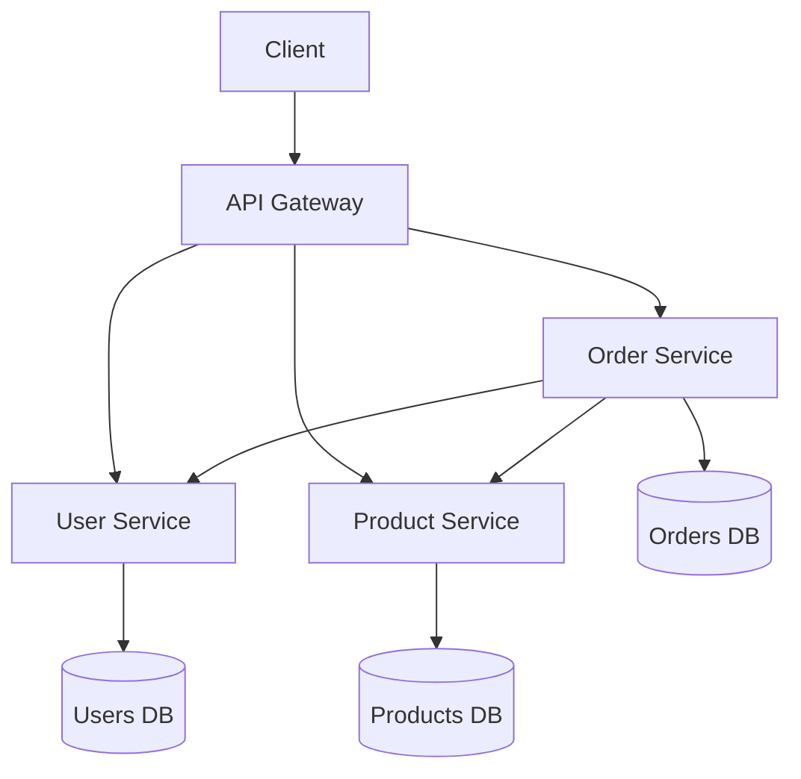

# Part 12: Microservices Architecture & Communication Patterns

*[← Back to Master Index](/blog/it-career-guide)*

---

## 1. What are Microservices?

Microservices architecture decomposes a monolithic application into small, independent services that communicate over well-defined APIs.

### Monolith vs Microservices

| Aspect | Monolith | Microservices |
|--------|----------|---------------|
| **Development** | Single codebase | Multiple repositories |
| **Deployment** | Single deploy | Independent deploys |
| **Scaling** | Scale entire app | Scale per service |
| **Technology** | Same stack | Polyglot |
| **Complexity** | Lower initially | Higher operational |

---

## 2. Service Decomposition Patterns

### Business Capability Decomposition

```yaml
E-commerce System:
  ├── User Service
  │   ├── User management
  │   ├── Authentication
  │   └── Authorization
  ├── Product Service
  │   ├── Product catalog
  │   ├── Inventory
  │   └── Search
  ├── Order Service
  │   ├── Order processing
  │   ├── Payment
  │   └── Fulfillment
  └── Notification Service
      ├── Email
      ├── SMS
      └── Push notifications
```

### Database per Service

```python
# User Service Database
class UserDatabase:
    def __init__(self):
        self.db = PostgreSQL("users_db")
    
    def create_user(self, user_data):
        return self.db.insert("users", user_data)

# Order Service Database
class OrderDatabase:
    def __init__(self):
        self.db = MongoDB("orders_db")
    
    def create_order(self, order_data):
        return self.db.insert("orders", order_data)
```

### Communication Patterns



---

## 3. Communication Protocols

### REST API

```python
from fastapi import FastAPI, HTTPException
import httpx

app = FastAPI()

@app.get("/users/{user_id}")
async def get_user(user_id: int):
    # Call user service
    async with httpx.AsyncClient() as client:
        response = await client.get(f"http://user-service/users/{user_id}")
        return response.json()

@app.post("/orders/")
async def create_order(order_data: dict):
    # Validate user exists
    async with httpx.AsyncClient() as client:
        user_response = await client.get(f"http://user-service/users/{order_data['user_id']}")
        if user_response.status_code != 200:
            raise HTTPException(status_code=404, detail="User not found")
    
    # Create order
    async with httpx.AsyncClient() as client:
        response = await client.post("http://order-service/orders/", json=order_data)
        return response.json()
```

### gRPC

```protobuf
// user_service.proto
syntax = "proto3";

service UserService {
    rpc GetUser(GetUserRequest) returns (GetUserResponse);
    rpc CreateUser(CreateUserRequest) returns (CreateUserResponse);
}

message GetUserRequest {
    int32 user_id = 1;
}

message GetUserResponse {
    int32 user_id = 1;
    string name = 2;
    string email = 3;
}
```

```python
# Python gRPC client
import grpc
from user_service_pb2 import GetUserRequest
from user_service_pb2_grpc import UserServiceStub

channel = grpc.insecure_channel('user-service:50051')
stub = UserServiceStub(channel)

request = GetUserRequest(user_id=123)
response = stub.GetUser(request)
print(f"User: {response.name}, {response.email}")
```

### GraphQL

```python
from graphql import GraphQLSchema, GraphQLObjectType, GraphQLField, GraphQLString

user_type = GraphQLObjectType(
    'User',
    lambda: {
        'id': GraphQLField(GraphQLString),
        'name': GraphQLField(GraphQLString),
        'email': GraphQLField(GraphQLString)
    }
)

schema = GraphQLSchema(query=GraphQLObjectType(
    'Query',
    lambda: {
        'user': GraphQLField(user_type, args={'id': GraphQLArgument(GraphQLString)}, resolve=resolve_user)
    }
))
```

---

## 4. Circuit Breaker Pattern

### Implementation

```python
import time
from enum import Enum

class CircuitState(Enum):
    CLOSED = 1
    OPEN = 2
    HALF_OPEN = 3

class CircuitBreaker:
    def __init__(self, failure_threshold=5, timeout=60):
        self.failure_threshold = failure_threshold
        self.timeout = timeout
        self.failure_count = 0
        self.last_failure_time = None
        self.state = CircuitState.CLOSED
    
    async def call(self, func, *args, **kwargs):
        if self.state == CircuitState.OPEN:
            if time.time() - self.last_failure_time > self.timeout:
                self.state = CircuitState.HALF_OPEN
            else:
                raise Exception("Circuit breaker is OPEN")
        
        try:
            result = await func(*args, **kwargs)
            self.on_success()
            return result
        except Exception as e:
            self.on_failure()
            raise e
    
    def on_success(self):
        self.failure_count = 0
        self.state = CircuitState.CLOSED
    
    def on_failure(self):
        self.failure_count += 1
        self.last_failure_time = time.time()
        if self.failure_count >= self.failure_threshold:
            self.state = CircuitState.OPEN
```

### Usage

```python
circuit_breaker = CircuitBreaker(failure_threshold=3, timeout=30)

async def call_external_service():
    async with httpx.AsyncClient() as client:
        response = await client.get("http://external-api/data")
        return response.json()

try:
    result = await circuit_breaker.call(call_external_service)
except Exception as e:
    # Handle failure
    result = get_fallback_data()
```

---

## 5. Saga Pattern

### Orchestration-Based Saga

```python
class OrderSaga:
    def __init__(self):
        self.steps = []
    
    async def execute(self, order_data):
        executed_steps = []
        
        try:
            # Step 1: Reserve inventory
            inventory_result = await self.reserve_inventory(order_data['items'])
            executed_steps.append(('inventory', inventory_result))
            
            # Step 2: Process payment
            payment_result = await self.process_payment(order_data['payment'])
            executed_steps.append(('payment', payment_result))
            
            # Step 3: Create order
            order_result = await self.create_order(order_data)
            executed_steps.append(('order', order_result))
            
            return order_result
            
        except Exception as e:
            await self.compensate(executed_steps)
            raise e
    
    async def compensate(self, executed_steps):
        # Reverse operations in reverse order
        for step_name, step_data in reversed(executed_steps):
            if step_name == 'order':
                await self.cancel_order(step_data['order_id'])
            elif step_name == 'payment':
                await self.refund_payment(step_data['transaction_id'])
            elif step_name == 'inventory':
                await self.release_inventory(step_data['reservation_id'])
```

### Choreography-Based Saga

```python
# Event handlers
async def handle_order_created(event):
    # Trigger inventory reservation
    await reserve_inventory(event['order_id'], event['items'])

async def handle_inventory_reserved(event):
    # Trigger payment processing
    await process_payment(event['order_id'], event['amount'])

async def handle_payment_processed(event):
    # Complete order
    await complete_order(event['order_id'])
```

---

## 6. Service Mesh

### Istio Configuration

```yaml
# VirtualService
apiVersion: networking.istio.io/v1alpha3
kind: VirtualService
metadata:
  name: user-service
spec:
  hosts:
  - user-service
  http:
  - route:
    - destination:
        host: user-service
        subset: v1
      weight: 90
    - destination:
        host: user-service
        subset: v2
      weight: 10
---
# DestinationRule
apiVersion: networking.istio.io/v1alpha3
kind: DestinationRule
metadata:
  name: user-service
spec:
  host: user-service
  subsets:
  - name: v1
    labels:
      version: v1
  - name: v2
    labels:
      version: v2
```

### Traffic Management

```yaml
# Retry policy
apiVersion: networking.istio.io/v1alpha3
kind: VirtualService
spec:
  http:
  - route:
    - destination:
        host: user-service
    retries:
      attempts: 3
      perTryTimeout: 2s
      retryOn: connect-failure,refused-stream
```

---

## 7. API Versioning

### URL Versioning

```python
from fastapi import FastAPI

app = FastAPI()

@app.get("/api/v1/users/")
async def get_users_v1():
    return {"version": "v1"}

@app.get("/api/v2/users/")
async def get_users_v2():
    return {"version": "v2", "new_feature": True}
```

### Header Versioning

```python
from fastapi import Header

@app.get("/users/")
async def get_users(version: str = Header(None)):
    if version == "v1":
        return get_users_v1()
    elif version == "v2":
        return get_users_v2()
    else:
        return get_users_latest()
```

### Query Parameter Versioning

```python
from fastapi import Query

@app.get("/users/")
async def get_users(version: str = Query("v1")):
    return get_users_by_version(version)
```

---

## 8. Resource Directory: Microservices

### Best Books

| Book | Author | Price | Key Topics |
|------|--------|-------|------------|
| **Building Microservices** | Sam Newman | Paid | Design patterns |
| **Microservices Patterns** | Chris Richardson | Paid | Architecture |
| **Domain-Driven Design** | Eric Evans | Paid | Business logic |
| **Microservices Security** | O'Reilly | Paid | Security patterns |

### Best Udemy Courses

| Course | Instructor | Price (INR) | Key Topics |
|--------|------------|-------------|------------|
| **Microservices Architecture** | Colt Steele | ₹1,499-2,299 | Design patterns |
| **Microservices with Python** | Jose Portilla | ₹999-1,499 | Python implementation |
| **gRPC Mastery** | Stephane Maarek | ₹999-1,499 | gRPC protocols |
| **Service Mesh with Istio** | Cloud Academy | ₹1,499-2,299 | Istio |

### Best O'Reilly Resources

| Resource | Topic | Access |
|----------|-------|--------|
| **Building Microservices** | O'Reilly | Paid |
| **Microservices Patterns** | O'Reilly | Paid |
| **Domain-Driven Design** | O'Reilly | Paid |

### Best LinkedIn Learning Courses

| Course | Instructor | Access |
|--------|------------|--------|
| **Microservices Architecture** | Barron Stone | Paid |
| **API Design** | Keith Cunningham | Paid |
| **Service Mesh** | Barron Stone | Paid |

### Free Resources

| Platform | Resource | Link |
|----------|----------|------|
| **Microservices.io** | Patterns guide | microservices.io |
| **Awesome Microservices** | GitHub | github.com/veselov/awesome-microservices |
| **Microservices Patterns** | Chris Richardson | microservices.io/patterns |
| **gRPC Examples** | GitHub | github.com/grpc/grpc/examples |

---

## 9. Common Microservices Interview Questions

| Question | Answer |
|----------|--------|
| **When to use microservices?** | When you need independent scaling, different tech stacks, or faster deployment cycles. |
| **How to handle distributed transactions?** | Use Saga pattern, eventual consistency, or two-phase commit. |
| **What is service discovery?** | Tools like Consul, Eureka, or Kubernetes DNS for service location. |
| **How to debug microservices?** | Distributed tracing (Jaeger, Zipkin), centralized logging. |
| **What is circuit breaker pattern?** | Prevent cascading failures by failing fast when dependent services are down. |

---

## 10. Part Navigation

### Previous Parts
[Part 11: System Design Fundamentals](/blog/it-career-guide/part-11-system-design)

### Next Parts
[Part 13: API Design & GraphQL](/blog/it-career-guide/part-13-api-design) ·
[Part 14: Docker Containers](/blog/it-career-guide/part-14-docker)

---

*[Proceed to Part 13: API Design & GraphQL →](/blog/it-career-guide/part-13-api-design)*