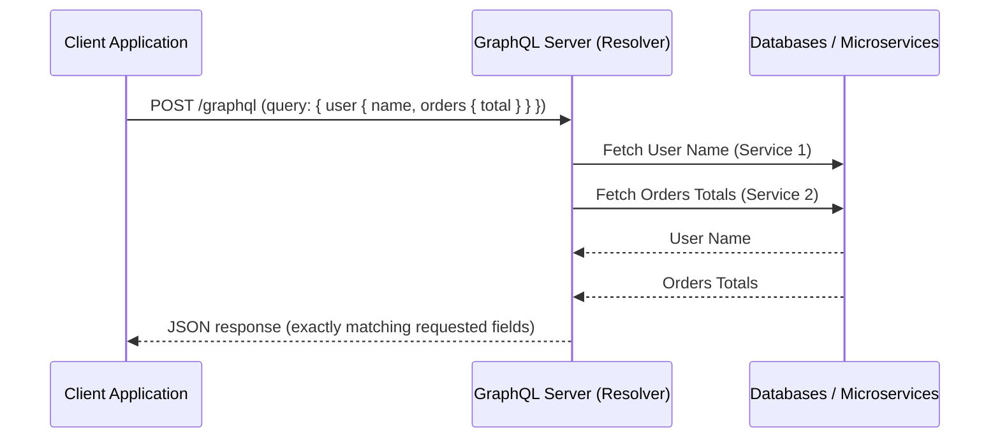

# Part 13: Advanced API Design & GraphQL

*[← Back to Master Index](/blog/it-career-guide)*

---

## 1. Core Concept Refresher: API Paradigm Selections and Idempotency

When designing application programming interfaces (APIs) to serve frontend clients, mobile apps, or third-party integrators, software engineers must establish strict architectural patterns. Poorly designed APIs introduce network latency, maintain structural clutter, leak internal database schemas, and create transactional inconsistency during network drops.

To succeed in senior systems engineering roles, you must look past basic router setups and master RESTful conventions, GraphQL performance tuning, and idempotency patterns.

---

### Over-fetching vs. Under-fetching
In client-server applications, network boundaries represent a severe performance bottleneck:
*   **Over-fetching:** A client queries an endpoint to display a user's name, but the server returns the entire `User` database record—including billing tokens, address structures, and historical logs.
    *   *The Cost:* Wasteful consumption of network bandwidth and CPU cycles for serialization/deserialization on both client and server.
*   **Under-fetching:** A client needs to render a user's dashboard displaying their name, active orders, and shipping status. In a pure RESTful setup, the client must make three sequential network requests: `GET /users/1`, `GET /users/1/orders`, and `GET /users/1/shipping`.
    *   *The Cost:* Compounds latency delays due to multiple roundtrips, particularly on slow mobile networks.

#### The GraphQL Alternative:
GraphQL resolves this by replacing multiple resource endpoints with a single endpoint (typically `POST /graphql`) accepting a flexible query payload. The client specifies the exact fields required, and the server's query resolver fetches only those fields, combining them into a single response document.

---

### Idempotency Keys in API Handlers
An operation is **Idempotent** if executing it multiple times yields the exact same system state as executing it once. 
*   **The Problem:** A client initiates a payment transaction (`POST /payments`). The server processes the card, but a network drop occurs before it can return the confirmation response. Observing a network timeout, the client's retry loop automatically fires another `POST /payments`. Without safety measures, the user is charged twice.
*   **The Solution:** Implement **Idempotency Keys** in your API handlers.
    1.  The client generates a unique UUID (Idempotency Key) and attaches it in the request headers (e.g. `Idempotency-Key: 9b1deb4d-3b7d-4bad-9bdd-2b0d7b3dcb6d`).
    2.  Upon receiving the request, the API Gateway checks an in-memory cache (like Redis) for the key.
    3.  If the key exists, the server bypasses database execution and immediately returns the cached response from the first run.
    4.  If the key is missing, it locks the transaction path, processes the request, caches the output payload in Redis with a TTL (e.g., 24 hours), releases the lock, and returns the response.

---

## 2. API Design Master Resource Directory (30 Curated Resources)

Mastering API design requires studying RESTful handbooks, GraphQL schema optimization plans, and security specifications. Below are the elite resources.

---

### Sub-Topic A: RESTful API Design & OpenAPI Specifications

#### 1. Designing Web APIs
*   **Direct URL:** https://www.oreilly.com/library/view/designing-web-apis/9781492026891/
*   **Search Identification:** Search O'Reilly Media for: `"Designing Web APIs" (Authors: Brenda Jin, Saurabh Sahni)`
*   **Resource Type:** Book
*   **Access / Price:** Paid (Included in TCS O'Reilly Enterprise benefit)
*   **Status:** Required (Non-Negotiable)
*   **Description:** Exceptional guide covering REST design conventions, HTTP status codes selection, resource layouts, and API usability standards.
*   **Mutual Exclusivity Mapping:** If you read this, you can skip *RESTful Web APIs* as Brenda Jin covers modern API gateways with tighter structural detail.

#### 2. Designing APIs for the Web
*   **Direct URL:** https://www.linkedin.com/learning/designing-apis-for-the-web
*   **Search Identification:** Search LinkedIn Learning for: `"Designing APIs for the Web"`
*   **Resource Type:** Video Course
*   **Access / Price:** Paid (Included in TCS Enterprise Account)
*   **Status:** Required
*   **Description:** Video series detailing URI structuring, HTTP methods mapping, error payload design, and API rate limits.
*   **Mutual Exclusivity Mapping:** Essential video companion for *Designing Web APIs*.

#### 3. OpenAPI Specification official Manual
*   **Direct URL:** https://spec.openapis.org/oas/latest.html
*   **Search Identification:** Search Web for: `"OpenAPI Specification v3.1.0 official documentation"`
*   **Resource Type:** Written Reference / Documentation
*   **Access / Price:** 100% Free
*   **Status:** Required
*   **Description:** The authoritative schema format mapping paths, parameters, schemas, components, and security schemas in YAML/JSON.
*   **Mutual Exclusivity Mapping:** Standard schema reference index.

#### 4. REST APIs with FastAPI and Flask (Udemy)
*   **Direct URL:** https://www.udemy.com/course/rest-api-fastapi/
*   **Search Identification:** Search Udemy for: `"REST APIs with FastAPI and Flask" (Instructor: Jose Salvatierra)`
*   **Resource Type:** Video Course
*   **Access / Price:** Paid (Included in TCS Udemy Business)
*   **Status:** Alternative to: *Designing APIs for the Web*.
*   **Description:** Focused course covering request validations, schema mappings, and auto-generating OpenAPI Swagger pages.
*   **Mutual Exclusivity Mapping:** Choose this if you prefer code implementation over high-level design.

#### 5. HTTP Semantic Methods Specification (RFC 9110)
*   **Direct URL:** https://datatracker.ietf.org/doc/html/rfc9110
*   **Search Identification:** Search Web for: `"RFC 9110 HTTP Semantics"`
*   **Resource Type:** Written Reference / Spec Sheet (IETF RFC)
*   **Access / Price:** 100% Free
*   **Status:** Optional
*   **Description:** The official specification defining safe methods (`GET`, `HEAD`), idempotent methods (`PUT`, `DELETE`), and non-idempotent methods (`POST`).
*   **Mutual Exclusivity Mapping:** Advanced system specification reference.

---

### Sub-Topic B: GraphQL Schema Design, Queries, and Mutations

#### 6. GraphQL in Action
*   **Direct URL:** https://www.oreilly.com/library/view/graphql-in-action/9781617295966/
*   **Search Identification:** Search O'Reilly Media for: `"GraphQL in Action" (Author: Samer Buna)`
*   **Resource Type:** Book
*   **Access / Price:** Paid (Included in TCS O'Reilly Enterprise benefit)
*   **Status:** Required (Highly Recommended)
*   **Description:** Standard guide detailing GraphQL type systems, queries, mutations, subscriptions, schemas design, and API bridges.
*   **Mutual Exclusivity Mapping:** If you read this, you can skip *GraphQL Masterclass on Udemy* as Samer Buna covers schema structures with superior architectural depth.

#### 7. GraphQL Foundations (LinkedIn Learning)
*   **Direct URL:** https://www.linkedin.com/learning/graphql-foundations-14392694
*   **Search Identification:** Search LinkedIn Learning for: `"GraphQL Foundations" (Instructor: Emmanuel Henri)`
*   **Resource Type:** Video Course
*   **Access / Price:** Paid (Included in TCS Enterprise Account)
*   **Status:** Required
*   **Description:** Video walkthrough configuring schemas, queries, and resolvers in Node.js backend environments.
*   **Mutual Exclusivity Mapping:** Essential video companion for *GraphQL in Action*.

#### 8. GraphQL API Design & Security (Udemy)
*   **Direct URL:** https://www.udemy.com/course/graphql-api-design/
*   **Search Identification:** Search Udemy for: `"GraphQL API Design and Security"`
*   **Resource Type:** Video Course
*   **Access / Price:** Paid (Included in TCS Udemy Business)
*   **Status:** Alternative to: *GraphQL Foundations*.
*   **Description:** Focused course covering schema federation, query depth limiting, and server security.
*   **Mutual Exclusivity Mapping:** Advanced security-oriented alternative.

#### 9. Apollo Odyssey GraphQL Tutorials
*   **Direct URL:** https://odyssey.apollographql.com/
*   **Search Identification:** Search Web for: `"Apollo Odyssey GraphQL developer learning path"`
*   **Resource Type:** Video & Interactive Sandbox
*   **Access / Price:** 100% Free
*   **Status:** Required
*   **Description:** Highly interactive training covering subgraphs, schema registry, router configurations, and server deployments.
*   **Mutual Exclusivity Mapping:** Standard query reference.

#### 10. GraphiQL Interactive Query Playground (GitHub)
*   **Direct URL:** https://github.com/graphql/graphiql
*   **Search Identification:** Search GitHub for: `"graphql graphiql IDE"`
*   **Resource Type:** Interactive Code Tool / Playground
*   **Access / Price:** 100% Free
*   **Status:** Optional
*   **Description:** Open-source in-browser GraphQL IDE for testing queries, autocompletions, and documentation explorer hooks.
*   **Mutual Exclusivity Mapping:** Optional practice sandbox.

---

### Sub-Topic C: Over-fetching vs. Under-fetching Solutions

#### 11. Designing Web APIs (Chapter 7: API Patterns)
*   **Direct URL:** https://www.oreilly.com/library/view/designing-web-apis/9781492026891/
*   **Search Identification:** Search O'Reilly Media for: `"Designing Web APIs" (Chapter 7: REST vs RPC vs GraphQL)`
*   **Resource Type:** Book Chapter / Reference
*   **Access / Price:** Paid (Included in TCS O'Reilly Enterprise benefit)
*   **Status:** Required (Non-Negotiable)
*   **Description:** Compares performance characteristics, parsing costs, and caching behaviors between REST and query engines.
*   **Mutual Exclusivity Mapping:** Required baseline systems engineering reference.

#### 12. Solving the N+1 Query Problem in GraphQL (LinkedIn)
*   **Direct URL:** https://www.linkedin.com/learning/solving-n-plus-1-in-graphql
*   **Search Identification:** Search LinkedIn Learning for: `"Solving the N+1 Query Problem in GraphQL"`
*   **Resource Type:** Video Course
*   **Access / Price:** Paid (Included in TCS Enterprise Account)
*   **Status:** Required
*   **Description:** Explains why nested resolvers trigger multiple database queries and how to implement **DataLoader** batching.
*   **Mutual Exclusivity Mapping:** Essential database scaling video companion.

#### 13. DataLoader Batching Library & Docs
*   **Direct URL:** https://github.com/graphql/dataloader
*   **Search Identification:** Search GitHub for: `"graphql dataloader batching caching"`
*   **Resource Type:** Code Library / Written Docs
*   **Access / Price:** 100% Free
*   **Status:** Required
*   **Description:** Facebook's official batching and caching utility to mitigate the $N+1$ database fetch problem in application servers.
*   **Mutual Exclusivity Mapping:** Standard deployment library.

#### 14. Apollo GraphQL Caching Strategies
*   **Direct URL:** https://www.apollographql.com/docs/apollo-server/performance/caching/
*   **Search Identification:** Search Web for: `"Apollo Server performance query caching official manual"`
*   **Resource Type:** Written Reference / Documentation
*   **Access / Price:** 100% Free
*   **Status:** Required
*   **Description:** Guide to setting up cache hints, CDN integration, and persistent query stores.
*   **Mutual Exclusivity Mapping:** Standard database manual.

#### 15. GraphQL Query Cost Analyzer (GitHub)
*   **Direct URL:** https://github.com/pa-bru/graphql-cost-analysis
*   **Search Identification:** Search GitHub for: `"graphql-cost-analysis middle"`
*   **Resource Type:** Code Library / API Specs
*   **Access / Price:** 100% Free
*   **Status:** Optional
*   **Description:** Express middleware to calculate query complexity costs before executing resolvers, preventing resource exhaustion.
*   **Mutual Exclusivity Mapping:** Optional developer library.

---

### Sub-Topic D: API Versioning Strategies

#### 16. API Design Patterns
*   **Direct URL:** https://www.oreilly.com/library/view/api-design-patterns/9781617295850/
*   **Search Identification:** Search O'Reilly Media for: `"API Design Patterns" (Author: JJ Geewax)`
*   **Resource Type:** Book
*   **Access / Price:** Paid (Included in TCS O'Reilly Enterprise benefit)
*   **Status:** Required (Non-Negotiable)
*   **Description:** Manning textbook detailing URI versioning, custom headers versioning, content negotiation, and deprecation schedules.
*   **Mutual Exclusivity Mapping:** If you read this, you can skip *API Versioning on Udemy* as JJ Geewax covers backward compatibility with wider industrial case studies.

#### 17. API Versioning Best Practices (LinkedIn Learning)
*   **Direct URL:** https://www.linkedin.com/learning/api-versioning-best-practices
*   **Search Identification:** Search LinkedIn Learning for: `"API Versioning Best Practices"`
*   **Resource Type:** Video Course
*   **Access / Price:** Paid (Included in TCS Enterprise Account)
*   **Status:** Required
*   **Description:** Video walkthrough configuring path-based, query-parameter, and Accept header versioning paths.
*   **Mutual Exclusivity Mapping:** Essential API design video companion.

#### 18. API Lifecycle: Versioning and Deprecation (Udemy)
*   **Direct URL:** https://www.udemy.com/course/api-lifecycle/
*   **Search Identification:** Search Udemy for: `"API Lifecycle and Versioning Strategies"`
*   **Resource Type:** Video Course
*   **Access / Price:** Paid (Included in TCS Udemy Business)
*   **Status:** Alternative to: *API Versioning Best Practices*.
*   **Description:** Focused course covering graceful shutdowns, legacy support timelines, and consumer communication channels.
*   **Mutual Exclusivity Mapping:** Slower framework alternative.

#### 19. IETF RFC 8594: The Sunset HTTP Header
*   **Direct URL:** https://datatracker.ietf.org/doc/html/rfc8594
*   **Search Identification:** Search Web for: `"RFC 8594 The Sunset HTTP Header"`
*   **Resource Type:** Written Reference / Spec Sheet (IETF RFC)
*   **Access / Price:** 100% Free
*   **Status:** Required
*   **Description:** The official specification defining how servers must advertise API deprecation dates in response headers.
*   **Mutual Exclusivity Mapping:** Standard protocol specs.

#### 20. Stripe API Versioning Case Study
*   **Direct URL:** https://stripe.com/blog/api-versioning-change-management
*   **Search Identification:** Search Web for: `"Stripe blog extensible API versioning change management"`
*   **Resource Type:** Written Case Study / Technical Blog
*   **Access / Price:** 100% Free
*   **Status:** Optional
*   **Description:** High-end architectural write-up showing how Stripe uses middleware layers to translate API payloads dynamically.
*   **Mutual Exclusivity Mapping:** Advanced engineering reference.

---

### Sub-Topic E: Idempotency Keys in API Handlers

#### 21. Distributed Systems Design Patterns: Idempotency (Udemy)
*   **Direct URL:** https://www.udemy.com/course/distributed-systems-design/
*   **Search Identification:** Search Udemy for: `"Distributed Systems Design Patterns: Idempotency"`
*   **Resource Type:** Video Course
*   **Access / Price:** Paid (Included in TCS Udemy Business)
*   **Status:** Required (Non-Negotiable)
*   **Description:** High-end guide configuring distributed lock counters, Redis key caching, and duplicate request filters.
*   **Mutual Exclusivity Mapping:** Essential distributed engineering reference.

#### 22. Designing Resilient API Integrations (LinkedIn Learning)
*   **Direct URL:** https://www.linkedin.com/learning/designing-resilient-api-integrations
*   **Search Identification:** Search LinkedIn Learning for: `"Designing Resilient API Integrations"`
*   **Resource Type:** Video Course
*   **Access / Price:** Paid (Included in TCS Enterprise Account)
*   **Status:** Required
*   **Description:** Details client-side retry architectures, exponential backoffs, and safe server-side idempotency gates.
*   **Mutual Exclusivity Mapping:** Essential system architecture companion.

#### 23. Stripe API Documentation: Idempotent Requests
*   **Direct URL:** https://stripe.com/docs/api/idempotent_requests
*   **Search Identification:** Search Web for: `"Stripe API reference guide idempotent requests"`
*   **Resource Type:** Written Reference / Spec Sheet
*   **Access / Price:** 100% Free
*   **Status:** Required
*   **Description:** The industry standard specification explaining how Stripe processes client idempotency keys, manages locks, and returns cached payments.
*   **Mutual Exclusivity Mapping:** Standard production-grade pattern specification.

#### 24. IETF Draft: The Idempotency-Key HTTP Header
*   **Direct URL:** https://datatracker.ietf.org/doc/html/draft-ietf-httpapi-idempotency-key-header
*   **Search Identification:** Search Web for: `"IETF draft HTTP Idempotency-Key Header"`
*   **Resource Type:** Written Reference / Spec Sheet (IETF Draft)
*   **Access / Price:** 100% Free
*   **Status:** Required
*   **Description:** The current internet engineering task force draft standardizing the implementation of idempotency headers in API platforms.
*   **Mutual Exclusivity Mapping:** Standard protocol specs.

#### 25. Redis Idempotency Middleware Sandbox (GitHub)
*   **Direct URL:** https://github.com/chrylis/spring-prevent-double-submit
*   **Search Identification:** Search GitHub for: `"spring prevent-double-submit idempotency"`
*   **Resource Type:** Code Library / API Specs
*   **Access / Price:** 100% Free
*   **Status:** Optional
*   **Description:** Code implementation showing how to intercept incoming payments, block duplicates in Redis, and return safe responses.
*   **Mutual Exclusivity Mapping:** Language-specific library reference.

---

### Sub-Topic F: API Performance Profiling & Compression

#### 26. High Performance Web Sites
*   **Direct URL:** https://www.oreilly.com/library/view/high-performance-web/9780596529307/
*   **Search Identification:** Search O'Reilly Media for: `"High Performance Web Sites" (Author: Steve Souders)`
*   **Resource Type:** Book
*   **Access / Price:** Paid (Included in TCS O'Reilly Enterprise benefit)
*   **Status:** Required (Non-Negotiable)
*   **Description:** Classic performance manual detailing HTTP Gzip compression, payload minifications, caching parameters, and TCP slow start limits.
*   **Mutual Exclusivity Mapping:** If you read this, you can skip *Web Performance on LinkedIn* as steve covers browser parsing with deeper network analysis.

#### 27. Web Performance and API Profiling (LinkedIn Learning)
*   **Direct URL:** https://www.linkedin.com/learning/web-performance-and-api-profiling
*   **Search Identification:** Search LinkedIn Learning for: `"Web Performance and API Profiling"`
*   **Resource Type:** Video Course
*   **Access / Price:** Paid (Included in TCS Enterprise Account)
*   **Status:** Required
*   **Description:** Video course configuring Brotli/Gzip compression, payload minification, HTTP/2 multiplexing, and measuring Time-to-First-Byte (TTFB).
*   **Mutual Exclusivity Mapping:** Essential performance optimization guide.

#### 28. High-Performance APIs with Spring Boot (Udemy)
*   **Direct URL:** https://www.udemy.com/course/high-performance-apis/
*   **Search Identification:** Search Udemy for: `"High-Performance APIs: Optimization and Compression"`
*   **Resource Type:** Video Course
*   **Access / Price:** Paid (Included in TCS Udemy Business)
*   **Status:** Alternative to: *Web Performance and API Profiling*.
*   **Description:** Focused course covering database query compression, caching layouts, and binary payload parsing.
*   **Mutual Exclusivity Mapping:** Choose this if you prefer code implementation.

#### 29. Brotli Compression Algorithm Specification (RFC 7932)
*   **Direct URL:** https://datatracker.ietf.org/doc/html/rfc7932
*   **Search Identification:** Search Web for: `"RFC 7932 Brotli Compression Algorithm"`
*   **Resource Type:** Written Reference / Spec Sheet (IETF RFC)
*   **Access / Price:** 100% Free
*   **Status:** Required
*   **Description:** The official specifications defining the Brotli compression format and dictionary layouts, detailing why it out-performs Gzip.
*   **Mutual Exclusivity Mapping:** Standard protocol specs.

#### 30. Local API Benchmark & Compression Sandbox (Autocannon)
*   **Direct URL:** https://github.com/mcollina/autocannon
*   **Search Identification:** Search GitHub for: `"mcollina autocannon HTTP benchmarking"`
*   **Resource Type:** Interactive Code Tool / Performance Diagnostic
*   **Access / Price:** 100% Free
*   **Status:** Optional
*   **Description:** Node-based high-speed HTTP load-testing CLI tool to measure API throughput under gzip and Brotli compressions.
*   **Mutual Exclusivity Mapping:** Standard profiling sandbox.

---

## 3. Hands-On Portfolio Lab Project: Idempotency Middleware in Redis

To demonstrate your API engineering capabilities to product-firm recruiters, you must build and commit a complete **REST API Idempotency Key Middleware** in Python or Node.js.

### The Lab Project Guidelines:
1.  **System Target:** You will construct a **Mock Payment Endpoint** (`POST /api/v1/charges`) that processes debit operations.
2.  **The Goal:** Build middleware that intercepts requests, checks for a mandatory `Idempotency-Key` header, processes the write safely, and intercepts retry requests during network drops without duplicating transactions.
3.  **Algorithmic Architecture:**
    *   Write an API server using Python (FastAPI) and `redis-py`.
    *   Implement an asynchronous middleware interceptor:
        1.  **Read Header:** Extract `Idempotency-Key` from request headers. If missing, return `400 Bad Request` (indicating that an idempotency key is required).
        2.  **Redis Check:** Check Redis for the key: `pipe.get(f"idempotency:{key}")`.
        3.  **Cache Hit:** If key exists:
            - Parse the stored payload. Return the cached status code, headers, and body instantly to the client.
        4.  **Cache Miss (Initiate Transaction):** If key is missing:
            - Set an active lock in Redis to prevent concurrent twin submits: `redis.set(f"lock:{key}", "active", nx=True, ex=10)`. If this fails (returns null), another thread is already processing the same key. Return a `409 Conflict` response immediately.
            - Process the business transaction (e.g., charge the payment balance).
            - Cache the successful HTTP response body and status code in Redis with a 24-hour expiration: `redis.set(f"idempotency:{key}", response_json, ex=86400)`.
            - Remove the active lock: `redis.delete(f"lock:{key}")`.
            - Return the response payload.
4.  **Simulation Test:**
    *   Write a test script that fires two concurrent, identical `POST` payment requests at the exact same millisecond.
    *   Verify that the first request succeeds (returns `201 Created`), while the second request is blocked by the active lock and returns a `409 Conflict` or returns the exact cached response once the first completes.
5.  **GitHub Commitment:** Commit the FastAPI application with custom middleware (`idempotency_middleware.py`), the concurrent load-testing script (`test_idempotency.py`), and explain charts to your public `2026-upskilling-roadmap` repository.

---

## 4. Technical Interview Self-Assessment

Use these questions to verify if you have successfully digested the principles of this API Design chapter:

| Concept | High-Frequency Interview Question | Expected Technical Answer Framework |
| :--- | :--- | :--- |
| **REST vs. GraphQL** | When should a backend engineer choose REST over GraphQL, and vice versa? | **REST:** Best for systems with highly standardized, resource-oriented operations, heavy public API usage, and strict caching needs (REST leverages standard HTTP status codes and CDN edge caching natively). **GraphQL:** Best for complex client-side applications with diverse, fast-evolving frontends, nested data models, and bandwidth constraints (e.g., mobile devices) where mitigating over-fetching and under-fetching is critical. |
| **Idempotency Keys** | Why must an Idempotency handler utilize a lock in Redis *before* processing a request? | Without an active lock (e.g., setting a key `lock:uuid` with `NX=True`), a client can send two concurrent twin requests at the exact same millisecond. Since both check the cache before either finishes writing, both observe a cache miss. Both threads will execute the database charge transaction simultaneously, causing a double charge. A Redis lock ensures only one thread executes the write, forcing the twin request to fail or wait. |
| **Accept Header** | Explain Accept header versioning and why it is technically superior to URI versioning. | **URI Versioning (`/v1/users`):** Forces client code to break when endpoints change, and clutters server routers. **Accept Header Versioning (`Accept: application/vnd.company.v1+json`):** Leverages standard HTTP content-negotiation. It separates the physical resource endpoint from its payload representation format, allowing clean schema evolution without changing the routing mesh. |

---

## 5. Exit Tasks for this Phase

Complete these verification steps before proceeding to Part 14:

- [ ] Launches a local Redis instance and configures a FastAPI/Node.js API gateway.
- [ ] Implements the `Idempotency-Key` interceptor middleware with Redis multi/exec transaction pipelines.
- [ ] Executes the concurrent twin requests test, verifying that database duplicate submissions are prevented.
- [ ] Commits the middleware code and test log statistics to your public Git repository.

---

*[Proceed to Part 14: Docker Containers & Development Virtualization →](/blog/it-career-guide/part-14-docker)*