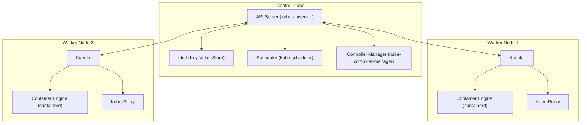
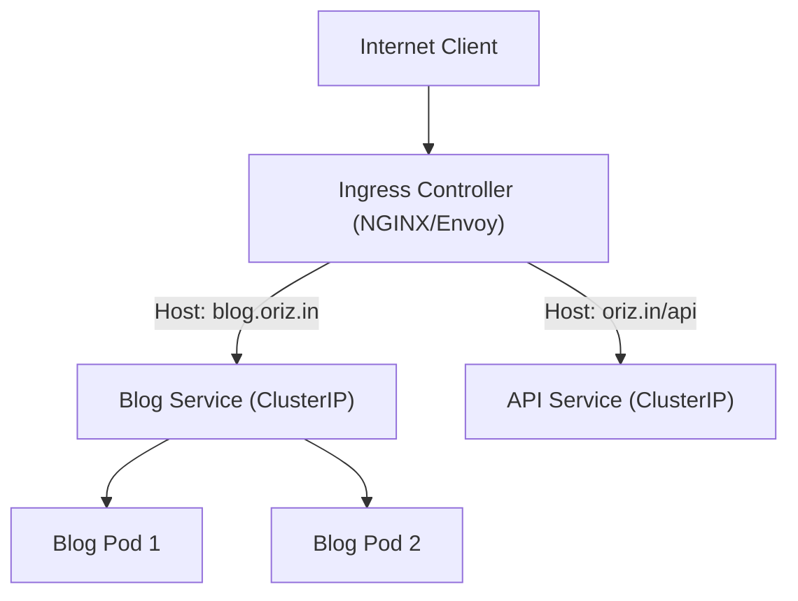
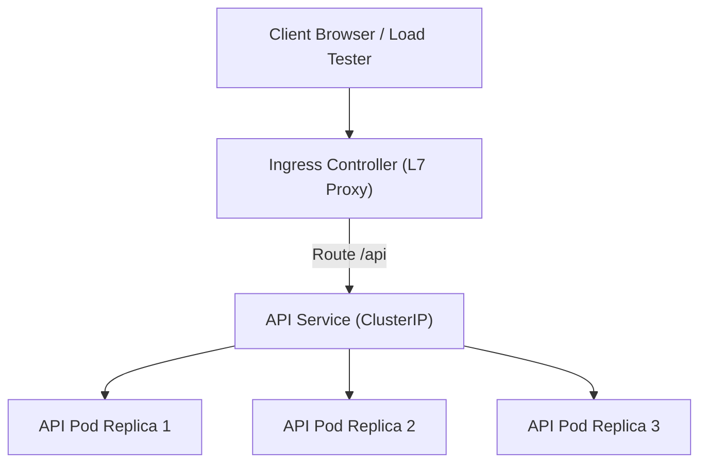

# Part 13: Kubernetes & Container Orchestration

*[← Back to Master Index](/blog/it-career-guide)*

---

## 1. Core Concept Refresher: Kubernetes Control Plane & Resource Lifecycle

While containerizing an application using Docker solves packaging and dependency issues, running containers in production introduces orchestration challenges. If a container crashes on server node A, how does it auto-recover? How do you scale an API from 3 instances to 50 during a traffic spike? How do you load-balance incoming HTTP traffic across dynamic container IPs?

**Kubernetes (K8s)** is the industry-standard distributed container orchestration platform designed to solve these exact problems.

---

### Control Plane and Worker Node Architecture

A Kubernetes cluster is divided into two primary zones: **The Control Plane** (the brain) and **Worker Nodes** (where the containers execute).

#### The Control Plane Components:
*   **kube-apiserver:** The entry point. All administrative commands (via `kubectl`) and inter-component communications route through this REST API.
*   **etcd:** A highly available, distributed key-value store that acts as the cluster's single source of truth, persisting the state of all cluster resources.
*   **kube-scheduler:** Watches for newly created Pods with no assigned node, and selects the best Worker Node for them to run on based on resource availability.
*   **kube-controller-manager:** Runs background daemon controller loops that monitor the state of the cluster (via the API Server) and attempt to transition the current state to the desired state (e.g., spawning new pods if some crash).

#### The Worker Node Components:
*   **kubelet:** An agent running on each node that ensures containers described in pod manifests are running and healthy.
*   **kube-proxy:** A network proxy that maintains network rules on nodes, allowing TCP/UDP connections to route to target containers.

---

### The Pod Lifecycle & Service Abstractions

*   **The Pod:** The smallest deployable unit in Kubernetes. A Pod wraps one or more containers (sharing storage and network namespaces). Containers inside a single Pod communicate via `localhost`. Pods are ephemeral; if a node crashes, the Pods on it are destroyed and rescheduled onto healthy nodes, receiving new dynamic IP addresses.
*   **Services (Stable Network Endpoints):** Because Pod IPs change constantly, you cannot hardcode them in upstream configurations. A **Service** is an abstraction that defines a logical set of Pods and a policy to access them.
    *   **ClusterIP (Default):** Exposes the Service on an internal cluster IP. Only reachable from within the cluster.
    *   **NodePort:** Exposes the Service on each Node's IP at a static port (typically 30000-32767).
    *   **LoadBalancer:** Integrates with cloud provider load balancers (AWS ELB, GCP Cloud Load Balancing) to route external traffic directly to the service.

---

### Ingress Controllers: Routing Layer 7 Traffic

Using cloud LoadBalancer services for every microservice is highly expensive and complex. Instead, architects deploy a single **Ingress Controller** (e.g., NGINX Ingress, Traefik, or Envoy-based controllers).

An Ingress Controller acts as an internal Layer 7 reverse proxy, routing incoming HTTP traffic to backend Services based on hostnames and URL paths:

---

### Resource Requests, Limits, and Probes

To prevent resource exhaustion and ensure high availability, K8s manifests must define resource configurations and health checks:

*   **Resource Requests:** The minimum amount of CPU and Memory the container requires to boot. The scheduler uses this to select nodes.
*   **Resource Limits:** The maximum amount of CPU and Memory the container can consume. If a container exceeds its memory limit, the Linux kernel terminates it with an **OOMKilled** (Out of Memory) error.
*   **Liveness Probes:** Periodically checks if the container process is running. If the check fails, kubelet restarts the container.
*   **Readiness Probes:** Periodically checks if the container is ready to accept network traffic. If it fails, K8s removes the Pod's IP from the Service endpoints, preventing clients from receiving errors.

---

## 2. Master Resource Directory: Kubernetes

Kubernetes is a complex distributed system. Mastering it requires studying official architecture documentation, cluster deployment frameworks, and networking guides. Below are the top resources.

---

### Resource 1: *Kubernetes in Action* by Marko Lukša
*   **Why It Was Selected:** This book is the undisputed bible for learning Kubernetes. Marko Lukša explains Kubernetes resources (Pods, ReplicaSets, Deployments, Services, ConfigMaps, Secrets, Volumes) step-by-step from first principles. It teaches you how the control plane schedules resources, how the network routing layer operates, and how to write production-grade YAML manifests, helping you build practical container orchestration skills.
*   **Target Syllabus Modules/Chapters:**
    *   Chapter 3: Pods: Running Containers in Kubernetes
    *   Chapter 4: Replication and other Controllers
    *   Chapter 5: Services: Enabling Clients to Discover Pods
    *   Chapter 11: Understanding Kubernetes Internals
*   **Time Investment Required:** 35 hours of reading and hands-on laboratory setups.
    *   *Week 1:* Chapters 3-5 (20 hours)
    *   *Week 2:* Chapter 11 and manifest setups (15 hours)
*   **Value Assessment:** Essential. Understanding the material in this book makes you competitive for Platform Engineering and Cloud Backend roles globally.
*   **Actionable Study Strategy:** Spin up a local Kubernetes cluster using **Minikube** or **Kind**. Replicate every manifest lab in the book. Pay special attention to **Chapter 11: Internals**. Use `kubectl proxy` to call the Kubernetes API Server directly to watch how resource changes are persisted in the etcd node.

---

### Resource 2: *Kubernetes Up & Running (3rd Edition)* by Brendan Burns et al.
*   **Why It Was Selected:** Written by Brendan Burns (co-founder of Kubernetes) and Joe Beda, this book provides high-level architectural insights and best practices for running real-world applications on Kubernetes, including security boundaries and stateful applications.
*   **Target Syllabus Modules/Chapters:**
    *   Chapter 5: Pods
    *   Chapter 8: Deployments
    *   Chapter 12: Integrating Storage (PVs, PVCs)
    *   Chapter 15: Organizing Your Application
*   **Time Investment Required:** 15 hours.
*   **Value Assessment:** High.
*   **Actionable Study Strategy:** Study the section on **StatefulSets**. Understand the key differences between Deployments (stateless scaling) and StatefulSets (which provide unique network identifiers and persistent disk bindings for database pods).

---

### Resource 3: *Kubernetes Official Documentation* (kubernetes.io/docs)
*   **Why It Was Selected:** The official Kubernetes documentation is exceptionally detailed and is the source of truth for YAML configurations and APIs.
*   **Target Syllabus Modules/Chapters:**
    *   Kubernetes Concepts (Control Plane, Workloads, Services, Storage)
    *   Tasks (Configure Pods, Inject Configurations)
*   **Time Investment Required:** 20 hours of reference study.
*   **Value Assessment:** Critical.
*   **Actionable Study Strategy:** Focus on **ConfigMaps and Secrets**. Write manifests that inject configuration parameters as environment variables, and mount sensitive secret tokens as secure files inside a Pod.

---

### Resource 4: *KubeAcademy by VMware* (kube.academy)
*   **Why It Was Selected:** A free, highly visual video platform offering courses from beginner to advanced topics, focusing heavily on cluster networking, security, and operation.
*   **Time Investment Required:** 10 hours.
*   **Value Assessment:** Medium-High.
*   **Actionable Study Strategy:** Watch the courses on **Kubernetes Networking**. Understand how CNI (Container Network Interface) plugins establish overlay networks across physical servers.

---

## 3. Hands-On Portfolio Lab Project: Multi-Replica API Cluster Deployment

To showcase your Kubernetes orchestration capabilities, you will deploy a **High-Availability Microservice Cluster** using Minikube/Kind, a YAML manifest structure, load balancing, and health checks.

### Lab Specifications:
1.  **Cluster Environment:**
    *   Install **Minikube** or **Kind** on WSL2. Enable the NGINX Ingress controller addon.
2.  **Deployment Manifest (`deployment.yaml`):**
    *   Write a manifest declaring a Deployment for your Node.js API:
        *   Replicas: 3.
        *   Resource Requests: 100m CPU, 128Mi Memory.
        *   Resource Limits: 200m CPU, 256Mi Memory.
        *   Liveness Probe: HTTP check targeting `/healthz` on port 3000, checking every 10s.
        *   Readiness Probe: HTTP check targeting `/readyz`, checking every 5s.
3.  **Service and Ingress Manifests (`service-ingress.yaml`):**
    *   Declare a Service of type `ClusterIP` routing traffic to port 3000 of your Pods.
    *   Declare an Ingress resource:
        *   Host: `blog.local`.
        *   Route: `/api` routes to your API Service.
4.  **Testing and Failure Modes:**
    *   Map `blog.local` to your Minikube IP in your host `/etc/hosts` file.
    *   Use `kubectl exec` to log into one of your Pods and delete the application process. Watch Kubernetes automatically detect the failure via the liveness probe, terminate the Pod, and spawn a healthy replacement instance.

---

## 4. Technical Interview Self-Assessment

Use these questions to verify your container orchestration knowledge:

| Concept | High-Frequency Interview Question | Expected Technical Answer Framework |
| :--- | :--- | :--- |
| **K8s Pods** | Why doesn't Kubernetes run containers directly? Why does it wrap them in a Pod? | A Pod provides an abstraction layer that allows multiple containers to share the same storage volumes, network namespace, and IP address. This is critical for sidecar patterns (e.g. running a logging agent or service mesh proxy next to your primary application container), enabling them to communicate via localhost and share file resources directly. |
| **Liveness vs. Readiness** | What is the difference between a Liveness Probe and a Readiness Probe? | A **Liveness Probe** checks if the container is alive; if it fails, kubelet terminates and restarts the container to recover from deadlocks. A **Readiness Probe** checks if the container is ready to accept requests (e.g. database connections established). If it fails, Kubernetes stops routing service traffic to the Pod but does *not* restart it, preventing client errors. |
| **Ingress vs. Service** | How does an Ingress Controller differ from a standard NodePort or LoadBalancer Service? | A Service (NodePort/LoadBalancer) operates at Layer 4 (TCP/UDP), routing traffic to Pods based on IP and port numbers. It is expensive and does not support domain routing. An **Ingress Controller** operates at Layer 7 (HTTP/HTTPS). It acts as a reverse proxy, allowing you to configure domain routing, SSL termination, path-based rewrites, and virtual hosts through a single IP. |

---

## 5. Exit Tasks for this Phase

Verify these objectives are complete before ending this phase:

- [ ] Spin up a local Minikube/Kind cluster and run basic `kubectl` commands.
- [ ] Write a Deployment manifest with custom CPU/memory limits and health probes.
- [ ] Deploy an Ingress resource and route domain traffic to internal services.
- [ ] Simulate a pod crash and observe how the controller manager handles self-healing.

---

*[Proceed to Part 14: Continuous Integration & Deployment with GitHub Actions →](/blog/it-career-guide/part-14-cicd)*
