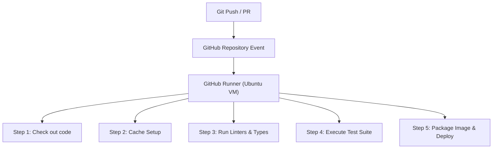
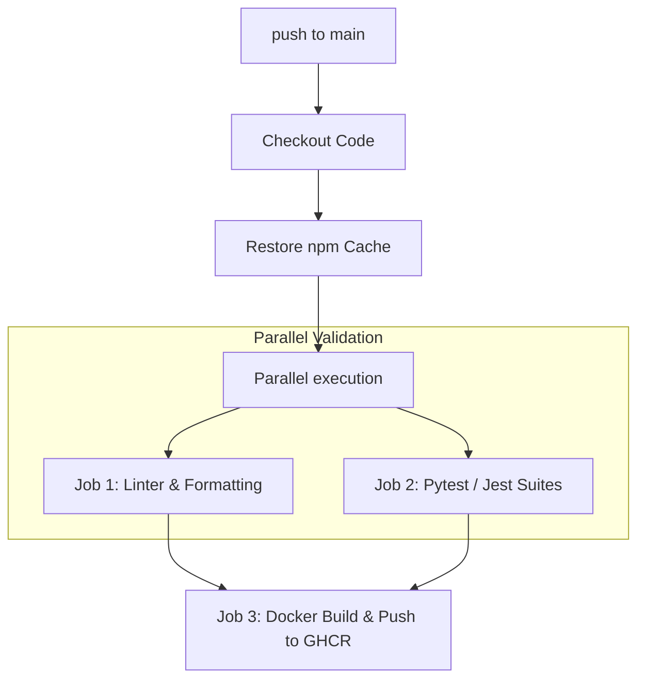

# Part 14: Continuous Integration & Deployment with GitHub Actions

*[← Back to Master Index](/blog/it-career-guide)*

---

## 1. Core Concept Refresher: The CI/CD Pipeline & GitHub Runner Architecture

In modern agile software development, teams commit code to repository branches multiple times per day. If testing, formatting, compiling, and deploying are handled manually, the development speed halts. Humans make errors: developers forget to run tests, write mismatched configurations, or push uncompiled code to production servers.

**Continuous Integration (CI)** and **Continuous Deployment (CD)** solve this by automating the build-test-deploy lifecycle.

---

### The DevOps Loop and GitHub Runner Mechanics

GitHub Actions is a serverless execution environment that runs workflow pipelines in response to events (like a `git push` or a Pull Request).



#### GitHub Actions Architecture:
*   **Workflows:** Automation files written in YAML, stored in the `.github/workflows/` directory.
*   **Events:** Triggers that start a workflow (e.g., `push`, `pull_request`, `schedule`).
*   **Jobs:** A collection of steps that execute on the same Runner. By default, multiple Jobs in a workflow execute in **parallel**, though you can define dependencies between them using the `needs` key.
*   **Steps:** Sequential tasks that execute in order. A step can run a shell command (e.g. `npm test`) or call a reusable Action (e.g. `actions/checkout`).
*   **Runners:** Virtual machines (or Docker containers) hosted by GitHub (or self-hosted on your own cloud nodes) that execute the jobs. Each runner gets a clean execution context and a shared workspace.

---

### Optimization Strategies: Parallelism and Caching

Slow pipelines kill developer productivity. If a developer has to wait 30 minutes for a pipeline to run before their Pull Request can be merged, team output drops.

To speed up pipelines, DevOps engineers use:
1.  **Parallel Job Matrixing:** Splitting tests to run concurrently across multiple runners.
2.  **Directory Caching:** Saving persistent folders (like `node_modules`, `.next/cache`, or local compiler caches) between workflow runs so they don't have to be downloaded from scratch every time.

```yaml
- name: Cache dependencies
  uses: actions/cache@v4
  with:
    path: ~/.npm
    key: ${{ runner.os }}-node-${{ hashFiles('**/package-lock.json') }}
    restore-keys: |
      ${{ runner.os }}-node-
```

This snippet caches the local npm directory. The cache key is calculated based on the SHA-256 hash of the `package-lock.json` file. If the dependencies don't change, the runner restores the cached directory in under 2 seconds, reducing build times.

---

### Container Packaging and Secure Registry Storage

A standard CD step in product companies is packaging your application into a Docker container and pushing it to a Registry, such as **GitHub Container Registry (GHCR)** or **Amazon Elastic Container Registry (ECR)**.

To build and push images securely:
*   Use **GitHub Secrets** to store sensitive credentials (like registry passwords or API tokens) rather than hardcoding them in the workflow YAML.
*   Log into the registry using temporary, short-lived tokens (`secrets.GITHUB_TOKEN`) provided automatically by the runner context.
*   Tag images with the specific Git commit SHA to ensure complete traceability.

---

## 2. Master Resource Directory: CI/CD & Automation

DevOps engineering requires understanding pipeline structures, test runners, and secure access permissions. Below are the top resources.

---

### Resource 1: *Continuous Delivery* by Jez Humble & David Farley
*   **Why It Was Selected:** The definitive bible of modern deployment and software release management. Jez Humble and David Farley established the core patterns of automation, automated configuration management, deployment rollbacks, and blue-green deployments. This book is selected to teach you the high-level strategies of software delivery, ensuring you build secure, reliable pipelines.
*   **Target Syllabus Modules/Chapters:**
    *   Chapter 3: The Deployment Pipeline
    *   Chapter 5: Anatomy of the Deployment Pipeline
    *   Chapter 8: Automated Acceptance Testing
    *   Chapter 10: Deploying and Releasing Your Application
*   **Time Investment Required:** 30 hours.
    *   *Week 1:* Chapters 3 & 5 (18 hours)
    *   *Week 2:* Chapters 8 & 10 (12 hours)
*   **Value Assessment:** Essential for any senior systems developer.
*   **Actionable Study Strategy:** Read Chapter 3 on **The Deployment Pipeline**. Draw a detailed diagram of your target pipeline: from local commit, through unit test stages, integration tests in a staging environment, artifact packaging, to blue-green deployments in production, showing what gates require automated versus manual approval.

---

### Resource 2: *GitHub Actions Official Documentation* (docs.github.com/actions)
*   **Why It Was Selected:** The official reference manuals are exceptionally detailed, providing comprehensive guides on YAML syntax, runner environment variables, cached directories, matrix variables, and security boundaries.
*   **Target Syllabus Modules/Chapters:**
    *   Quickstart & Writing Workflows
    *   Using Runner Environments & Caching
    *   Security Hardening (Secrets, OpenID Connect)
*   **Time Investment Required:** 20 hours of reference study.
    *   *Week 1:* Workflow syntax and runners (10 hours)
    *   *Week 2:* Cache configurations and secrets (10 hours)
*   **Value Assessment:** Critical.
*   **Actionable Study Strategy:** Read the guide on **Security Hardening**. Study how to use **OpenID Connect (OIDC)** to authorize GitHub Actions runners to deploy directly to AWS without needing to persist long-lived AWS Access Keys in GitHub Secrets.

---

### Resource 3: *DevOps Roadmap* (roadmap.sh/devops)
*   **Why It Was Selected:** An exceptional, interactive learning roadmap mapping the entire DevOps toolset (Linux, Networking, CI/CD, Containerization, Orchestration, Log Aggregation, Infrastructure-as-Code).
*   **Target Syllabus Modules/Chapters:**
    *   CI/CD pipelines section
    *   Monitoring & Infrastructure-as-Code guidelines
*   **Time Investment Required:** 10 hours.
    *   *Value Assessment:* High (Free learning guide).
*   **Actionable Study Strategy:** Focus on the **CI/CD** node. Click through the definitions and study the differences between Continuous Integration, Continuous Delivery, and Continuous Deployment.

---

## 3. Hands-On Portfolio Lab Project: High-Performance parallel CI/CD Pipeline

To showcase your DevOps capabilities, you will build a **High-Performance GitHub Actions Pipeline** that executes linting, runs test suites in parallel, builds an optimized Docker container, scans it for security alerts, and pushes it to GHCR.



### Lab Specifications:
1.  **Workflow Construction:**
    *   Create a `.github/workflows/ci.yml` file in your repository.
2.  **Strict Validation Jobs:**
    *   **Linter Job:** Must run the project configured linter and static type-checks.
    *   **Test Job:** Must execute the unit and integration test suites.
    *   *Optimization:* Both jobs must execute in parallel on clean `ubuntu-latest` runners, utilizing npm caching to finish under 1 minute.
3.  **Container Compilation and Publish:**
    *   Create a Docker compilation job that executes *only* if the linter and test jobs complete successfully (use the `needs` key).
    *   Compile the Docker image and log into the GitHub Container Registry:
        *   Registry: `ghcr.io`.
        *   Credentials: Use `github.token` automatically.
    *   Tag the image with the specific Git commit SHA.
4.  **Resilient Verification (User Rule Optimization):**
    *   **Crucial Rule:** Configure the workflow steps with `continue-on-error: true` for the test steps so that the entire pipeline runs and displays which tests fail, rather than failing immediately on the first test error.

---

## 4. Technical Interview Self-Assessment

Use these questions to verify your DevOps automation knowledge:

| Concept | High-Frequency Interview Question | Expected Technical Answer Framework |
| :--- | :--- | :--- |
| **CI vs. CD** | What is the difference between Continuous Delivery and Continuous Deployment? | **Continuous Delivery** means that every code change that passes the automated pipeline is built and ready to be deployed, but requires manual human approval to push to production. **Continuous Deployment** is fully automated; every code change that passes the pipeline is automatically deployed to the production servers without manual intervention. |
| **OIDC Security** | Why is OpenID Connect (OIDC) preferred over storing permanent cloud keys in GitHub Secrets? | Storing permanent credentials (like AWS Access Keys) inside GitHub Secrets introduces risk; if your GitHub organization is compromised, those credentials can leak. **OIDC** allows your GitHub runner to request temporary, short-lived security tokens directly from AWS by proving its identity via an encrypted JSON Web Token (JWT) issued by GitHub, eliminating the need to store long-lived credentials. |
| **Caching Strategies** | How do cache key hashes work in GitHub Actions? | GitHub Actions uses a key-value cache. During a run, the action calculates a unique key, typically using a hash of dependency files (`hashFiles('package-lock.json')`). If a cache matching this key exists, it is restored. If the dependencies change, the lock file hash changes, causing a cache miss; the pipeline downloads new dependencies and writes a new cache with the new key. |

---

## 5. Exit Tasks for this Phase

Verify these objectives are complete before ending this phase:

- [ ] Write a complete `.github/workflows/ci.yml` file in a repository.
- [ ] Configure parallel jobs using dependency chains (`needs`).
- [ ] Successfully push a containerized image to GHCR from a pipeline run.
- [ ] Implement dependency directory caching in a workflow run.

---

*[Proceed to Part 15: AWS Cloud & Serverless Architectures →](/blog/it-career-guide/part-15-serverless)*
