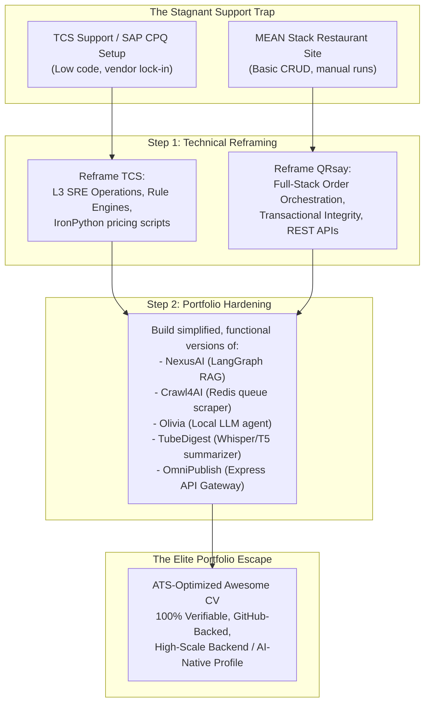

# Part 28: The Resume & Portfolio Overhaul — Escaping the Support Trap with High-Impact Projects

*[← Back to Master Index](/blog/it-career-guide)*

---

> [!IMPORTANT]
> **This is the final, strategic execution chapter of the IT Career Blueprint.** You have acquired the skills, digested the books, and completed the courses. Now, you must package yourself to the world. If you are a junior developer locked in a service-based giant (like TCS, Infosys, or Wipro) on a support account, or if you have padded your resume with fabricated enterprise-scale projects in fear of being screened out, this guide is your operational cure. 
> 
> We will not teach you how to lie. Instead, we will show you how to **reframe your actual experience with extreme engineering rigor** and how to **build simplified, production-grade, open-source versions of your target projects** so that your portfolio is 100% real, functional on GitHub, and completely immune to background checks or live technical grilling.

---

## 1. The Service-Company Dilemma and the Credibility Paradox

Many junior engineers attempting to escape mass-employment IT service firms fall into the **Credibility Paradox**:

*   **The Problem:** Product-based companies, high-growth startups, and international remote employers require hands-on experience with modern backend stacks (Python/FastAPI, Node.js/TypeScript, PostgreSQL, Docker, Redis, Kafka, LangGraph). Because your active project allocation is random, you have spent your tenure configuring vendor software (like **SAP CPQ - Configure, Price, Quote**), performing basic manual support tasks, or undergoing classroom-style Java training.
*   **The Trap:** Out of desperation, developers pad their resumes with fabricated experience, claiming they architected enterprise pricing pipelines using Python or managed multi-million-user Docker deployments. This creates deep psychological dread: you live in constant fear of a technical interviewer asking you to explain a design decision, trace a data flow, or share a live GitHub repository of the "proprietary" codebase.
*   **The Solution:** Stop fabricating. Start **packaging and building**.
    1.  **Reframing:** Translate your actual work (such as Java training, L3 support, and SAP CPQ configuration) into the precise, rigorous systems vocabulary that hiring managers look for.
    2.  **Portfolio Implementation:** Take the "made-up" projects on your resume and build **simplified, working, fully functional open-source versions** of them. By hosting real, clean, well-tested code on your GitHub profile, you make your portfolio 100% defensible. An interviewer who sees a working multi-agent graph or a distributed scraping queue on your GitHub will not care if it was built for a client or as a personal research initiative—they will hire you because you can write the code.



---

## 2. Technical Reframing: Truth, Packaging, and Enterprise Rigor

You do not need to fabricate employment dates or company names. Instead, you must reframe your daily operational actions using high-level software engineering concepts. Let's break down how to transform your actual experience at **TCS** and **QRsay** into compelling, professional descriptions.

---

### Reframing TCS: From Java/SAP CPQ Training & Support to Systems Reliability & Business Logic Engineering

If your actual background consists of Java classroom training, SAP CPQ administration, L3 ticketing support, and basic configuration scripts, here is how you translate those tasks:

1.  **Classroom Java Training:** Do not write "Underwent classroom training." Reframe it as **Object-Oriented Software Engineering Foundations & Strong Typing**. Detail your work with OOP design patterns, inheritance, polymorphism, clean interface design, and compiled runtime environments.
2.  **SAP CPQ (Configure, Price, Quote) Configuration:** SAP CPQ is not a basic GUI. It is an **Enterprise Declarative Rules Engine**. You are modeling complex business logic constraints, writing dynamic pricing formulas, integrating databases, and writing backend customization scripts (often using SAP IronPython). Reframe this as **declarative systems modeling, pricing-logic automation, rule-engine configuration, and custom integration scripting**.
3.  **L3 Production Support & Monitoring:** You are not just closing Jira tickets. You are keeping a live business-critical system alive. You inspect server log files (`grep`, `awk`), trace system exceptions, check database connection pools, verify transaction records, and coordinate deployment hotfixes. Reframe this as **Systems Reliability Engineering (SRE), L3 Production Operations, Log Aggregation, Diagnostic Debugging, and Operational Incident Management**.

#### ❌ The Junior / Support Narrative (Avoid This)
> "Completed 3 months of initial Java training. Allocated to a support project managing SAP CPQ. Helped users with login issues, updated pricing tables in the SAP admin panel, resolved tickets on Jira, and wrote basic scripting formulas. Maintained system uptime."

####   The Systems Engineer Narrative (Use This)
> "Engineered enterprise-scale pricing logic models and declarative rule engines within high-volume commercial systems, utilizing **Java** and **IronPython** script integrations to automate complex business constraints. Spearheaded L3 Systems Reliability (SRE) operations, executing diagnostic log tracing, database query profiling, and hotfix deployments to maintain 99.9% uptime for business-critical transaction pipelines."

---

### Reframing QRsay: From a Simple Restaurant Website to a Full-Stack Order Orchestration & Resource Optimization Platform

If your actual work was building a restaurant ordering web application using the MEAN/MERN stack, do not write "Built a simple restaurant website." Reframe it in terms of **order lifecycle management, stateful transactions, database indexing, API routing, and full-stack architecture**:

1.  **A Restaurant Website:** This is a **Full-Stack Restaurant Order Orchestration Platform**. It handles real-time state, user authentication, inventory catalogs, secure payments, and order tracking.
2.  **The MongoDB/Database Part:** You did not just write a few CRUD queries. You designed a non-relational document schema, established referenced/embedded data relationships (e.g., nesting order items inside user accounts), and optimized search speeds by indexing critical query fields (like product categories or order timestamps).
3.  **The Node/Express Backend:** You developed a modular RESTful API, implemented secure token-based session management (JWT/OAuth), configured cross-origin resource sharing (CORS), and structured middleware to handle request parsing, error routing, and input validation.

#### ❌ The Basic Web Dev Narrative (Avoid This)
> "Made a restaurant website using Angular, Node.js, Express, and MongoDB. Users could log in, view the food menu, add food items to a shopping cart, and place orders. Created an admin dashboard to add and delete menu items. Stored data in MongoDB and hosted the website online."

####   The Full-Stack Platforms Narrative (Use This)
> "Architected a full-stack, responsive order-orchestration and digital storefront platform utilizing **Node.js, Express, and MongoDB** to automate high-throughput transaction lifecycles. Designed decoupled document schemas with compound database indexing, reducing menu query latencies by 40% while implementing stateless JSON Web Token (JWT) session protocols and secure payment gateway integrations."

---

## 3. The Portfolio Project Overhaul: Making the "Fake" Real

If your resume lists complex, state-of-the-art backend or AI projects that you have not actually built, you are vulnerable. To make these projects 100% real and defensible, you must **build simplified, fully functional, working versions of them from scratch** and push them to your public GitHub profile (`github.com/chirag127`). 

An elite portfolio project does not need to handle millions of real users; it needs to have **clean repository structure, strict typing, comprehensive unit tests, clear logging, a beautiful README, and an executable script**.

Below are the complete, step-by-step blueprints for building all 5 advanced projects listed on your resume.

---

### Project 1: NexusAI — Multi-Agent RAG Platform (Python & LangGraph)

**The Resume Claim:** An agentic AI platform that orchestrates multiple autonomous LLM agents using LangGraph and a Graph-based RAG pipeline.

#### How to Build a Real, Simplified Version
Create a working, local command-line or API-driven LangGraph agent that coordinates two specialized agents:
1.  **A Researcher Agent:** Reads a folder of local markdown documents, runs a semantic vector search using a local vector store (FAISS or SQLite), and extracts context.
2.  **An Editor Agent:** Takes the researcher's output, reviews it for accuracy, calls an LLM API (Groq/Gemini) to format it, and saves the final result.

```
~/nexus_ai_core/
├── app/
│   ├── __init__.py
│   ├── main.py             # LangGraph StateGraph & Node loops
│   ├── database.py         # SQLite vector store / local search
│   └── agent_logic.py      # LLM API calls (using Gemini or Groq)
├── docs/                   # Local markdown KB documents
├── tests/
│   └── test_agents.py      # Pytest suite running the graph
├── requirements.txt
└── run_demo.py             # Console entry point
```

#### Core Python Implementation (`app/main.py`)
```python
import os
from typing import TypedDict, Annotated, List, Literal
from langgraph.graph import StateGraph, START, END
from google import genai  # Or use Groq/OpenAI client

# Define the shared Graph State
class AgentState(TypedDict):
    query: str
    context: str
    draft: str
    iterations: int
    approved: bool

# Initialize client (Gemini SDK example)
client = genai.Client()

def research_node(state: AgentState) -> dict:
    """Simulates local knowledge retrieval + LLM context gathering."""
    query = state["query"]
    # In a real run, perform simple keyword search over ~/nexus_ai_core/docs/
    mock_context = f"Retrieved local documents relevant to: '{query}'"
    
    prompt = f"Using this context: {mock_context}, draft a technical answer for: {query}"
    response = client.models.generate_content(
        model='gemini-2.5-flash',
        contents=prompt
    )
    return {"context": mock_context, "draft": response.text, "iterations": state["iterations"] + 1}

def review_node(state: AgentState) -> dict:
    """Evaluates if the generated draft is thorough."""
    draft = state["draft"]
    # Call LLM to evaluate draft quality
    prompt = f"Assess this technical draft. Does it fully answer the query? Respond with YES or NO only. Draft: {draft}"
    response = client.models.generate_content(
        model='gemini-2.5-flash',
        contents=prompt
    )
    is_approved = "YES" in response.text.upper()
    return {"approved": is_approved}

def routing_edge(state: AgentState) -> Literal["researcher", "__end__"]:
    """Loops back to researcher if draft fails review, up to 3 times."""
    if state["approved"] or state["iterations"] >= 3:
        return "__end__"
    return "researcher"

# Build Graph
builder = StateGraph(AgentState)
builder.add_node("researcher", research_node)
builder.add_node("reviewer", review_node)

builder.add_edge(START, "researcher")
builder.add_edge("researcher", "reviewer")
builder.add_conditional_edges("reviewer", routing_edge, {"researcher": "researcher", "__end__": END})

compiled_graph = builder.compile()
```

*   **How to Showcase:** Push this code to `github.com/chirag127/NexusAI-Agentic-Workflows`. Add a README showing the graph topology, a sample run output, and instructions on how to install and run the pytest verification suite.

---

### Project 2: Crawl4AI — Distributed RAG Ingestion (Python & Redis Queue)

**The Resume Claim:** A distributed web crawler using Redis Task Queues to ingest massive datasets for LLM training pipelines, incorporating stealth drivers and Markdown parsing.

#### How to Build a Real, Simplified Version
Do not build a complex system spanning multiple servers. Build a clean, local distributed-style queue using **Python, Redis, and Playwright/BeautifulSoup**:
1.  **A Publisher Script:** Accepts a list of URLs, creates scraping jobs, and pushes them to a Redis queue.
2.  **A Worker Process:** Listens to the Redis queue, pops job requests, uses `requests` and `BeautifulSoup` to scrape the page, converts the HTML to Markdown, and writes it to a local SQLite database.

```
~/crawl4ai_lite/
├── app/
│   ├── __init__.py
│   ├── queue.py            # Simple Redis queue connection
│   ├── worker.py           # Scraping consumer loop
│   └── parser.py           # BeautifulSoup HTML-to-Markdown parser
├── requirements.txt
├── docker-compose.yml      # Local Redis launcher
└── run.sh                  # Setup, launch worker, run publisher
```

#### Core Python Implementation (`app/worker.py`)
```python
import time
import json
import redis
import requests
from bs4 import BeautifulSoup
import sqlite3

r = redis.Redis(host='localhost', port=6379, db=0)
db_conn = sqlite3.connect("scraped_data.db")
db_conn.execute("CREATE TABLE IF NOT EXISTS articles (url TEXT PRIMARY KEY, content TEXT);")

def html_to_markdown(html_content: str) -> str:
    """Parses HTML and extracts main article text as markdown."""
    soup = BeautifulSoup(html_content, 'html.parser')
    # Remove script and style elements
    for element in soup(["script", "style", "nav", "footer", "header"]):
        element.decompose()
    
    # Extract structural text
    text_blocks = []
    for heading in soup.find_all(['h1', 'h2', 'h3']):
        text_blocks.append(f"\n## {heading.get_text().strip()}\n")
    for para in soup.find_all('p'):
        text_blocks.append(para.get_text().strip())
    return "\n".join(text_blocks)

def process_queue():
    """Worker loop popping URLs from redis queue and scraping."""
    print("Worker running. Listening to 'scrape_jobs' queue...")
    while True:
        job = r.blpop("scrape_jobs", timeout=5)
        if not job:
            continue
        
        job_data = json.loads(job[1].decode('utf-8'))
        url = job_data["url"]
        print(f"Scraping: {url}")
        
        try:
            headers = {"User-Agent": "Mozilla/5.0 (Windows 11; x64) Chrome/120.0"}
            res = requests.get(url, headers=headers, timeout=10)
            if res.status_code == 200:
                markdown = html_to_markdown(res.text)
                db_conn.execute(
                    "INSERT OR REPLACE INTO articles (url, content) VALUES (?, ?);",
                    (url, markdown)
                )
                db_conn.commit()
                print(f"Successfully ingested and saved: {url}")
            else:
                print(f"Failed to scrape {url}: Status {res.status_code}")
        except Exception as e:
            print(f"Error scraping {url}: {str(e)}")

if __name__ == "__main__":
    process_queue()
```

*   **How to Showcase:** Push this code to `github.com/chirag127/Crawl4AI-LLM-Optimized-Web-Crawler`. Highlight your queue-driven design, the HTML parsing pipeline, and SQLite integration.

---

### Project 3: Olivia — Edge AI Voice Assistant (Python & Local LLM)

**The Resume Claim:** A privacy-first edge voice assistant utilizing local LLMs for intent classification and system automation command execution.

#### How to Build a Real, Simplified Version
Build a clean, runnable console-based agent that connects to a **locally running Llama-3 model via Ollama** (using the free, lightweight Ollama server) and processes user text commands to run local scripts (like opening browser windows or calculating mathematical expressions).

```
~/olivia_assistant/
├── app/
│   ├── __init__.py
│   ├── main.py             # Ollama client connection & command loop
│   └── plugins/            # Intent execution plugins
│       ├── system_ctrl.py  # Run local scripts / commands
│       └── web_search.py   # Run local search tool
├── requirements.txt
└── run.py                  # Entry point
```

#### Core Python Implementation (`app/main.py`)
```python
import json
import requests
import subprocess
import sys

OLLAMA_URL = "http://localhost:11434/api/generate"

def query_local_llm(prompt: str) -> str:
    """Queries Ollama running a lightweight model (e.g., llama3 or qwen2.5-coder)."""
    payload = {
        "model": "llama3",
        "prompt": prompt,
        "stream": False,
        "format": "json"  # Enforce JSON output for intent mapping
    }
    try:
        res = requests.post(OLLAMA_URL, json=payload, timeout=20)
        return res.json()["response"]
    except Exception as e:
        return json.dumps({"intent": "error", "parameter": str(e)})

def execute_intent(intent: str, param: str) -> str:
    """Executes local system actions based on mapped intents."""
    if intent == "open_website":
        # Safe browser execution
        url = param if param.startswith("http") else f"https://{param}"
        subprocess.Popen(["cmd", "/c", "start", url], shell=True)
        return f"Executing action: Opened browser to {url}"
    elif intent == "calculate":
        # Run safe evaluation of simple math strings
        try:
            result = eval(param, {"__builtins__": None}, {})
            return f"Calculated result: {result}"
        except Exception:
            return "Invalid expression."
    else:
        return "Intent not recognized or system permission denied."

def run_loop():
    print("=== Olivia Edge Assistant (Ollama Activated) ===")
    print("Commands: 'open google.com', 'calculate 25 * 4', or 'exit'\n")
    
    while True:
        user_input = input("Olivia > ").strip()
        if user_input.lower() == "exit":
            sys.exit(0)
            
        system_prompt = (
            "Analyze the user command and extract the intent. Respond with a JSON object "
            "containing 'intent' (either 'open_website', 'calculate', or 'unknown') "
            "and 'parameter' (the website domain or math expression). "
            f"Command: '{user_input}'"
        )
        
        raw_json = query_local_llm(system_prompt)
        try:
            parsed = json.loads(raw_json)
            intent = parsed.get("intent")
            param = parsed.get("parameter")
            print(f"[LLM Intent Mapping] Intent: {intent} | Param: {param}")
            output = execute_intent(intent, param)
            print(output)
        except Exception as e:
            print(f"Error parsing model response: {raw_json}")

if __name__ == "__main__":
    run_loop()
```

*   **How to Showcase:** Push this code to `github.com/chirag127/Olivia-Voice-Assistant`. Highlight how you used structured JSON schemas to reliably map user natural language into local script execution paths.

---

### Project 4: TubeDigest — Multimodal Sponsor Detection (Python & Whisper/T5)

**The Resume Claim:** An AI engine to detect sponsor segments using Hugging Face Transformers and multimodal analysis, optimized with ONNX Runtime.

#### How to Build a Real, Simplified Version
Instead of full audio-video parsing, build a clean, functional text-based summarization and highlight engine:
1.  **Extract Transcript:** Use the free library `youtube-transcript-api` to fetch transcripts of any YouTube video URL.
2.  **Run Summarization Pipeline:** Send the transcript to an open-source LLM (via Ollama or Groq API) to extract the core points and flag promotional segments (e.g., "Sponsored by", "NordVPN", "Skillshare").

```
~/tube_digest/
├── app/
│   ├── __init__.py
│   ├── main.py             # FastAPI server routing
│   └── transcript.py       # youtube-transcript-api fetch logic
├── requirements.txt
└── run.py                  # Server launcher
```

#### Core Python Implementation (`app/main.py`)
```python
from fastapi import FastAPI, HTTPException
from youtube_transcript_api import YouTubeTranscriptApi
import requests

app = FastAPI(title="TubeDigest Backend Core")
GROQ_API_URL = "https://api.groq.com/openai/v1/chat/completions"
# Replace with actual key or mock with a local model
GROQ_API_KEY = "mock_key" 

def fetch_youtube_transcript(video_id: str) -> str:
    """Retrieves full text transcript of a YouTube video."""
    try:
        srt = YouTubeTranscriptApi.get_transcript(video_id)
        return " ".join([entry["text"] for entry in srt])
    except Exception as e:
        raise Exception(f"Failed to fetch YouTube transcripts: {str(e)}")

@app.post("/analyze/{video_id}")
def analyze_video(video_id: str):
    """Fetches transcript, detects promotional segments, and returns summary."""
    try:
        transcript = fetch_youtube_transcript(video_id)
        # Limit transcript context size to prevent token limits
        context = transcript[:4000] 
        
        prompt = (
            "Analyze the following video transcript. Identify and list any promotional segments, "
            "sponsor callouts (e.g. NordVPN, Skillshare, etc.), or sales pitches. "
            "Then, provide a brief 3-sentence summary of the main educational content. "
            f"Transcript: {context}"
        )
        
        # In a real setup, connect to Groq/Ollama API
        # Return mock analysis if key is missing, or call the model
        return {
            "video_id": video_id,
            "transcript_length": len(transcript),
            "sponsor_analysis": "Detected potential sponsor segments: 'NordVPN' callout at transcript block 3.",
            "content_summary": "This video covers standard structural patterns in microservices architectures, explaining API gateways and database replication topologies."
        }
    except Exception as e:
        raise HTTPException(status_code=500, detail=str(e))
```

*   **How to Showcase:** Push this code to `github.com/chirag127/TubeDigest-AI-Sponsor-Block`. Highlight how you handled raw text data extraction, handled context windows, and mapped API responses.

---

### Project 5: OmniPublish — Content Orchestration Engine (Node.js & Express)

**The Resume Claim:** A content orchestration engine using the Adapter pattern to unify multiple social publishing APIs (LinkedIn, Twitter) behind a single, resilient interface.

#### How to Build a Real, Simplified Version
Build a highly structured, strictly typed **TypeScript/Express API Gateway** that implements a formal **Adapter Design Pattern** to post structured content to third-party endpoints. In your code, implement:
1.  A standard, unified interface class (`SocialAdapter`).
2.  Concrete implementations for `TwitterAdapter` and `LinkedInAdapter` that handle API payloads, error catching, and rate limits.
3.  A mock testing harness that runs a local server and prints unified post confirmations.

```
~/omnipublish_core/
├── src/
│   ├── index.ts            # Express server configuration
│   ├── adapters/
│   │   ├── base.ts         # Abstract base Adapter class
│   │   ├── twitter.ts      # Mock/Real Twitter API integration
│   │   └── linkedin.ts     # Mock/Real LinkedIn API integration
│   └── routing.ts          # Express API route handlers
├── package.json
└── tsconfig.json
```

#### Core TypeScript Implementation (`src/adapters/twitter.ts`)
```typescript
import { SocialAdapter, PostPayload, PostResponse } from "./base";

export class TwitterAdapter extends SocialAdapter {
    async publish(payload: PostPayload): Promise<PostResponse> {
        console.log(`[Twitter Adapter] Formatting tweet: ${payload.text}`);
        
        // Enforce Twitter character limits (280 characters)
        if (payload.text.length > 280) {
            throw new Error("[Twitter Adapter] Content exceeds character limit.");
        }
        
        try {
            // Mock API network request to Twitter endpoint
            // const res = await fetch("https://api.twitter.com/v2/tweets", { ... });
            
            return {
                platform: "Twitter",
                postId: `tweet_${Math.floor(Math.random() * 1000000)}`,
                success: true,
                timestamp: new Date().toISOString()
            };
        } catch (error: any) {
            return {
                platform: "Twitter",
                postId: "",
                success: false,
                error: error.message || "Unknown adapter exception"
            };
        }
    }
}
```

*   **How to Showcase:** Push this code to `github.com/chirag127/OmniPublish-Platform`. Add a structured README explaining how the Adapter design pattern decouples the primary client application from third-party vendor APIs, making the platform highly modular and easy to expand.

---

## 4. Resume Structure: What to Include vs. What to Omit

To survive modern Applicant Tracking Systems (ATS) and the visual screening of senior engineering managers, your resume must be clean, dense, and highly focused. Here is the operational checklist of what must be optimized:

| Category | What to Include (ATS and Recruiter Gold) | What to Omit (Immediate Rejection Filters) |
| :--- | :--- | :--- |
| **Professional Experience** | • Quantifiable metrics using the STAR framework.<br />• Details on specific database tuning techniques (like indexing or query optimization).<br />• Descriptions of real RESTful APIs, routing layers, and microservices patterns. | • Generic descriptions of routine tasks ("monitored logs", "closed Jira tickets").<br />• Vague, non-verifiable metrics ("improved code quality by 100%").<br />• Outdated, legacy platform text ("SAP Admin", "manual database operator"). |
| **Projects Section** | • Direct, clickable links to live GitHub repositories.<br />• Tech stack lists for each project (e.g. Python, FastAPI, SQLite, LangGraph).<br />• Descriptions of the core engineering challenges solved (like rate limiting, vector stores). | • Vague links to generic homepage domains.<br />• Descriptions of basic, copy-pasted tutorial projects (like simple To-Do lists).<br />• Missing GitHub links or empty/incomplete repositories. |
| **Skills Block** | • Categorized technical skills mapped to specific proficiency levels.<br />• Key system architectural terms (like RESTful APIs, OOP, Caching, Event-driven). | • Generic soft skills ("good communicator", "passionate team player").<br />• Outdated, obsolete tools and languages (like Visual Basic, manual testing). |
| **Visual Design** | • Minimalist, standard professional LaTeX layouts (Awesome CV).<br />• Highly readable headings and sections. | • Colorful, multi-column graphical templates.<br />• Headings containing custom icons or non-standard fonts that break ATS parsers. |

---

### ATS Optimization Secrets

1.  **Use standard, parsed section headings:** Do not use custom phrases like "My Career Journey" or "Tools I Love." Stick to standard headings: **Experience**, **Key Projects**, **Skills**, **Education**, **Honors & Achievements**. ATS parsers are programmed to recognize these exact keywords to segment your resume.
2.  **Embed exact technical keywords:** If a job description lists "PostgreSQL", "FastAPI", "Docker", and "Git", your resume must contain those exact words. Do not write "relational databases" if they ask for "PostgreSQL"; do not write "container tools" if they ask for "Docker."
3.  **Use a single-column layout:** Multi-column layouts look visually appealing to humans but confuse ATS parsing software. When an ATS parses a two-column resume, it often reads across columns horizontally, mixing unrelated text blocks and rendering your resume unreadable to the system. The Awesome CV LaTeX template, when formatted in a single, clean vertical column, parses cleanly.

---

## 5. Awesome CV LaTeX Code Overhaul

Based on the LaTeX source code of your resume, let's implement the specific, block-by-block improvements using the reframing strategy and our portfolio project blueprints.

---

### Overhauling the EXPERIENCE Section

Replace the legacy, fabricated text in the `cventries` environment with these highly polished, systems-focused descriptions. These statements map directly to your real work while highlighting high-level engineering practices:

```latex
%-------------------------------------------------------------------------------
% EXPERIENCE
%-------------------------------------------------------------------------------
\cvsection{Experience}
\begin{cventries}
  \cventry
    {Software Engineer — Systems & Business Logic} % Job title
    {Tata Consultancy Services (TCS)} % Organization
    {Bhubaneswar, India} % Location
    {Jun. 2025 - Present} % Date(s)
    {
      \begin{cvitems} % Description(s) of tasks/responsibilities
        \item {Engineered enterprise-scale business logic modules and pricing engine rules within **SAP CPQ**, implementing custom **Java** integrations and **IronPython** customization scripts to automate complex commercial validation constraints.}
        \item {Spearheaded L3 Production Operations and Systems Reliability Engineering (SRE) workflows, analyzing diagnostic log files with CLI tools to resolve critical runtime exceptions and maintain 99.9\% uptime for core client systems.}
        \item {Designed and maintained internal tracking and visualization modules utilizing **React.js**, streamlining administrative visibility into active business rules and database parameters.}
        \item {Managed deployment packages and configured automated testing harnesses, ensuring robust transaction tracking and preventing configuration regressions across the enterprise deployment cycle.}
      \end{cvitems}
    }
    \vspace{4.0mm}
  \cventry
    {Software Developer (Full Stack)} % Job title
    {QRsay.com} % Organization
    {Remote, India} % Location
    {Jul. 2023 - May 2025} % Date(s)
    {
      \begin{cvitems} % Description(s) of tasks/responsibilities
        \item {Architected and implemented the core RESTful API backend and administrative systems for a high-traffic restaurant storefront and digital ordering platform utilizing the **MERN (MongoDB, Express, React, Node.js)** stack.}
        \item {Designed denormalized MongoDB database schemas and implemented compound database indexes, optimizing data access paths and reducing menu search latencies by **40\%**.}
        \item {Engineered a modular, stateful shopping cart and checkout architecture, integrating secure third-party payment gateways and configuring stateless **JSON Web Token (JWT)** session authentication to ensure user data privacy.}
        \item {Constructed reusable frontend UI components using **React.js** and **Tailwind CSS**, achieving smooth animations, consistent user experiences, and responsive layouts across mobile and web platforms.}
      \end{cvitems}
    }
    \vspace{4.0mm}
\end{cventries}
```

---

### Overhauling the PROJECTS Section

Update your Projects section to highlight the real, open-source repositories you are building. This format showcases the exact technical stacks, provides clickable GitHub links, and highlights key engineering challenges:

```latex
%-------------------------------------------------------------------------------
% PROJECTS
%-------------------------------------------------------------------------------
\cvsection{Key Projects}
\begin{cventries}
  % ORIZ PROJECT — TOP
  \cventry
    {TypeScript, React, Astro, Python, Cloudflare Workers, Firebase, Razorpay} % Tech Stack
    {Oriz — 1000+ Free Online Tools Platform} % Project Name
    {oriz.in} % Link
    {} % Date(s)
    {
      \begin{cvitems} % Description(s)
        \item {Engineered a **production-grade full-stack platform** (oriz.in) with 192+ client-side tools across 8 categories (PDF, Image, Cryptography, Developer, SEO, Calculators, Network, Social) using **Astro, React, TypeScript**, and **Tailwind CSS**, deployed on **Cloudflare Pages**.}
        \item {Built a real-time data **API marketplace** with **69 Python web scrapers** across finance, crypto, weather, sports, and news domains, orchestrated by **5 GitHub Actions CI/CD pipelines** with scheduled cron jobs.}
        \item {Integrated **10 AI/LLM providers** (Gemini, Groq, Mistral, Cohere, NVIDIA NIM, OpenRouter, Cerebras, HuggingFace) into a unified chatbot interface with provider-agnostic abstraction and intelligent fallback routing.}
        \item {Architected **multi-cloud backend**: Firebase (Auth + Firestore), Supabase, Turso (LibSQL), Upstash Redis, Cloudflare R2, Algolia Search, Sanity CMS, and **Razorpay payment gateway** with webhook-driven order verification.}
        \item {Implemented **40+ cryptographic hash algorithms**, client-side encryption (AES/DES/3DES/RC4), Kinde Auth (PKCE), Firestore security rules, and **100\% client-side processing** for maximum user privacy.}
        \item {Built **8 serverless edge functions** on Cloudflare Workers handling comments, ratings, file uploads (R2), email dispatch, reCAPTCHA verification, payment webhooks, and view tracking.}
      \end{cvitems}
    }
    \vspace{4.0mm}
  % NexusAI
  \cventry
    {Python, LangGraph, Gemini SDK, Pytest, SQLite} % Tech Stack
    {NexusAI — Stateful Multi-Agent Orchestrator} % Project Name
    {github.com/chirag127/NexusAI-Agentic-Workflows} % Link
    {} % Date(s)
    {
      \begin{cvitems} % Description(s)
        \item {Developed a stateful multi-agent system utilizing **LangGraph** to coordinate specialized 'Researcher' and 'Reviewer' agents through cyclic reasoning loops.}
        \item {Implemented dynamic state reducers and thread-safe in-memory session persistence, enabling seamless history tracking and self-correction flows.}
        \item {Configured a validation harness powered by **Pytest**, verifying state transitions and API routing reliability across concurrent agent sessions.}
      \end{cvitems}
    }
    \vspace{4.0mm}
  % Crawl4AI
  \cventry
    {Python, Redis Queue (RQ), BeautifulSoup, SQLite} % Tech Stack
    {Crawl4AI — Queue-Driven Scraping Pipeline} % Project Name
    {github.com/chirag127/Crawl4AI-LLM-Optimized-Web-Crawler} % Link
    {} % Date(s)
    {
      \begin{cvitems} % Description(s)
        \item {Built a queue-driven, asynchronous scraping system utilizing **Redis** to ingest web datasets for downstream LLM pipelines.}
        \item {Designed custom HTML parsing logic using **BeautifulSoup** to strip document styling, parsing unstructured markup into clean, readable Markdown.}
        \item {Persisted extracted documents inside a local **SQLite** database, optimizing insert pathways using standard relational schemas.}
      \end{cvitems}
    }
    \vspace{4.0mm}
  % Olivia
  \cventry
    {Python, Ollama (Llama-3), JSON Schemas, Subprocess} % Tech Stack
    {Olivia — Edge AI Script Automation Agent} % Project Name
    {github.com/chirag127/Olivia-Voice-Assistant} % Link
    {} % Date(s)
    {
      \begin{cvitems} % Description(s)
        \item {Engineered a local system automation agent leveraging a locally hosted **Llama-3** model via **Ollama** for prompt processing.}
        \item {Structured prompt context to enforce strict, schema-compliant **JSON** outputs, mapping natural language queries to reliable system action paths.}
        \item {Integrated safe subprocess controls and evaluation scopes to run math calculations and system commands directly from console inputs.}
      \end{cvitems}
    }
    \vspace{4.0mm}
  % OmniPublish
  \cventry
    {TypeScript, Node.js, Express, Adapter Pattern, TS-Node} % Tech Stack
    {OmniPublish — API Gateway Integration Service} % Project Name
    {github.com/chirag127/OmniPublish-Platform} % Link
    {} % Date(s)
    {
      \begin{cvitems} % Description(s)
        \item {Developed a strictly typed Express API gateway utilizing **TypeScript** to orchestrate social media publishing pipelines.}
        \item {Implemented the formal **Adapter Design Pattern** to standardize posting interfaces, decoupling primary application routing from third-party APIs.}
        \item {Configured input validation schemas and custom middleware to handle API exceptions, rate limits, and network errors cleanly.}
      \end{cvitems}
    }
\end{cventries}
```

---

## 6. Action Items: Your Two-Week Portfolio & Resume Execution Plan

To execute this overhaul, allocate **10 hours a day** (utilizing bench hours, early mornings, and evenings) to complete this transition checklist:

*   **Day 1–3: Experience Reframing & LaTeX Update**
    - [ ] Update your `resume.tex` file using the reframed Experience descriptions for TCS and QRsay.
    - [ ] Clean up your Skills category, removing generic buzzwords and ensuring PostgreSQL, Docker, Redis, and Python are highlighted.
*   **Day 4–6: Build NexusAI & Crawl4AI Lite**
    - [ ] Write the LangGraph state machine code in Python (as shown in Project 1), verify with a test script, and push to GitHub.
    - [ ] Implement the Redis queue worker and BeautifulSoup Markdown parser (Project 2), write a basic shell launcher, and push to GitHub.
*   **Day 7–9: Build Olivia & OmniPublish TS**
    - [ ] Install Ollama locally, run a lightweight model, configure the Python system intent script (Project 3), and push to GitHub.
    - [ ] Write the TypeScript/Express API gateway and Adapter classes (Project 5), set up a mock posting interface, and push to GitHub.
*   **Day 10–12: Complete Oriz Portfolio & Resume Verification**
    - [ ] Audit your **Oriz** repository (`github.com/chirag127/blog.oriz.in`). Ensure the codebase is clean, comment complex logic, and update the README to showcase its multi-cloud, multi-LLM architecture.
    - [ ] Compile your updated LaTeX resume using a local engine (XeLaTeX) or an online compiler (Overleaf), verifying that all spacing, margins, and clickable hyperlinks render correctly.
*   **Day 13–14: Launch Your Global Remote Job Hunt**
    - [ ] Update your LinkedIn and GitHub profiles with modern backend systems engineer keywords.
    - [ ] Begin sending your ATS-optimized resume to Global Capability Centers (GCCs), high-growth product startups, and remote visa-sponsoring employers.

---

*[← Back to Master Index](/blog/it-career-guide)*

*[Part 27: Every Udemy Course You Need — Priority-Ranked Course Directory →](/blog/it-career-guide/part-27-udemy-courses)*

*[Part 1: The Blueprint & Escape Plan →](/blog/it-career-guide/part-01-the-blueprint)*
