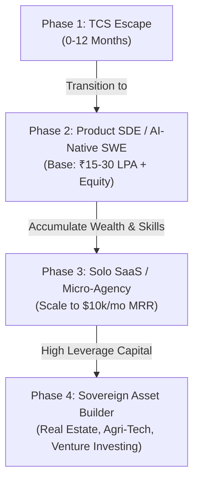

# Part 1: The Path Decision Matrix & The 2026 Knowledge Universe

*[← Back to Master Index](/blog/ultimate-roadmap)*

---

## 1. First Task: The Career Path Decision Matrix

To maximize lifetime wealth, you must treat your career path as an asset allocation
decision. Different career paths offer vastly different risk-adjusted returns on your
labor. As a junior engineer with high analytical aptitude, your time is your most
valuable leverageable resource. Let's compare 17 distinct tracks.

### Comparative Path Matrix

| Path | Income | Difficulty | Time | Scalability | Remote | Demand | AI Res. | Success % | Wealth |
| :--- | :---: | :---: | :---: | :---: | :---: | :---: | :---: | :---: | :---: |
| **Backend Eng.** | High | Med-High | 1-2 yrs | Medium | High | High | High | High (70%) | High |
| **Full Stack Eng.** | High | Medium | 1-2 yrs | Medium | High | High | Med-Low | High (65%) | Med-High |
| **AI Eng.** | V. High | High | 1-2 yrs | Med-High | High | V. High | High | Med (50%) | V. High |
| **DevOps** | Med-High | Med-High | 2 yrs | Medium | Med-High | High | Medium | High (60%) | Medium |
| **Cloud Eng.** | Med-High | Med-High | 2 yrs | Medium | Med-High | High | Medium | High (60%) | Medium |
| **Cybersecurity** | High | High | 2-3 yrs | Medium | Medium | High | V. High | Med (45%) | Medium |
| **Data Eng.** | High | Med-High | 1-2 yrs | Medium | High | High | Medium | High (60%) | Med-High |
| **Product Mgmt.** | V. High | Med-High | 2-3 yrs | Low | Medium | High | Med-High | Low-Med (35%)| Med-High |
| **Consulting** | V. High | High | 2-3 yrs | Low | Low | High | Medium | Low (20%) | Medium |
| **Enterprise Sales**| Extremely | High | 1-2 yrs | Low | Low-Med | High | V. High | Low-Med (25%)| Extremely |
| **Finance / IB** | Extremely | V. High | 3-4 yrs | Low | Low | High | Medium | V. Low (10%)| Extremely |
| **SaaS Founder** | Unlimited | V. High | 2-4 yrs | Infinite | Infinite | V. High | V. High | V. Low (5%) | Infinite |
| **Agency Owner** | V. High | Medium | 1-2 yrs | High | High | High | Medium | Med (30%) | High |
| **Agri-Tech Founder**| Unlimited | V. High | 3-5 yrs | High | Low | Medium | V. High | V. Low (3%) | Infinite |
| **Agriculture** | Medium | High | 5+ yrs | Med-Low | None | Constant | V. High | Med (40%) | Medium |
| **Real Estate** | High | High | 3-5 yrs | Med-High | None | Constant | V. High | Med-Low (20%)| High |
| **Content Creation**| Unlimited | High | 2-3 yrs | Infinite | Infinite | Med-High | Low | V. Low (2%) | High |

*(Note: Success % indicates the probability of achieving a top-decile outcome within that field given disciplined execution).*

---

### The Recommended Path: The Hybrid Model (The AI-Native Backend Engineer-Founder)

Choosing a single path in isolation is a sub-optimal strategy. Instead, you must build a
**Hybrid Capital Model** that minimizes downside risk while preserving infinite upside optionality.



#### Why This Hybrid Model Wins:
1. **Immediate Risk Abatement:** Rebuilding your backend, cloud, and distributed systems foundation provides a highly secure safety net (base income of ₹15-30 LPA in GCCs/Product startups).
2. **AI Sovereignty:** AI Engineering integrated with Backend Systems yields the highest AI-resistance. AI can write simple landing pages, but it cannot architect resilient, state-driven, event-based distributed backends.
3. **High Optionality:** The tech stack used to build distributed backends is the exact same stack required to launch a high-margin, scalable SaaS or Agency.
4. **Wealth Multiplier:** You use your career income to fund your investments (mutual funds, stocks, real estate) and boot-strap your SaaS/Agri-Tech ventures without requiring dilutive external venture capital.

---

## 2. Second Task: The Complete Knowledge Universe

To build outsized wealth, you cannot be a narrow specialist. You must build a
**T-Shaped Knowledge Profile**: deep technical expertise supported by a broad, interdisciplinary
foundation in psychology, communication, finance, systems thinking, and physical systems.

```
┌────────────────────────────────────────────────────────────────────────┐
│                        THE KNOWLEDGE UNIVERSE                          │
├────────────────────────────────────────────────────────────────────────┤
│                                                                        │
│   [Learning]      [Thinking]      [Communication]      [Psychology]    │
│   - Metacognition - Systems       - Technical Writing  - Habit Loops   │
│   - Note-Taking   - Mental Models - Negotiation        - Biases        │
│                                                                        │
│   [Business]      [Finance]       [Technology]         [Physical Ind.] │
│   - SaaS Metrics  - Asset Alloc.  - Dist. Systems      - Agri-Tech     │
│   - Marketing     - Valuation     - LLM / RAG / Agents - Supply Chain  │
│                                                                        │
└────────────────────────────────────────────────────────────────────────┘
```

Here is the exact mapping of the 8 core dimensions of knowledge you must master over the next 20 years:

### Dimension A: Learning (Metacognition & Knowledge Management)
*   **Learning How To Learn:** Focused vs. diffuse brain modes, chunking, and handling cognitive load.
*   **Memory Systems:** Spaced repetition (Anki algorithms), active recall, and spatial memory triggers.
*   **Deliberate Practice:** Pushing past cognitive comfort zones, immediate feedback loops, and targeted weakness isolation.
*   **Speed & Quality Reading:** Syntopical reading, structural book dissection, and active margin annotation.
*   **Note-Taking & Synthesis:** Progressive summarization, Zettelkasten methods, and relational linking.
*   **Knowledge Management:** Building a digital "Second Brain" using obsidian/markdown for frictionless recall.

### Dimension B: Thinking (Cognitive Models & Systems Design)
*   **Critical Thinking:** Identifying logical fallacies, checking foundational axioms, and first-principles reasoning.
*   **Systems Thinking:** Feedback loops (reinforcing and balancing), system delays, emergence, and bottleneck identification.
*   **Mental Models:** Second-order effects, opportunity cost, inversion, compounding, and Pareto distribution (80/20 rule).
*   **Bayesian Thinking:** Updating probability beliefs based on new evidentiary variables.
*   **Decision Making:** Regret minimization frameworks, expected value calculation, and asymmetric bet structures.

### Dimension C: Communication (High-Leverage Human Interfaces)
*   **Technical Writing:** Translating highly complex architectural structures into clear, unambiguous prose.
*   **Public Speaking:** Managing stage fright, vocal tonality, structuring arguments, and rhetorical clarity.
*   **Storytelling:** Narrative arcs (hero's journey), tension building, and emotional anchoring.
*   **Negotiation:** Principled negotiation (Getting to Yes), BATNA (Best Alternative to a Negotiated Agreement), and anchoring techniques.
*   **Persuasion:** Robert Cialdini's six weapons of influence (reciprocity, consistency, social proof, liking, authority, scarcity).
*   **Sales:** Relationship mapping, cold-outreach systems, handling objections, and closing structures.

### Dimension D: Psychology (Human Behavior & Habit Architecture)
*   **Habit Systems:** Hook cycles (Cue, Craving, Response, Reward) and friction engineering.
*   **Motivation:** Dopaminergic systems, intrinsic vs. extrinsic drivers, and deep flow-state induction.
*   **Behavioral Economics:** Hyperbolic discounting, loss aversion, and framing effects.
*   **Cognitive Biases:** Confirmation bias, availability heuristic, status quo bias, and the Dunning-Kruger effect.
*   **Resilience & Focus:** Stoic dichotomy of control, managing cognitive exhaustion, and attention preservation.

### Dimension E: Business (High-Leverage Operations)
*   **Entrepreneurship:** Customer discovery, lean startup loops, product-market fit, and pricing structures.
*   **Marketing:** Performance marketing, SEO engines, programmatic content networks, and organic branding.
*   **Sales Operations:** Pipeline tracking, CRM engineering, high-ticket outbound cycles, and customer success management.
*   **Product Management:** Agile roadmapping, wireframing, feature prioritization (RICE framework), and user analytics.
*   **Operations & Systems:** Designing standard operating procedures (SOPs), automating routine workflows, and delegating.
*   **Leadership & Culture:** Matrix management, radical candor, incentive structures, and hiring filters.

### Dimension F: Finance (Asset Scaling & Valuation)
*   **Personal Finance:** Liquid runways, comprehensive insurance wrapping, tax optimization (Sections 80C, 80D, 10(14) in India), and budgeting.
*   **Investing Theory:** Efficient frontier, modern portfolio theory, indexation, value vs. growth investing, and dollar-cost averaging.
*   **Taxation & Corporate Structures:** Private limited scaling, GST compliance, capital gains harvesting, and corporate write-offs.
*   **Accounting:** Interpreting three financial statements (Balance Sheet, Income Statement, Cash Flow Statement) and double-entry book-keeping.
*   **Valuation:** Discounted cash flow (DCF) models, comparable company analysis (Multiples), and equity cap-table math.

### Dimension G: Technology (The Digital Leverage Stack)
*   **Computer Science:** Operating systems (Linux kernel, process memory, threads, file systems), networking (TCP/IP, HTTP/3, DNS, TLS).
*   **Software Engineering:** Advanced Python, TypeScript, structural design patterns, object-oriented design, and functional paradigms.
*   **Backend Engineering:** Async execution models, database design, REST/gRPC/GraphQL API architectures.
*   **Cloud Computing:** Virtual private networks, IAM policies, computing abstractions (VMs, serverless, containers), and managed database structures.
*   **Distributed Systems:** Horizontal scaling, CAP theorem, message brokers (Kafka), transactional replication, and eventual consistency.
*   **AI Engineering:** Large Language Model APIs, embeddings, vector search algorithms, RAG pipelines, and multi-agent system design (state graphs).

### Dimension H: Physical Industries (Real-World Capital Operations)
*   **Agriculture:** Soil microbiome optimization, crop cycles, water management (drip systems), and micro-climatic impacts.
*   **Agri-Tech:** Hydroponic automation, IoT soil monitoring networks, satellite crop diagnostics, and algorithmic yield forecasting.
*   **Supply Chain & Logistics:** Cold-chain optimization, warehousing models, multi-modal transport dispatch, and inventory replenishment algorithms.
*   **Energy Systems:** Solar grid setups, lithium battery chemistry, micro-grids, and decentralized energy arbitrage.
*   **Manufacturing:** Lean manufacturing (Kaizen/Six Sigma), bill of materials (BOM) management, and factory layout design.
*   **Real Estate:** Land zoning laws, construction management, lease structural designs, commercial cap rates, and property management systems.

---

*In the next part, we will map this Knowledge Universe to specific skill levels and identify the elite reading lists and courses required to master them.*

**[Proceed to Part 2: Prioritized Skill Tree, Reading Roadmap & Course Directory →](/blog/ultimate-roadmap/part-02-skills-books-courses)**
