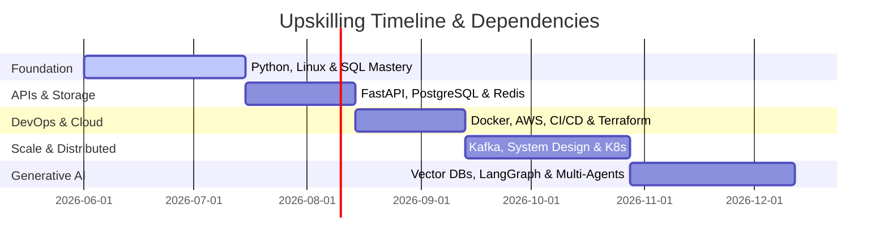
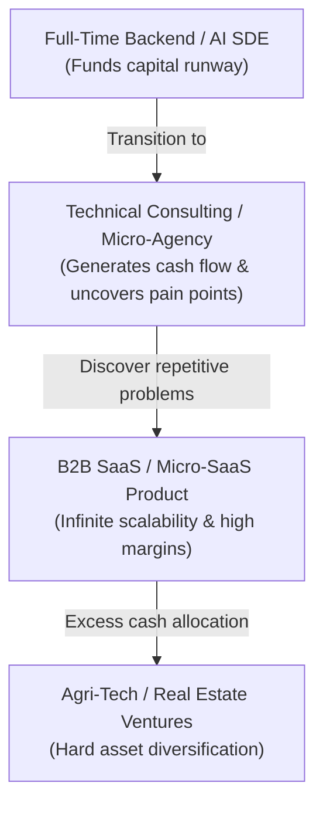

# Part 3: The AI-Native Software Engineer & Entrepreneurship Roadmap

*[← Back to Master Index](/blog/ultimate-roadmap)*

---

## 1. Sixth Task: The Software Engineering Roadmap

To become a **Top 1% SDE**, you must master every layer of modern backend systems
and Generative AI orchestration. This roadmap starts from your current level
(TCS support) and scales you to a Senior AI-Native Backend Engineer.

### SDE Technical Roadmap Modules

---

### Module 1: Python Internals & Advanced Scripting
*   **Best Book:** *Fluent Python* by Luciano Ramalho (O'Reilly). Explains data model, generators, coroutines.
*   **Best Course:** *Complete Python Bootcamp* by Jose Portilla (Udemy).
*   **Practical Lab Project:** Build a custom file system parser that processes 10GB log files using generator memory pools without exceeding a 50MB RAM limit.
*   **Success Milestone:** Write asynchronous decorators that profile resource operations, fully utilizing clean type annotations.

### Module 2: Linux Operating System & WSL2
*   **Best Book:** *How Linux Works* by Brian Ward (No Starch). Explains processes, signals, device drivers.
*   **Best Course:** *Linux Command Line Bootcamp* by Colt Steele (Udemy).
*   **Practical Lab Project:** Build a bash automation suite that monitors system CPU, disk, and memory and dispatches a JSON report over standard socket pipelines.
*   **Success Milestone:** Configure a secure, headless WSL2 Ubuntu partition using SSH keys and automated cron configurations.

### Module 3: Networking Fundamentals (TCP/IP, HTTP)
*   **Best Book:** *Computer Networking: A Top-Down Approach* by Kurose & Ross. Explains socket abstractions.
*   **Best Course:** *Introduction to Computer Networks* (Coursera).
*   **Practical Lab Project:** Build a barebones TCP server in pure Python using the `socket` library, parsing and routing custom raw HTTP requests.
*   **Success Milestone:** Successfully execute, capture, and explain a local 3-way TCP handshake using Wireshark CLI.

### Module 4: SQL & Database Relational Models
*   **Best Book:** *SQL Antipatterns: Avoiding the Pitfalls* by Bill Karwin.
*   **Best Course:** *SQL for Data Science* (Coursera).
*   **Practical Lab Project:** Create a relational database schema for a massive ecommerce platform with strict index configurations.
*   **Success Milestone:** Write complex multi-table joins utilizing window functions and common table expressions (CTEs).

### Module 5: PostgreSQL Internals & Performance
*   **Best Book:** *Mastering PostgreSQL* by Hans-Jürgen Schönig. Query planning, locks, partitioning.
*   **Best Course:** *PostgreSQL High Performance* (O'Reilly).
*   **Practical Lab Project:** Build a script that mocks 1,000,000 product rows, profiles sluggish queries using `EXPLAIN ANALYZE`, and resolves slow reads by adding targeted composite indices.
*   **Success Milestone:** Successfully execute a schema transition involving millions of rows under active transactional locks with zero system downtime.

### Module 6: High-Performance APIs (FastAPI & async)
*   **Best Book:** *FastAPI Web Development* (Official Reference Docs).
*   **Best Course:** *REST API with FastAPI* (Udemy).
*   **Practical Lab Project:** Develop an asynchronous task management API using FastAPI, Tortoise-ORM, and native dependency injection patterns.
*   **Success Milestone:** Compile a fully validated, production-grade OpenAPI schema featuring comprehensive Swagger testing suites.

### Module 7: Redis Caching & In-Memory Data Structures
*   **Best Book:** *Redis in Action* by Josiah Carlson. Caching patterns, pub/sub, transactional locks.
*   **Best Course:** *Redis Masterclass* (Udemy).
*   **Practical Lab Project:** Integrate a FastAPI endpoint with a Redis distributed lock mechanism to prevent race conditions during virtual coupon claims.
*   **Success Milestone:** Configure a robust Redis semantic cache layer that reduces database read latency by 90%.

### Module 8: Docker Containerization
*   **Best Book:** *Docker Deep Dive* by Nigel Poulton. Multi-stage builds, layer caching, secure mounting.
*   **Best Course:** *Docker & Kubernetes* (Udemy).
*   **Practical Lab Project:** Write a multi-stage Dockerfile for a FastAPI microservice that optimizes build-time caches and minimizes image size under 100MB.
*   **Success Milestone:** Implement Docker Compose files that bootstrap an API, a PostgreSQL engine, and a Redis container with automated health checks.

### Module 9: AWS Cloud Infrastructure
*   **Best Book:** *AWS Certified Solutions Architect Study Guide* by Ben Piper.
*   **Best Course:** *AWS Solutions Architect Associate* by Stephane Maarek (Udemy).
*   **Practical Lab Project:** Configure a Virtual Private Cloud (VPC) on AWS featuring isolated public and private subnets, security groups, and an RDS database instance.
*   **Success Milestone:** Deploy a containerized API to AWS ECS (Fargate) with auto-scaling metrics.

### Module 10: CI/CD Pipeline Automation
*   **Best Book:** *Continuous Delivery* by Jez Humble & David Farley.
*   **Best Course:** *GitHub Actions Masterclass* (Udemy).
*   **Practical Lab Project:** Build a GitHub Actions workflow that executes testing scripts (`pytest`), lints files (`ruff`), runs a docker build, and publishes image tags to DockerHub automatically.
*   **Success Milestone:** Configure the CI/CD pipeline to deploy code to staging envs with roll-back fail-safes.

### Module 11: Terraform & Infrastructure as Code (IaC)
*   **Best Book:** *Terraform: Up & Running* by Yevgeniy Brikman. State management, workspaces.
*   **Best Course:** *Terraform Masterclass* (Udemy).
*   **Practical Lab Project:** Declare a complete VPC, ECS container cluster, and RDS PostgreSQL database inside declarative HCL Terraform scripts.
*   **Success Milestone:** Successfully deploy, update, and completely destroy an AWS stack using remote terraform state pools.

### Module 12: Kubernetes Orchestration
*   **Best Book:** *Kubernetes Up & Running* by Kelsey Hightower.
*   **Best Course:** *Kubernetes for Beginners* (Udemy).
*   **Practical Lab Project:** Deploy a FastAPI container service inside a local Kubernetes (Kind) cluster using Deployments, Services, and Ingress controllers.
*   **Success Milestone:** Successfully configure Pod Autoscaling configurations and verify zero-downtime rolling service updates.

### Module 13: Apache Kafka & Event Streaming
*   **Best Book:** *Kafka: The Definitive Guide* by Gwen Shapira. Partitioning, offset commits, consumers.
*   **Best Course:** *Apache Kafka Masterclass* (Udemy).
*   **Practical Lab Project:** Architect an event-driven system with a Kafka broker, a Python producer dispatching purchase logs, and multiple consumers modifying inventory records asynchronously.
*   **Success Milestone:** Implement consumer group consumer instances to process horizontally scaled partition messages.

### Module 14: System Design Fundamentals
*   **Best Book:** *System Design Interview – An Insider's Guide* by Alex Xu.
*   **Best Course:** *Pragmatic System Design* by Gaurav Sen.
*   **Practical Lab Project:** Document a complete system design roadmap (using RESHADED frameworks) outlining the backend architecture for a high-availability platform like Uber or Instagram.
*   **Success Milestone:** Design systems that leverage CDNs, edge computing, read-replicas, and sharded databases.

### Module 15: Distributed Systems & Eventual Consistency
*   **Best Book:** *Designing Data-Intensive Applications* by Martin Kleppmann. CAP theorem, consensus.
*   **Best Course:** *Distributed Computer Systems* (Coursera).
*   **Practical Lab Project:** Build a distributed transaction system in Python using the Outbox pattern to guarantee data consistency between service endpoints.
*   **Success Milestone:** Implement distributed lock logic using Redis (Redlock) or ZooKeeper.

### Module 16: Generative AI & Embeddings
*   **Best Book:** *Generative AI Blueprint* by David Foster.
*   **Best Course:** *Generative AI with Large Language Models* (Coursera).
*   **Practical Lab Project:** Write a script that reads unstructured text docs, processes data chunks, generates semantic embeddings via OpenAI APIs, and runs similarity checks.
*   **Success Milestone:** Map embedding output behaviors to evaluate chunking overlap performance.

### Module 17: Vector Databases (PGVector, Chroma)
*   **Best Book:** *Building Vector Databases* (Free Online Publication).
*   **Best Course:** *Vector Databases Deep Dive* (Udemy).
*   **Practical Lab Project:** Seed and index 100,000 product vector embeddings in a local PGVector (PostgreSQL) setup using HNSW index mechanics.
*   **Success Milestone:** Perform highly optimized hybrid searches merging semantic similarity with exact matching.

### Module 18: Retrieval-Augmented Generation (RAG)
*   **Best Book:** *Prompt Engineering Guide* (Online Reference).
*   **Best Course:** *RAG Masterclass* (Udemy).
*   **Practical Lab Project:** Build an enterprise-grade RAG pipeline that reads PDF manuals, extracts tables, queries a vector database, and generates contextual answers using Claude APIs.
*   **Success Milestone:** Implement a RAG evaluation framework (RAGAS) analyzing generation faithfulness and retrieval context relevancy.

### Module 19: AI Agent Frameworks (LangChain)
*   **Best Book:** *LLM Engineering* by John C. Mitchell.
*   **Best Course:** *LangChain & LLMs* (Udemy).
*   **Practical Lab Project:** Build a multi-step financial tool agent that parses user commands, performs API math, queries a database, and generates a formatted PDF budget report.
*   **Success Milestone:** Integrate the agent system with robust API validation, error handling, and prompt optimization.

### Module 20: Multi-Agent Systems & State Graphs (LangGraph)
*   **Best Book:** *LangGraph Reference Docs* (Online).
*   **Best Course:** *LangGraph Masterclass* by Eden Marco (Udemy).
*   **Practical Lab Project:** Build a collaborative multi-agent writing system where a "Writer Agent" drafts reports, a "Fact-Checker Agent" validates citations, and a "Human Approver" triggers edits.
*   **Success Milestone:** Deploy a stateful DAG-graph agent system featuring persistence databases and memory replay interfaces.

---

## 2. Seventh Task: The Entrepreneurship Roadmap

Building outsized wealth requires owning equity. While SDE careers yield high base incomes,
they are bounded linear paths. Real leverage and capital multiplication occur when you launch
a business. Let's compare 8 different business formats.

### Comparative Business Matrix

| Model | Startup Cost | Time | Risk | Scalability | Wealth Potential |
| :--- | :---: | :---: | :---: | :---: | :---: |
| **Freelancing** | ₹0 - ₹50k | Immediate | Low | Low | Medium |
| **Consulting** | ₹0 - ₹50k | Immediate | Low | Low-Med | Med-High |
| **SaaS** | ₹10k - ₹100k | High (6-12m) | Med-High | Infinite | Infinite |
| **Agency** | ₹10k - ₹50k | Med (2-6m) | Medium | High | High |
| **Content Business**| ₹5k - ₹20k | High (1-2y) | Low | Infinite | Med-High |
| **Education Business**| ₹5k - ₹20k | High (1-2y) | Low | Infinite | High |
| **Agri-Tech** | ₹1L - ₹5L | High (1-3y) | High | High | Infinite |
| **Agriculture** | ₹5L - ₹20L | High (2-5y) | Med-High | Low-Med | Medium |

---

### The Recommended Path: The SaaS-First Micro-Conglomerate

For a developer, the best route to transition from employment into business ownership is
the **SaaS-First Micro-Conglomerate model**.

#### Why This Strategy Works:
1. **Low Startup Capital:** Building software costs nothing but compute fees. Your full-time SDE salary fully funds this.
2. **Consulting to SaaS Loophole:** In a technical consulting agency, clients pay you to build custom code. This pays you to discover *exactly* what problems businesses face. When three clients ask for the same custom integration, you package it as a B2B SaaS.
3. **Compounding Cash Flow:** A B2B SaaS with 100 clients paying ₹8,000 ($100 USD) a month yields ₹8 Lakhs ($10,000 USD) MRR at a 90% margin. This forms a permanent wealth generation engine.
4. **Asset Reinvestment:** Allocate excess SaaS distributions to high-barrier, physically resilient assets like modern Agri-Tech setups (automated hydroponics/precision farming) or cash-flowing commercial real estate.

---

*In the next part, we will construct your personal investment engine and mapping out a granular 10-year timeline.*

**[Proceed to Part 4: The Wealth-Builder's Investing Guide & 10-Year Master Plan →](/blog/ultimate-roadmap/part-04-investing-and-10y-plan)**
