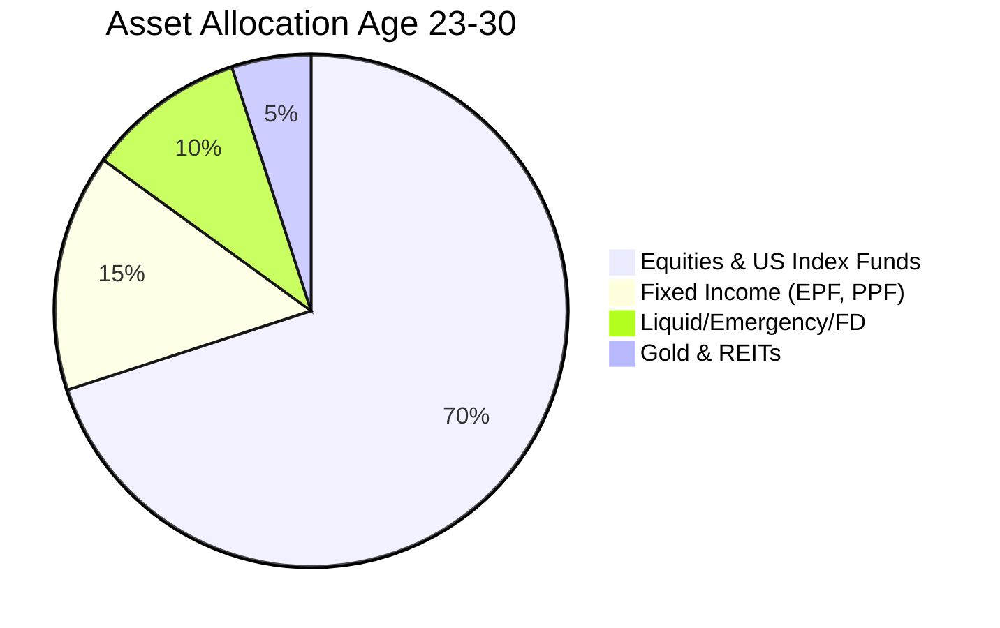
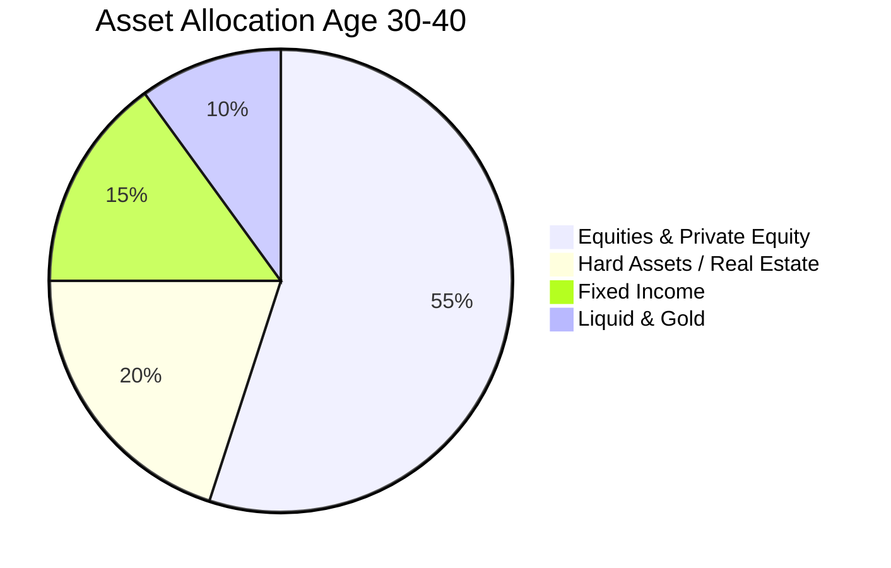

# Part 4: The Wealth-Builder's Investing Guide & 10-Year Master Plan

*[← Back to Master Index](/blog/ultimate-roadmap)*

---

## 1. Eighth Task: The Complete Investing Roadmap

Upskilling increases your active income, but **investing** is what translates active
income into long-term financial sovereignty. The goal is to build an automated asset
allocation machine that works silently in the background while you focus on technical
leverage.

### Core Asset Classification

*   **Emergency Fund:** 6 to 12 months of non-negotiable living expenses stored in highly liquid setups (sweeping Fixed Deposits / liquid mutual funds).
*   **Insurance:** Complete Term Insurance (₹1.5–3 Crore sum assured) paired with super top-up Health Insurance. Never buy unit-linked insurance plans (ULIPs).
*   **Fixed Income (FD, PPF, EPF):** Low-risk, tax-sheltered engines. Fully utilize employee EPF matches and secure long-term PPF deposits up to the ₹1.5 Lakh yearly limit.
*   **Equities (Mutual Funds, Index Funds, Direct Stocks):** The primary compounding engine. Allocate heavily to Nifty 50 Index Funds, Next 50, and US-focused index pools (S&P 500 / Nasdaq).
*   **Hard Assets (Real Estate, REITs, Gold):** Inflation-hedged physical allocations. REITs provide commercial real estate yields without operational hassles.
*   **Decentralized & International Allocations:** Diversification across geopolitical regions using global brokerage models.

---

### Age-Based Allocation Strategies

#### Phase A: Age 23–30 (Aggressive Compounding)
*   **Philosophy:** You have massive human capital (time). Maximize exposure to equities; minimize low-yield debt assets.
*   **Equities (Index Funds & Direct Growth Stocks):** 70% of monthly surplus. (50% Nifty 50 Index, 25% Nifty Next 50 Index, 25% S&P 500 Index).
*   **Debt & Fixed Income (EPF, PPF):** 15% of surplus.
*   **Cash / Emergency / FDs:** 10% (kept liquid to fund job transitions or business bootstrapping).
*   **Gold / REITs:** 5%.

#### Phase B: Age 30–40 (Wealth Consolidation & Expansion)
*   **Philosophy:** As base income scales and business dividends begin, increase hard-asset allocations to secure cash flow.
*   **Equities (Domestic & International):** 55% of surplus.
*   **Real Estate & REITs:** 20% (acquiring cash-flowing commercial real estate or automated Agri-Tech operations).
*   **Fixed Income & Debt:** 15% (stabilizing the portfolio).
*   **Cash / Liquid Reserves / Gold:** 10%.

#### Phase C: Age 40–60 (Income Preservation & Distribution)
*   **Philosophy:** Capital preservation is primary. Build a robust dividend and fixed-income ladder.
*   **Equities (High-Dividend & Large Cap):** 40%.
*   **Hard Assets / Commercial Properties:** 30%.
*   **Debt Instruments / Bonds / EPF:** 20%.
*   **Cash / Gold:** 10%.

---

## 2. Ninth Task: The 10-Year Master Plan

This granular master plan defines exact operational parameters across three developmental stages to guide your execution.

### Stage 1: Age 23–25 (The Foundation & Escape Phase)
*   **Core Objective:** Rebuild your technical foundations, escape the TCS support bench, and double/triple your base CTC.
*   **Skills to Acquire:** Advanced Python, SQL performance, FastAPI, Docker, and standard Git collaboration workflows.
*   **Income Goal:** Transition from ₹3.36 LPA to ₹12–18 LPA.
*   **Key Projects:** Build an automated distributed web-scraping cluster deployed in containers, and publish 2 stateful backend API frameworks on GitHub.
*   **Investments:** Establish a ₹2 Lakh emergency reserve, set up automated mutual fund SIPs (₹20,000/month), and configure top-up health insurance.
*   **Businesses to Seed:** Launch a technical writing blog and establish a small-scale freelance profile.
*   **Reading Mastery:** *Deep Work*, *Atomic Habits*, *Designing Data-Intensive Applications*, *The Personal MBA*.
*   **Networking Strategy:** Build a strong public presence on LinkedIn by sharing daily upskilling insights and contributing to 2 high-profile open-source repositories.
*   **Health Protocol:** Sleep 7-8 hours daily, drink 4L of water, run three times a week, and eliminate high-sugar processed foods.

### Stage 2: Age 25–30 (The Leverage & Scale Phase)
*   **Core Objective:** Secure senior-level technical roles, scale active income, launch automated side businesses, and build a significant investment base.
*   **Skills to Acquire:** Distributed Systems (Kafka, Redis, Kubernetes), System Design, Terraform, Vector DBs, LangGraph, and SaaS financial operations.
*   **Income Goal:** Scale to ₹24–45 LPA (or equivalent remote international contracts).
*   **Key Projects:** Build a complete, stateful multi-agent B2B operations agent using LangGraph, and deploy microservice architectures using Kubernetes and CI/CD pipelines.
*   **Investments:** Maximize PPF contributions, invest ₹1 Lakh monthly into index and equity funds, and invest in commercial REITs.
*   **Businesses to Seed:** Bootstrap a high-margin technical consulting agency and launch a B2B SaaS platform targeting a specific business workflow.
*   **Reading Mastery:** *Thinking, Fast and Slow*, *Zero to One*, *Influence*, *High Output Management*.
*   **Networking Strategy:** Connect directly with engineering leaders, write technical whitepapers, and mentor junior developers.
*   **Health Protocol:** Integrate regular strength training, manage stress via mindfulness practice, and optimize nutrition.

### Stage 3: Age 30–35 (The Sovereignty & Empire Phase)
*   **Core Objective:** Achieve complete financial independence, transition to full-time business ownership, and diversify into physical assets.
*   **Skills to Acquire:** Corporate Finance, Mergers & Acquisitions, Precision Agriculture, Commercial Real Estate Valuation, and Matrix Leadership.
*   **Income Goal:** Unbounded (Targeting ₹1.5 Crore+ annual distributions from business and equity dividends).
*   **Key Projects:** Build and automate high-yield agricultural hydroponic facilities powered by custom IoT networks.
*   **Investments:** Direct commercial real estate acquisitions, private equity, and international equity portfolios.
*   **Businesses to Seed:** Transition your B2B SaaS into a full-scale corporate entity, and launch an Agri-Tech platform focused on precision farming.
*   **Reading Mastery:** *Valuation*, *Competitive Strategy*, *Antifragile*, *The Lessons of History*.
*   **Networking Strategy:** Engage with startup founders, venture partners, agricultural innovators, and policy shapers.
*   **Health Protocol:** Annual comprehensive executive health checkups, functional mobility work, and strict clean diet protocols.

---

*In the final part, we will translate this master plan into a highly granular, 100-part step-by-step curriculum.*

**[Proceed to Part 5: The Elite 100-Part Curriculum (TCS to Top 1%) →](/blog/ultimate-roadmap/part-05-the-100-part-curriculum)**
